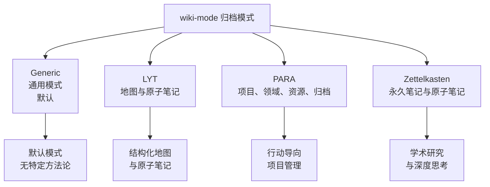
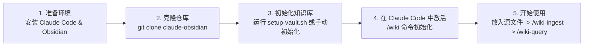

# AgriciDaniel/claude-obsidian

[GitHub URL](https://github.com/AgriciDaniel/claude-obsidian)

- **Stars**: 13742
- **Language**: Python

## claude-obsidian：深度融合 AI 的本地第二大脑构建系统

> 这是一个将 Claude Code 与 Obsidian 知识库深度结合的开源项目，能自动将原始信息转化为结构化知识网络。

- **Tags**: Obsidian, Claude, 知识管理, PKM, 开源
- **Category**: 开发工具, 生活效率, AI 编程

## Details

# claude-obsidian：让 AI 与 Obsidian 共同构建你的“第二大脑”
> 一句话总结：claude-obsidian 是一个将 Claude Code 的 AI 能力与 Obsidian 本地知识库深度融合的开源项目，它通过一套结构化工作流，将原始信息转化为可查询、可连接、可维护的知识网络，实现了真正意义上的“知识复利”。
## 1 背景与痛点：为什么我们这个时代需要“第二大脑”？
你是否经历过这样的困境：**每天与 AI 对话产生大量洞见，但对话一关就再难找回？** 又或者，** Obsidian 笔记库里积累了数百条笔记，却从未有效链接，成为数字孤岛？** 这正是 claude-obsidian 试图解决的核心痛点。
当前 AI 工具的“金鱼效应”尤为严重：**每次会话都从零开始**，无法积累和复用上下文。而传统知识管理工具（如 Notion）虽然强大，但**数据锁定在云端平台**，不仅存在隐私风险，更与本地工作流脱节。claude-obsidian 的诞生，就是为了打通 AI 与个人知识库的最后一公里，让**每一次输入都成为未来智能的基础**。
## 2 核心亮点与功能剖析：它如何运作？
claude-obsidian 的核心价值在于其**一套完整且严谨的工作流**，它不只是工具集合，而是一个知识操作系统。以下是它最值得称道的五大能力：
### 2.1 四步循环：从信息到知识的转化
claude-obsidian 围绕一个重复循环组织工作：**保留源文件 → 声明主张 → 连接知识 → 投入使用**。这个过程通过其核心命令实现：

### 2.2 15 个技能，一套系统
claude-obsidian 提供了**15 个协同工作的技能**，覆盖了知识管理的全生命周期：
| 技能类别 | 核心技能 | 功能描述 |
| :--- | :--- | :--- |
| **构建与使用** | `wiki` | 初始化或采用现有知识库，诊断准备状态 |
| | `save` | 保存一个范围化的答案或见解（非自动记录） |
| | `wiki-ingest` | 将捕获的源文件转换为链接的页面和来源记录 |
| | `wiki-query` | **仅从相关库证据中读取**答案 |
| | `wiki-lint` | 报告死链接、孤立文件、元数据缺口等 |
| **扩展工作流** | `autoresearch` | 有边界的网络研究，需显式同意外网访问 |
| | `canvas` | 创建和维护 Obsidian Canvas 视图 |
| | `wiki-fold` | 操作日志的可追溯汇总 |
| | `wiki-mode` | 支持Generic、LYT、PARA或Zettelkasten归档模式 |
| **参考技能** | `obsidian-markdown` | 正确的Obsidian风味Markdown、链接和嵌入 |
| | `obsidian-bases` | 原生.base表、卡片、过滤器和公式 |
### 2.3 信任架构：安全与可追溯性
claude-obsidian 将**信任嵌入架构本身**，这是其区别于其他工具的关键：
-   **本地优先原则**：你的知识库始终保持为普通的 Markdown、JSON 和源文件目录，**不隐藏在插件缓存中，不锁定在云端数据库中，也不静默上传到模型**。
-   **来源主导主张**：它不为重要主张自动创建摘要，而是保留**源文件、主张账本**（记录权威性、新鲜度、支持、矛盾、置信度和审查状态），让你能追溯到每条知识的起源。
-   **事务性操作**：**每个知识操作都是一个可恢复的事务**。读取目标并记录其SHA-256 → 并行工作者仅返回草案和证据 → 将完整更改合并到一个操作包中 → 检查包并应用一次 → 报告操作ID和精确更改路径。这意味着即使中途出错，也能回滚到之前的状态，**防止半成功的批量编辑破坏知识库**。
### 2.4 多模式知识管理
claude-obsidian 通过 `wiki-mode` 技能支持四种主流知识管理方法论，**无需批量移动现有知识**，只需改变新笔记的归档方式：

## 3 目标人群与收益：谁最应该使用它？
claude-obsidian 的收益是明确且显著的，但其价值因用户群体不同而有所侧重。
| 用户群体 | 核心收益 | 典型使用场景 |
| :--- | :--- | :--- |
| **深度研究者** | **自动化文献综述**，自动发现跨文档矛盾，维护参考文献库 | 摄入多篇论文，自动生成概念图谱并发现研究空白 |
| **内容创作者** | **快速构建知识体系**，将散乱信息转化为结构化课程或书籍 | 摄入网络文章、视频笔记，自动生成大纲和章节链接 |
| **开发者/技术专家** | **管理项目知识**，自动生成技术文档，追踪代码决策 | 记录编程决策，将GitHub issue自动关联到技术文档 |
| **学生/终身学习者** | **构建个人学术网络**，自动链接课程笔记与外部资料 | 摄入讲座幻灯片、教材章节，自动生成概念地图和问答 |
> 💡 **核心收益**：claude-obsidian 将知识管理的**边际成本降低到近乎零**。你无需手动分类、链接、整理，只需放入源文件并运行命令，AI 会完成繁琐的脏活累活，而你的知识库会随着每次使用而**不断进化，产生复利效应**。
## 4 竞品/同类对比：它处于什么位置？
claude-obsidian 在个人知识管理（PKM）与 AI 结合的领域占据独特位置。下表将其与主要竞品进行了对比：
| 特性维度 | **claude-obsidian** | **Notion AI** | **ChatGPT + 记忆** | **Mem.ai / Reflect** |
| :--- | :--- | :--- | :--- | :--- |
| **数据所有权** | **本地Markdown文件** | 云端锁定 | 云端锁定 | 部分云端锁定 |
| **AI操作能力** | **深度文件系统访问** | 集成但有限 | 浅层记忆 | 有限 |
| **上下文持久性** | **深度持久** | 中等 | 浅层、不持久 | 中等 |
| **可扩展性** | **高（MCP/Agent Skills）** | 生态锁定 | 有限 | 有限 |
| **本地优先** | **✅ 是** | ❌ 否 | ❌ 否 | ❌ 否 |
| **源文件保留** | **✅ 保留原始引用** | ❌ 无 | ❌ 无 | ❌ 无 |
| **事务性操作** | **✅ 是（回滚/冲突检测）** | ❌ 无 | ❌ 无 | ❌ 无 |
**独特竞争力**：claude-obsidian 的**独特性在于其对“数据主权”和“操作可追溯性”的极致追求**。它不只是一个AI工具，而是一个**为AI操作而设计的、安全的、本地优先的知识操作系统**。它的目标是成为**“可以信赖的数字协作者”**，而非一个会犯错且难以追责的“智能助手”。
## 5 局限与不足：客观存在的挑战
尽管 claude-obsidian 设计精良，但它并非完美无缺，存在一些客观局限和潜在挑战。
### 5.1 学习与部署门槛
claude-obsidian 的**初始设置过程对非技术用户来说可能有些复杂**。它需要安装 Claude Code、配置环境变量、理解命令行操作。虽然提供了详细的安装指南，但对于完全命令行陌生的新手，仍需一定学习成本。
-   **Windows 用户限制**：在**原生 Windows 环境下，知识库的写入操作（事务应用、初始化等）目前被拒绝**，必须通过 WSL (Windows Subsystem for Linux) 环境才能获得完整功能。这对纯 Windows 用户来说是一个显著的障碍。
-   **依赖要求**：需要 **Python 3.11+、Git、Node.js (用于部分MCP设置)** 等工具，确保环境无误可能需要时间。
### 5.2 成本考量
claude-obsidian 本身是**完全免费且开源的**（MIT许可），但其**核心价值依赖于 Claude Code 或其他兼容的 AI Agent**。
-   **AI 计算成本**：每次 `wiki-ingest`（摄取）和 `wiki-query`（查询）都会**消耗大量的 AI tokens**，这意味着**日常使用会产生持续的 API 费用**。对于知识库规模较大的用户，`wiki-lint`（清理）操作也可能成本不菲。
-   **时间成本**：初始化知识库、首次大规模摄取文件可能需要**较长的时间和计算资源**。
### 5.3 潜在风险与依赖
-   **AI 幻觉与错误传播**：尽管强调“来源主导主张”，但 AI 在理解、提取、连接信息时**仍可能产生错误或误解**。如果用户完全依赖 AI 而不进行审核，这些错误可能会被写入知识库并**持续传播和放大**。**源文件的可追溯性告诉你信息来自何处，但无法保证其真实性**。
-   **对特定生态的依赖**：目前**最佳体验与 Claude Code 深度绑定**，虽然支持其他 Agent Skills 主机（如 Cursor, Windsurf, Codex, OpenCode, Gemini），但功能完整性可能略有差异。如果你不使用 Claude 生态，其核心吸引力会打折扣。
-   **并非“全自动”**：claude-obsidian **需要用户主动将源文件放入 `inbox/` 目录并执行命令**，它无法自动监控文件系统变化。这意味着**仍需一定的用户干预和习惯养成**。
> ⚠️ **总结性提醒**：claude-obsidian 是一个**强大但需要主动驾驭的工具**，它更像是一台“知识引擎”，需要你（用户）作为“驾驶员”来加油（提供源文件）、踩油门（执行命令）、并把握方向（审核AI输出）。它不会自动让你变得聪明，但它能**极大放大你构建和管理知识的效率**。
## 6 结语与行动建议：终极评判
claude-obsidian 是一个**在理念和实践上都非常先进的开源项目**，它成功地将 AI 的能力与本地优先、数据主权、可追溯性等现代数字伦理理念相结合。它不仅仅是一个“插件”，而是一种**全新的个人知识管理范式**——**AI 驱动的、自主组织的、可进化的第二大脑**。
### ✅ 适合使用它的你
claude-obsidian 非常适合以下用户：
-   **技术背景较强**，不畏惧命令行操作，愿意投入时间学习设置。
-   **极度重视数据隐私和所有权**，希望核心知识保留在本地。
-   **知识密集型工作者**（研究者、开发者、作家、内容创作者），需要处理大量信息并构建复杂知识网络。
-   **愿意为优质工具付费**（支付 AI API 费用），以换取**极高的效率和知识复利**。
### ❌ 可能不适合它的你
你可能需要再考虑一下，如果你：
-   **追求极致简单**，希望“零配置”就能使用，不想学习任何命令行。
-   **纯 Windows 用户**，且不想或无法配置 WSL 环境。
-   **对 AI API 成本非常敏感**，无法承担日常使用产生的 token 费用。
-   **希望完全自动化**，不愿手动执行任何命令或进行任何审核。
### 🚀 行动建议与入门指南
如果你决定尝试，以下是最快的入门路径：

1.  **快速体验（推荐）**：使用 **Option 1: Clone as vault** 方式。这会得到一个预配置好的知识库模板，包含所有必要的结构、模板和配置。你只需：
    ```bash
    git clone https://github.com/AgriciDaniel/claude-obsidian.git
    cd claude-obsidian
    bash bin/setup-vault.sh
    ```
    然后在 Obsidian 中打开 `claude-obsidian` 文件夹作为知识库，并在 Claude Code 中进入同一目录后运行 `/wiki` 即可开始。
2.  **集成到现有工作流**：如果你已有 Obsidian 知识库，可以使用 **Option 2: Install as Claude Code Plugin** 方式：
    ```bash
    claude plugin marketplace add AgriciDaniel/claude-obsidian
    claude plugin install claude-obsidian@claude-obsidian-marketplace
    ```
    这会在你的知识库中安装技能，然后你可以使用 `/wiki` 命令初始化。
3.  **阅读官方文档**：项目的 [GitHub Wiki](https://github.com/AgriciDaniel/claude-obsidian) 和 [安装指南](https://github.com/AgriciDaniel/claude-obsidian/blob/main/docs/install-guide.md) 是最权威的资料，强烈建议在开始前仔细阅读。
claude-obsidian 代表了个人知识管理与 AI 结合的未来方向：**工具是为人类赋能，而非替代人类思考**。它通过精巧的设计，让 AI 成为你忠实的知识管家，而非一个会犯错的“聊天机器人”。如果你愿意接受它的一点学习曲线，它将会成为你数字生活中最强大的投资之一。
