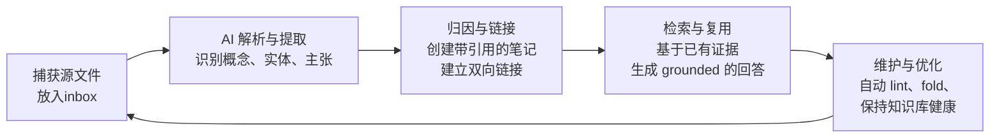
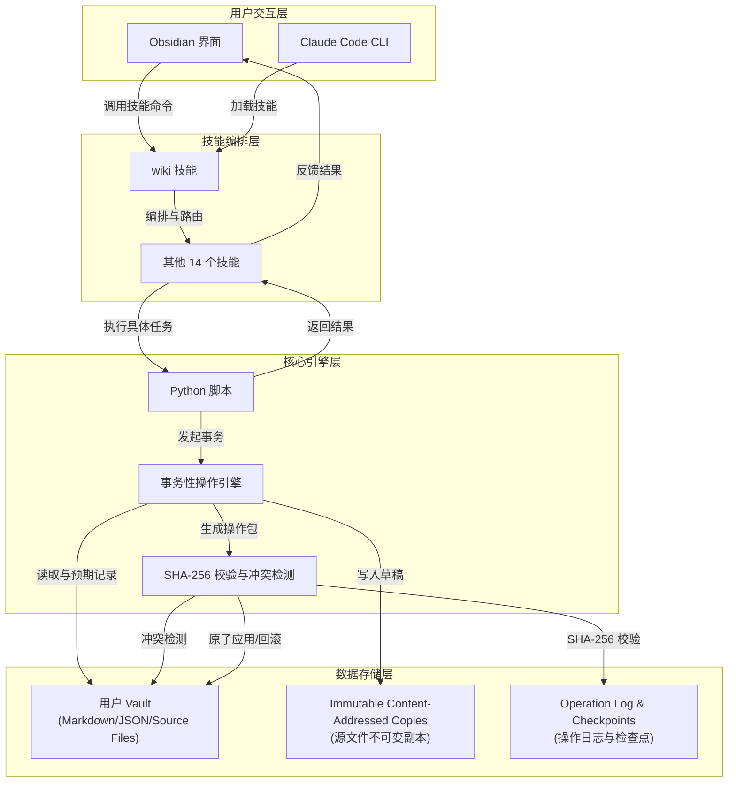

# AgriciDaniel/claude-obsidian

[GitHub URL](https://github.com/AgriciDaniel/claude-obsidian)

- **Stars**: 11771
- **Language**: Python

## Claude-Obsidian：AI驱动的本地化知识复合系统评测

> 将Obsidian笔记库转化为Claude可读可写的持久知识库，解决AI上下文丢失与笔记孤岛痛点。

- **Tags**: Obsidian, Claude, 知识管理, Second Brain, 开源
- **Category**: 开发工具, 生活效率, AI 编程

## Details

# 🧠 Claude-Obsidian 深度评测：为你的 AI 打造一个持久记忆与知识复合的「第二大脑」
> **一句话总结**：Claude-Obsidian 是一个基于 **Karpathy 的 LLM Wiki 模式**构建的开源项目，它将你的 Obsidian 笔记库变为一个 **Claude 可读、可写、可引用的持久知识库**，解决了 AI 每次对话都“从零开始”的核心痛点，让知识像复利一样持续累积。
---
## 🔍 背景与痛点：为什么需要 Claude-Obsidian？
想象一下，你每天使用 AI 工具（如 ChatGPT、Claude Code）进行思考、研究、写作，但每次打开对话窗口，都需要**重新输入上下文、解释项目背景、重复你的思考逻辑**。就像金鱼一样，拥有七秒记忆，无法从过往的对话中积累智慧。这就是所谓的“**金鱼问题**”。
另一方面，你的 Obsidian 笔记库（个人知识库）里塞满了碎片化、未整理、孤立的笔记，像一座充满宝藏的**迷宫**，自己都难以回溯和利用。
**Claude-Obsidian 的核心使命**就是将这两者融合：让 AI 拥有一个持久记忆（你的知识库），让你的知识库变得“**活**”起来（由 AI 驱动持续更新）。它不再是一个简单的“AI 聊天插件”，而是一个**知识复合系统**，遵循“**捕获 → 归因 → 连接 → 复用**”的循环，让你的每一次思考、每一次阅读、每一次 AI 对话都能沉淀下来，为未来提供养料。
### 🎯 核心痛点与解决之道
| 痛点 | 传统方式 | Claude-Obsidian 的解决方案 |
| :--- | :--- | :--- |
| **AI 上下文丢失** | 每次对话都需重新解释背景 | Claude 能**直接读取你的整个知识库**，理解你的项目、偏好和思考脉络 |
| **笔记沦为信息孤岛** | 笔记零散，难以关联和利用 | 自动**提取概念、创建链接、生成索引**，构建知识图谱 |
| **AI 回答缺乏依据** | 容易产生幻觉，无法溯源 | **强制要求每个重要主张都有源文件或笔记支撑**，并提供证据追溯 |
| **知识管理维护成本高** | 需手动整理、归档、去重 | **自动化 lint（体检）、fold（汇总）、retrieve（检索）** 等维护工作 |
| **数据所有权与隐私** | 数据被锁定在云端，无法迁移 | **纯 Markdown 文件，本地优先**，你的知识永远由你掌控 |
---
## ✨ 核心亮点与功能剖析
Claude-Obsidian 的设计哲学是“**本地优先、源文件至上、知识复合**”，其核心亮点体现在以下几个方面。
### 1. 🔄 持久记忆与知识复合的循环
这是 Claude-Obsidian 的核心灵魂。它围绕一个可重复的循环工作：

-   **捕获 (Capture)**：将任何源文件（PDF、网页、文本、截图等）拖入 `inbox` 目录。
-   **归因 (Ground)**：AI 读取源文件，提取概念、实体和关键主张，并为每个主张**记录其来源、置信度、支持状态和审查状态**。这意味着你不仅拥有一个摘要，更拥有一个**可追溯的证据链**。
-   **连接 (Connect)**：自动创建链接的 Wiki 页面、索引（如 `index.md`、`hot.md`）、内容地图（MOC）和 Obsidian Canvas 视图。
-   **复用 (Use)**：通过 `wiki-query` 命令，AI 能**仅基于你知识库中的证据**生成回答，杜绝幻觉。
-   **维护 (Maintain)**：通过 `wiki-lint` 检查死链接、孤儿笔记、元数据缺失；通过 `wiki-fold` 将操作日志汇总成简洁的变更日志，保持知识库的活力和整洁。
### 2. 🧠 15 大技能系统
Claude-Obsidian 提供了 **15 个精细化的技能**，覆盖了知识管理的全流程。以下是其核心技能及其功能：
| 技能类别 | 技能名称 | 核心功能 |
| :--- | :--- | :--- |
| **🏗️ 核心构建与使用** | `wiki` | 初始化或采纳知识库，诊断就绪状态，路由任务 |
| | `save` | **保存有价值的对话**，将其结构化地转化为笔记 |
| | `wiki-ingest` | **将源文件转化为链接的 Wiki 页面和可追溯记录** |
| | `wiki-query` | **仅基于知识库中的证据进行只读查询与回答** |
| | `wiki-lint` | **报告死链接、孤儿笔记、元数据缺失、过时索引** |
| **🌐 工作流扩展** | `autoresearch` | **有边界的网络研究**，明确网络出口和单独的规范合并 |
| | `canvas` | 创建和维护 Wiki 作用域的 Obsidian Canvas |
| | `defuddle` | 在摄取前清理和简化网页内容 |
| | `wiki-fold` | 对操作日志进行提取式、可追溯的汇总 |
| | `wiki-mode` | 支持**通用、LYT、PARA、Zettelkasten** 四种归档方法论 |
| | `wiki-retrieve` | **提供上下文前缀、BM25 及可选的余弦重新排序** |
| | `wiki-cli` | 支持 Obsidian CLI 读取与搜索，事务安全写入 |
| **📚 参考与基础** | `obsidian-markdown` | 正确处理 Obsidian 风味 Markdown、链接、嵌入和提示块 |
| | `obsidian-bases` | 处理原生 `.base` 表格、卡片、过滤器和公式 |
| | `think` | 提供**结构化的观察、倾听、连接、创建和成长审查循环** |
### 3. 🛡️ 信任是架构的一部分
Claude-Obsidian 从底层设计上就保证了操作的安全性和可追溯性：
-   **明确的 Vault 选择**：它绝不会将源代码仓库、插件缓存或贡献者状态视为默认知识库。Vault 必须通过 `CLAUDE_OBSIDIAN_VAULT` 环境变量、最近的 `.claude-obsidian.json` 文件或明确的已初始化祖先路径来**显式选择**。如果选择不明确，命令会在不写入任何内容的情况下退出，避免灾难性操作。
-   **事务性操作与回滚**：每个逻辑知识操作都是一个**可恢复的事务**：
    1.  读取每个目标并记录其预期的 SHA-256。
    2.  让并行工作线程仅返回草稿和证据。
    3.  将完整更改合并到一个操作包中。
    4.  检查该包，然后**仅应用一次**。
    5.  报告操作 ID 和精确的更改路径。
-   **冲突检测而非静默覆盖**：如果一个目标已被更改，它就是一个冲突，系统**永远不会静默覆盖**。Git 检查点、破坏性修复、网络出口和规范研究合并仍然是显式操作。
### 4. 🧩 灵活的知识组织方法论
`wiki-mode` 技能允许你选择最适合你的笔记组织方式，**而无需移动或重组现有笔记**：
| 模式 | 归档原则 | 适合人群 |
| :--- | :--- | :--- |
| **通用** | 按来源、概念、实体和会话归档 | 希望灵活自由组织者 |
| **LYT** | **Maps of Content（内容地图） + 链接的原子笔记** | 喜欢自上而下、层级化思考者 |
| **PARA** | **项目（Projects）、领域（Areas）、资源（Resources）、归档（Archives）** | 需要清晰分类与任务驱动者 |
| **Zettelkasten** | **稳定标识符、原子笔记和密集链接** | 追求深度思考与知识链接者 |
---
## 🎯 目标人群与收益
### ✅ 谁最适合使用 Claude-Obsidian？
1.  **深度使用 Obsidian 的知识工作者**：已经拥有或愿意建立 Obsidian 知识库，希望 AI 能真正“住”进去，而不仅仅是作为外部工具。
2.  **AI 重度用户与开发者**：频繁使用 AI（尤其是 Claude Code）进行思考、研究、写作，**深受“上下文重置”之苦**，渴望让 AI 拥有持久记忆。
3.  **研究者与学术工作者**：需要处理大量文献、PDF、网页，并希望**自动提取观点、建立引用关联、追踪证据链**。
4.  **内容创作者与写作者**：需要整理大量素材、灵感、草稿，希望 AI 能帮助**结构化、扩充、优化内容**，并保持风格一致。
5.  **追求数据隐私与自主权的用户**：**极度重视数据所有权**，不希望知识被锁定在云端黑箱中，希望使用纯 Markdown 格式。
### 🎁 能为你带来什么具体收益？
-   **🚀 效率革命**：**减少 90% 以上的重复解释和背景铺垫时间**。AI 直接基于你的知识库工作，瞬间进入状态。
-   **🧠 知识深化**：AI 帮你**自动发现笔记之间的隐秘联系**，填补知识盲区，让你的知识库从“信息库”进化为“智慧库”。
-   **📊 信任与可靠**：**每个回答都标明来源**，你可以清晰地知道信息从哪里来，**极大降低 AI 幻觉带来的风险**，提升输出可信度。
-   **🔄 自动化维护**：**告别手动整理、归档、去重**的繁琐工作。知识库在 AI 的驱动下自我维护、自我优化，始终保持健康。
-   **💰 成本可控**：**插件本身完全开源免费（MIT 协议）**。你只需为 Claude 的 API 访问或订阅付费（Claude Code 有免费额度），并且可以精细控制调用频率。
-   **🔒 数据自主权**：你的知识就是你的。**纯 Markdown 文件，本地存储**，你可以随时迁移、备份、用任何编辑器打开，不受任何服务商绑架。
---
## ⚔️ 竞品/同类对比
| 特性维度 | Claude-Obsidian | Notion AI | Roam Research | Logseq | Heptabase |
| :--- | :--- | :--- | :--- | :--- | :--- |
| **核心定位** | **本地优先、AI 驱动的自组织知识系统** | 云端协作知识库 + AI 辅助 | 网络化思考工具 + 简单 AI | 本地优先网络化笔记 + 本地 AI | 可视化知识图谱 + AI 分析 |
| **数据格式** | **纯 Markdown (本地文件)** | 专有数据库 | 专有数据库 | 纯 Markdown (本地文件) | 专有数据库 |
| **AI 集成深度** | **极深** (AI 直接读写知识库，15+ 技能) | 较浅 (AI 辅助写作、总结) | 较浅 (基础问答) | 较深 (本地模型集成) | 较深 (AI 分析、图谱) |
| **源文件归因** | **强制归因，证据追溯** | 无 | 无 | 无 | 部分支持 |
| **知识复合能力** | **核心优势** (自动链接、索引、维护) | 无 | 无 (手动链接) | 无 (手动链接) | 有 (AI 辅助) |
| **数据所有权** | **极高** (本地文件，随时导出) | 低 (数据在云端，迁移困难) | 中 (可导出 Markdown) | **极高** (本地文件) | 低 (数据在云端) |
| **价格** | **免费** (需付 Claude API 费) | 付费订阅 | 付费订阅 | **免费** (可选本地模型) | 付费订阅 |
| **上手难度** | 中高 (需配置环境、理解概念) | 低 | 中 | 中 | 中 |
| **适合人群** | **开发者、技术研究者、追求极致自主权者** | **团队协作、追求便捷用户** | **网络化思考爱好者** | **追求本地优先和开源用户** | **可视化思维学习者** |
**🏆 独特竞争力**：
-   **唯一真正实现“AI 驱动的知识复合”的系统**：其他工具的 AI 更多是“辅助写作”，而 Claude-Obsidian 的 AI 是“知识管理员”，能自动维护和进化你的知识库。
-   **本地优先 + 源文件归因**：在保证数据自主权和输出可信度方面，**没有任何竞品能与之匹敌**。
-   **精细化的技能体系与工作流**：它不是一个简单的“聊天机器人”，而是一个**可编程、可组合的知识工作流引擎**。
---
## ⚠️ 局限与不足
没有一款工具是完美的，Claude-Obsidian 也有其局限性和潜在的挑战：
1.  **⚙️ 上手门槛较高**
    -   **技术要求**：需要安装 Python、配置 Claude Code CLI、理解命令行操作。对于**技术小白或非开发者用户**，初期的安装和配置可能会是一个不小的挑战。
    -   **学习曲线**：需要理解其背后的“**捕获-归因-连接-复用**”哲学以及各种技能的用途，这需要一定的学习和实践。
2.  **💰 运行成本（ Claude API 费用）**
    -   虽然**插件本身免费**，但每次 `wiki-ingest`（摄取文件）、`wiki-query`（查询）都会消耗 Claude 的 Token 量。
    -   对于**超大型的知识库或频繁的使用**，Token 消耗可能会成为一笔不小的开支。需要用户有意识地控制调用频率，并权衡投入产出比。
3.  **🐛 AI 的局限性与错误传播**
    -   **源文件依赖**：其输出质量**高度依赖源文件的质量和结构**。如果源文件本身混乱、歧义多，AI 的处理结果也可能不尽如人意。
    -   **“自信的错误”**：虽然强制归因能减少幻觉，但 AI 仍然可能**基于错误的源信息自信地生成错误结论**。你仍然需要充当“最终裁判”的角色。
    -   **上下文窗口限制**：当知识库极度庞大时，单次查询可能无法检索到所有相关笔记，需要依赖 `wiki-retrieve` 等技能进行优化。
4.  **👥 协作与多用户支持薄弱**
    -   其设计哲学是“**单人知识库**”。虽然可以通过 Git 共享知识库，但**并非为实时协作或多人同时编辑而设计**。团队使用时需要谨慎。
5.  **🎨 UI/UX 依赖 Obsidian**
    -   它本身没有独立的 UI，**完全依赖 Obsidian 的界面和插件生态**。如果你不是 Obsidian 的深度用户，或者对 Obsidian 的某些方面不满意，这可能会成为一个问题。
---
## 📦 技术栈与架构解析
### 🔧 技术栈
-   **编程语言**：Python (用于核心脚本和技能实现)
-   **笔记平台**：Obsidian (本地 Markdown 文件)
-   **AI 引擎**：Claude Code (或兼容的 Agent Skills Host，如 Cursor, Windsurf, Codex, OpenCode, Gemini)
-   **核心依赖**：Anthropic API (通过 Claude Code 间接调用)
### 🏗️ 架构设计精妙之处
Claude-Obsidian 的架构设计非常精妙，体现了“**信任但验证**”的原则：

-   **分离的 Vault 逻辑**：**源代码仓库 ≠ 你的知识库**。必须显式初始化或采纳一个独立的目录作为你的 Vault，从架构上杜绝了误操作的风险。
-   **不可变源文件副本**：在处理前，系统会为每个源文件创建一个**不可变的、内容寻址的副本**（例如通过 SHA-256 哈希命名）。这意味着原始文件永远不会被修改，所有操作都在副本上进行，保证了源文件的权威性和可追溯性。
-   **事务性写入引擎**：这是其最核心的架构亮点。所有写操作都**被包装成一个事务**，要么全部成功应用，要么全部失败回滚，并伴随详细的检查点（checkpoint）和操作日志（operation log）。这保证了在 AI 进行大量批量操作时（比如重命名 200 个笔记），即使中途出错，你的知识库也不会被破坏。
### 🧩 代码组织结构
```bash
claude-obsidian/
├── docs/                   # 文档目录
│   ├── install-guide.md    # 安装指南
│   ├── compound-vault-guide.md # 复合 Vault 指南
│   └── methodology-modes-guide.md # 方法论模式指南
├── skills/                 # 15 个技能的实现
│   ├── wiki/
│   ├── save/
│   ├── wiki-ingest/
│   └── ...
├── scripts/                # Python 核心脚本
│   └── claude-obsidian.py  # 主入口脚本
├── bin/                    # 辅助脚本
│   └── setup-multi-agent.sh
└── README.md               # 项目说明
```
这种结构清晰地将**技能定义、文档、核心实现和辅助工具**分开，便于理解和扩展。
### 🚀 上手门槛与部署体验
-   **安装部署**：**官方文档提供了详细的安装指南**，但对于新手来说，步骤仍显繁琐。主要包括：
    1.  克隆仓库。
    2.  使用 Python 脚本初始化一个全新的 Vault（或采纳现有的 Vault）。
    3.  配置 Claude Code CLI 路径（如果使用 Claudian 插件集成到 Obsidian）。
    4.  在 Claude Code 中加载技能。
-   **Docker 一键部署**：目前**未提供官方的 Docker 镜像**。用户需要自行配置环境，这提高了部署的复杂性。
-   **官方文档质量**：文档**非常详细和系统**，覆盖了安装、各种技能用法、方法论模式、架构契约等，是理解和使用该项目的关键资源。
### 🌐 社区活跃度与生命力
-   **GitHub 数据**：截至 2026 年 8 月，该项目已获得 **11.2k Stars** 和 **714 Forks**，在开源社区拥有极高的关注度和活跃度。
-   **更新频率**：项目**仍在持续更新迭代**（最新版本 v2.1.0），核心开发者响应积极。
-   **生态周边**：虽然主要围绕 Claude Code 和 Obsidian 生态，但其**技能设计理念与 Agent Skills 模式兼容**，未来可能有更多集成可能。
### 💡 Demo / 代码示例
#### 示例 1：初始化一个新的知识库
```bash
# 1. 克隆仓库
git clone https://github.com/AgriciDaniel/claude-obsidian.git
cd claude-obsidian
# 2. 初始化一个全新的知识库（在 ~/Documents/MyKnowledgeVault）
export GENERATED_AT="$(date -u +%Y-%m-%dT%H:%M:%SZ)"
export OPERATION_ID="init-reviewed"
python3 scripts/claude-obsidian.py init "$HOME/Documents/MyKnowledgeVault" \
  --generated-at "$GENERATED_AT" --operation-id "$OPERATION_ID"
```
运行后，系统会生成一个 JSON 计划，你需要**审查该计划**，然后复制其 `approved_plan_sha256`，再运行带 `--apply` 参数的命令来实际创建 Vault。这个预览-确认机制体现了其安全设计。
#### 示例 2：摄取一个 PDF 文件并生成 Wiki 页面
1.  将 PDF 文件（如 `research_paper.pdf`）放入你的 Vault 的 `inbox/` 目录。
2.  在 Claude Code 中（或通过 Claudian 插件在 Obsidian 中）运行：
    ```
    /wiki-ingest
    ```
3.  Claude 会自动读取 PDF，提取概念、实体和关键主张，并：
    *   在 `sources/` 目录下创建该 PDF 的元数据文件。
    *   在 `wiki/concepts/` 或 `wiki/entities/` 下为提取的概念创建链接的 Markdown 页面。
    *   在 `wiki/index.md` 中添加一行索引。
    *   在 `log.md` 中记录这次操作。
#### 示例 3：仅基于知识库证据回答问题
```
/wiki-query 我过去一个月关于“微服务架构”的笔记中，有哪些核心优势和常见挑战？
```
Claude 会**仅检索你知识库中**与“微服务架构”相关的笔记，并**仅基于这些笔记中的证据**来回答问题，同时会**引用来源**（如 `[source: Microservices-Architecture-Notes.md]`）。
---
## 🚀 结语与行动建议
### 🎯 终极评判
Claude-Obsidian 是一个**极具前瞻性和深度的开源项目**，它不仅是 Obsidian 的一个插件，更是对“AI 时代的个人知识管理”的一次大胆探索和范式定义。
-   **如果你是技术研究者、开发者、深度知识工作者**，并且**追求极致的数据自主权、输出可信度和知识复合效率**，那么 Claude-Obsidian 可能是为你量身定做的“第二大脑”操作系统。它代表了未来 AI 与个人知识管理融合的一个方向。
-   **如果你是寻求便捷、开箱即用、不想折腾技术细节的普通用户**，那么它可能**暂时还不是最佳选择**。Notion AI、Roam Research 等更成熟的商业产品可能更适合你。你可以先从简单的 Obsidian + Claude 集成开始，逐步理解其理念后再考虑迁移。
### 📌 行动建议
1.  **✅ 立即行动（适合所有人）**：
    *   **克隆并阅读文档**：先去 GitHub 克隆仓库，**仔细阅读 README 和 docs/install-guide.md**，理解其理念和工作流。
    *   **体验 Demo**：如果条件允许，在一个**空目录下按照文档初始化一个测试 Vault**，体验一下 `wiki-ingest` 和 `wiki-query` 的流程，感受一下 AI 驱动的知识复合是什么感觉。
2.  **🔧 深度实践（适合 Obsidian + Claude 重度用户）**：
    *   **采纳现有 Vault**：使用 `adopt` 工作流将你现有的 Obsidian Vault 接入 Claude-Obsidian，开始在日常工作中使用 `/save` 和 `/wiki-query`。
    *   **选择方法论**：根据你的思考习惯，在 `wiki-mode` 中选择 PARA、LYT 或 Zettelkasten 模式，让 AI 按照你的逻辑组织笔记。
    *   **构建自动化流程**：将 Claude-Obsidian 的命令集成到你的工作流中，例如在阅读论文后自动调用 `wiki-ingest`，在项目结束后自动调用 `wiki-fold` 生成总结。
3.  **🤔 谨慎观望（适合技术新手或轻度用户）**：
    *   **先解决“为什么”**：先问自己，是否真的**受够了“AI 上下文重置”和“笔记变成信息孤岛”的痛点**？如果痛点不强烈，不必急于上这套复杂系统。
    *   **从简单工具开始**：可以先尝试使用 **Claudian 插件**将 Claude Code 集成到 Obsidian 中，进行简单的 AI 辅助写作和对话，熟悉“AI 在知识库中工作”的感觉，再决定是否升级到完整的 Claude-Obsidian 系统。
### 🔮 未来展望
Claude-Obsidian 目前已经非常强大，但其未来还有巨大的想象空间：
-   **更丰富的技能生态**：社区可能贡献更多技能，如 `wiki-translate`、`wiki-summarize`、`wiki-audit` 等。
-   **更好的图形化界面**：虽然命令行很强大，但一个更友好的图形化配置和监控界面会降低门槛。
-   **与更多 AI 模型的集成**：未来可能支持更多本地模型（如 LLaMA、Mistral），进一步降低 API 调用成本和隐私风险。
-   **团队协作的探索**：在保证本地优先的前提下，探索更安全的团队知识共享与协作模式。
> **最终总结**：Claude-Obsidian 不是一个工具，而是一套**关于“如何让 AI 与个人知识持久协作”的哲学和方法论**。它可能不是今天的“最佳”，但很可能是未来的“方向”。如果你愿意投入时间学习和配置，它将为你打开一个全新的、AI 增强的知识工作时代。
