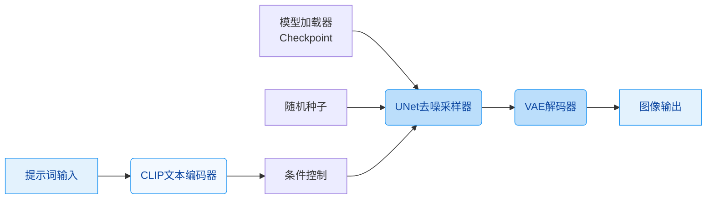
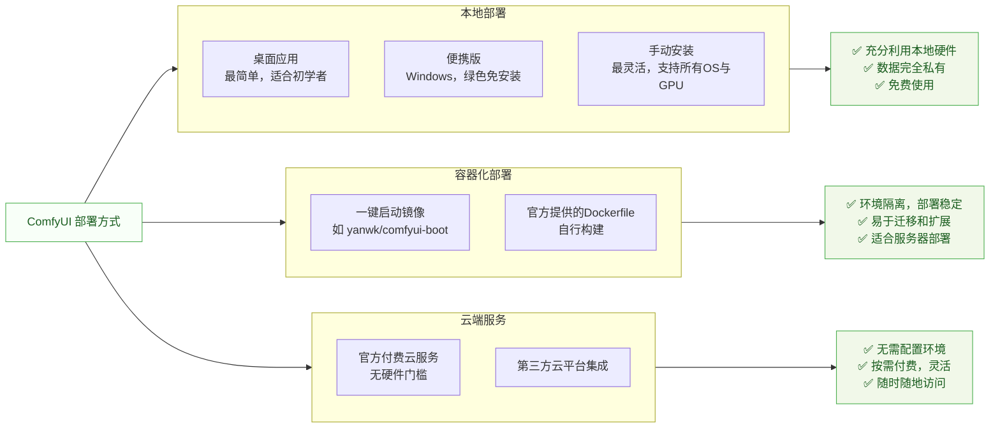

# Comfy-Org/ComfyUI

[GitHub URL](https://github.com/Comfy-Org/ComfyUI)


## ComfyUI 深度评测：节点式 AI 生成引擎

> ComfyUI 是一个基于节点式界面的模块化 AI 生成引擎，提供极致控制力与工作流复用能力。

- **Tags**: Stable Diffusion, 节点式编辑, AI 绘画, 工作流自动化, AIGC
- **Category**: AI 工具, 开源项目, 生产力工具

## Details

# ComfyUI 深度评测：为追求极致控制的视觉创作者打造的开源AI生成引擎
> 一句话总结：ComfyUI 是一个基于节点式（Node-based）界面的**模块化AI生成引擎**，它为用户提供了**前所未有的细粒度控制**和**强大的工作流复用能力**，是专业创作者和开发者追求**可定制、可重复、可集成**的AI生成任务的终极利器。
## 🔍 1. 背景与痛点：为何我们需要 ComfyUI？
在AI生成领域，传统在线工具（如DALL-E、Midjourney）虽然简单易用，但存在不可忽视的局限性：
-   **“黑盒”操作**：无法了解内部参数，结果难以复现和微调。
-   **功能固化**：工作流程被平台预设，无法满足个性化或复杂的生产需求。
-   **隐私与成本**：数据需上传云端，存在隐私风险；高频使用时成本高昂。
-   **模型限制**：通常只能使用平台指定的模型，难以快速尝试最新的开源模型。
ComfyUI 诞生于这样的背景。它并非一个简单的“AI绘画软件”，而是一个**底层生成引擎**和**开放工作流构建平台**。它将复杂的AI模型操作（如文本编码、去噪采样、VAE解码、ControlNet控制等）拆解为独立的“节点”，通过连接这些节点来构建灵活、可控且可复用的生成流程。
它主要解决了以下核心痛点：
-   **对专业用户而言**：提供了从模型加载、参数调整到后处理的全链路控制，确保输出结果**精准符合设计意图**。
-   **对团队与企业而言**：通过**保存和加载JSON工作流**，实现了生成过程的**标准化与可复现性**，便于团队协作和项目交付。
-   **对开发者而言**：提供了**本地API**和**自定义节点开发能力**，可轻松将AI生成能力**集成到任何生产流水线或应用程序中**。
-   **对硬件受限用户而言**：支持**模型量化**和**智能VRAM/RAM管理**，能在有限硬件上运行大型模型，并提供**云端解决方案**。
## ⚙️ 2. 核心亮点与功能剖析：深度与广度的完美结合
ComfyUI 的强大源于其精妙的架构设计和丰富的生态支持。其核心能力可以概括为以下几点：
### 🧩 2.1 节点式工作流系统（Node-Based Workflow）
这是 ComfyUI 的灵魂。它将一个AI生成任务分解为多个步骤（加载模型、输入提示词、采样、解码、保存等），每个步骤由一个**节点（Node）** 处理。节点之间通过**端口（Ports）** 和**连线（Wires）** 传递数据（如图像、文本、模型、潜空间表示等）。

-   **直观理解**：这就像一条**现代化的工厂流水线**。每个节点是一台专业机器，完成一道工序（如冲压、焊接、喷漆）。物料（数据）通过传送带（连线）在机器间流转，最终产出成品（生成内容）。你可以随时调整任何机器的参数，甚至替换机器，以改变最终产品的规格。
-   **核心优势**：
    -   **可视化编程**：无需写代码，通过拖拽和连接即可构建复杂逻辑。
    -   **模块化与复用**：可以创建**子图（Subgraph）** 或**保存工作流模板**，一次构建，无限复用。团队可共享同一套“生产线”，确保输出一致性。
    -   **极致控制**：可以精确控制扩散模型中的每一个参数（如采样步数、CFG Scale、采样器类型、调度器等），实现精准的“微调”而非“盲盒”生成。
### 🚀 2.2 强大的后端与性能优化
ComfyUI 的后端经过精心设计，在效率和灵活性之间取得了卓越平衡。
| 特性 | 描述 | 带来的收益 |
| :--- | :--- | :--- |
| **异步队列系统** | 支持将多个生成任务加入队列，按顺序或优先级执行，无需逐个等待。 | **批量生产**：可以一口气生成数十甚至上百张图，适合大量内容创作。 |
| **部分图重执行** | 只修改工作流中的一部分节点并重运行，无需重新执行整个流程。 | **高效迭代**：调整后续参数时，可节省大量前期计算时间，**大幅提升迭代速度**。 |
| **智能VRAM/RAM管理** | 自动将模型卸载到CPU内存，按需加载到GPU显存，支持**模型量化**（如FP8、FP4）。 | **硬件友好**：在显存较小的显卡上也能运行大型模型（如SDXL、Flux），降低硬件门槛。 |
| **模型混合与合并** | 支持在同一工作流中加载和使用多个不同的模型（如不同的Checkpoint、VAE、LoRA、ControlNet）。 | **混合创新**：可以融合多个模型的优点，创造独特的艺术风格或解决特定任务（如结合动漫与写实模型）。 |
### 🌐 2.3 广泛的模型支持与生态集成
ComfyUI 的一个巨大优势是其对**最新开源模型**的广泛支持，无需等待官方适配。
-   **原生支持**：开箱即用支持众多前沿开源模型，如 **Stable Diffusion 1.5/SDXL/SD3**、**Flux.1/Flux.2**、**Kandinsky**、**Wan 2.1 Video**、**Hunyuan3D**、**LTX-Video**、**Qwen-VL**等，涵盖了图像、视频、3D、音频甚至文本生成。
-   **自定义节点生态**：社区开发了数千个**自定义节点**，极大地扩展了功能边界。例如：
    -   **图像处理**：超分辨率、修复、补全、抠图、风格迁移。
    -   **高级控制**：集成各种ControlNet模型（OpenPose、Depth、Canny等）。
    -   **外部服务**：调用API节点（如Google Gemini、Stability AI API），实现多模态交互或云端推理。
-   **模板库**：官方和社区提供了丰富的**预配置工作流模板**，新手可直接加载并运行，快速上手并理解高级用法。
### 🔌 2.4 灵活的部署与集成方式
ComfyUI 提供了多种部署方案，以满足不同场景的需求：

-   **本地部署**：
    -   **桌面应用**：提供Windows和macOS安装包，一键安装，开箱即用，**强烈推荐新手使用**。
    -   **便携版**：解压即用的绿色版本，适合Windows用户快速体验或测试。
    -   **手动安装**：通过Python和pip安装，支持所有操作系统和GPU类型（NVIDIA、AMD、Intel、Apple Silicon），灵活性最高，但配置稍复杂。
-   **容器化部署（Docker）**：
    -   这是**服务器部署或追求环境一致性**的首选方案。社区提供了多个预配置的Docker镜像（如 `yanwk/comfyui-boot`），一条命令即可启动，无需担心依赖冲突。
    -   **优势**：环境隔离、易于迁移、适合在远程服务器或集群上部署，便于多人协作或集成到CI/CD流程。
-   **云端服务（Comfy Cloud）**：
    -   官方提供的付费云服务，对于没有强大本地硬件的用户是很好的选择，按需付费，免去配置烦恼。
### 🧪 2.5 代码示例：初识节点编程
下面是一个最基础的“文本生图”工作流代码示例，展示了其底层逻辑。即使不懂代码，也能看出它如何通过组合不同功能节点来构建流程。
```python
# 这是一个示意性的JSON工作流结构，实际工作流保存为JSON文件
workflow = {
    "nodes": [
        # 1. 加载模型
        {"id": 1, "type": "CheckpointLoaderSimple", "inputs": {"ckpt_name": "v1-5-pruned.safetensors"}},
        # 2. 输入提示词
        {"id": 2, "type": "CLIPTextEncode", "inputs": {"text": "a beautiful landscape, masterpiece, best quality", "clip": ["1", 1]}},
        # 3. 设置采样参数
        {"id": 3, "type": "KSampler", "inputs": {"seed": 123456, "steps": 20, "cfg": 7.0, "model": ["1", 0], "positive": ["2", 0], "negative": ["2", 1]}},
        # 4. 解码潜空间图像
        {"id": 4, "type": "VAEDecode", "inputs": {"samples": ["3", 0], "vae": ["1", 2]}},
        # 5. 保存图像
        {"id": 5, "type": "SaveImage", "inputs": {"images": ["4", 0], "filename_prefix": "output_"}}
    ],
    "links": [
        # 定义节点之间的连接关系
        [1, 0, 2, 0, "MODEL"],  # 模型输出 -> CLIP输入
        [1, 1, 2, 1, "CLIP"],   # CLIP输出 -> CLIPTextEncode输入
        # ... 其他连接 ...
        [3, 0, 4, 0, "LATENT"], # 采样器输出 -> VAE解码输入
        [4, 0, 5, 0, "IMAGE"]   # 解码图像 -> 保存输入
    ]
}
```
**解读**：这个JSON文件描述了一个完整的生成流程。你可以看到它由多个节点组成，每个节点有明确的类型（如`CheckpointLoaderSimple`）和输入输出。通过`links`数组定义了节点之间的数据流向。**ComfyUI的所有高级工作流，最终都保存为这样的JSON文件，这是实现标准化和复用的基石。**
## 🎯 3. 目标人群与收益：谁最适合使用 ComfyUI？
ComfyUI 并非为所有人设计，但它能为其目标用户带来**颠覆性的效率提升和创作解放**。
| 用户类型 | 收益 | 典型使用场景 |
| :--- | :--- | :--- |
| **专业视觉创作者<br>（插画师、设计师、摄影师）** | ✅ **精准控制**：精确把控生成结果，符合设计规范。<br>✅ **风格统一**：通过固定工作流，确保系列作品风格高度一致。<br>✅ **批量生产**：生成大量变体或素材，快速填充设计稿。 | 概念设计、海报素材生成、风格迁移与融合、AI辅助绘画、批量生成纹理/图标。 |
| **AI内容创作者/研究者** | ✅ **前沿模型**：第一时间体验并应用最新的开源模型。<br>✅ **实验平台**：是测试新模型、新采样方法、新节点的理想环境。<br>✅ **社区生态**：享受丰富的自定义节点和模板带来的无限可能。 | 模型评测、算法研究、生成新模型工作流、创作AI艺术、探索多模态生成。 |
| **开发者与工程师** | ✅ **可编程生成**：通过API将AI生成能力嵌入任何应用。<br>✅ **自动化流水线**：构建自动化图像/视频处理流程。<br>✅ **自定义开发**：轻松开发自定义节点，集成特定业务逻辑。 | 开发AI绘图网站、自动化内容生成系统、集成到设计工具（如Figma插件）、创建专属的AI工作流。 |
| **团队与企业** | ✅ **标准化与可复现**：通过共享工作流，确保团队输出标准统一。<br>✅ **私有部署与数据安全**：可在本地或私有云部署，保障数据不出域。<br>✅ **成本可控**：一次投入，无限使用，无生成费用限制。 | 企业品牌素材生成、电商批量图生成、游戏资产快速原型、内部设计流程自动化。 |
## ⚖️ 4. 竞品/同类对比：在开源领域的独特定位
ComfyUI 在开源节点式生成工具中占据**核心地位**，但其主要对手并非传统UI工具，而是同为节点式的引擎。
| 特性 | **ComfyUI** | **Automatic1111 WebUI** | **Fooocus** | **InvokeAI** |
| :--- | :--- | :--- | :--- | :--- |
| **核心哲学** | **节点式、模块化、极致控制** | 传统UI界面，功能丰富但相对固化 | **极简UI**，追求“开箱即用”的高质量 | 传统UI，注重“艺术家工作流” |
| **灵活性** | ⭐⭐⭐⭐⭐ **无与伦比** | ⭐⭐⭐ 功能丰富，但调整相对复杂 | ⭐⭐ 简单，但灵活性低 | ⭐⭐⭐⭐ 功能灵活，但非节点式 |
| **学习曲线** | ⭐⭐ **陡峭**，需要理解节点概念 | ⭐⭐⭐ 中等，类似传统软件 | ⭐ **极低**，傻瓜式操作 | ⭐⭐⭐ 中等，设计较好 |
| **扩展性** | ⭐⭐⭐⭐⭐ **强大**，自定义节点生态繁荣 | ⭐⭐⭐ 插件生态丰富，但核心扩展性弱 | ⭐⭐ 有限 | ⭐⭐⭐ 插件生态不错 |
| **性能** | ⭐⭐⭐⭐⭐ **高效**，部分执行、量化支持良好 | ⭐⭐⭐ 优化较好 | ⭐⭐⭐ 优化较好 | ⭐⭐⭐⭐ 优化较好 |
| **最佳定位** | **专业创作者、开发者、追求极致控制** | **普通用户、体验丰富功能** | **小白用户、快速出图** | **设计师、艺术家** |
**核心竞争力总结**：
ComfyUI 的独特之处在于它**不仅仅是一个UI，而是一个开放、模块化、可编程的生成引擎**。它将控制权完全交还给了用户，并通过节点系统和自定义生态，构建了一个**几乎无限可能的创作平台**。它的竞争对手不是其他UI，而是任何试图将AI生成简单化、标准化的工具，因为它的本质是**复杂性的封装和民主化**。
## ⚠️ 5. 局限与不足：需要清醒认识的现实
尽管强大，ComfyUI 并非没有缺点，其局限性主要源于其设计哲学和目标定位。
-   **学习曲线极其陡峭**：这是最大的门槛。理解节点、端口、数据流、采样器、调度器等概念需要时间。对于完全没有技术背景的用户，上手难度远高于Fooocus或Midjourney。
-   **初始配置可能复杂**：特别是手动安装和Docker部署，对于新手可能面临**环境配置、依赖安装、模型路径设置**等一系列问题。
-   **模型管理需手动**：ComfyUI不会自动管理模型文件。用户需要手动将下载的模型（ckpt/safetensors）放入对应的`models`文件夹下（如`checkpoints`、`loras`、`embeddings`等），并了解不同模型类型应放置的子目录。
-   **UI/UX仍需改进**：虽然功能强大，但默认UI相对简陋，缺乏现代感。节点布局、连线管理、缩放导航等功能体验有待提升（社区已有大量主题和UI扩展插件）。
-   **资源消耗显著**：尽管支持量化，但运行大型模型（如Flux、SDXL）对**显存和内存要求依然很高**。低配置用户可能面临性能瓶颈。
-   **社区文档质量参差不齐**：官方文档在逐步完善，但大量教程和解决方案散落在Discord、GitHub Issues、博客和视频平台中，缺乏系统化的新手引导。
## 🔧 6. 实战部署与使用指南：从零开始的快速通道
### 🚀 6.1 部署方式选择与快速启动
对于大多数用户，推荐从以下两种方式之一开始：
#### 方案一：桌面应用（推荐新手）
1.  访问 [comfy.org/download](https://www.comfy.org/download)，下载对应系统的安装包。
2.  运行安装程序，完成安装。
3.  启动应用，它通常会自动打开WebUI（地址通常是 `http://127.0.0.1:8188`）。
4.  在浏览器中打开界面，你就可以开始探索了。
#### 方案二：Docker容器化部署（推荐服务器/多环境用户）
这是最稳定、最易于迁移的部署方式，尤其适合在Linux服务器或需要隔离环境时使用。
```bash
# 1. 拉取预配置的镜像（以支持NVIDIA GPU的镜像为例）
docker pull yanwk/comfyui-boot:cu124-slim
# 2. 启动容器
#   --gpus all: 启用所有GPU（仅NVIDIA显卡需要）
#   -p 8188:8188: 将容器内8188端口映射到主机
#   -v $(pwd)/storage:/root/storage: 挂载本地目录，用于保存生成图片和模型
docker run -it --rm --name comfyui \
    --gpus all \
    -p 8188:8188 \
    -v "$(pwd)"/storage:/root/storage \
    yanwk/comfyui-boot:cu124-slim
```
执行上述命令后，在浏览器访问 `http://localhost:8188`，你就能看到ComfyUI的界面了。
> 💡 **提示**：如果遇到端口冲突（8188被占用），可以修改 `-p` 参数，如 `-p 8190:8188`，然后访问 `http://localhost:8190`。
### 🧩 6.2 第一个工作流：生成你的第一张图
1.  **打开模板**：在ComfyUI界面左侧，找到 **"Templates"** 图标并点击。
2.  **选择模板**：在模板列表中，找到并选择 **"Text to Image"** 或 **"Quick Start"** 类别的模板（如 "SDXL Text to Image"）。
3.  **加载模型**：模板会自动加载一个工作流。找到 **"Checkpoint Loader"** 节点，在模型选择器中点击选择一个模型（如 `v1-5-pruned.safetensors`）。**如果模型未下载，界面会提示你下载，按提示操作即可**。
4.  **输入提示词**：找到 **"CLIP Text Encode"** 节点（通常有Positive和Negative两个），在Positive文本框中输入你想生成的画面描述，如 "a cat sitting on a windowsill, soft lighting, highly detailed, masterpiece"。
5.  **运行工作流**：点击工具栏上的 **蓝色"Queue Prompt"按钮**（或按 `Ctrl+Enter`）。你会看到节点依次被高亮（绿色），开始生成过程。
6.  **查看结果**：生成完成后，图片会显示在 **"Save Image"** 节点的预览窗口中，并自动保存到你的输出目录。
### 🔧 6.3 自定义节点开发：为ComfyUI注入无限可能
ComfyUI的扩展性是其最强大的特性之一。开发自定义节点非常简单，只需定义一个类并注册即可。
```python
# custom_nodes/my_first_node.py
import numpy as np
from PIL import Image
import requests
import io
import base64
class ImageCaptioningNode:
    @classmethod
    def INPUT_TYPES(cls):
        return {
            "required": {
                "image": ("IMAGE",),  # 输入图像
                "api_key": ("STRING", {"default": ""})  # API密钥
            }
        }
    RETURN_TYPES = ("STRING",)  # 返回文本
    FUNCTION = "caption_image"  # 执行函数
    CATEGORY = "image"  # 节点分类
    OUTPUT_NODE = True  # 是否为输出节点
    def caption_image(self, image, api_key):
        # 将ComfyUI的图像张量转换为PIL图像
        i = 255. * image.cpu().numpy().squeeze()
        img = Image.fromarray(np.clip(i, 0, 255).astype(np.uint8))
        
        # 转换为base64
        buffered = io.BytesIO()
        img.save(buffered, format="JPEG")
        img_str = base64.b64encode(buffered.getvalue()).decode()
        
        # 调用外部API（此处以Google Gemini API为例）
        # 实际使用中请替换为真实的API调用逻辑和密钥
        headers = {"Content-Type": "application/json"}
        payload = {
            "contents": [{
                "parts": [
                    {"text": "Describe this image in detail."},
                    {"inline_data": {"mime_type": "image/jpeg", "data": img_str}}
                ]
            }]
        }
        response = requests.post(
            f"https://generativelanguage.googleapis.com/v1beta/models/gemini-pro-vision:generateContent?key={api_key}",
            headers=headers,
            json=payload
        )
        
        if response.status_code == 200:
            caption = response.json()['candidates'][0]['content']['parts'][0]['text']
        else:
            caption = "Error: API call failed"
            
        return (caption,)  # 返回描述文本
# 节点注册映射
NODE_CLASS_MAPPINGS = {
    "ImageCaptioningNode": ImageCaptioningNode
}
# 节点显示名称映射（可选）
NODE_DISPLAY_NAME_MAPPINGS = {
    "ImageCaptioningNode": "图像描述生成"
}
```
**如何使用**：
1.  将上述代码保存为 `image_captioning.py`，放入ComfyUI安装目录下的 `custom_nodes` 文件夹中。
2.  重启ComfyUI。你会在节点菜单的 `image` 分类下找到名为 **"图像描述生成"** 的节点。
3.  将此节点连接到工作流中，输入图像和API密钥，即可调用外部服务生成图像描述。
## 🧭 7. 结语与行动建议：终极评判
ComfyUI 是一个**现象级的开源项目**，它不仅仅是一个工具，更是一个**理念和社区**。它完美地体现了“**将复杂的技术以模块化的方式呈现，赋予用户终极控制权**”的设计哲学。
### 🏆 7.1 终极评判
-   **对于专业创作者和开发者**：ComfyUI 是**不可替代的生产力工具**。它能将你的创意和技术潜力转化为现实，并极大地提升效率和标准化水平。**投入时间学习它的回报是巨大的。**
-   **对于普通AI爱好者**：如果你的需求是“快速出图”，ComfyUI的复杂度可能不值得。但如果你想**深入理解AI生成的原理、探索最新模型、或构建独特的生成流程**，ComfyUI提供了**最深入、最灵活的探索平台**。
-   **对于团队和企业**：ComfyUI 是**实现AI生成能力私有化、标准化、可规模化**的基石。它能让你的团队摆脱对云服务的依赖，掌控数据主权，并构建专属的生成流水线。
### 🚀 7.2 行动建议
1.  **如果你是新手**：
    -   **立即下载桌面应用**，从官方模板开始，生成你的第一张图。
    -   **不要试图一次搞懂所有节点**。先学会用模板，再逐步修改参数，最后尝试调整节点。
    -   **多看多学**：在YouTube、B站搜索“ComfyUI教程”，有大量优质视频教程。
2.  **如果你是进阶用户**：
    -   **探索自定义节点**：安装一些流行的自定义节点（如`ComfyUI-Manager`），解锁新功能。
    -   **尝试Docker部署**：体验环境隔离的便捷，为在服务器上运行做准备。
    -   **开始构建自己的工作流库**：将常用的节点组合保存为子图，形成自己的“工具箱”。
3.  **如果你是开发者或企业决策者**：
    -   **深入研究API**：ComfyUI提供了强大的本地API，可以将生成能力集成到任何应用中。
    -   **评估部署方案**：根据团队规模和需求，选择本地部署、容器化部署或混合云方案。
    -   **投资学习与培训**：组织团队学习ComfyUI，其带来的长期效率提升远超学习成本。
**最终，ComfyUI 代表了一种趋势：AI工具将从“黑盒”走向“白盒”，从“预设”走向“定制”，从“消费”走向“创造”。如果你希望自己能站在这个趋势的前沿，那么拥抱ComfyUI，就是拥抱未来。**
