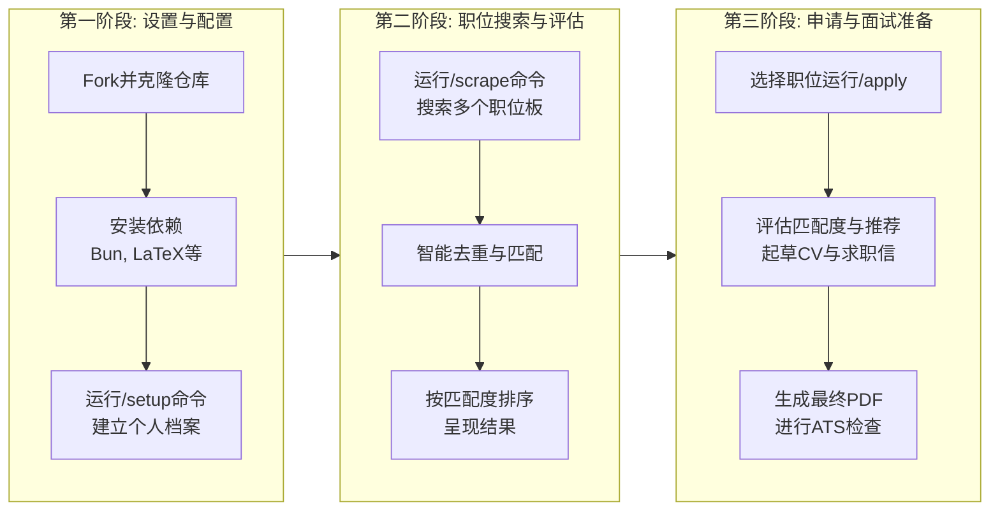

# MadsLorentzen/ai-job-search

[GitHub URL](https://github.com/MadsLorentzen/ai-job-search)

- **Stars**: 33875
- **Language**: Python

## AI Job Search Agent 深度评测：本地化求职自动化神器

> 基于 Claude Code 的开源 AI 求职自动化框架，通过全流程自动化显著提升求职效率与质量。

- **Tags**: 求职自动化, AI工具, 开源项目, 简历生成, 面试准备
- **Category**: AI 编程, 生活效率, 开发工具

## Details

# 🔍 AI Job Search Agent 深度评测：用 AI 重塑求职体验的先锋工具
> **一句话总结**：这是一个基于 Claude Code 的本地化 AI 求职自动化框架，通过智能化的职位匹配、简历定制、面试准备全流程，让求职者用技术手段提升求职效率与质量，是 AI 时代“武装到牙齿”的求职神器。
---
## 📊 一、核心概览与定位
**ai-job-search** 是由开发者 Mads Lorentzen 创建的开源项目，它是一个**构建在 Claude Code 之上的本地化 AI 求职自动化框架**。该项目旨在将 AI 技术深度应用于求职全流程，从职位搜索、简历定制、求职信撰写到面试准备，提供端到端的智能化支持。其核心价值在于通过**本地化、自动化、个性化**的解决方案，让求职者能够高效应对繁杂的求职任务，同时保持内容的真实性和专业性。
**核心指标一览**：
| 维度 | 评估 |
| :--- | :--- |
| **开源协议** | MIT License（完全自由） |
| **技术基础** | Claude Code CLI |
| **社区热度** | 约 12.9k stars, 4.1k forks（2026年中数据） |
| **适用范围** | 全球通用，但内置搜索工具主要针对丹麦市场 |
| **成本** | 框架免费，需支付 Claude API 使用费 |
## 🌐 二、背景与痛点：它为何诞生？
### 创作者的真实故事
项目的创建者 Mads Lorentzen 本人是一位地球物理学家。2025年底，当他被裁员后，并未陷入传统的求职困境，而是**利用自己的技术背景构建了这个自动化求职系统**。他通过这套系统每周执行 `/scrape`、`/apply` 和 `/interview` 工作流，最终提交了69份高度定制化的申请，获得了20个初面机会，并成功在2026年6月签订了一份AI工程师的工作合同。
### 解决的核心痛点
传统的求职过程存在多个痛点：
1.  **重复性劳动**：频繁地填写表单、修改简历、撰写千篇一律的求职信
2.  **信息不对称**：难以高效筛选出真正匹配自己技能和目标的职位
3.  **内容定制困难**：针对每个职位调整简历和求职信耗时巨大
4.  **面试准备不充分**：缺乏系统性的面试准备资料和模拟演练
5.  **流程管理混乱**：难以跟踪多个申请的状态和进展
**ai-job-search** 正是针对这些痛点提供了系统性的解决方案，通过AI技术将重复性任务自动化，让求职者能够专注于更核心的“人类”部分——如网络社交、面试表现和 offer 谈判。
## ⚙️ 三、核心亮点与功能剖析
### 1. 智能化全流程工作流
框架的核心工作流可以分为三个主要阶段，如下图所示：

### 2. 人机协作的双代理审查机制
这是该项目最精妙的设计之一。它不是简单地让AI生成内容，而是采用了**起草者-审查者分离的双代理模式**：
-   **起草代理**：根据职位描述和个人档案，生成初版的简历和求职信
-   **审查代理**：以批判性视角审视初版内容，提出修改建议，确保内容专业、准确且避免常见错误
这种“**AI帮助AI，人类监督AI**”的模式，既保证了效率，又通过层层审查提升了内容质量，减少了AI幻觉的风险。
### 3. LaTeX 生成的专业级简历与求职信
框架使用 LaTeX 模板生成简历和求职信，这带来了三个关键优势：
-   **格式完美**：生成的PDF文档格式统一、专业，排版美观，符合企业规范
-   **可定制性**：通过修改模板，可以轻松调整风格和内容布局
-   **ATS 友好**：生成的PDF包含文本层，能够通过ATS（Applicant Tracking System）系统的关键词检查，提高简历通过率
### 4. 智能面试准备系统
`/interview` 命令是一个强大的面试准备工具，它能够：
-   基于已提交的申请材料（简历、求职信、职位描述）构建阶段性的准备包
-   研究公司和面试官的背景信息
-   将可能的面试问题与你的STAR（Situation, Task, Action, Result）示例相匹配
-   提供模拟面试演练，遵循特定的角色扮演协议
### 5. 本地化运行与数据隐私
所有操作都在**本地机器上运行**，通过Claude Code CLI与AI交互。这意味着：
-   **数据隐私**：你的个人档案、申请材料等敏感数据不会上传到任何第三方服务器
-   **完全控制**：你可以审查每一个生成的输出，决定是否使用
-   **离线能力**：核心工作流可以在离线环境下运行（除了与AI模型的交互）
## 👥 四、目标人群与收益
### 谁最适合使用它？
1.  **技术背景的求职者**：程序员、数据科学家、AI工程师等，对CLI和自动化工具不陌生
2.  **频繁换工作者**：需要大量投递简历，急需提高效率的职场人士
3.  **海外求职者**：针对特定国家/地区市场（如丹麦）进行定制化申请的国际人才
4.  **追求极致效率者**：希望用技术手段解决重复性任务，专注于核心竞争力提升的人
### 能带来什么收益？
| 收益类型 | 具体体现 |
| :--- | :--- |
| **时间节省** | 将每个申请的准备时间从数小时缩短到数分钟 |
| **质量提升** | 生成高度定制化的专业材料，通过率更高 |
| **信息优势** | 系统性筛选职位，避免错过真正匹配的机会 |
| **信心增强** | 充分的面试准备让你在面试中更加自信 |
| **流程掌控** | 清晰跟踪所有申请的状态，不再混乱 |
> 💡 **真实收益验证**：项目创建者Mads本人通过此系统成功获得了AI工程师的职位，证明了其在实际求职中的有效性。
## ⚖️ 五、竞品/同类对比
| 维度 | **ai-job-search** | **传统求职方式** | **其他AI求职工具** |
| :--- | :--- | :--- | :--- |
| **自动化程度** | 高（全流程自动化） | 低（完全手动） | 中（通常只覆盖部分环节） |
| **定制化程度** | 高（基于个人档案深度定制） | 低（通用模板） | 中（通常基于关键词匹配） |
| **数据隐私** | 完全本地运行 | N/A | 通常需要上传数据到云端 |
| **技术门槛** | 高（需要技术背景） | 低 | 中 |
| **成本** | 框架免费，需API费用 | 仅有时间成本 | 订阅制或按次付费 |
| **灵活性** | 极高（可修改工作流和模板） | 低 | 低（通常固定功能） |
**独特竞争力**：
-   **“武装到牙齿”的全流程自动化**：从职位搜索到面试准备，覆盖求职的每一个环节
-   **人机协作的双代理审查机制**：这是与其他AI工具最大的区别，保证了输出质量
-   **开源与可定制性**：用户可以根据自己的需求修改和扩展功能
-   **本地化运行**：解决了数据隐私问题
## ⚠️ 六、局限与不足
### 1. 技术门槛较高
-   **命令行界面**：需要熟悉CLI操作，对非技术用户不友好
-   **依赖管理**：需要安装Python、Bun、LaTeX等多个依赖项，配置过程可能复杂
-   **调试困难**：当工作流出现问题时，需要一定的技术能力进行排查和修复
### 2. 地域限制
-   **内置搜索工具**：目前的职位搜索技能主要针对丹麦市场（Jobindex、Jobnet、Akademikernes Jobbank等）
-   **需本地化适配**：在其他国家使用需要自行开发或替换为本地职位板的搜索技能
### 3. 成本考虑
-   **API费用**：虽然框架本身免费，但需要使用Claude API，频繁使用会产生费用
-   **时间投入**：初始设置和学习需要投入一定的时间成本
### 4. 依赖与兼容性
-   **Claude Code依赖**：完全依赖Claude Code CLI，无法与其他AI工具（如Codex、Gemini CLI等）无缝集成，虽然提供了适配指南，但需要额外配置
-   **LaTeX依赖**：需要LaTeX环境，编译过程中可能会遇到字体或包的问题
### 5. “人机协作”的悖论
-   **需要人类监督**：虽然自动化了大部分工作，但仍需要人类审查和决策，完全的“一键发送”并不现实
-   **学习曲线**：需要理解如何与AI交互，如何提供有效的反馈，这需要一定的学习成本
## 🚀 七、上手指南：快速体验
### 1. 环境准备
```bash
# 1. 克隆仓库（注意：推荐创建私有仓库以保护个人数据）
gh repo fork MadsLorentzen/ai-job-search --clone
cd ai-job-search
# 2. 安装依赖（需要Bun和LaTeX环境）
# 在Windows PowerShell中:
$tools = @("jobbank-search", "jobdanmark-search", "jobindex-search", "jobnet-search", "linkedin-search", "freehire-search")
foreach ($tool in $tools) {
  Push-Location ".agents/skills/$tool/cli"
  bun install
  Pop-Location
}
# 在Bash/zsh中:
for tool in jobbank-search jobdanmark-search jobindex-search jobnet-search linkedin-search freehire-search; do
  (cd .agents/skills/$tool/cli && bun install)
done
```
### 2. 初始化个人档案
```bash
# 启动Claude Code
claude
# 在Claude Code中运行
/setup
```
`/setup` 命令会引导你通过三种方式之一建立个人档案：
-   从现有文档文件夹导入（推荐）
-   直接粘贴简历内容
-   通过问答式访谈建立档案
### 3. 搜索和申请职位
```bash
# 搜索职位
/scrape
# 申请特定职位
/apply <职位URL或直接粘贴职位描述>
```
## 📝 八、真实案例演示
以下是一个简化的案例展示，说明系统如何处理一个职位申请：
**用户输入**：
```
/apply https://example.com/job/123456
```
**系统处理流程**：
1.  **评估匹配度**：分析职位描述与个人档案的匹配程度，给出评分和推荐意见
2.  **生成初稿**：起草代理生成简历和求职信的初稿
3.  **审查与修改**：审查代理对初稿进行批判性审查，提出修改建议
4.  **最终版本**：根据审查意见修改后生成最终版本
5.  **编译PDF**：使用LaTeX编译简历和求职信为PDF格式
6.  **ATS检查**：检查生成的PDF是否包含文本层，并通过ATS关键词检查
**输出示例**（简化版）：
```
✅ 评估完成：匹配度 85%
- 你的Python和机器学习技能高度匹配
- 需要强调你的分布式系统经验
📄 简历初稿已生成
- 添加了职位要求的关键词：Python, TensorFlow, AWS
- 重新排序了项目经验，突出相关性
📝 求职信初稿已生成
- 第一段：表达对公司的了解和热情
- 第二段：匹配核心技能与职位要求
- 第三段：突出独特价值主张
🔍 审查意见：
- 建议：在简历中添加具体的量化成果
- 建议：求职信第三段可以更具体地描述一个相关项目
✅ 最终版本已生成
- 简历：cv_final.pdf
- 求职信：cover_letter_final.pdf
- ATS检查：通过 ✅
⚠️ 请务必在发送前仔细审查所有内容！
```
## 🔮 九、未来展望与发展方向
1.  **地域扩展**：社区正在开发针对其他国家和地区的职位搜索技能，未来有望支持更多本地化市场
2.  **集成更多AI模型**：虽然目前主要依赖Claude，但社区已经在探索如何适配其他AI模型（如Codex、Gemini等）
3.  **UI/UX改进**：可能会开发图形界面或Web界面，降低技术门槛
4.  **更多集成**：与更多工具集成，如Notion、Gmail等，进一步自动化工作流
5.  **社区生态**：随着社区的发展，可能会出现更多的插件、模板和最佳实践分享
## 🎯 十、结语与行动建议
### 终极评判
**ai-job-search** 是一个**设计精良、功能强大、真正实用的AI求职自动化框架**。它不仅仅是一个工具，更是一种**用技术手段武装求职过程的全新范式**。虽然它目前的技术门槛较高，主要适合技术背景的求职者，但其所展现的理念和实现方式，为整个求职技术领域指明了方向。
### 行动建议
1.  **如果你是技术背景的求职者**：
    -   **立即尝试**：按照快速上手指南，花1-2小时设置环境，体验一次完整的申请流程
    -   **投资学习**：投入时间学习如何更好地与AI交互，如何提供有效的反馈，这将极大提升你的使用效果
    -   **参与社区**：在GitHub上提交问题、分享经验、甚至贡献代码，帮助项目变得更好
2.  **如果你是非技术背景的求职者**：
    -   **关注发展**：关注项目的进展，等待UI界面或更低门槛的版本出现
    -   **学习基础**：开始学习基本的命令行操作和Git使用，为未来使用这类工具做准备
    -   **寻找替代方案**：考虑使用其他AI求职工具（如Resume.io, Zety等），虽然功能不如ai-job-search全面，但更容易上手
3.  **如果你是开发者或研究者**：
    -   **深入源码**：学习其架构设计和实现思路，了解如何构建复杂的AI工作流
    -   **贡献代码**：帮助解决issue、添加新功能或适配其他市场
    -   **构建衍生项目**：基于这个框架，构建针对特定行业或地区的专业化工具
> **最终建议**：无论你的技术背景如何，**ai-job-search都值得关注和尝试**。它不仅是一个工具，更是一种思维的转变——用技术和AI来增强人类的能力，而不是取代人类。在AI时代，这种“人机协作”的思维模式将变得越来越重要。
**项目链接**：[https://github.com/MadsLorentzen/ai-job-search](https://github.com/MadsLorentzen/ai-job-search)  
**支持项目**：如果这个项目对你有帮助，可以考虑通过[Ko-fi](https://ko-fi.com/madslorentzen)支持作者的开发工作。
