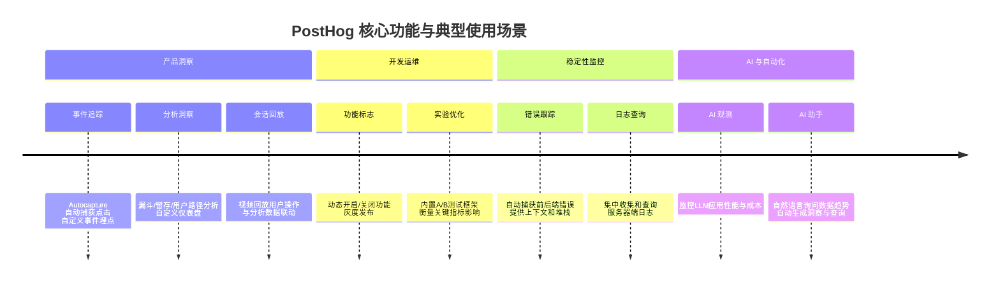
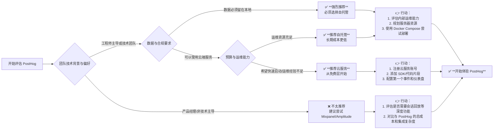

# PostHog/posthog

[GitHub URL](https://github.com/PostHog/posthog)

- **Stars**: 38937
- **Language**: Python

## PostHog 深度评测：全能开源产品分析平台

> 一款集分析、回放、功能标志于一体的开源一体化产品开发平台。

- **Tags**: 开源, SaaS替代, 用户行为分析, 自托管, DevOps
- **Category**: 开发工具, 数据分析, 效率工具

## Details

# PostHog 深度评测：一个让产品工程师爱不释手的全能开源分析平台
> 一句话总结：PostHog 是一个**开源、一体化**的产品洞察与开发平台，它将产品分析、会话回放、功能标志、实验、错误跟踪等多种工具集成于一体，旨在帮助产品团队和开发者**更高效地理解用户行为、快速迭代产品**，并特别注重数据主权和开发者体验。
## 🔍 背景与痛点：它为何诞生？
在传统的软件开发生命周期中，团队常面临以下**核心痛点**：
1.  **工具割裂，数据孤岛**：产品分析（如 Mixpanel, Amplitude）、错误监控（如 Sentry）、会话回放（如 FullStory）、功能管理（如 LaunchDarkly）等工具通常各自为政。数据分散在不同平台，难以联动分析，切换工具耗时耗力，导致**洞察成本高**。
2.  **工程化难题**：许多分析工具需要工程团队编写大量埋点代码，才能开始收集数据。这既消耗开发资源，又容易因埋点逻辑不一致或变更滞后而导致**数据质量差、分析结果失真**。
3.  **数据主权与合规顾虑**：对于金融、医疗、政府或对数据隐私要求极高的企业，将用户行为数据发送至第三方云服务可能存在**合规风险**和**数据所有权担忧**。
4.  **迭代速度与成本**：付费企业版工具费用高昂，且其功能设计往往难以完全契合每个团队独特的工作流。使用付费工具可能意味着**为不必要的功能付费**，或需要将就其固有的流程。
PostHog 的出现正是为了**一站式解决这些问题**。它由 PostHog 公司开发并开源，最初只是一个简单的开源分析工具，但因其强大的功能和开发者友好的理念，逐渐演变为一个覆盖产品开发生命周期多个关键环节的**一体化平台**。其核心理念是：**将产品洞察和开发工具的掌控权交还给工程师和产品团队**，通过开源和自托管选项确保数据完全可控，并通过丰富的集成能力简化工作流。
## ✨ 核心亮点与功能剖析
PostHog 的强大之处在于其**功能的一体化和深度集成**。它不仅仅是一个分析工具，更是一个产品开发者的“瑞士军刀”。
### 📊 1. 产品分析（Product Analytics）
这是 PostHog 的根基。它帮助团队回答“用户在做什么？”和“用户在哪里流失？”这类核心问题。
*   **事件追踪**：支持**自动捕获（Autocapture）** 和**自定义事件**。Autocapture 能自动跟踪页面上的点击、表单提交、输入等交互，**大幅减少手动埋点工作**。同时，也允许通过 SDK 轻松定义和追踪关键业务事件（如 `signup_completed`, `feature_used`）。
*   **强大查询**：提供直观的查询构建器，支持**漏斗分析、留存分析、用户路径分析、群组分析**等。用户可以创建自定义图表和仪表盘，实时监控关键指标。
*   **数据洞察**：能够发现用户行为模式，识别高价值用户和流失风险用户，从而驱动产品优化。
### 📹 2. 会话回放（Session Replay）
它允许你以视频形式**精确回放用户在应用中的操作过程**。这不仅仅是看，更是为了**洞察**。
*   **价值**：能直观看到用户在哪些功能上遇到困惑、哪里表单填写出错、哪个按钮被反复点击但无效。这对于**定位可用性问题、了解用户真实意图、验证假设**至关重要。
*   **智能集成**：回放可以与分析数据联动。例如，直接在分析报告中点击某个步骤的流失用户，就能查看他们对应的会话回放，**瞬间从宏观统计深入到微观个案**。
### 🚩 3. 功能标志（Feature Flags）与实验（Experiments）
这属于**开发运维（DevOps）与增长黑客**结合的利器。
*   **功能标志**：可以**动态开启或关闭**特定功能，而无需重新部署代码。这对于**灰度发布、A/B测试、按用户条件展示不同功能**（如仅向付费用户显示高级按钮）非常实用。
*   **实验**：内置了**A/B测试框架**。你可以轻松创建实验，将用户随机分配到不同组，衡量不同功能或页面设计对关键指标（如转化率、留存）的影响。所有实验数据与分析数据集中管理，**结果透明可信**。
### 🐛 4. 错误跟踪（Error Tracking）与日志（Logs）
*   **错误跟踪**：自动捕获应用中的JavaScript、后端错误（如Python、Go、Node.js），并提供详细的错误堆栈、用户信息、上下文（如发生错误时的页面URL、用户属性），帮助开发者**快速定位和修复Bug**。
*   **日志（Logs）**：这是一个强大的后端调试工具，允许你集中收集和查询服务器端日志，并与前端行为数据关联，实现**端到端的错误排查和性能诊断**。
### 🤖 5. AI 观测与助手（AI Observability & Assistant）
这是 PostHog 面向AI时代推出的前沿功能。
*   **AI 观测**：可以**监控和分析LLM（大语言模型）应用的性能和成本**，跟踪Token消耗、请求延迟、响应质量，帮助优化AI应用。
*   **AI 助手**：内置的AI能力可以**自动解释数据趋势、生成洞察、甚至帮你编写查询**。你可以用自然语言向它提问，例如“上周转化率下降的原因是什么？”，它会基于你的数据进行分析和回答。
### 🔌 6. 无与伦比的集成能力
PostHog 的另一个核心优势是其**强大的集成生态**。
*   **与开发流程深度集成**：通过 GitHub App，可以将 PostHog 中的支持票与 GitHub Issue 双向同步。在 PostHog 中回复的评论会自动同步到 GitHub，反之亦然。这使得产品反馈可以直接转化为开发任务，打通了从“用户反馈”到“代码修复”的闭环。
*   **Slack & 其他工具**：支持将关键指标、实验结果、错误告警推送到 Slack 等团队协作工具，让整个团队实时了解产品状况。
*   **数据导出与嵌入**：支持通过 API 或导出功能将数据与 BI 工具（如 Metabase、Superset）集成，或将分析图表嵌入到自己的仪表盘中。

## 🎯 目标人群与收益：谁最适合使用？
PostHog 的定位使其特别适合以下团队和场景：
| 目标人群 | 核心痛点 | PostHog 带来的收益 |
| :--- | :--- | :--- |
| **产品工程师（Engineer-Product Role）** | 需要频繁在开发工具和分析工具间切换，渴望有开发者友好的洞察工具。 | **一站式平台**，减少工具切换；**代码即配置**，通过 SDK 和 API 深度控制；**自动化集成**，将洞察无缝融入开发流程。 |
| **技术产品经理（Technical PM）** | 深陷数据孤岛，难以快速获取可信的、可关联的用户行为数据来验证假设。 | **统一数据源**，所有行为数据集中一处；**灵活查询**，快速回答“如果-那么”假设问题；**实验驱动**，用数据驱动产品决策。 |
| **初创公司与成长型团队** | 预算有限，需要用有限资源最大化价值；迭代速度至关重要。 | **开源免费自托管**，大幅降低工具成本；**功能全面**，避免集成多个工具的复杂；**快速上手**，Autocapture 快速获取数据。 |
| **对数据隐私有强要求的企业** | 需要完全掌控用户行为数据，不能发送至第三方云服务。 | **完全数据主权**，可自托管在私有云或本地环境；**透明开源**，代码完全公开，可审计和定制；**合规友好**。 |
| **AI 应用开发者** | 缺乏工具来监控和优化 LLM 应用的性能、成本和输出质量。 | **AI 观测能力**，原生支持追踪 LLM 调用；**成本与质量分析**，优化 Token 消耗和响应效果；**前沿且专注**。 |
## ⚖️ 竞品/同类对比：它处于什么位置？
在产品分析和开发工具领域，PostHog 的定位非常独特。下表将其与主要竞品进行了对比。
### 核心竞品对比一览
| 特性维度 | **PostHog** | **Mixpanel / Amplitude** | **FullStory / LogRocket** | **Sentry / Bugsnag** | **Pendo / Appcues** |
| :--- | :--- | :--- | :--- | :--- | :--- |
| **核心定位** | **一体化**产品开发平台 | **专注产品分析** | **专注会话回放**与用户反馈 | **专注错误监控** | **专注用户引导**与采纳 |
| **功能覆盖** | **非常全面**：分析+回放+功能标志+实验+错误+日志+AI | **极深**于分析，其他功能较浅或需集成 | **极深**于回放，分析功能基础 | **极深**于错误监控，其他功能较弱 | **极深**于引导流程，分析基础 |
| **开源与自托管** | ✅ **完全开源**，支持自托管 | ❌ 主要为SaaS，无自托管 | ❌ 主要为SaaS，无自托管 | ❌ 主要为SaaS，有自托管选项 | ❌ 主要为SaaS |
| **开发者体验** | ⭐⭐⭐⭐⭐ **工程化优先**，SDK强大，API友好，集成能力强 | ⭐⭐⭐ 需较多手动埋点，非开发者主要目标用户 | ⭐⭐⭐ 开发者主要做集成，非核心用户 | ⭐⭐⭐⭐⭐ 开发者核心工具，体验极佳 | ⭐⭐⭐ 主要为产品经理和增长团队设计 |
| **定价模式** | **开源免费自托管**；SaaS按事件收费，有慷慨免费层 | **SaaS付费**，价格较高，有免费层但限制多 | **SaaS付费**，价格较高 | **SaaS付费**，有 generous 免费/自托管选项 | **SaaS付费**，价格中等 |
| **独特竞争力** | **开源与数据主权**；**功能一体化**；**工程友好** | **分析深度与专业度**；**成熟的工作流**；**企业级功能** | **会话回放的极致体验**；**用户行为洞察** | **错误监控的权威性**；**性能监控**；**生态强大** | **无代码用户引导**；**用户采纳流程设计** |
### 🆚 关键对比解读
1.  **PostHog vs. 混合搭配多个工具**
    PostHog 最大的价值在于**替代了传统工具链**。若单独购买 Mixpanel + FullStory + LaunchDarkly + Sentry，每月成本极高且数据割裂。PostHog 提供“**一个平台搞定大部分需求**”，**显著降低成本**和**数据整合的复杂度**。对于技术团队，这能极大提升效率。
2.  **PostHog vs. 开源同类（如Metabase, Superset）**
    Metabase/Superset 是强大的 BI 工具，但它们**不擅长产品事件跟踪和实时行为分析**，也没有会话回放、功能标志等开发者核心功能。它们更适合生成传统的业务报表（如销售、财务）。PostHog 则是**专为产品行为分析打造**，在实时性、事件粒度、与开发流程集成方面远胜通用BI工具。
3.  **PostHog vs. 专注领域巨头（如Amplitude, Sentry）**
    这是“**全能选手**”与“**单项冠军**”的较量。如果你的团队**只做一件事**，比如只做深度分析（Amplitude）或只监控错误（Sentry），那么专注工具通常在单一领域做得更深、更专业。但如果你需要**同时做多件事**，且希望数据能关联，那么 PostHog 的**一体化优势**就变得不可替代。它就像一个“瑞士军刀”，虽然每把小刀可能不如专门的刀，但它能解决你80%的问题，并且方便携带。
## ⚠️ 局限与不足：你需要知道这些
PostHog 虽然强大，但并非完美无缺，其局限性主要体现在：
1.  **自托管的运维与维护成本**
    这是选择自托管 PostHog 时**最大的挑战**。你需要自行管理数据库（PostgreSQL）、数据仓库（ClickHouse）、Redis、Kafka 等组件的部署、升级、备份和监控。这要求团队具备**较强的DevOps运维能力**。PostHog 提供了 Docker Compose 和 Kubernetes（Helm）两种部署方式，但 K8s 部署官方已**支持日落（Sunset）**，意味着未来可能不再积极维护。对于没有运维经验的小团队，自托管可能是个“坑”，**云服务可能更实际**。
2.  **官方对自托管的支持有限**
    PostHog 明确表示，**不对自托管实例提供商业级技术支持**。这意味着如果你在自托管环境中遇到问题，只能依赖社区文档和问题排查。这对稳定性要求极高的企业来说是个风险。
3.  **文档与社区生态仍在完善**
    虽然 PostHog 的文档相当详尽，但作为一个快速发展的项目，**某些高级功能或特定部署场景的文档可能不够细致或更新不及时**。社区虽然活跃（GitHub Star 37.8k+），但相比 Sentry 等老牌工具，**其第三方插件、教程、生态丰富度仍有差距**。
4.  **并非所有功能都同等强大**
    “一站式”也意味着精力分散。虽然其核心分析、功能标志、错误跟踪都很强，但**会话回放**的精细度（如网络请求、控制台日志）可能不如 FullStory/LogRocket；**AI 观测**的功能仍在快速发展中，可能不如专门为 LLM 打造的监控工具（如 LangSmith）深度。你需要根据自身需求评估其功能强度是否足够。
5.  **学习曲线**
    对于完全非技术的产品经理或市场人员，PostHog 的界面和功能**比 Mixpanel/Amplitude 更具“工程化”思维**，初期上手可能需要一点时间来理解“事件”、“属性”、“群组”等概念。但一旦掌握，其灵活性又远超前者。
## 🧭 深度技术解析：开发者的视角
### 技术栈与架构设计
PostHog 的后端主要采用 **Django (Python)** 框架，这是其核心业务逻辑所在。其架构设计精妙之处在于**数据分存储策略**：
*   **PostgreSQL**：存储用户数据、项目信息、配置等结构化数据。
*   **ClickHouse**：这是其**事件分析引擎的核心**。ClickHouse 是一个高性能的列式数据库，极其适合处理海量时序事件数据的实时查询和分析，这也是 PostHog 分析查询速度极快的原因。
*   **Redis**：用于缓存、会话存储、消息队列等，提升性能和实时性。
*   **Kafka**：作为事件消息总线，负责在各个服务间可靠地传递事件流，确保数据不丢失、处理有序。
这种**多语言、多数据库协同**的架构，是为了在**性能、可扩展性和开发效率**之间取得最佳平衡。Django 提供了快速的开发能力和强大的ORM，ClickHouse 负责繁重的分析计算，Redis 和 Kafka 则保障了实时性和高可用性。
### 上手门槛与部署体验
*   **云服务（SaaS）**：**门槛最低**，只需注册账号，添加代码片段（几行JavaScript或SDK），即可开始收集数据。推荐大多数用户，尤其是初创团队和需要快速验证想法的场景从云服务开始。
*   **Docker Compose 自托管**：**门槛中等**。PostHog 提供了配置好的 `docker-compose.yml` 文件。通常只需运行：
    ```bash
    git clone https://github.com/PostHog/posthog.git
    cd posthog
    docker-compose up -d
    ```
    即可在一台服务器上启动全部服务。但需要提前安装 Docker 和 Docker Compose，并确保服务器资源足够（建议至少4核8G内存）。后续维护（如升级、备份）仍需手动操作。
*   **Kubernetes 自托管**：**门槛较高**。虽然曾提供 Helm Charts，但官方已宣布支持日落。这意味着未来可能不再积极维护和更新 K8s 部署方案，除非你有非常强的 K8s 运维能力和自定义需求，否则不推荐。
**Demo / 核心代码示例**：
以下是一个在 React 应用中最基础的集成示例，展示如何自动捕获事件和手动追踪关键操作。
```javascript
// 1. 安装 PostHog SDK
// npm install posthog-js
// 2. 在应用入口处（如 App.jsx 或 index.js）初始化
import posthog from 'posthog-js'
// 替换 YOUR_PROJECT_API_KEY 和 YOUR_INSTANCE_ADDRESS
posthog.init('YOUR_PROJECT_API_KEY', {
  api_host: 'https://app.posthog.com', // 如果是云服务
  // api_host: 'http://your-self-hosted-domain.com', // 如果是自托管
  autocapture: true, // 启用自动捕获（点击、表单提交等）
  capture_pageview: true, // 自动捕获页面浏览
  capture_pageleave: true, // 自动捕获页面离开
})
// 3. 手动追踪一个自定义事件（例如，用户点击“升级”按钮）
function handleUpgradeClick() {
  // 可选：设置用户属性
  posthog.people.set({
    'plan': 'free',
    'last_upgrade_click': new Date().toISOString()
  })
  // 追踪事件
  posthog.capture('upgrade_button_clicked', {
    'button_location': 'navbar',
    'user_type': 'free_tier'
  })
  
  // ... 跳转到升级页面
}
```
### 社区活跃度与生命力
PostHog 的**社区非常活跃**，GitHub 主仓库拥有超过 **37.8k Stars** 和 **3.2k Forks**。其 Issue 和 Pull Request 数量庞大（Issue 3.4k, PR 1.8k），表明有大量用户和开发者在参与贡献和反馈。
*   **更新频率**：**非常高**。主分支几乎每天都有新提交，意味着功能迭代和Bug修复非常迅速。
*   **Issue 解决速度**：**相当快**。核心团队非常积极地响应和解决社区提交的问题和功能请求。
*   **生态建设**：除了主项目，PostHog 还维护了一系列周边工具和SDK，其文档博客持续产出高质量的技术内容，形成了良好的开发者社区氛围。
## 🧭 结语与行动建议：终极评判
### 终极评判
PostHog 是一个**极具创新性和颠覆性的开源产品**。它凭借 **“开源 + 一体化 + 开发者友好”** 的独特组合，在产品分析和开发工具领域开辟了一条新赛道。它尤其适合那些**技术驱动、注重数据主权、希望将洞察无缝融入开发流程的团队**。它的出现，让“**用数据驱动产品，用工具赋能开发**”的理念变得前所未有的触手可及。
### 行动建议：你是否应该选择 PostHog？

1.  **如果你是初创公司或成长型团队，且工程师数量 ≥ 1**：
    **不要犹豫，立即从 PostHog 云服务开始**。它的免费层非常慷慨，集成简单，能立即带来价值。随着团队和业务增长，再根据数据量和合规需求考虑是否自托管。
2.  **如果你是对数据隐私有强要求的企业（如金融、医疗、政府）**：
    **PostHog 是为数不多的、可行的开源解决方案之一**。你需要投入资源组建或培训运维团队来维护自托管环境，这是获取数据自主权所必需的投资。
3.  **如果你是成熟的大型企业，已有稳定的工具链（如 Amplitude + Sentry + LaunchDarkly）**：
    **不要盲目替换**。PostHog 的集成成本和迁移成本可能很高。你可以先在一个小型的、创新的**新项目或子产品上试点**，评估其一体化带来的效率提升和成本节约是否值得全面迁移。
4.  **如果你是个人开发者或学习项目**：
    **PostHog 云服务是你的最佳选择之一**。免费层足够你学习所有功能，且无需担心运维问题。
> **最后提醒**：工具本身只是手段，**真正重要的是你如何利用它来构建更好的产品**。PostHog 赋予了你前所未有的能力，但如何设计事件、如何分析数据、如何驱动决策，仍然需要你和团队的智慧与洞察。拥抱 PostHog，但更要拥抱数据驱动的产品文化。
