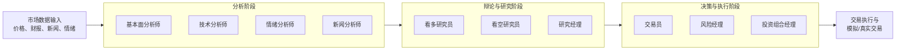
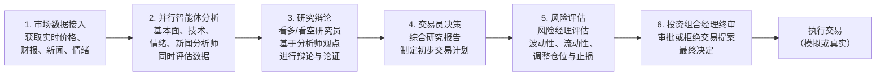

# TauricResearch/TradingAgents

[GitHub URL](https://github.com/TauricResearch/TradingAgents)

- **Stars**: 101176
- **Language**: Python

## TradingAgents 深度评测

> 基于多智能体架构的 AI 金融交易研究框架，模拟交易团队协作，提供深度市场分析与决策支持。

- **Tags**: 开源项目, 量化交易, LangGraph, 智能体, Python
- **Category**: 金融科技, 人工智能, 开发者工具

## Details

# 🚀 TradingAgents 深度评测：当大模型成为你的专业交易团队
> **一句话总结**：TradingAgents 是一个**多智能体 LLM 金融交易框架**，它通过模拟真实交易团队的结构，让多个 AI 智能体协同工作，从数据分析、辩论研究到风险管理，自动生成基于证据的投资决策。它既适合研究人员探索 AI 在金融领域的应用，也为开发者提供了高度可定制的交易平台。
---
## 📊 1. 背景与痛点：传统量化交易与 AI 的融合
### 1.1 量化交易的现状与挑战
传统量化交易通常依赖**固定的数学模型和规则**，例如：
- **技术指标策略**：基于 MACD、RSI 等指标的交叉和背离。
- **基本面策略**：通过财务报表（如 PE、ROE）筛选股票。
- **统计套利**：利用价格统计特性的均值回归。
但这些方法存在明显缺陷：
- **静态模型僵化**：市场风格切换时（如从成长股切换至价值股），固定模型容易失效。
- **黑箱决策风险**：复杂的机器学习模型（如神经网络）难以解释，导致合规与风控难度大。
- **数据融合困难**：整合新闻、财报、社交媒体等**非结构化数据**的成本高且技术复杂。
### 1.2 大模型带来的革命
大语言模型（LLM）的兴起为金融分析带来新可能：
- **强大的语义理解**：能理解财报文本、新闻情绪、社交媒体讨论。
- **逻辑推理能力**：可以基于多源数据生成连贯的投资论点（Thesis）。
- **代码生成与工具调用**：可通过 API 获取实时数据并计算指标。
但单一大模型也存在局限：
- **幻觉风险**：可能编造财务数据或新闻事实。
- **缺乏专注分工**：无法同时深度跟踪基本面、技术面和情绪面。
- **决策一致性差**：相同输入在不同调用下可能给出矛盾结论。
### 1.3 TradingAgents 的创新思路
TradingAgents 的诞生正是为了解决上述问题。它通过**多智能体架构**，让不同的 AI 专家各司其职，并通过**辩论机制**和**风险管理模块**，最终生成更稳健、可解释的决策。其设计理念是：“**让 AI 模拟真实交易团队的协作流程**”。
---
## 🔍 2. 核心亮点与功能剖析
### 2.1 多智能体架构：模拟顶级交易团队
TradingAgents 的核心是构建了一个完整的专业交易团队，每个智能体都有明确的分工和职责：
| 智能体 (Agent) | 职责描述 | 核心能力与数据源 |
| :--- | :--- | :--- |
| **📊 基本面分析师** (Fundamentals Analyst) | 分析公司财务状况和内在价值 | 财报数据（收入、利润、现金流）、关键财务指标（PE、ROE） |
| **📈 技术分析师** (Technical Analyst) | 识别价格趋势和交易信号 | 历史价格、技术指标（MACD、RSI、布林带） |
| **😊 情绪分析师** (Sentiment Analyst) | 衡量市场短期情绪和热度 | 新闻标题、StockTwits、Reddit 讨论区（如 r/wallstreetbets） |
| **📰 新闻分析师** (News Analyst) | 解读宏观事件和公司新闻 | 全球新闻、宏观经济指标（如 FRED 数据） |
| **🐂 看多研究员** (Bull Researcher) | 构建看多投资论点 | 综合分析师观点，寻找支持上涨的证据和逻辑 |
| **🐻 看空研究员** (Bear Researcher) | 构建看空投资论点 | 综合分析师观点，寻找支持下跌的证据和风险点 |
| **🔬 研究经理** (Research Manager) | 综合各方意见并组织辩论 | 评估看多/看空论据的可靠性，促成平衡的讨论 |
| **🤵 交易员** (Trader) | 做出最终交易决策 | 综合研究报告、市场条件，决定交易方向、时机和规模 |
| **⚖️ 风险经理** (Risk Manager) | 评估和控制风险 | 评估市场波动性、流动性，调整仓位和止损位 |
| **💼 投资组合经理** (Portfolio Manager) | 终极决策者 | 审批交易提案，管理整体资产配置和风险暴露 |

这个架构的精妙之处在于**分工协作与相互制约**：
- **并行分析**：多个分析师同时从不同角度研究同一标的，效率更高。
- **辩论机制**：看多和看空研究员相互质疑，研究经理主持，能有效**平衡观点，减少极端偏见**。
- **风险把关**：风险经理和投资组合经理作为“双重保险”，确保决策在风险可控范围内。
### 2.2 技术栈与架构解析
- **核心框架**：基于 **LangGraph** 构建。LangGraph 是 LangChain 生态中用于构建**有状态、多智能体应用**的框架，非常适合实现这种复杂的决策流程和智能体间的交互。
- **LLM 提供商支持**：提供**极其广泛**的 LLM 支持，是其一大亮点。
    - **闭源 API**：OpenAI (GPT-4/5), Google (Gemini), Anthropic (Claude), xAI (Grok), Azure OpenAI, AWS Bedrock。
    - **开源/本地模型**：Ollama, DeepSeek, Qwen (通义千问), GLM (智谱), MiniMax, Groq, Mistral 等。
    - **兼容端点**：支持任何兼容 OpenAI API 的端点（如 vLLM, LM Studio）。
    - **双区域支持**：特别为中国用户优化，支持 Qwen 和 GLM 的**国际版和国内版** API，避免网络问题。
- **数据源接入**：
    - **行情数据**：Yahoo Finance（支持全球市场，包括美股、港股、A股、加密货币等）。
    - **新闻与情绪**：新闻标题、Reddit、StockTwits 等。
    - **宏观经济**：FRED (圣路易斯联储经济数据)。
    - **预测市场**：Polymarket（新兴数据源）。
- **部署与扩展**：
    - **Python 包**：可作为库导入自定义代码中，灵活集成到研究流程。
    - **Docker**：提供 Docker Compose 配置，支持**一键部署**和**本地模型（Ollama）**，解决环境依赖和团队协作问题。
    - **环境变量配置**：支持通过 `TRADINGAGENTS_*` 前缀的环境变量进行配置，API 密钥支持自动检测。
### 2.3 核心工作流：从数据到决策
TradingAgents 的决策过程可概括为以下六大步骤：

### 2.4 配置与定制性
- **高度可配置**：用户可以通过配置文件或代码调整：
    - **研究深度**：设置辩论轮数、每个智能体的思考时长。
    - **模型选择**：为不同智能体选择不同的 LLM（如给技术分析师用更强的模型，给风险经理用更稳定的模型）。
    - **数据源范围**：选择接入哪些数据源。
    - **风险参数**：设置最大持仓、止损比例等。
- **LangGraph Checkpoint Resume**：支持**断点续跑**。如果程序中断，可以从上次的检查点恢复，对于长时间的复杂分析非常有用。
- **持久化决策日志**：所有决策过程都会被记录，便于后续审计、回测和复盘。
---
## 🧩 3. 上手门槛与部署体验
### 3.1 安装与部署
TradingAgents 提供了多种安装方式，满足不同需求：
| 部署方式 | 适用场景 | 复杂度 | 优点 | 缺点 |
| :--- | :--- | :--- | :--- | :--- |
| **Python 包安装** | 个人开发者、研究人员、需要深度集成 | ⭐⭐⭐ | 灵活性最高，可直接作为库使用 | 需配置本地 Python 环境，可能遇到依赖问题 |
| **Docker 部署** | 团队协作、需要隔离环境、追求稳定性 | ⭐⭐ | 解决环境依赖问题，一键启动，便于分享 | 需要了解 Docker 基础 |
| **Docker + Ollama (本地模型)** | 隐私敏感、不想用 API、有本地 GPU | ⭐⭐⭐⭐ | 数据隐私、成本可控（长期）、无 API 限制 | 对硬件要求高，配置稍复杂 |
**核心安装步骤（Python 包方式）**：
```bash
# 1. 克隆仓库
git clone https://github.com/TauricResearch/TradingAgents.git
cd TradingAgents
# 2. 创建并激活虚拟环境（推荐使用 Python 3.12）
conda create -n tradingagents python=3.12
conda activate tradingagents
# 3. 安装依赖
pip install -r requirements.txt
# 4. 配置 API 密钥（在 .env 文件中或直接导出环境变量）
export OPENAI_API_KEY="你的OpenAI_API密钥"
# ... 配置其他需要的密钥
# 5. 启动交互式命令行界面 (CLI)
tradingagents
```
> 💡 **小白提示**：如果你对环境配置不熟悉，强烈建议使用 **Docker**。只需安装 Docker Desktop，然后执行：
> ```bash
> cp .env.example .env  # 编辑 .env 文件，填入你的 API 密钥
> docker compose run --rm tradingagents
> ```
> 这样可以避免几乎所有环境依赖问题。
### 3.2 CLI 与交互体验
启动后，会出现一个**文本用户界面 (TUI)**，引导你完成配置：
1.  **选择标的 (Ticker)**：输入股票代码（如 `AAPL`, `0700.HK`, `BTC-USD`），系统会自动解析市场。
2.  **选择分析日期**：分析历史某一天的数据，用于回测。
3.  **选择 LLM 提供商与模型**：从已配置的提供中选择你想用的模型。
4.  **配置研究参数**：设置研究深度（影响辩论轮数和思考时间）。
5.  **运行与分析**：系统开始运行，你可以在界面上实时看到每个智能体的分析过程和输出（非常解压！）。最终会给出一个**明确的交易决策（买入/卖出/持有）** 以及**详细的决策报告**。
-blue)  
### 3.3 核心代码示例（Python 包用法）
对于开发者，可以将其集成到自己的研究项目中：
```python
from tradingagents.graph.trading_graph import TradingAgentsGraph
from tradingagents.default_config import DEFAULT_CONFIG
# 初始化 TradingAgents，可传入自定义配置
ta = TradingAgentsGraph(debug=True, config=DEFAULT_CONFIG.copy())
# 执行分析：对英伟达(NVDA)在2026年1月15日进行分析
# 返回: (状态, 决策对象)
_, decision = ta.propagate("NVDA", "2026-01-15")
# decision 对象包含了完整的分析过程和最终结论
print(decision.summary)  # 打印决策摘要
print(decision.action)   # 打印最终操作（如 'BUY', 'SELL', 'HOLD'）
print(decision.reasoning) # 打印详细的推理过程
```
---
## 🎯 4. 目标人群与收益
### 4.1 谁最适合使用？
| 人群 | 匹配度 | 核心收益 |
| :--- | :--- | :--- |
| **🧑‍💻 量化研究员/金融工程师** | ⭐⭐⭐⭐⭐ | **快速构建原型**：无需从零搭建多智能体框架，专注于策略研究。**可解释性强**：清晰的决策流程有助于理解策略逻辑和归因。 |
| **📈 个人交易者/投资者** | ⭐⭐⭐⭐ | **获得第二意见**：让一个“AI团队”为你分析一只股票，作为你决策的参考。**学习工具**：观察专业人士（AI）是如何从多角度分析公司的。 |
| **🏦 金融机构/对冲基金** | ⭐⭐⭐⭐ | **探索前沿应用**：评估多智能体 LLM 在投资研究中的潜力。**降低研发成本**：基于开源框架快速开发内部工具，而非完全自研。 |
| **🎓 高校学生/学者** | ⭐⭐⭐⭐⭐ | **学术研究利器**：用于研究 AI 在金融领域的应用、多智能体协作、强化学习等。**论文支撑**：其背后的 Trading-R1 模型已发表了学术论文，提供理论支撑。 |
| **👨‍💻 AI/LLM 应用开发者** | ⭐⭐⭐⭐⭐ | **学习多智能体架构**：一个优秀的学习如何构建复杂 LLM 应用的范例。**LangGraph 实践案例**：深入理解 LangGraph 在实际项目中的应用。 |
### 4.2 能解决什么痛点？带来什么具体收益？
1.  **提升分析广度与深度**：**同时跟踪基本面、技术面、情绪面和宏观面**，这是个人投资者难以做到的。看多/看空研究员的辩论能帮你看到自己可能忽略的风险点。
2.  **增强决策纪律性**：AI 模型会严格按照既定的流程和风险规则执行决策，**避免人性弱点**（如追涨杀跌、过度自信）导致的冲动交易。
3.  **节省大量时间**：原本需要数小时甚至数天的信息收集、整理、分析、撰写报告的工作，现在可以在**数分钟内完成**。
4.  **获得可解释的决策依据**：不仅能得到一个“买”或“卖”的结论，还能**看到完整的分析过程和推理逻辑**，让你知道为什么做出这个决策，便于理解和信任。
5.  **探索前沿 AI 技术**：无需自己训练模型，就能体验到**多智能体协作**、**思维链推理**、**工具调用**等前沿 AI 技术在金融领域的应用，开拓视野。
---
## ⚔️ 5. 竞品/同类对比
在 AI 交易工具领域，TradingAgents 处于一个独特的细分市场。
| 维度 | TradingAgents | Trading-R1 (模型) | 传统量化平台 | 单 Agent 交易 Bot |
| :--- | :--- | :--- | :--- | :--- |
| **核心本质** | **多智能体框架** | **微调的金融大模型** | **回测与执行平台** | **简单脚本封装** |
| **决策模式** | **协作与辩论** | **单模型推理** | **规则与模型** | **预设规则** |
| **可解释性** | **极高**（完整流程记录） | **高**（生成式报告） | **中/高**（取决于模型） | **低**（黑箱或无） |
| **定制灵活性** | **极高**（可修改任何环节） | **低**（固定模型） | **高**（可编程） | **中**（修改规则） |
| **技术门槛** | **较高**（需配置环境） | **中**（API 调用） | **高**（编程与金融知识） | **低/中**（脚本编写） |
| **适用场景** | **研究、原型、辅助决策** | **快速生成投资论点** | **系统开发、实盘** | **简单自动化任务** |
| **成本** | **API 成本 + 开发时间** | **API 成本** | **平台费用 + 佣金** | **API 成本（可能）** |
- **与 Trading-R1 的关系**：TradingAgents 是**框架**，而 Trading-R1 是一个经过微调的、专为金融交易设计的**专用模型**。 你可以在 TradingAgents 框架中**选择使用 Trading-R1 作为某个智能体（如研究经理）的 LLM**，理论上能获得更金融领域的专业推理能力。Trading-R1 的技术报告表明，其通过监督微调和强化学习，在风险调整后收益和回撤控制上表现优异。
- **独特竞争力**：TradingAgents 的核心优势在于其**多智能体协作的架构**，这比单一模型（即使是 Trading-R1）更能模拟真实世界的决策复杂性，提供了更高的**可解释性、可靠性和灵活性**。它不是一个“黑箱”预测器，而是一个“透明”的决策支持系统。
---
## ⚠️ 6. 局限与不足
### 6.1 客观存在的局限
1.  **性能依赖 LLM 能力**：整个系统的表现上限，**直接取决于所选用的 LLM 的能力和稳定性**。如果 LLM 产生幻觉、推理能力不足，最终决策的质量也会大打折扣。**无免费午餐定理**同样适用。
2.  **并非“圣杯”或理财工具**：官方明确强调，这是一个**研究框架**，**不构成任何投资建议**。 其表现会因模型、市场、参数配置等因素而有很大差异。**切勿将其作为实盘交易的唯一依据**。
3.  **运行成本较高**：每次分析都需要调用多个 LLM 多次，**API 费用会随着使用次数和模型规模迅速累积**。对于个人用户，频繁使用可能是一笔不小的开支。
4.  **学习成本不低**：要真正用好它，你需要了解：
    - **基本的金融知识**：理解基本面、技术分析、风险概念。
    - **LLM 和 Prompt Engineering**：如何选择合适的模型、理解温度（Temperature）等参数对输出影响。
    - **Python 和基础运维**：配置环境、管理密钥、处理可能的错误。
5.  **数据源与延迟**：虽然支持多个数据源，但**免费数据源的更新频率和可靠性可能不如付费专业数据服务**。对于实盘交易，数据的实时性和准确性至关重要。
### 6.2 潜在风险与注意事项
- **过度依赖风险**：可能会因为它的输出看起来很专业而**放弃自己的独立思考**，这是非常危险的。它只是一个强大的工具，不能替代你的判断。
- **模型偏见风险**：LLM 可能会继承训练数据中的偏见（如对某些行业或规模的公司的偏好），这可能导致分析结果不够客观。
- **技术故障风险**：依赖 API 调用和网络连接，**服务中断、API 限额超限、网络问题**都可能导致无法运行。
> ⚠️ **重要提示**：**TradingAgents 绝对不是一个可以让你自动赚钱的“印钞机”**。它是一个**强大的研究和原型工具**，能帮助你**更高效、更全面地分析市场**，但最终的决策和风险承担必须由你自己负责。
---
## 🔮 7. 社区、生态与未来展望
### 7.1 社区活跃度与维护
- **更新迭代非常活跃**：从搜索结果看，项目在 **2026 年几乎每个月都有重大版本发布**（v0.2.2 到 v0.3.1），修复问题、增加新功能、支持新的模型和提供商。 这表明开发团队非常积极，项目充满生命力。
- **社区已有衍生项目**：例如 `malda231125/TradingAgents-KR`，这是针对韩国市场的适配版本，说明项目具备一定的扩展性和影响力，吸引了其他开发者参与。
- **文档与资源**：除了 GitHub 上的 README，还有专门的网站（TradingAgents.co）提供了更友好的介绍和架构图。 技术报告（Trading-R1）也提供了深度的理论基础。
### 7.2 未来可能的发展方向
- **Trading-R1 终端发布**：技术报告中提到的“Trading-R1 Terminal”预计将是一个更易于使用的、基于 Trading-R1 模型的交互式终端，可能会进一步降低使用门槛。
- **更多数据源与交易所支持**：可能会接入更多专业数据源（如彭博、路透）和交易所（加密货币、衍生品）。
- **实盘交易接口集成**：未来可能会提供与券商 API（如 Alpaca、Interactive Brokers）的对接能力，实现从分析到执行的闭环（**但这将伴随着更高的风险和责任**）。
- **性能优化与成本降低**：探索更高效的模型调用策略、缓存机制，以降低运行成本。
---
## 🎯 8. 结语与终极评判
### 8.1 综合评分（五星制）
| 维度 | 评分 | 简评 |
| :--- | :--- | :--- |
| **创新性** | ⭐⭐⭐⭐⭐ | 多智能体协作架构在金融领域的应用极具前瞻性。 |
| **功能性** | ⭐⭐⭐⭐ | 功能全面，覆盖了投研的核心环节，但实盘交易能力待完善。 |
| **易用性** | ⭐⭐⭐ | 安装和配置有一定门槛，但 CLI 设计友好，Docker 大幅降低了部署难度。 |
| **可靠性** | ⭐⭐⭐⭐ | 框架本身稳定，但输出质量高度依赖 LLM 和配置。 |
| **性价比** | ⭐⭐⭐ | 对于研究价值极高，但作为日常工具的 API 成本需考虑。 |
| **社区与生态** | ⭐⭐⭐⭐ | 活跃的开发和快速的迭代，衍生项目开始出现。 |
### 8.2 最终建议
**TradingAgents 是一个设计精妙、实现出色、充满潜力的 AI 金融研究框架。**
- **如果你是**：
    - **量化研究员、金融工程师、AI 爱好者或学生**：**强烈推荐**你立即上手体验。它不仅能极大地提升你的研究效率，还能让你深入理解前沿 AI 技术在垂直领域的应用。这是一个可以用来“玩”很久、挖得很深的宝藏项目。
    - **有经验的个人投资者**：**值得一试**。将其作为你投资分析工具箱中的一个“高级参谋”，尤其当你需要快速分析一只不熟悉的股票时，它能帮你打开思路。但请务必**保持批判性思维**，将其观点与你的独立判断相结合。
    - **金融机构或团队**：**强烈推荐**进行深度评估和原型开发。它很可能成为你们构建下一代智能投研系统的强大基石和灵感来源。
- **如果你是**：
    - **寻找“一键暴富”实盘系统的交易新手**：**请谨慎对待**。这个工具的学习成本和潜在运行成本对你来说可能过高，而且其决策过程复杂，不适合盲目跟随。**先学习投资基础，再谈工具。**
### 8.3 如何开始？
1.  **访问官网和 GitHub**：[TradingAgents 官网](https://tradingagents.co) | [GitHub 仓库](https://github.com/TauricResearch/TradingAgents)
2.  **阅读文档**：仔细阅读 README 和 CHANGELOG，了解最新功能。
3.  **选择部署方式**：新手推荐 **Docker**，开发者推荐 **Python 包**。
4.  **配置 API**：至少配置一个 LLM 提供商的 API Key（OpenAI 是最常用的起点）。
5.  **运行 Demo**：先从 CLI 开始，尝试分析一两只熟悉的股票（如 AAPL），感受整个流程。
6.  **深入定制**：根据需求修改配置，甚至尝试替换某个智能体的 Prompt，让它更符合你的风格。
> **最终评判**：TradingAgents 是一个**将前沿 AI 技术与金融领域知识深度融合的典范**。它不仅是一个强大的工具，更是一个**面向未来的、可扩展的决策框架**。对于任何对 AI 和金融交叉领域感兴趣的人来说，它都绝对值得你投入时间去探索和掌握。它或许不会直接给你答案，但能教会你如何像顶尖团队一样思考。
