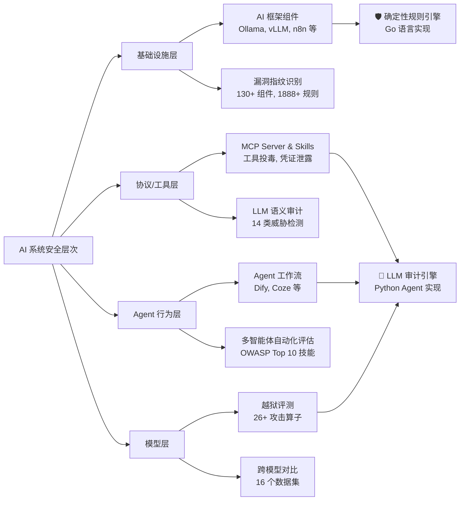

# Tencent/AI-Infra-Guard

[GitHub URL](https://github.com/Tencent/AI-Infra-Guard)

- **Stars**: 5743
- **Language**: Python

## 腾讯 AI-Infra-Guard：全栈 AI 红队平台深度评测

> 腾讯开源的全栈 AI 红队平台，通过“规则+LLM”双引擎，全面检测 AI 基础设施、Agent 工作流及模型越狱等新型安全威胁。

- **Tags**: AI 安全, 红队测试, 腾讯开源, 越狱检测, 自动化审计
- **Category**: 开发工具, 安全合规, AI 应用开发

## Details

# 腾讯 AI-Infra-Guard：全栈 AI 安全红队平台深度评测
> 开源三周斩获 5300+ Star，腾讯朱雀实验室用 A.I.G 为 AI 生态筑起第一道防线——它不是传统漏洞扫描器的简单升级，而是面对 AI 新型攻击面的范式级补全。
## 一句话总结
**AI-Infra-Guard (A.I.G)** 是腾讯朱雀实验室开源的**全栈 AI 红队平台**，通过“规则引擎 + LLM 审计”双引擎架构，覆盖从基础设施、协议/工具到 Agent 行为与模型的多层攻击面，是目前业内最全面的 AI 生态安全检测工具链。
---
## 🧠 背景与痛点：AI 生态的安全新边疆
AI 技术的爆发式增长带来了全新的安全挑战。传统安全工具（如 Trivy、Grype）主要依赖静态签名匹配，面对 AI 系统中**基于语义的攻击**完全无能为力：
- **Agent 技能投毒**：第三方插件或 Skill 藏有恶意代码，表面是翻译功能，背地里可能窃取聊天记录
- **MCP 工具劫持**：AI 通过 Model Context Protocol 连接的外部工具（如数据库、文件系统）权限过大，可被诱导执行越权操作
- **提示词注入**：通过精心设计的输入，绕过 AI 的安全防护，生成诈骗话术、钓鱼链接或恶意代码
- **模型越狱**：利用多轮对话或特定提示词，使大模型输出有害内容
A.I.G 就是为了解决这些**传统工具无法覆盖的 AI 专属威胁**而生的。它诞生于 2025 年，目前仍在高速迭代中（2026 年 8 月已发布 v4.5.2）。
## ✨ 核心亮点与功能剖析
A.I.G 的核心价值在于其**分层安全检测能力**，覆盖 AI 系统的四大攻击面，并采用双引擎架构应对不同类型的威胁。
### 🔧 1. 分层安全检测架构
A.I.G 将 AI 系统的攻击面分为四个层次，并为每层设计了匹配的检测范式：

### 🚀 2. 核心扫描能力详解
#### 📊 AI 基础设施漏洞扫描 (Infra Scan)
- **检测对象**：Ollama、vLLM、ComfyUI、n8n 等 130+ AI 组件
- **技术实现**：通过指纹识别服务版本，匹配 1888+ 条 CVE 规则
- **特色功能**：
    - 连接运行中的服务进行实时检测
    - 支持 Docker 一键部署，开箱即用
    - 提供 CLI 工具，可集成到 CI/CD 流水线
#### 🔍 MCP Server & Skills 安全扫描
- **检测重点**：14 类 MCP/Skills 威胁，包括工具投毒、凭证泄露、命令注入等
- **技术亮点**：**用 LLM 审计 LLM 生态系统**，需要理解代码的语义层面，而非静态匹配
- **性能表现**：在 SkillTrustBench 基准测试中，使用 Claude Opus 4.6 作为检测引擎时，F1 分数高达 **0.9848**（业界领先）
- **使用方式**：提供独立 CLI 工具 `aig-skill-scan`，可直接扫描本地 Skill 项目
#### 🤖 Agent 工作流安全评估 (Agent Scan)
- **支持平台**：Dify、Coze 等主流 Agent 开发平台
- **评估维度**：OWASP AI 应用安全 Top 10 技能，包括权限管理、输出验证等
- **特色能力**：
    - 多智能体自动化框架，模拟真实攻击路径
    - 生成完整证据链，包含触发 Payload、Agent 响应和修复建议
    - 提供 `aig-agent-redteam` Skill，可直接在 OpenClaw 环境中使用自然语言调用
#### ⚠️ 大模型越狱评测 (Jailbreak Evaluation)
- **攻击手法**：26+ 种单轮和多轮越狱攻击算子（Many-Shot、PAIR、GOAT、ActorAttack 等）
- **评测数据**：覆盖 16 个数据集，支持跨模型鲁棒性对比
- **输出价值**：提供详细的越狱成功率报告和模型安全增强建议
### 🎯 3. 关键技术创新点
| 特性 | 传统安全工具 | AI-Infra-Guard |
| :--- | :--- | :--- |
| **检测范式** | 静态签名匹配（规则驱动） | **双引擎架构**：规则引擎 + LLM 语义审计 |
| **覆盖范围** | 仅传统 IT 漏洞 | **AI 专属威胁**：Agent/MCP/Skill/越狱全覆盖 |
| **部署成本** | 中等 | **Docker 一键部署**，5 分钟上手 |
| **生态集成** | 有限 | **Skill 市场**，支持 OpenClaw 等 AI 平台 |
| **更新频率** | 月度/季度 | **周迭代**，规则库持续更新 |
> 💡 **技术架构解析**：A.I.G 采用 Go 语言构建规则引擎，负责确定性的指纹识别和 CVE 匹配；同时用 Python 构建 LLM Agent 审计引擎，处理需要语义理解的代码审计和越狱评估。这种“双引擎”设计充分发挥了两种技术的优势。
## 👥 目标人群与收益
| 人群 | 收益 | 使用方式 |
| :--- | :--- | :--- |
| **本地 AI 玩家** | 检测自建推理服务暴露端口，防止显卡被劫持 | Docker 一键部署，扫描本地服务 |
| **企业 Agent 开发团队** | 上线前全面评估 Agent 工作流安全，避免生产事故 | 集成到 CI/CD 流水线，`aig-skill-scan` 扫描代码仓库 |
| **Skill/MCP 开发者** | 自查技能包风险，避免发布后门功能 | 使用 `aig-skill-scan` 扫描源码或远程 URL |
| **安全研究员** | 获得 AI 靶场测试工具，编写漏洞报告 | 研究其 MCP/Skills 扫描能力，组合其他工具使用 |
**核心收益**：
- **效率提升**：自动化检测替代人工审计，节省 **240 分钟/次** 的安全检查时间
- **成本节约**：企业级安全检测需求无需付费订阅，开源免费使用（Apache-2.0 许可）
- **合规支持**：覆盖 OWASP AI 应用安全标准，帮助满足安全合规要求
## 🆚 竞品/同类对比
| 特性维度 | AI-Infra-Guard | 传统漏洞扫描器 | 通用渗透框架 |
| :--- | :--- | :--- | :--- |
| **覆盖范围** | **Agent+MCP+Skills+Infra+越狱** | 仅组件漏洞 | 偏传统 IT |
| **AI 专属风险** | ✅ 14 类 MCP/Skills 风险 | ❌ | ❌ |
| **部署成本** | Docker 一键（低） | 中等 | 高 |
| **红队资质** | **Black Hat 入选** | — | 视工具实际应用 |
| **开源协议** | **Apache-2.0** | 多样 | 多样 |
| **社区活跃度** | 高（5300+ Star） | 中 | 低 |
> ⚠️ **注意**：A.I.G 目前缺乏**认证机制**，官方定位为内部使用，**切勿直接部署在公网环境**。
## ⚠️ 局限与不足
1.  **学习成本较高**：需要 AI 基础知识，纯小白用户直接上手可能遇到困难
2.  **认证机制缺失**：目前没有身份验证功能，不适合直接暴露在公网，仅适合内部网络使用
3.  **部分模块文档不全**：如 SkillJack 等研究项目文档尚未完善，需要查阅源码
4.  **LLM 依赖**：LLM 审计引擎的性能依赖于所选模型的推理能力，不同模型检测效果差异显著
## 🛠️ 快速上手指南
### 方式一：Docker 一键部署（推荐）
```bash
# 1. 克隆项目
git clone https://github.com/Tencent/AI-Infra-Guard.git
cd AI-Infra-Guard
# 2. 使用预构建镜像启动（推荐）
docker-compose -f docker-compose.images.yml up -d
# 3. 访问 Web 界面
# 浏览器打开: http://localhost:8088
```
### 方式二：独立安装 Skill 扫描器（适合 CI/CD）
```bash
# 1. 安装独立扫描工具
pip install aig-skill-scan
# 2. 设置环境变量
export LLM_API_KEY="your-api-key"
# 3. 扫描本地 Skill 项目
aig-skill-scan --repo /path/to/your/skill \
           -m deepseek-v4-flash \
           --language en \
           -o result.json
```
### 方式三：OpenClaw 环境集成
```bash
# 安装 AIG 扫描 Skill
clawhub install aig-scanner
# 配置 AIG 服务地址（替换为实际部署地址）
export AIG_BASE_URL="http://your-aig-service:8088"
# 在 OpenClaw 中自然语言调用
# 例如："帮我检查安装的 Skill 和 MCP 是否安全"
```
<details>
<summary>🔧 系统要求</summary>
- **Docker**: 20.10 或更高版本
- **内存**: 4GB+
- **磁盘空间**: 10GB+
</details>
## 🏆 结语与行动建议
### 📊 综合评分
| 维度 | 评分 (1-5) | 说明 |
| :--- | :--- | :--- |
| **功能全面性** | ★★★★★ | 覆盖 AI 生态所有关键层，无死角 |
| **技术创新性** | ★★★★★ | 双引擎架构开创了 AI 安全检测新范式 |
| **易用性** | ★★★★☆ | Docker 一键部署，但需要一定 AI 基础 |
| **社区活跃度** | ★★★★★ | 周迭代，文档完善，社区响应快 |
| **生产适用性** | ★★★☆☆ | 认证机制缺失，目前仅适合内部使用 |
**终极评判**：AI-Infra-Guard 是目前**最全面、最前沿的 AI 生态安全检测工具**，非常适合企业和开发者用于 AI 应用上线前的安全自检。虽然目前缺乏认证机制，但官方正在积极开发中，预计未来版本会解决。
### 🚀 行动建议
1.  **如果你是 AI 开发者**：
    -   立即使用 Docker 部署体验，扫描你的 AI 项目
    -   将 `aig-skill-scan` 集成到 CI/CD 流水线，实现自动化安全检测
2.  **如果你是企业安全团队**：
    -   评估 A.I.G 作为 AI 应用安全基线工具的可行性
    -   关注官方更新，等待认证机制完善后部署到生产环境
3.  **如果你是安全研究员**：
    -   研究其 LLM 审计引擎的实现，探索“以 AI 制 AI”的安全检测新思路
    -   贡献漏洞规则或攻击算子，参与社区建设
> 💎 **一句话总结**：AI-Infra-Guard 是 AI 安全时代的“瑞士军刀”，它不是来补充传统安全工具的，而是来**重新定义 AI 生态安全检测**的。对于任何正在构建或使用 AI 应用的团队，A.I.G 都已成为不可或缺的安全检测平台。
---
**📚 延伸资源**
-   **GitHub 仓库**: https://github.com/Tencent/AI-Infra-Guard
-   **官方文档**: https://tencent.github.io/AI-Infra-Guard/
-   **在线 Pro 版**: https://aigsec.ai/ (需要邀请码)
-   **用户反馈调查**: https://doc.weixin.qq.com/forms/AJEAIQdfAAoAFkA0QbdAFwCNcKSO0BFLf
*注：本文基于 2026 年 8 月的项目状态撰写，功能细节可能随版本更新而变化。*
