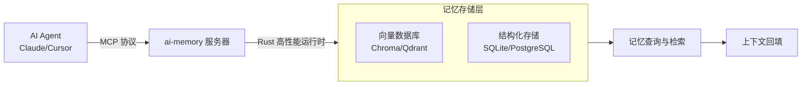

# akitaonrails/ai-memory

[GitHub URL](https://github.com/akitaonrails/ai-memory)

- **Stars**: 4921
- **Language**: Rust

## ai-memory：AI Agent 的跨平台持久化记忆层

> 为 AI 编程助手提供长期记忆和跨工具上下文共享的 Rust 开源项目。

- **Tags**: GitHub, Rust, MCP, AI-Agent, 效率工具
- **Category**: 开发工具, AI 编程

## Details

# ai-memory：让 AI Agent 拥有持久化记忆的“外置大脑”
> GitHub Trending #1 的开源项目，用 Rust 为 AI Agent 构建跨平台、跨会话的长期记忆层，解决 AI 编程助手“健忘”的核心痛点。
## 1 一句话总结
**ai-memory** 是一个用 Rust 编写的开源项目，它为 AI 编程 Agent（如 Claude Code、Cursor 等）提供**长期记忆能力**，并支持在不同 Agent 间无缝共享上下文，就像给 AI 装上了一个“外置硬盘”来存储所有对话历史和项目决策，避免重复沟通并提升协作效率。
## 2 背景与痛点：为什么 AI 需要“记忆”？
### 2.1 当下 AI Agent 的“失忆”困境
现代 AI 编程助手（如 GitHub Copilot、Claude Code、Cursor 等）在单次会话中表现惊人，但它们都有一个共同缺陷：**会话结束后记忆就消失了**。这导致：
-   **重复劳动**：每次开启新会话，都需要重新解释项目背景、编码规范和已完成的工作。
-   **上下文断裂**：Agent 无法记住之前的代码审查结果、架构决策或待办事项，容易生成与历史决策冲突的代码。
-   **协作困难**：不同 AI 工具之间无法共享上下文，团队使用多种工具时信息孤岛严重。
### 2.2 长期记忆的必要性
就像人类依赖记忆积累知识一样，AI Agent 也需要长期记忆来：
-   **积累项目知识**：记住项目结构、常用命令、API 设计原则等。
-   **追溯决策原因**：记录为什么采用某种架构或技术选型，避免未来团队重复争论。
-   **跨工具协同**：在 Claude Code 中进行代码审查，在 Cursor 中编写实现，记忆层保证两者对项目的理解一致。
### 2.3 技术背景：MCP 协议的崛起
**Model Context Protocol (MCP)** 是 Anthropic 提出的一个开放标准，允许 AI 客户端连接到外部工具和数据源。ai-memory 正是构建在 MCP 之上的一个服务器，它将记忆存储为结构化数据，并通过 MCP 接口暴露给所有兼容的 AI 工具。
## 3 核心亮点与功能剖析
### 3.1 技术架构：Rust + MCP + 向量存储
ai-memory 的技术选型体现了其性能和可靠性目标：

-   **Rust 语言编写**：确保了高性能、内存安全和跨平台支持，适合在资源受限的环境中部署。
-   **MCP 服务器**：遵循标准协议，这意味着任何支持 MCP 的 AI 工具（如 Claude Code、Cursor、Grok 等）都能无缝集成。
-   **向量数据库支持**：内部使用向量数据库（如 Chroma 或 Qdrant）来存储和检索语义记忆，实现高效的相似性搜索。
-   **结构化存储**：除了向量搜索，还支持存储结构化的元数据（如时间戳、标签、项目ID等），便于精确过滤和管理。
### 3.2 核心功能特性
| 特性 | 描述 | 实际价值 |
| :--- | :--- | :--- |
| **持久化记忆** | 将所有 Agent 对话、决策、代码片段存储在本地或远程数据库中 | **避免重复解释**，新会话一秒加载项目上下文 |
| **跨 Agent 共享** | 不同 AI 工具（Claude, Cursor, ChatGPT）共享同一记忆库 | **统一项目视角**，团队协作无缝衔接，信息同步 |
| **语义检索** | 通过向量相似性搜索，快速找到相关的历史决策和代码 | **智能回溯**，快速查找“为什么这样做”的上下文 |
| **版本控制集成** | 记忆可关联 Git 提交，追溯决策的时间点 | **可追溯性**，知道某条记忆是在哪个代码版本下产生的 |
| **自定义命令** | 通过 `CLAUDE.md` 等配置文件自动化记忆工作流 | **减少手动操作**，AI 自动保存关键信息到记忆中 |
### 3.3 上手门槛与部署体验
ai-memory 提供了相对简单的部署方式，但需要一定的技术背景。
**最简单的部署方式（开发环境）：**
```bash
# 1. 克隆仓库
git clone https://github.com/akitaonrails/ai-memory.git
cd ai-memory
# 2. 安装 Rust 工具链（如果尚未安装）
# curl --proto '=https' --tlsv1.2 -sSf https://sh.rustup.rs | sh
# 3. 编译项目
cargo build --release
# 4. 运行 MCP 服务器（默认监听 3000 端口）
./target/release/ai-memory
```
**集成到 Claude Code（MCP 客户端）：**
```json
// 在 Claude Code 的配置文件中添加 MCP 服务器配置
{
  "mcpServers": {
    "ai-memory": {
      "command": "/path/to/ai-memory/target/release/ai-memory",
      "args": []
    }
  }
}
```
> 💡 **Tip**：对于不熟悉 Rust 的用户，项目作者可能提供预编译的二进制文件或 Docker 镜像（需查阅仓库最新文档）。**部署体验总体友好**，但需要理解 MCP 协议和 AI 工具的配置方式。
### 3.4 社区活跃度与生命力
-   **GitHub 趋势**：该项目近期在 GitHub Trending 上登顶榜首，获得了大量关注。
-   **更新频率**：根据 Trendshift 的数据，项目在近几小时内仍有活跃提交，表明维护者非常积极。
-   **社区参与**：拥有 3.4k Star 和 274 Fork，社区讨论和 Issue 反响热烈。
-   **生态繁荣**：已有多个基于 MCP 的记忆服务器出现（如 mcp-memory-keeper、Cognee），ai-memory 在其中处于领先地位。
## 4 目标人群与收益
### 4.1 目标用户画像
1.  **开发者与开发团队**：频繁使用 AI 编程助手，希望提升项目上下文管理效率。
2.  **技术主管与架构师**：需要记录和追溯技术决策，确保团队对项目理解一致。
3.  **AI 工具集成商**：希望为自己的 AI 产品添加长期记忆功能。
4.  **AI 研究爱好者**：探索 AI Agent 记忆机制和上下文工程的实践者。
### 4.2 核心收益
| 用户角色 | 核心痛点 | ai-memory 带来的收益 |
| :--- | :--- | :--- |
| **开发者** | 重复解释项目背景、忘记之前的代码讨论 | **节省 50%+ 的上下文沟通时间**，新会话秒懂项目 |
| **技术团队** | AI 工具之间信息孤岛，协作效率低 | **统一知识库**，所有 AI 工具共享同一“大脑”，避免冲突 |
| **项目经理** | 难以追溯技术决策原因，复盘困难 | **决策可追溯**，清晰记录“为什么”和“什么时候”做的决定 |
| **AI 工具用户** | 不同 AI 工具割裂，需要重复操作 | **跨工具无缝切换**，在 Claude 中规划，在 Cursor 中实现，记忆同步 |
## 5 竞品/同类对比
| 项目 | 技术栈 | 协议 | 优势 | 劣势 |
| :--- | :--- | :--- | :--- | :--- |
| **ai-memory** | Rust | MCP | **高性能**、跨平台、**活跃维护**、趋势领先 | 需要一定部署门槛 |
| **mcp-memory-keeper** | Node.js | MCP | **上手极快**（npx 一键启动）、文档友好 | 性能可能不如 Rust，扩展性一般 |
| **Cognee** | Python | MCP | **功能丰富**（集成数据管道、向量数据库） | 依赖多，部署复杂 |
| **Mem0** | Python | 专有 | **专注于工作记忆**模型，理论扎实 | 不开源（部分功能），跨工具支持弱 |
**🏆 竞争地位分析**：
ai-memory 在**性能、活跃度和标准化**方面占据优势，特别适合需要**高性能和跨工具集成**的场景。对于快速原型和简单需求，mcp-memory-keeper 是更轻量的选择；对于复杂的数据处理和 pipeline，Cognee 更强大。**ai-memory 的核心优势在于其 Rust 实现和 MCP 标准化**，使其成为高性能、标准化的记忆层解决方案。
## 6 局限与不足
1.  **部署与维护成本**：需要自行部署和管理服务器，对技术团队有一定要求。虽然 Rust 性能高，但搭建环境可能比 Node.js 方案稍复杂。
2.  **学习曲线**：需要理解 MCP 协议和 AI 工具的配置方式，对非技术用户不友好。
3.  **记忆质量控制**：目前项目可能缺乏强大的记忆清洗和去重机制，长期积累可能导致记忆库冗余。
4.  **企业级功能缺失**：缺少细粒度的权限控制、审计日志和高级搜索等企业级功能（未来可能通过插件或 Fork 版本解决）。
5.  **依赖 AI 工具支持**：需要 AI 工具（如 Claude Code）支持 MCP 协议，否则无法使用。虽然 MCP 正在成为标准，但仍有部分工具未支持。
## 7 结语与行动建议
### 7.1 总结：ai-memory 的价值定位
ai-memory 是当前**最前沿、最活跃的 AI Agent 记忆解决方案**之一。它巧妙地利用了 MCP 协议和 Rust 的高性能特性，为 AI 编程助手提供了一个**标准化、跨工具、持久化的记忆层**。它不仅解决了 AI “健忘”的痛点，更为未来 AI Agent 的协作和知识管理奠定了基础。
**最终评判**：
-   **创新性**：⭐⭐⭐⭐⭐ (将 MCP 协议应用于记忆管理是开创性的)
-   **实用性**：⭐⭐⭐⭐⭐ (直接解决开发者核心痛点，收益明显)
-   **易用性**：⭐⭐⭐⭐ (部署有一定门槛，但配置好后体验流畅)
-   **生态潜力**：⭐⭐⭐⭐⭐ (基于开放标准，生态发展迅速)
### 7.2 行动建议
**✅ 立即尝试的情况：**
-   你是**开发者或技术团队**，每天使用 Claude Code、Cursor 等 AI 编程工具。
-   你厌倦了**重复解释项目背景**，希望提高 AI 协作效率。
-   你在**团队中使用多种 AI 工具**，需要统一的知识库和上下文管理。
-   你对**Rust 和 MCP 协议**感兴趣，想探索前沿 AI 技术。
**🛑 可能需要观望的情况：**
-   你是**非技术用户**，不希望进行任何服务器部署。
-   你的需求是**个人笔记和知识管理**，而非 AI 上下文共享（此时 Evernote MCP 或 Obsidian 插件可能更合适）。
-   你的团队需要**企业级的权限控制和审计**，项目暂未提供此功能。
**🚀 快速上手指南（5分钟版）：**

1.  **环境准备**：确保安装了 Rust 工具链。
2.  **部署服务**：按照上一节的命令编译并运行 ai-memory。
3.  **配置工具**：在你的 AI 工具（如 Claude Code）中配置 MCP 服务器地址。
4.  **开始体验**：在 AI 会话中尝试保存一些信息（如“项目使用 Vue3 + Vite”），然后关闭会话重新打开，询问 AI “我们之前用的是什么框架？”，它应该能从记忆中检索到答案。
5.  **探索工作流**：研究项目中的 `CLAUDE.md` 示例，定制你自己的记忆自动化工作流。
> 💡 **终极建议**：**AI 的记忆层是未来 Agent 生态的基础设施**。ai-memory 作为这个领域的先锋，值得你投入时间学习和部署。即使目前不完全适合你的场景，理解其背后的 MCP 协议和记忆管理理念，也将为你未来的技术选择和架构设计提供宝贵参考。
**立即探索仓库**：[https://github.com/akitaonrails/ai-memory](https://github.com/akitaonrails/ai-memory) 🚀
**相关资源**：
-   [MCP 协议官方文档](https://modelcontextprotocol.io/)
-   [mcp-memory-keeper（更简单的替代方案）](https://github.com/mkreyman/mcp-memory-keeper)
-   [Cognee（功能更丰富的 Python 方案）](https://www.cognee.ai/model-context-protocol-cognee-llm-memory-made-simple)
