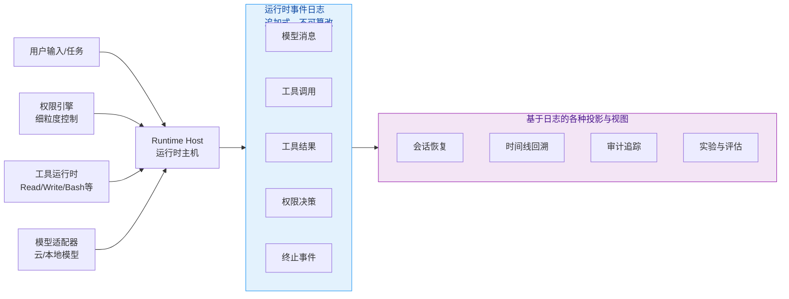

# apache/maka

[GitHub URL](https://github.com/apache/maka)

- **Stars**: 3843
- **Language**: TypeScript

## Apache Maka (Incubating) 深度评测

> 本地优先、可审计且可控的AI智能体工作台，兼顾安全与透明。

- **Tags**: Apache, AI Agent, 本地部署, 开源, 工作流
- **Category**: AI 编程, 开发工具, 安全合规

## Details

# 🔍 Apache Maka (Incubating) 深度评测：本地优先的AI智能体工作台
> **一句话总结**：Apache Maka（孵化中）是一个致力于**本地优先**、**可审计**且**可控**的AI智能体工作台，它为需要安全、可靠地集成AI到开发工作流的开发者提供了强大的底层基础设施。
## 📌 1. 背景与痛点：为何我们需要Maka？
Apache Maka（孵化中）的诞生，直指当前AI智能体（AI Agent）领域的几个核心痛点：
*   **数据隐私与安全顾虑**：将代码库、项目文件甚至API密钥等敏感信息上传到云端第三方AI服务，对于许多企业和个人开发者来说，是不可接受的风险。
*   **“黑盒”操作与不可控性**：许多Agent平台封装得太深，开发者无法清晰看到Agent是如何思考、如何调用工具、以及每一步的决策依据。当出现错误时，排查困难。
*   **成本与效率的平衡**：虽然本地模型安全可靠，但其性能和效果往往与顶尖的云端模型存在差距。如何既享受本地安全，又能灵活接入云端能力，是一个难题。
*   **缺乏统一的开发与调试标准**：构建多步骤、复杂决策的Agent工作流时，缺乏一个标准化的框架来管理其生命周期、权限和执行日志。
Apache Maka（孵化中）试图通过其**本地优先（Local-first）** 和**日志即运行时（Log is the Runtime）** 的核心理念来解决这些问题。它目前正处于**Apache孵化器**进行孵化，这意味着其基础设施、沟通和决策流程仍在稳定化过程中，尚未完全获得ASF的正式背书。
## ⭐ 2. 核心亮点与功能剖析
Maka的设计思想非常清晰，它的几个核心亮点共同构成了其独特的竞争力。
### 🏗️ 核心架构：日志即运行时（Log is the Runtime）
这是Maka最颠覆性的设计理念。想象一下，你的每一次和AI的对话、每一次工具调用、每一个工具的执行结果、以及每一次权限的批准或拒绝，都被**按顺序、不可篡改地记录下来**，形成一个完整的、追加式的日志（Append-only Log）。

这个日志（Runtime Event Log）是整个系统的**唯一真相来源（Single Source of Truth）**。所有的会话历史、UI状态、上下文恢复，乃至复杂的实验评估，都是从这个日志上**投影（projection）** 出来的。这意味着：
*   **可追溯性**：你可以像看电影回放一样，查看Agent执行任务的每一个细节，决策过程完全透明。
*   **可恢复性**：如果程序崩溃或中断，你可以从日志中精确恢复到之前的任何状态，不会丢失进度。
*   **可审计性**：对于企业级应用，这份日志就是完美的审计日志，符合严格的数据安全和合规要求。
### 🛡️ 本地优先与可控权限
Maka默认将所有会话、设置和运行记录都存储在你的本地机器上。你拥有对数据的完全控制权。它还内置了一个**强大的权限引擎**，你可以精细地控制Agent能否执行特定操作，比如：
*   **文件操作**：允许读取/写入哪些目录的文件？
*   **命令行工具**：允许执行哪些Bash命令？
*   **网络请求**：允许向哪些域名发起请求？
这就像给AI装上了“刹车”和“方向盘”，确保它只能在你的许可下安全工作，防止“越权”或“误操作”。
### 🧩 多模型支持与灵活接入
Maka并不绑定任何特定的模型提供商。它提供了模型适配器，允许你灵活选择：
*   **云端API**：如OpenAI、Anthropic、Claude等。
*   **本地模型**：通过兼容的接口运行本地模型（如Ollama）。
*   **代理/网关**：任何兼容其协议的模型服务。
这意味着你可以根据需求在**云端强大**与**本地安全**之间自由切换，甚至为不同任务分配不同模型，实现成本与效果的最优平衡。
### 🧪 内置评估（Evaluation）框架
对于开发者来说，如何评估和比较不同Agent或不同模型的表现是一个难题。Maka内置了一个声明式的、多臂实验（Multi-arm Experiment）评估框架。你可以：
*   定义评估规格（Spec）和任务。
*   让Maka自动执行实验，并生成详细的报告，包括得分、使用成本、耗时、失败原因等。
*   将Maka的Agent与外部适配器（如其他Agent框架）进行公平、可重复的对比。
这对于**优化Agent工作流**和**模型选型**来说，是无比强大的工具。
## 🎯 3. 目标人群与收益
Maka并非为所有人设计，但它对特定人群有极高的价值。
| 目标人群 | 核心收益 |
| :--- | :--- |
| **👨‍💻 企业级开发者与安全团队** | **数据主权与合规**：代码和敏感数据不离开本地。**可审计**：完整的执行日志满足安全审计要求。**可控性**：细粒度权限控制降低风险。 |
| **🔬 AI应用研究人员与算法工程师** | **可复现的实验**：评估框架让模型和Agent对比更科学、更公平。**透明性**：能深入分析Agent决策逻辑，而非黑盒。**灵活性**：轻松切换模型和工具进行实验。 |
| **🛠️ 开发工具与IDE集成开发者** | **强大的底层引擎**：可作为内核构建下一代AI编程助手。**标准化接口**：为Agent与开发环境交互提供统一标准。**扩展性**：模块化设计便于二次开发。 |
| **🧑‍💻 个人开发者与极客** | **本地AI工作台**：安全地让AI帮你操作本地项目。**学习Agent原理**：通过日志直观理解Agent如何思考和工作。**完全掌控**：拥有数据、模型和执行的所有权。 |
## ⚖️ 4. 竞品/同类对比
Maka在AI智能体工作台领域有其独特的定位。
| 特性维度 | **Apache Maka (孵化中)** | **LangSmith** | **Vellum AI** | **OpenAI Code Interpreter** |
| :--- | :--- | :--- | :--- | :--- |
| **核心定位** | **本地优先**、**可审计**的Agent工作台与**评估框架** | 云端Agent开发与调试平台 | 云端Agent工作流构建与托管 | **云沙箱**代码执行环境 |
| **数据存储** | **本地**（完全可控） | **云端**（需信任提供商） | **云端**（需信任提供商） | **云端**（需信任提供商） |
| **执行透明度** | **极高**（完整事件日志） | 中等（提供追踪） | 中等（提供日志） | 低（黑盒沙箱） |
| **权限控制** | **强大**（细粒度本地权限） | 有限（主要依赖平台安全） | 有限（主要依赖平台安全） | 有限（沙箱隔离） |
| **模型灵活性** | **极高**（支持云、本地、自定义） | 高（主要支持OpenAI） | 高（主要支持主流模型） | 仅限OpenAI模型 |
| **主要优势** | **安全**、**可审计**、**可控**、**本地化** | **开发体验**、**集成**、**协作** | **可视化工作流**、**易用性** | **无缝集成**、**开箱即用** |
| **主要劣势** | **学习成本高**、**生态尚不成熟**、**跨平台支持待完善** | **数据离线**、**成本**、**隐私顾虑** | **数据离线**、**成本**、**依赖平台** | **数据离线**、**封闭生态**、**权限受限** |
> 💡 **关键洞察**：Maka并非要取代云端平台，而是为那些对**安全、合规、可控和透明性有极高要求**的场景提供了**另一个选择**。它更像是为AI Agent领域打造的“本地开发服务器”，而LangSmith等更像是“云端IDE”。
## ⚠️ 5. 局限与不足
没有任何工具是完美的，Maka目前也存在一些显著的局限性，在选择前需要充分考虑。
1.  **🚧 仍处于孵化阶段，稳定性与可靠性存疑**
    作为Apache孵化项目，其代码、API和格式**仍在快速演进中**，未来可能会发生**不兼容的变更**。这意味着现在投入学习可能需要为未来的调整做好准备。它尚未经过ASF的完整审查和投票，**不建议直接用于生产环境**。
2.  **🖥️ 跨平台支持尚不完善**
    目前，官方桌面应用**仅支持Apple Silicon（M1/M2/M3）的Mac电脑**。对于Intel Mac、Windows和Linux用户，目前只能通过源码构建CLI和TUI（终端用户界面）来使用，体验会大打折扣，且Windows支持仍处于“未签名预览”状态。
3.  **📚 学习曲线陡峭，上手门槛高**
    要充分发挥Maka的能力，需要理解其**独特的架构概念**（如Runtime Event Log、Projection、权限策略）。它的文档和配置选项相对复杂，更适合有丰富开发经验的用户。
4.  **🔗 生态与集成尚待成熟**
    虽然提供了模型和工具适配器的接口，但目前**现成的插件和集成生态还不够繁荣**。你可能需要自己编写适配器来连接特定的工具或服务。
5.  **🚀 性能与体验可能不如云端方案**
    依赖本地模型时，其生成速度和效果上限会受到本地硬件（尤其是GPU）的限制。其终端界面（TUI）和命令行（CLI）虽然强大，但相比成熟的图形界面（GUI），在易用性和视觉体验上仍有差距。
## 🏁 6. 结语与行动建议
**终极评判**：Apache Maka（孵化中）是一个**野心勃勃、设计理念先进且极具前瞻性**的AI智能体基础设施项目。它为解决AI时代的**数据安全、执行透明度和可控性**这些最核心、最棘手的问题，提供了一套**深刻而优雅的解决方案**。它就像为AI Agent世界安装上了“行车记录仪”和“权限系统”，让“智能”变得“可信赖”。
然而，它目前仍是一个**面向早期采用者、开发者和极客的“开发者预览版”**，而非面向大众的“开箱即用”产品。它的价值与它的不成熟性相伴而生。
**👉 给你的行动建议**：
*   **如果你是**：**企业安全团队**、**AI应用研究员**、**开发工具开发者**，或者对**AI底层技术有强烈好奇心的极客**：
    **✅ 强烈建议你关注并尝试**。它很可能为你带来全新的工作流和视角。可以从在Mac上源码运行CLI开始，体验其核心的日志理念和权限控制。
*   **如果你是**：**个人开发者**，只是想找一个**好用、稳定、能快速让AI帮你写代码的助手**：
    **⚠️ 可以关注，但暂不推荐深度投入**。目前市面上有更成熟、更易用的云端选项（如Cursor、GitHub Copilot Workspace、Bolt.new等）。等待其跨平台支持完善、孵化状态稳定后再考虑作为主力工具。
*   **如果你是**：**决策者**，正在为公司评估是否采用Maka：
    **⛔ 目前不建议用于生产环境**。可以将其作为一个**战略性的研究项目**，投入小部分资源进行探索和评估，为未来的AI基础设施布局做准备。
**总而言之**，Maka不是今天就能替代所有工具的“银弹”，但它**点亮了通往未来AI工作方式的一盏灯**。对于追求**控制、透明和安全**的深度用户来说，它无疑是目前最值得关注和探索的先锋项目之一。它的成长，值得我们每一位开发者共同见证。
