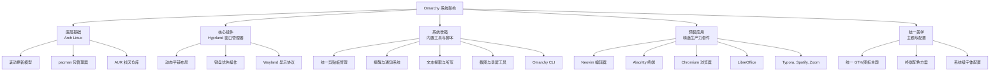

# basecamp/omarchy

[GitHub URL](https://github.com/basecamp/omarchy)

- **Stars**: 32952
- **Language**: Shell

## Basecamp/Omarchy：极致美观与效率的 Linux 发行版评测

> 由 DHH 主导的基于 Arch Linux 的高度定制化发行版，预装精选开发工具与 Hyprland 窗口管理器，提供开箱即用的极致效率与美学体验。

- **Tags**: Linux, Arch Linux, Hyprland, 开发环境, DHH
- **Category**: 操作系统, 开发工具

## Details

# Basecamp/Omarchy：DHH 打造的“现代、美观且固执”的 Linux 发行版深度评测
> 一句话总结：由 Ruby on Rails 创造者 David Heinemeier Hansson (DHH) 主导的、基于 Arch Linux 的**高度定制化 Linux 发行版**，旨在为开发者提供一个开箱即用、美观且富有生产力的极致工作环境，但其“固执”的设计哲学也可能成为某些用户的门槛。
## 🌟 背景与痛点：为何要再造一个 Linux 发行版？
在深入了解 Omarchy 之前，我们首先需要理解其诞生背景。Linux 世界早已被众多发行版占据，从 Debian、Ubuntu 到 Fedora、Arch Linux，似乎已没有“再造一个”的必要。然而，Omarchy 的诞生源于一位技术先驱对**现有 Linux 体验的深刻不满与极致追求**。
-   **创作者背景**：Omarchy 由 **David Heinemeier Hansson (DHH)** 主导，他不仅是 **Ruby on Rails 框架的创造者**，也是 Basecamp（项目管理软件）的联合创始人。DHH 以其“固执”（Opinionated）的设计哲学著称，他相信**优秀的软件应通过强烈的观点来引导用户，而非提供无限的可选项导致瘫痪**。这种哲学贯穿了他的所有作品。
-   **解决的核心痛点**：DHH 和团队发现，**即便是在 Linux 世界，搭建一个既美观、现代，又为开发者高度优化的工作环境仍然需要耗费大量时间**。你需要手动安装和配置：
    -   **窗口管理器**（如 Hyprland）
    -   **文本编辑器**（如 Neovim）
    -   **终端**（如 Alacritty）
    -   **浏览器**（Chromium/Firefox）
    -   **各种开发工具链**
    -   **美观的主题与字体**
    -   **自动化脚本和快捷键**
    ...这个过程漫长且充满摩擦。Omarchy 的使命就是**将这些“胶水”预先调和好**，提供一个从系统底层到应用层都经过精心打磨、高度集成的**“开箱即用”的终极开发环境**。
## ⭐ 核心亮点与功能剖析：Omarchy 的魅力何在？
Omarchy 的魅力远不止于“预装软件”，它是一个经过深思熟虑、**充满设计哲学的完整系统**。以下是其最值得称道的几个核心特点：
### 1. 基于 Arch + Hyprland 的强大与优雅
Omarchy 选择 **Arch Linux** 作为基础发行版。Arch 是一款**轻量、灵活、滚动更新**的发行版，拥有强大的软件包管理器 (`pacman`) 和极其丰富的 AUR 社区仓库，几乎能找到任何你想要的软件。同时，它默认使用 **Hyprland** 作为窗口管理器。
> 💡 **通俗比喻**：
> Arch 就像一块**高级的定制西装面料**，本身足够好，但需要你（或裁缝）有极高的技艺和耐心去缝制。Hyprland 则像一位**极致效率的管家**，它用优雅的、基于键盘的平铺布局来管理你的所有窗口，告别了鼠标频繁点击的繁琐。
> Omarchy 则是那位**顶级裁缝**，不仅帮你选了最棒的面料和管家，还把整套西装、配饰甚至日常的维护规程都一并准备好了，你只需要穿上就能自信出门。
### 2. **预装精心挑选的开发生产力工具链**
Omarchy 的一大承诺是“开箱即用”，它预装了一系列经过团队精心挑选、互相配合的顶级工具：
| 工具类别 | 预装工具 | 为何选择它（背后的观点） |
| :--- | :--- | :--- |
| **文本编辑** | **Neovim** (高度配置化) | 极致的可定制性和高效的键盘操作，是许多资深开发者的终极选择。 |
| **终端** | **Alacritty** | 现代、快速、基于 GPU 的终端模拟器，启动和渲染速度极快。 |
| **浏览器** | **Chromium** | 开源、稳定、性能卓越，是许多开发者环境中的首选。 |
| **办公套件** | **LibreOffice** | 开源世界的“Office”，兼容性好，满足文档处理需求。 |
| **笔记/写作** | **Typora** | 所见即所得的 Markdown 编辑器，写作体验流畅优雅。 |
| **音乐** | **Spotify** (客户端) | 顶级流媒体服务，满足日常放松需求。 |
| **会议** | **Zoom** | 行业标准的视频会议软件，工作必备。 |
| **开发语言** | **Ruby, Node.js, Go** 等 | 预装多种主流开发语言运行时，省去安装烦恼。 |
### 3. **统一的美学主题与视觉体验**
Omarchy 致力于提供**“美丽”的系统体验**。它默认采用一套**统一且精心设计的美学主题**，覆盖了终端、窗口管理器、应用程序乃至系统图标。这意味着你不需要再花费数小时去寻找和配置能搭配起来的 GTK 主题、图标主题、终端配色等，**从开机的那一刻起，一切就是协调、美观且令人愉悦的**。
### 4. **高度集成的系统级增强功能**
Omarchy 不仅仅是打包软件，更是在系统层面进行了深度定制和增强，提供了许多**开箱即用的高级功能**：
-   **统一剪贴板历史管理**：一个强大的系统级剪贴板管理器，可以记录你的复制历史，通过快捷键轻松调用和粘贴。
-   **快速提醒与通知系统**：内置一个轻量级的提醒和通知系统，帮助你更好地管理时间和任务。
-   **强大的文本提取与听写**：可能集成了 OCR（文字识别）和语音听写功能，方便从图片中提取文字或进行语音输入。
-   **内置截图与录屏工具**：提供强大的截图、区域选择、甚至录屏功能，并支持直接上传或分享，适合开发者和内容创作者。
-   **Omarchy CLI**：一个统一的命令行工具，用于管理系统、配置主题、触发各种快捷操作等，将系统控制权真正交给用户。
### 5. **详尽的官方文档与手册**
Omarchy 拥有一份**非常详尽、结构清晰的官方手册**。这份手册不仅涵盖了安装指南，更深入地讲解了导航、热键、自定义、各个应用程序的使用方法以及背后的设计理念。这大大降低了上手难度，让用户能够逐步探索和掌握这个系统的全部潜力。
## 🎯 目标人群与收益：谁该使用 Omarchy？
Omarchy 的设计目标非常明确，它**并非面向所有人**，而是为一个特定群体量身打造。
### 理想用户画像
-   **资深开发者与极客**：那些已经厌倦了在 Linux 上反复配置环境，希望节省时间、专注于代码本身的人。
-   **追求极致效率的用户**：那些深信**键盘是最高效的交互工具**，希望将一切操作流程化、自动化的人。
-   **美学追求者**：那些不仅要求系统功能强大，还要求它**视觉上优雅、协调、美观**，不愿将就于默认丑陋主题的人。
-   **Arch Linux 爱好者**：那些喜欢 Arch 的滚动更新和强大包管理，但又**不想从头搭建整个系统**的人。
-   **DHH 的粉丝与追随者**：那些认同“固执”的软件设计哲学，相信“少即是多”，并愿意让工具引导自己工作方式的人。
### 能带来的具体收益
1.  **巨大的时间节省**：从数天甚至数周的系统配置时间，缩短到**一次安装即可开始工作**。
2.  **提升工作专注度**：统一、美观、高效的环境能显著减少视觉干扰和操作摩擦，让你更专注于代码和创作。
3.  **学习最佳实践**：通过研究 Omarchy 的配置和选择，可以**学习到许多前沿的开发工具组合和高效的系统配置方法**。
4.  **获得“未来感”的体验**：体验像 Hyprland 这样的现代窗口管理器带来的优雅和高效，感受不同于传统桌面环境的全新交互模式。
5.  **加入一个精英社区**：成为 Omarchy 用户，意味着加入了一个由技术先驱和爱好者组成的社区，可以交流心得、分享配置。
## ⚖️ 竞品/同类对比：它处于什么位置？
为了更清晰地定位 Omarchy，下表将其与其他一些流行的、面向开发者的 Linux 解决方案进行了对比。
| 特性维度 | **Omarchy** | **Arch Linux (手动搭建)** | **Ubuntu/Fedora (主流发行版)** | **Pop!_OS (Ubuntu衍生)** | **Manjaro (Arch衍生)** |
| :--- | :--- | :--- | :--- | :--- | :--- |
| **基础发行版** | Arch | Arch | Debian/Ubuntu | Ubuntu | Arch |
| **窗口管理器** | **Hyprland (平铺)** | 无默认/需自选 | GNOME (堆叠) | GNOME (堆叠) | 多种可选 |
| **预装开发工具** | **高度精选、集成** | **完全空白** | 基础工具 | 较好集成 | 较好集成 |
| **开箱即用程度** | ★★★★★ (极致) | ★☆☆☆☆ (需大量配置) | ★★★★☆ (良好) | ★★★★☆ (良好) | ★★★★☆ (良好) |
| **系统稳定性** | ★★★☆☆ (滚动更新风险) | ★★★☆☆ (滚动更新风险) | ★★★★★ (稳定) | ★★★★★ (稳定) | ★★★★☆ (相对稳定) |
| **定制自由度** | ★★★☆☆ (在“固执”框架内) | ★★★★★ (完全自由) | ★★★☆☆ (受限于发行版) | ★★★☆☆ (受限于发行版) | ★★★★☆ (较高) |
| **美学一致性** | ★★★★★ (统一设计) | ★☆☆☆☆ (需自己调配) | ★★★☆☆ (默认主题一般) | ★★★☆☆ (默认主题一般) | ★★★☆☆ (默认主题一般) |
| **学习曲线** | ★★★★☆ (需适应Hyprland) | ★★★★★ (极高) | ★★☆☆☆ (较低) | ★★☆☆☆ (较低) | ★★★☆☆ (中等) |
| **面向用户** | **追求极致效率与美感的开发者** | **终极极客和定制狂** | **大众用户、新手、服务器** | **开发者、创作者** | **希望体验Arch又想省力的用户** |
| **核心优势** | **无缝集成、极致美观、开箱即用** | **绝对自由、最新软件、可定制性** | **稳定、易用、生态庞大** | **开发者友好、预装工具** | **Arch体验、相对易用** |
| **核心劣势** | **“固执”可能不符合所有人习惯** | **配置耗时耗力，学习成本极高** | **效率不如平铺WM，定制性有限** | **效率不如平铺WM** | **并非“纯净”Arch，可能有封装延迟** |
> 💡 **定位总结**：
> Omarchy 并非要取代 Arch 或 Ubuntu，而是在它们之间找到了一个独特的生态位。它提供了**接近手动 Arch 搭建的极致定制和效率，同时又提供了主流发行版的开箱即用和美观体验**。你可以把它看作是一个“**预配置好的、由顶级工程师为你搭建好的、理想化的 Arch 开发环境**”。
## ⚠️ 局限与不足：它可能不适合你？
尽管 Omarchy 拥有诸多闪光点，但它并非完美无缺。它的“固执”既是优势，也可能是其局限性。以下是一些需要你认真考虑的因素：
### 1. **“固执”可能成为束缚**
Omarchy 强烈的设计观点意味着**它的选择并非对每个人都“最优”**。例如：
-   **强制使用 Neovim**：如果你是 Vim 或 Emacs 的忠实用户，或者更喜欢 VS Code、IntelliJ 等图形化 IDE，你可能需要费力去替换或适应它。
-   **强制使用 Hyprland**：平铺窗口管理器并非所有人都能快速适应。如果你习惯了传统的堆叠式窗口管理（如 GNOME、KDE），学习曲线会非常陡峭。
-   **强制使用 Chromium**：如果你是 Firefox 的坚定支持者，可能需要手动替换。
-   **统一的主题不可逆**：你被锁定在 Omarchy 提供的美学框架内，大幅度的个性化主题定制可能受限或需要更深的系统知识。
> ⚠️ **注意**：社区中有开发者提供了清理脚本（如 `omarchy-cleaner.sh`），可以用来移除一些“不必要”的预装软件，但这仍然无法改变其底层的“固执”设计哲学。
### 2. **基于滚动更新的潜在不稳定性**
由于基于 Arch Linux，Omarchy 继承了**滚动更新（Rolling Release）模型**的优点（始终最新）和缺点（潜在的更新冲突或系统崩溃）。虽然 Omarchy 团队会努力确保兼容性，但**一次不当的更新仍可能导致系统无法启动或关键功能失效**。这对于追求**绝对稳定**的生产环境或服务器来说是一个风险。
### 3. **相对较小的社区与资源**
与 Ubuntu 或 Arch 本身相比，Omarchy 的社区要小得多。这意味着：
-   **遇到问题时，能找到的现成解决方案和教程相对较少**。
-   **第三方软件包或驱动可能需要你自己手动解决**。
-   **项目的发展和维护高度依赖 DHH 和 Basecamp 团队的投入**（虽然目前看起来很活跃）。
### 4. **硬件兼容性未知**
作为基于 Arch 的发行版，理论上支持广泛的硬件。但 Hyprland 等**较新的窗口管理器对某些老旧显卡或特定硬件的兼容性可能不如成熟的桌面环境（如 GNOME/KDE）**。如果你使用的是非常新的硬件或非常旧的硬件，可能需要事先确认。
### 5. **上手门槛仍然不低**
尽管比手动搭建 Arch 低得多，但 Omarchy 的**上手门槛对于完全的 Linux 新手来说依然很高**。你需要对 Linux 基本概念（如终端、包管理、权限、配置文件）有基本了解，并且愿意学习和适应 Hyprland 的操作方式。
## 🔧 技术栈与架构解析
为了更深入地理解 Omarchy 的技术实现，我们来看一下它的技术栈和架构设计。

其架构设计的精妙之处在于：
-   **高度集成**：通过系统级的脚本和配置，将各个独立的组件（Hyprland, Alacritty, Neovim 等）有机地结合成一个整体，共享配置（如主题、快捷键），形成统一的用户体验。
-   **配置即代码**：Omarchy 的核心是其庞大的配置文件集合。这些配置文件被组织在仓库的 `config`, `default`, `shell` 等目录下，用户可以通过版本控制来管理自己的个性化配置，也便于团队分享。
-   **模块化设计**：从仓库的目录结构（如 `applications`, `agents/skills`, `themes`）可以看出，系统功能被模块化地拆分和封装，便于维护和扩展。
## 🚀 上手门槛与部署体验
### 安装方式
Omarchy 提供了 ISO 镜像文件，可以直接从官方网站或 GitHub Release 页面下载。安装过程类似于其他 Arch 系发行版：
1.  **下载并制作启动U盘**：使用 `dd` 或 Rufus 等工具将 ISO 写入 USB。
2.  **从USB启动**：在 BIOS 中选择从 USB 启动。
3.  **运行安装脚本**：Omarchy 提供了一个自动化安装脚本 `install.sh`，可以极大简化安装过程。该脚本会处理分区、格式化、安装基础系统、安装引导程序等一系列操作。
4.  **配置用户**：安装完成后，首次启动时会创建用户并设置密码。
<details>
<summary><strong>🧪 安装体验与注意事项（来自社区反馈）</strong></summary>
社区用户报告了一些安装过程中的经验：
-   **网络连接问题**：有用户反馈在安装过程中，Omarchy 的 ISO 无法连接到 WiFi，但使用标准的 Arch 安装器则可以正常连接。这可能是一个需要解决的 bug。
-   **手动安装选项**：对于熟悉 Arch 的用户，也可以选择使用标准的 Arch 安装流程，在最后 chroot 进新系统后，手动运行 Omarchy 的安装脚本来完成定制。这提供了更多的控制权。
-   **清理脚本**：安装完成后，如果觉得预装软件太多，可以运行社区提供的 `omarchy-cleaner.sh` 脚本来移除不需要的软件。
</details>
### 文档与学习资源
Omarchy 的**官方手册是其最大的亮点和最佳的学习资源**。这份手册结构清晰，从基础的导航、热键到高级的自定义和 CLI 使用都有详细说明，并配有大量截图。强烈建议每一位新用户在安装后首先通读这份手册。
此外，**GitHub 仓库的 Issue 板块**也是获取帮助和反馈问题的重要场所。虽然社区不大，但核心开发者团队非常活跃，对问题的响应速度很快。
## 🧩 社区活跃度与生命力
-   **开发活跃度**：Omarchy 的开发非常活跃。GitHub 仓库显示有超过 **6,300 次提交**，最新的分支是 `quattro`（版本4），持续在更新和修复问题。这表明项目并非“一次性发布”，而是在持续演进。
-   **问题响应速度**：由于团队规模相对较小且专注，**核心开发者对 Issue 的响应速度通常很快**，能及时解决用户遇到的 bug 或问题。
-   **社区生态**：社区规模虽小但很精悍。主要围绕在 GitHub、Discord（官方社区）和一些技术论坛（如 System Crafters 论坛）。用户们会分享自己的配置、工具和经验。目前尚未形成庞大的第三方插件或主题生态，但这与其“固执”的设计哲学也有关。
## 🧪 Demo / 代码示例：感受 Omarchy 的魅力
让我们通过一些简单的示例来感受一下 Omarchy 的操作方式和配置理念。
### 1. Hyprland 的平铺布局体验
Hyprland 的核心是键盘快捷键。以下是一些默认或常见的基本操作（具体请以 Omarchy 手册为准）：
| 操作 | 快捷键 (默认) | 说明 |
| :--- | :--- | :--- |
| **移动焦点** | `Super + 方向键` (如 `Super + h/j/k/l`) | 在不同窗口间移动焦点，方向键可配置为 hjkl。 |
| **移动窗口** | `Super + Shift + 方向键` | 将当前窗口移动到屏幕的不同位置。 |
| **调整窗口大小** | `Super + Control + 方向键` | 调整当前窗口的尺寸。 |
| **切换工作区** | `Super + 数字键` (1-9) | 快速切换到不同的虚拟桌面（工作区）。 |
| **移动窗口到工作区** | `Super + Shift + 数字键` | 将当前窗口移动到指定工作区。 |
| **启动终端** | `Super + Enter` | 快速启动一个新的终端窗口。 |
| **退出窗口** | `Super + Shift + q` | 关闭当前聚焦的窗口。 |
> 💡 **体验**：这种基于键盘的平铺布局一旦适应，你会发现自己操作窗口的效率远高于鼠标，所有窗口都井井有条，不会出现窗口重叠或难以寻找的情况。
### 2. 配置文件示例：自定义终端快捷键
Omarchy 的配置大多基于文本文件，这意味着你可以用文本编辑器（如 Neovim）轻松修改。例如，如果你想添加一个新的快捷键来启动某个程序，可以编辑 Hyprland 的配置文件（通常在 `~/.config/hypr/hyprland.conf`）。
```bash
# 在 Hyprland 配置文件中添加一个新的快捷键来启动 Neovim
bind = $mainMod, Return, exec, alacritty -e nvim
```
*（注：`$mainMod` 通常指的是 Super 键，即 Windows 键）*
### 3. 使用 Omarchy CLI
Omarchy 提供了一个统一的命令行工具 `omarchy`，可以用来管理系统。
```bash
# 查看所有可用的命令
omarchy --help
# 例如，重启 Hyprland 窗口管理器
omarchy restart-wm
# 切换主题（假设支持）
omarchy theme set "your-theme-name"
```
## 📊 商业模式与性价比
-   **免费与开源**：Omarchy 是**完全免费且开源**的（MIT 许可证）。你可以自由地使用、修改和分发它。
-   **无付费版**：不存在“免费版”和“付费版”之分。所有功能都免费提供。
-   **成本考量**：主要的“成本”是你的**时间成本**（学习曲线）和**潜在的硬件风险**（滚动更新）。此外，你也需要考虑是否愿意投入时间来维护和定制这个系统。
-   **性价比**：如果你正好是它的目标用户，那么其带来的**效率提升和愉悦体验是无可替代的**，性价比极高。如果你只是想尝试一下 Linux，那么可能更简单、更稳定的发行版（如 Ubuntu）是更“省钱”的选择。
## 🏁 结语与行动建议：终极评判
Omarchy 是一个**充满激情、观点鲜明且执行极其出色的项目**。它完美体现了 DHH “固执”的软件设计哲学：**不是提供选项，而是提供最佳解决方案**。它成功地解决了许多资深开发者长期以来的痛点——搭建一个既美观、高效又无需反复折腾的终极开发环境。
### 我的终极评判
| 维度 | 评分 (1-5星) | 评价 |
| :--- | :--- | :--- |
| **理念与愿景** | ★★★★★ | 观点鲜明，直击开发者痛点，执行力惊人。 |
| **开箱即用体验** | ★★★★★ | 从安装到日常使用，都打磨得非常出色，真正做到了“美丽、现代、固执”。 |
| **效率提升** | ★★★★★ | Hyprland + 统一工具链带来的效率提升是颠覆性的。 |
| **美学一致性** | ★★★★★ | 统一的设计主题是同类项目中的标杆，赏心悦目。 |
| **文档与支持** | ★★★★☆ | 官方手册非常详尽，但社区相对较小，第三方资源有限。 |
| **稳定性与风险** | ★★★☆☆ | 滚动更新模型带来潜在风险，需要用户有一定的维护能力。 |
| **定制自由度** | ★★★☆☆ | 在其框架内自由度极高，但框架本身也是限制。 |
| **推荐指数** | **★★★★☆** (4.5/5) | **强烈推荐给目标用户，但对其他人可能不友好。** |
### 给不同读者的行动建议
1.  **如果你是资深开发者、极客或效率追求者**：
    **强烈建议你立即尝试 Omarchy**！下载 ISO，在一个虚拟机或闲置电脑上安装体验。花时间阅读官方手册，适应 Hyprland 的操作。一旦你习惯了，就再也回不去了。它可能会成为你最喜欢的操作系统。
2.  **如果你是 Linux 新手或主要使用 Windows/macOS**：
    **请谨慎对待 Omarchy**。它的学习曲线对你来说可能非常陡峭。**更推荐你从 Ubuntu 或 Fedora 开始**，打好 Linux 基础，再逐步探索更轻量级或更定制化的发行版。
3.  **如果你是 Arch 用户或爱好者**：
    **Omarchy 值得一看**。它为你提供了一个“预配置好的 Arch 理想环境”，你可以从中学习到许多优秀的配置和工具组合，甚至可以将其作为自己搭建环境的参考或灵感来源。你不一定要完全使用它，但可以“取其精华”。
4.  **如果你是追求稳定性的系统管理员或企业用户**：
    **Omarchy 目前可能不适合你**。滚动更新模型带来的风险在严肃生产环境中是不可接受的。请坚持使用 Ubuntu LTS、CentOS Stream 或 Rocky Linux 等经过长期验证的稳定发行版。
> 💡 **最终思考**：
> Omarchy 的存在再次证明了一个真理：**优秀的软件不仅仅在于功能，更在于它所倡导的哲学和生活方式**。它不仅仅是一个 Linux 发行版，更是一种关于如何更高效、更优雅地使用计算机的宣言。如果你认同这种宣言，那么 Omarchy 将成为你工作中最得力的伙伴。
