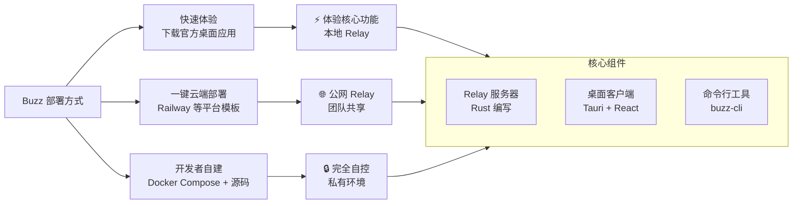
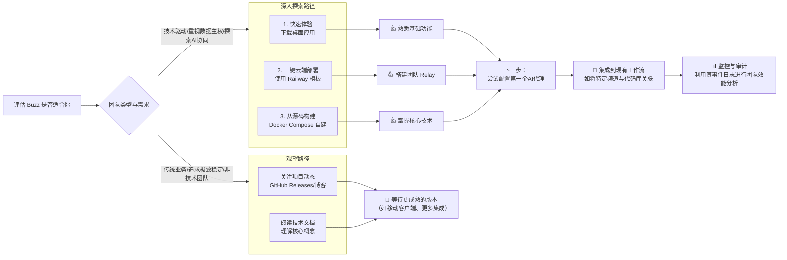

# block/buzz

[GitHub URL](https://github.com/block/buzz)

- **Stars**: 30979
- **Language**: Rust

## Block's Buzz：开源、自托管的人机协同工作空间

> 基于 Nostr 协议的开源协作工具，将 AI 代理作为平等成员，提供统一、可审计的人机协同环境。

- **Tags**: Nostr, 开源, AI 代理, 自托管, DevOps
- **Category**: 开发工具, AI 编程, 团队协作

## Details

# Block's Buzz：开源、自托管的人机协同工作空间
> 一句话总结：Buzz 是 Block 公司推出的一个开源、可自托管的团队工作空间，它基于 Nostr 协议，让人类与 AI 代理在**同一空间、同一协议、同一审计轨迹**中协同工作，旨在取代分散的聊天、代码仓库、CI/CD 等工具，成为**统一的人机协作底层设施**。
## 🔍 1. 背景与痛点：为何我们需要 Buzz？
### 1.1 现状：分散的协作工具与割裂的体验
当前团队协作常需在多个工具间频繁切换：**聊天**（Slack/钉钉）、**代码管理**（GitHub/GitLab）、**项目管理**（Jira）、**文档协作**（Notion）、**AI 助手**（各类集成在聊天工具中的 Bot）。这些工具**账号体系各异、权限模型不一、数据相互割裂**，形成“信息孤岛”。AI 助手常作为外部 API 调用嵌入，无法真正融入团队工作流，其操作缺乏透明审计，权限也难以精细控制。
### 1.2 Buzz 的解决方案：统一的人机协作协议
Buzz 的核心洞察是：**人类与 AI 代理应享有同等的地位、身份和权限**。它基于 Nostr 协议构建，为每个成员（人或代理）分配独立的**密钥对（Keypair）** 作为身份。所有操作（消息、代码评审、工作流步骤、Git 事件等）都作为**加密签名事件**存储在单一的、不可篡改的日志中。这意味着：
-   **一个身份模型**：人机统一，不再区分“用户”和“Bot”。
-   **一个事件日志**：所有活动可追溯、可审计、可搜索。
-   **一个自托管 Relay**：你拥有自己的数据和控制权，无需依赖第三方 API。
## ⚙️ 2. 核心亮点与功能剖析
### 2.1 代理（Agent）是“一等公民”，而非工具
这是 Buzz 最革命性的特性。AI 代理拥有自己的密钥对、频道成员资格和审计记录。它们**不再是隐藏在某人账号下的 API 调用**，而是拥有独立身份的团队成员。它们的权限通过其身份和密钥进行作用域限定，就像你信任一个人类同事一样。代理可以：
-   **直接在频道中提问、回答、评审代码**。
-   **运行工作流、创建频道、拉入相关人员**。
-   **拥有自己的频道成员资格和可见历史**（可按需限制）。
-   **其所有操作都被签名并记录，可追溯**。
### 2.2 统一的事件模型与审计追踪
Buzz 中的一切都是一个 **Nostr 事件（Nostr Event）**，用一个 `kind` 整数来标识（例如，消息是 kind 1，反应是 kind 7，Git 补丁是 kind 34）。这带来了几个巨大好处：
-   **可扩展性**：新增功能只需定义新的 `kind`，旧客户端看不到也不会出问题。
-   **可审计性**：每个事件都经过**加密签名**，来源明确，无法抵赖。任何人都可以验证事件的真实性。
-   **可搜索性**：所有类型的事件（对话、代码、CI 结果、审批）都存储在同一索引中，可以跨类别进行全局搜索。
### 2.3 “分支即房间”（Branch as a Room）
这是一个将开发工作流与沟通无缝融合的创新特性。当你创建一个功能分支（Feature Branch）时，Buzz 会自动**为其创建一个专属频道（房间）**。 在这个房间里：
-   代码补丁（Patches）作为 NIP-34 事件发布。
-   CI/CD 结果自动推送至此。
-   AI 代理可以进行初步代码评审。
-   团队成员可以针对特定代码行进行讨论和反应。
-   **合并决策及最终批准**也发生在同一个房间里。
**整个房间的对话历史，就成为了这段代码为何存在的完整记录**。
### 2.4 强大的工作流（Workflow）自动化
Buzz 支持 YAML 配置的工作流，可以由**消息、反应、时间计划或 Webhook 触发**。 例如：
-   当有人给某个 PR 点赞（👍）时，自动触发部署。
-   当标签被创建时，自动从合并的 PR 中起草发布说明，并交由人类审核。
-   工作流的每一步骤都会作为事件被记录，形成完整的审计链。
### 2.5 灵活的自托管与部署选项
Buzz 采用 **Rust 编写的 Relay 服务器**作为单一数据源和真相来源，客户端通过 WebSocket 与之通信。 它提供了多种部署路径，极大降低了上手门槛：
-   **快速体验**：直接下载官方打包的桌面应用（支持 macOS, Linux, Windows），默认连接本地 `ws://localhost:3000`。
-   **一键云端部署**：通过 Railway 等平台提供的模板，可以**一键部署自己的 Relay 到云端**，无需管理服务器。
-   **开发者自建**：使用 Docker Compose 从源码构建，可部署到自己的 VPS 或私有环境。

## 🧑‍💻 3. 目标人群与收益
| 用户类型 | 核心痛点 | Buzz 带来的收益 |
| :--- | :--- | :--- |
| **技术团队/开发者** | 工具割裂、上下文切换频繁、AI 代理难以融入开发流、审计追踪困难 | **统一协作空间**，分支讨论与代码评审合一；**AI 代理作为平等成员**参与开发；**端到端可审计**的代码变更历史。 |
| **重视数据隐私与控制的企业** | 担心数据泄露、依赖第三方 SaaS 服务、无法满足合规要求 | **完全自托管**，数据掌握在自己手中；**加密签名的事件**提供不可篡改的审计线索；**开源 Apache 2.0** 协议，可自由定制和审计。 |
| **AI 代理开发者/研究者** | 缺乏一个让多个代理协同工作、且能清晰追踪其行为的标准化平台 | **为代理提供标准化的身份和权限模型**；**事件日志**是研究代理行为的完美数据源；**可扩展的事件 kind** 为集成新能力提供了强大基础。 |
| **DevOps 与运维工程师** | 监控告警、发布管理、故障排查需要在多个系统间跳转 | **将工作流（CI/CD）、监控告警、发布说明**等集成到同一空间；**AI 代理**可以主动进行故障排查和根因分析；**所有操作记录在案**，便于复盘。 |
## ⚔️ 4. 竞品/同类对比
| 特性维度 | **Buzz** | **Slack + GitHub Copilot** | **Discord + Bot** | **Mattermost** |
| :--- | :--- | :--- | :--- | :--- |
| **核心定位** | **人机协同的统一工作空间** | 聊天 + 代码AI补全 | 社区/聊天 + 功能Bot | 企业自托管聊天 |
| **AI 代理地位** | **一等公民**（独立身份、权限、审计） | **API 集成**（绑定在用户下） | **外部 Bot**（无独立身份） | **插件/集成**（非原生） |
| **数据所有权** | **完全自托管**（你拥有数据） | **云端托管**（数据在第三方） | **云端/自托管**（取决于服务器） | **完全自托管** |
| **审计追踪** | **加密签名事件**（不可篡改、跨类型） | 基本聊天记录 + Git 提交历史 | 基本聊天记录 | 基本聊天记录 |
| **开发工作流集成** | **深度集成**（分支即房间、Git 事件） | 需通过 webhook/web 面板集成 | 需通过第三方 Bot 集成 | 需通过插件集成 |
| **技术基础** | **Nostr 协议**（去中心化、可扩展） | 专有协议 | 专有协议 | 专有协议 |
| **开源程度** | **完全开源**（Apache 2.0） | 闭源 | 开源（部分） | 开源（核心） |
**核心差异化优势**：Buzz 的核心创新在于其**底层协议设计**（Nostr）和**人机平等的哲学**。它不是在现有工具上打补丁，而是从零开始构建了一个专为**人类与AI代理协同**而生的、统一且可审计的协作协议和平台。
## ⚠️ 5. 局限与不足
1.  **早期阶段，生态待成熟**：项目仍处于**早期阶段**（Alpha/Beta 版本），许多功能（如移动客户端、工作流审批网关、Web 推送通知）仍在开发中（标记为 🚧 Being wired up 或 💭 Strong opinions, pending code）。 期望立即可用、功能完备的用户需要耐心。
2.  **学习成本与概念门槛**：对于非技术用户，理解 **Nostr 协议、事件日志、密钥对** 等概念有一定门槛。自托管 Relay 也需要基本的服务器运维知识。
3.  **移动客户端体验问题**：目前移动客户端（iOS/Android）正在开发中，且已有用户报告通过 Railway 模板部署后，**移动设备配对（Pairing）功能存在404错误**，表明移动端的稳定性和易用性仍需打磨。
4.  **代理配置与调试复杂性**：虽然 Buzz 为代理提供了标准接口，但**将具体的 LLM（如 GPT-4, Claude）或本地模型连接到 Buzz**，仍需一定的配置工作（设置 `BUZZ_PRIVATE_KEY` 等）。对于非开发者用户，让一个代理“活起来”并真正工作可能需要一番折腾。有用户反馈初次使用时代码不响应。
5.  **社区与文档**：作为新项目，其**社区生态、教程、案例分享**远不如 Slack、Discord 等成熟工具丰富。遇到问题时，可能需要直接阅读源码或少数的博客文章。
## 🚀 6. 结语与行动建议
**终极评判**：Buzz 是一个**极具前瞻性和颠覆性**的开源项目。它不仅仅是一个“Slack 的替代品”，更是在探索**下一代人机协同工作模式**。其基于 Nostr 的**统一事件日志和审计模型**、以及将**AI 代理视为平等成员的设计**，为解决当前协作工具的割裂和AI代理的信任问题提供了 elegant 的解决方案。尽管目前它仍是一个“**有潜力的青少年**”，而非“完全成熟的生产力工具”，但其核心愿景和技术架构使其值得每一位关注**人机协同、开源、数据主权**的开发者和技术团队密切关注。
### 📌 行动建议

> **💡 给早期采用者的提示**：Buzz 的最大价值目前体现在其**独特的技术范式和协作理念**上。如果你愿意投入时间学习和配置，它能为你带来前所未有的、可控的人机协同体验。但如果你需要一个“开箱即用”、零配置、且能无缝替换所有现有工具的解决方案，那么目前的 Buzz 可能还未完全准备好。**关注其 GitHub 仓库的 Release 和 Issues**，是跟踪项目进度的最佳方式。
Buzz 的出现，标志着我们或许正在从“**用AI增强工具**”的时代，迈向“**用工具构建AI与人类共同工作的新范式**”的时代。无论它最终能否成功成为主流，其探索本身就为行业提供了宝贵的思路和方向。
