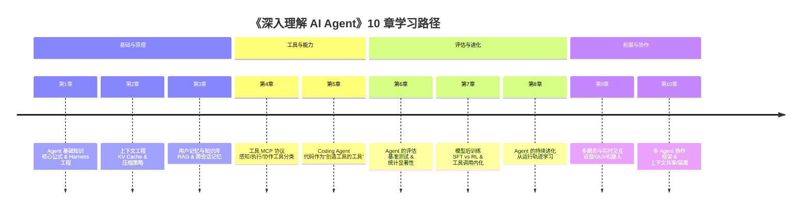

# bojieli/ai-agent-book

[GitHub URL](https://github.com/bojieli/ai-agent-book)


## 《深入理解 AI Agent：设计原理与工程实践》深度评测

> GitHub星标超2.7万的开源书籍，系统拆解AI Agent从原理到生产的完整路径，含95个实战代码实验。

- **Tags**: AI Agent, LLM, RAG, 开源书籍, 实战教程
- **Category**: AI 编程, 技术教程, 开源项目

## Details

# 《深入理解 AI Agent：设计原理与工程实践》深度评测：从原理到生产的完整指南
> 一本由华为“天才少年”撰写、GitHub 星标超 2.7 万的开源书籍，用 10 章内容和 95 个配套实验，系统性地拆解了 AI Agent 从设计原理到工程实践的完整路径。
## 📖 一句话总结
这不是一本普通的 AI Agent 科普读物，而是一套**工程师写给工程师的教科书级资源**。它以 **Agent = LLM + 上下文 + 工具** 为核心公式，系统性地讲解了如何从零开始构建可靠、可扩展的生产级 AI Agent 系统，并提供大量可直接运行的代码实验，完美解决了“Demo 到生产”之间的鸿沟问题。
## 🔍 背景与痛点
### AI Agent 落地的核心挑战
2025-2026 年间，AI Agent 领域经历了从“模型能力”到“系统构建”的焦点转移。虽然大语言模型（LLM）的能力飞速提升，但将单个模型转化为可靠、可用的生产级 Agent，仍然面临一系列严峻挑战：
-   **知识碎片化**：AI Agent 涉及提示工程、上下文管理、RAG、工具调用、评估指标、后训练、多模态、多 Agent 协作等多个交叉领域，知识散落在论文、博客和 README 中，缺乏系统性的整合。
-   **Demo 与生产的巨大鸿沟**：许多教程仅停留在“调用 API 做个 Demo”的层面，一旦进入真实、复杂、长流程的任务，系统就频繁出错，无法满足可靠性、安全性和可审计性的严格要求。
-   **“玄学”工程化难**：很多 Agent 的开发依赖经验和直觉进行反复试错，缺乏可解释、可验证、可复用的工程原则和方法论。
### 本书的诞生
本书作者**李博杰**（Bojie Li）拥有**中科大与微软亚洲研究院联合培养博士**背景，师从张霖涛、陈恩红教授，是**首届华为“天才少年”**，曾任华为计算机网络与协议实验室助理科学家、中科院计算所研究员，现任 Pine AI 首席科学家。这种**理论研究与工程实践的双重背景**，使他能从根本上理解 Agent 的设计原理，并提炼出可工程化的方法。
本书内容源于李博杰在**图灵《AI Agent 实战营》**（2025年8-10月）的系列课程讲义和配套实验，经过系统整理、补充与重构而成。更独特的是，这本书本身也是**人机协作的产物**：作者主要采用“Whisper Coding”（口述式协作）的方式，与 Pine 的语音 Agent 共同完成资料整理和文本迭代，这本身就是一次 Agent 深度参与知识生产的实践。
## ✨ 核心亮点与功能剖析
### 1. 核心公式：Agent = LLM + 上下文 + 工具
全书紧紧围绕这个核心公式展开，将 AI Agent 的复杂系统简化为三个核心组成部分，并逐一深入剖析：
| 组成部分 | 作用 | 核心内容 |
| :--- | :--- | :--- |
| **LLM (大脑)** | 理解、思考、决策 | 模型选型（SFT vs RL）、工具调用能力、推理边界 |
| **上下文 (记忆与工作空间)** | 决定能力上限 | KV Cache、提示工程、Agent Skills、上下文压缩 |
| **工具 (双手)** | 与外部世界交互 | MCP 协议、感知/执行/协作工具、异步设计 |
这个公式的**简洁性和高明之处**在于，它首先为读者构建了一个清晰的整体框架，然后再用整整 10 章内容去填充每一部分的血肉细节，避免了“概念繁多却无所适从”的困境。
### 2. 10 章递进式知识框架
全书的结构设计如同精心建造的塔楼，每一章都为下一章奠定基础，同时又能独立解决具体问题，形成一条完整的学习路径：

### 3. 95 个配套实验：能跑才算学会
这是本书最核心、最惊艳的亮点。每一章都配套了**可运行的代码实验**，总数达 95 个，其中超过 70 个可以独立运行。这些实验绝非“Hello World”式的演示，而是**直接从作者 Pine AI 的生产实践中提炼和简化而来**，极具实战价值。
实验类型分为三类：
-   **✅ 可独立运行**：仓库自带完整代码，配置好 API Key 即可直接运行，覆盖大部分核心概念。
-   **📖 复现指南**：需要额外克隆外部评测基准（如 SWE-bench、OSWorld）或训练框架（如 verl、MiniMind），README 有详细说明。
-   **📝 读者练习**：基于已有实验进行改造和扩展，鼓励动手实践和探索。
**一个简单的实验示例（第2章 - 上下文工程）**：
```python
# chapter2/context/main.py - 上下文压缩实验
from transformers import AutoTokenizer
import torch
# 使用一个小型模型演示上下文压缩的核心思想
tokenizer = AutoTokenizer.from_pretrained("gpt2")
# 原始长文本
original_text = "这是一个非常非常长的对话历史或文档内容..." # 假设很长
original_length = len(tokenizer(original_text)["input_ids"])
# 滑动窗口策略（简单示例）
window_size = 512  # 保持最近的 N 个 token
compressed_context = original_text[-1000:]  # 用字符串截断模拟
# 摘要压缩策略（需要调用 LLM）
# compressed_context = llm_summarize(original_text)  # 伪代码
# 检索增强策略（从知识库中检索相关片段）
# compressed_context = retrieve_relevant(original_text, knowledge_base)  # 伪代码
compressed_length = len(tokenizer(compressed_context)["input_ids"])
print(f"原始上下文长度: {original_length} tokens")
print(f"压缩后上下文长度: {compressed_length} tokens")
print(f"压缩率: {100 * compressed_length / original_length:.1f}%")
```
*此代码仅为实验理念的最简化演示，书中实验更为完整和复杂。*
### 4. 多语言与多格式支持
-   **多语言版本**：提供中文原版（由作者撰写）和**12 种语言的社区翻译**（英文、西班牙语、印尼语、阿拉伯语、繁体中文、俄语、泰米尔语、越南语、日语、土耳其语、韩语、匈牙利语）。
-   **多阅读格式**：支持**在线阅读**（支持多语言切换、章节折叠、全文搜索、配套实验直达）和**离线下载**（PDF、EPUB 格式），排版精美，适合不同阅读习惯。
## 🎯 目标人群与收益
### 1. 核心读者与收益
| 读者类型 | 核心收益 | 推荐阅读路径 |
| :--- | :--- | :--- |
| **AI Agent 工程师/开发者** | 获得从设计到实现生产级 Agent 的完整方法论和代码参考，解决 Demo 到生产的鸿沟问题。 | 第1-6章（重点实践），根据需求深入第7-10章。 |
| **产品经理/项目经理** | 理解 Agent 技术栈的能力边界、成本构成和工程挑战，做出更合理的技术选型和产品规划。 | 第1章（全局认知）、第6章（评估体系）、第2-5章（核心能力）。 |
| **AI 研究者/学生** | 获得系统性的知识框架和前沿的工程实践视角，连接理论与应用，启发研究方向。 | 全书阅读，重点关注第7-8章（后训练与进化）和第10章（协作）。 |
| **技术决策者/CTO** | 洞察 AI Agent 技术的成熟度和落地路径，制定公司级的技术战略和人才培养计划。 | 第1章（基础）、第5-6章（评估与实战）、第10章（未来趋势）。 |
### 2. 对小白用户的友好性
虽然本书定位为“工程师写给工程师”，但其**循序渐进的章节设计**和**大量生动的类比**（如将 Agent 比作“拥有大脑（LLM）、记忆（上下文）和双手（工具）的智能体”）使得它对有基础编程能力的用户也非常友好。**强烈建议小白用户**：
-   **从第1章开始**，建立核心公式的整体认知。
-   **跑一跑第1、2章的实验**，亲手感受 Agent 的基本工作原理和上下文的重要性。
-   **在线阅读**（`bojieli.github.io/ai-agent-book/`），利用全文搜索功能查找感兴趣的关键词。
## ⚖️ 竞品/同类对比
与市面上其他 AI Agent 学习资源相比，本书的特点和优势非常鲜明：
| 资源类型 | 代表 | 核心特点 | 局限性 |
| :--- | :--- | :--- | :--- |
| **学术论文** | 各类顶级会议论文 | 理论前沿，创新性强 | 代码复现难，缺乏工程实践视角，门槛极高 |
| **博客/教程** | Medium、知乎文章 | 易于获取，更新快 | 知识碎片化，缺乏系统性，深度不足 |
| **商业课程** | 在线教育平台 | 有讲师辅导，结构化 | 价格昂贵，内容可能滞后，代码非开源 |
| **开源框架文档** | LangChain、AutoGPT | 聚焦具体框架，实用性强 | 易陷入“工具主义”，缺乏原理性分析 |
| **🏆 本书** | **《深入理解 AI Agent》** | **原理+工程双视角，系统性强，实验可跑，完全开源免费** | **部分内容（如第7章后训练）需要较强算力** |
**核心竞争优势**：本书在**理论深度、工程实践、系统性和开源免费**四个维度上达到了近乎完美的平衡，填补了市场空白，这也是其能获得 GitHub 社区极高认可度的根本原因。
## ⚠️ 局限与不足
尽管本书是当前最优秀的开源资源之一，但仍存在一些客观的局限性和潜在挑战：
1.  **部分章节学习门槛较高**：第7章（模型后训练）和第9章（多模态与机器人控制）涉及**从零训练模型**和**仿真平台**，需要较强的计算资源和专业知识，个人用户完全复现难度较大。
2.  **技术迭代极快**：AI Agent 领域发展日新月异，本书基于 2025 年的知识体系整理。尽管核心原理（如上下文工程、MCP）具有很强的稳定性，但部分具体的工具、框架和最佳实践可能需要根据最新发展进行更新和补充。
3.  **社区翻译版本滞后**：虽然提供了多语言版本，但中文原版的更新速度通常领先于社区翻译版，非中文读者可能需要等待一段时间才能获取最新的内容修正和实验更新。
4.  **依赖外部 API 密钥**：运行大部分实验需要配置至少一个大模型提供商的 API 密钥（如 OpenAI、Anthropic、DeepSeek 等），这可能会产生一定的费用，且部分模型在国内访问可能存在网络问题。
> 💡 **给学习者的建议**：**不要试图一次跑通所有实验**。优先选择与你的目标和工作流最相关的章节进行深度学习和实践。对于算力要求高的章节，可以先理解原理和代码结构，再在云平台或共享资源上进行复现。
## 🏁 结语与行动建议
### 综合评判：一本不可多得的“工程圣经”
《深入理解 AI Agent：设计原理与工程实践》远不止一本开源书，它是一个**活的、不断演进的知识社区**，一套**可操作、可验证的工程方法库**，以及一个**连接全球 Agent 开发者的协作平台**。它成功地将 AI Agent 的“神秘”和“玄学”转化为可理解、可解释、可复现的**工程科学**。
其最大的价值在于，它不仅告诉你“是什么”（What）和“怎么做”（How），更深刻地揭示了“为什么”（Why），帮助你在模型和能力快速迭代的洪流中，掌握那些**穿越周期的、稳定的设计原则**。
### 🚀 立即行动指南
1.  **立即 Star & Watch**：前往 [GitHub 仓库](https://github.com/bojieli/ai-agent-book) 点击 Star 并 Watch Release，以便第一时间获取更新通知。
2.  **选择阅读方式**：
    -   **快速预览**：访问 [在线阅读页面](https://bojieli.github.io/ai-agent-book/)，浏览目录，确定你的重点章节。
    -   **深度学习**：下载 [中文原版 PDF](https://github.com/bojieli/ai-agent-book/releases/download/latest/AI-Agents-in-Depth-zh-CN.pdf)，进行沉浸式阅读和批注。
3.  **上手实验**：
    ```bash
    # 1. 克隆仓库
    git clone https://github.com/bojieli/ai-agent-book.git
    cd ai-agent-book
    
    # 2. 安装依赖（推荐使用 uv，速度快且依赖锁定）
    # 安装 uv: https://docs.astral.sh/uv/getting-started/installation/
    uv sync --locked --extra ch2  # 例如安装第2章依赖
    
    # 3. 配置 API Key
    cp .env.example .env
    # 编辑 .env 文件，填入你的 API Key（如 OPENAI_API_KEY）
    
    # 4. 运行实验
    uv run python chapter2/context/main.py
    ```
4.  **参与社区**：
    -   如果你在阅读或实验中遇到问题，欢迎在 GitHub Issues 中提问或搜索已有问题。
    -   如果你发现了错误或改进之处，欢迎提交 Pull Request 贡献代码、文档或翻译。
**对于所有对 AI Agent 感兴趣的开发者、研究者和决策者来说，这本书不仅是必读的“入门圣经”，更是常备的“实战手册”和“案头参考”。立即开始你的 Agent 深度探索之旅吧！**
