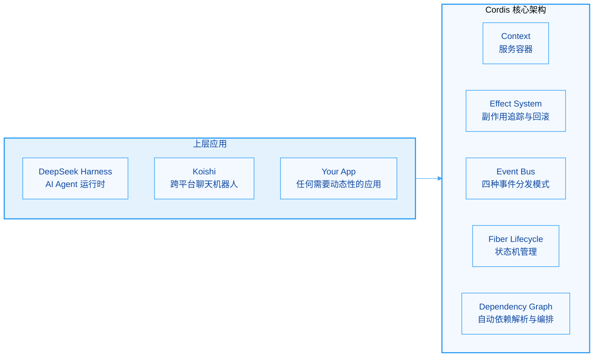
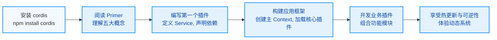

# cordiverse/cordis

[GitHub URL](https://github.com/cordiverse/cordis)

- **Stars**: 7235
- **Language**: TypeScript

## Cordis：实现时空可组合性的元框架深度评测

> 一个通过形式化模型解决复杂系统动态插件化、依赖管理和状态污染的底层基础设施。

- **Tags**: 插件系统, 热更新, 依赖注入, TypeScript, 可逆计算
- **Category**: 开发框架, 系统架构

## Details

# Cordis：为可逆软件系统而生的“元框架”深度评测
> 一个让软件组件像乐高积木一样安全插拔、动态组合，并在卸载时完整逆转其所有副作用的插件框架。
## 一、一句话总结
**Cordis** 是一个由 TypeScript 编写的**元框架（Meta-Framework）**，它致力于解决复杂软件系统中的“**时空可组合性**”（Spatiotemporal Composability）问题。它不耦合任何具体业务领域，而是为构建**可热更新、可逆组合、长期运行**的复杂应用（如 AI Agent 运行时、跨平台聊天机器人、微内核架构）提供了一套**形式化的底层基础设施**。
其核心价值在于：让应用的各个组件（插件）可以**在运行时动态加载、卸载、替换和重载**，并确保所有操作产生的副作用都能被**自动、完整、可预测地撤销**，从而避免传统插件系统中常见的“状态污染”、“内存泄漏”和“卸载残留”问题。
---
## 二、背景与痛点：为什么需要 Cordis？
现代软件系统，尤其是**长期运行**的 Agent 系统、机器人框架或微内核应用，对**动态性**和**可组合性**提出了极高要求。它们需要在运行时持续增加、移除、替换和重新组合不同组件。
然而，传统的插件系统或依赖注入框架在应对这些挑战时，暴露出几个**根本性痛点**：
| 痛点维度 | 传统做法 | Cordis 的解决方案 |
| :--- | :--- | :--- |
| **生命周期管理** | 手动管理清理（`dispose()`），极易遗忘监听器、定时器等副作用，导致**内存泄漏**和**状态污染** | **可逆副作用（Reversible Effects）**：所有副作用操作自动返回撤销函数，卸载时按逆序自动调用 |
| **依赖管理** | 手动编写启动脚本或用装饰器声明依赖，**顺序依赖复杂**，升级困难 | **依赖注入与自动编排**：通过 `inject` 声明，框架自动根据依赖图决定加载顺序，服务不可用时自动重载或卸载 |
| **热更新** | 需**重启整个进程**，丢失内存状态、会话和缓存，体验差 | **Fiber 状态机与事务加载**：支持运行时重载，配置更新可原子性回滚，进程无需重启 |
| **系统稳定性** | 长期运行后，插件残留导致状态不一致，需**定期重启**维护 | **时空可组合性**：从底层保证组件的可逆性和依赖的协调性，支持**数年无需重启**的稳定运行 |
**Cordis 的诞生**，正是为了从**编程范式**层面解决这些问题。它最初从知名的跨平台聊天机器人框架 **Koishi** 中抽离而出，并因被 DeepSeek AI 采用作为其 **Agent Harness 的核心基础设施**而备受瞩目。其核心思想已被北京大学与 DeepSeek-AI 在联合论文《A Programming Paradigm for Spatiotemporal Composability》中形式化。
> 💡 **形象比喻**：Cordis 就像一个拥有“完美记忆和整理癖”的**智能管家**。当你（插件）想进来干活时，它会帮你准备好一切所需工具（服务）。当你想离开时，它会把你带来的所有东西（注册的事件、创建的资源、修改的状态）**原封不动地收拾干净**，就像你从未出现过一样。而且，如果你需要的工具还没到位，它会耐心等待，直到工具到位后再叫你干活，整个过程完全自动化。
---
## 三、核心亮点与功能剖析
Cordis 的设计哲学浓缩为两个词：**时间可组合性**（Temporal Composability）和**空间可组合性**（Spatial Composability）。其能力围绕五大核心概念构建，并实现了一些精巧的技术机制。
### 1. 五大核心概念
这是理解和使用 Cordis 的基石，官方将其浓缩为五句话：
1.  **插件是实现 Service 的对象**
    插件是功能的最小单元，可以有三种形态：
    ```typescript
    // 1. 函数插件（最常见）
    function myPlugin(ctx: Context, config: MyConfig) {
      // 插件体：注册服务、监听事件等
      ctx.on('message', (msg) => console.log(msg));
    }
    // 声明依赖和配置校验
    myPlugin.inject = ['llm']; // 依赖 'llm' 服务
    myPlugin.Config = MyConfigSchema; // 使用 standard-schema 校验配置
    // 2. 类插件
    class MyService extends Service {
      constructor(ctx: Context) {
        super(ctx);
        // 插件逻辑
      }
    }
    // 3. 对象插件
    const plugin = {
      name: 'my-plugin',
      inject: ['tools'],
      apply(ctx, config) {
        // 插件逻辑
      }
    };
    ```
2.  **上下文是服务的容器**
    上下文（`Context`）是服务和所有共享状态的仓库。每个服务占据一个稳定的 `ctx.<key>`，如 `ctx.llm`、`ctx.tools`。其他插件通过 key 查找服务，而不是直接 import 具体实现，实现了**依赖倒置**。
3.  **通过 inject 声明服务依赖**
    通过 `inject` 属性声明所需服务（如 `inject: ['llm', 'tools']`），框架会**等待这些服务就绪后**才启动该插件。如果依赖的服务被卸载，插件会自动被停用；如果服务重新加载，插件会自动重载。这使得插件之间的依赖关系完全**声明式**和**自动协调**。
4.  **类型化事件用于通信**
    插件通过**事件**进行通信。服务通过 TypeScript 的**声明合并**（Declaration Merging）来声明事件名，然后通过 `emit`（发射）、`waterfall`（瀑布流）、`parallel`（并行）、`serial`（串行）四种模式派发事件。
    ```typescript
    // 声明事件（通常在服务接口中）
    declare module 'cordis' {
      interface Events {
        'my-event': (payload: { data: string }) => void | Promise<void>;
      }
    }
    // 派发事件（在插件中）
    ctx.emit('my-event', { data: 'hello' }); // 观察，不等待结果
    // 或 ctx.waterfall(...) / ctx.parallel(...) / ctx.serial(...)
    ```
5.  **注册是可逆副作用**
    所有副作用操作（如 `ctx.on()`、`ctx.effect()`、`ctx.plugin()`）都会返回一个**撤销函数**（disposer）。Cordis 内部维护一个副作用栈，当插件被卸载时，会自动按**逆序**调用所有 disposer，确保副作用被完整撤销。这是**时间可组合性**的核心实现。
### 2. 关键技术机制
-   **Fiber 状态机**：每个插件拥有独立的生命周期状态机（`PENDING → LOADING → ACTIVE → DISPOSED`），确保状态转换的确定性，防止竞态条件。
-   **事务化加载**：配置更新时，Cordis 会尝试**原子性地**加载新配置。如果任何步骤失败，整个事务会回滚，系统状态保持一致，不会出现“装了一半”的残局。
-   **上下文隔离**：可以为特定服务创建隔离上下文，使得上下文内外的插件无法相互感知。这在多租户场景或沙箱环境中尤为重要。
### 3. 技术栈与架构

Cordis 本身使用 **TypeScript** 编写，其核心实现**零外部依赖**（Zero Dependencies），保证了其稳定性和可移植性。目前也有 **Rust** 语言版本（`cordis-rs`）的移植工作正在进行，旨在为 Rust 生态带来相同的能力。
---
## 四、目标人群与收益：谁需要 Cordis？
Cordis 并非适用于所有项目。它的目标非常清晰：**需要高动态性、长期运行、且对状态管理有极高要求**的复杂软件系统。
### 🎯 核心目标人群
1.  **AI Agent / 智能体开发者**：正在构建类似 DeepSeek Harness 的 Agent 运行时，需要在运行时动态加载、卸载、替换工具、模型、策略等组件。
2.  **跨平台机器人/聊天框架开发者**：正在开发如 Koishi 那样的，需要对接多个平台（微信、QQ、Telegram 等）、支持插件热更新的系统。
3.  **微内核/插件化应用架构师**：设计需要高度可扩展、可定制的桌面应用、开发工具或复杂后台服务，希望核心与插件完全解耦。
4.  **追求极致稳定性的长期服务维护者**：运维的进程（如游戏服务器、金融交易网关）要求**数月甚至数年零重启**，且需支持在线更新。
### 💡 具体收益
| 角色 | 痛点 | Cordis 带来的收益 |
| :--- | :--- | :--- |
| **插件开发者** | 不知道如何干净卸载插件，担心副作用残留 | **只需声明依赖和注册副作用**，框架自动处理所有清理工作，**无后顾之忧** |
| **系统架构师** | 插件间依赖复杂，启动顺序难以编排，系统脆弱 | **依赖自动解析与编排**，修改一个插件不会破坏其他插件，**架构更稳固** |
| **DevOps/运维** | 更新插件需重启服务，影响用户体验，丢失会话 | **真正的热更新**，无需重启进程即可应用更改，**运维效率大幅提升** |
| **最终用户** | 软件更新频繁，经常需要重启才能生效，体验差 | **无缝更新**，功能更新对用户透明，**享受更流畅的体验** |
---
## 五、竞品/同类对比：Cordis 的独特竞争力
Cordis 并非唯一的插件框架或依赖注入方案。下表将其与一些常见技术进行了对比，突显其独特之处。
| 特性维度 | **Cordis** | **传统 IoC 容器 (如 NestJS)** | **普通插件系统 (如 Webpack Plugin)** | **微内核架构 (如 Eclipse RCP)** |
| :--- | :--- | :--- | :--- | :--- |
| **生命周期管理** | **✅ 自动可逆副作用**，卸载彻底 | ⭕ 需手动实现 `OnModuleDestroy`，易遗漏 | ⭕ 生命周期钩子简单，通常不支持完整卸载 | ⭕ 依赖复杂扩展点机制，学习成本高 |
| **依赖管理** | **✅ 声明式依赖注入 + 自动编排** | ✅ 声明式依赖注入，但**启动时装配** | ❌ 通常不支持或依赖手动顺序 | ⭕ 依赖扩展点，但**静态强绑定** |
| **热更新** | **✅ 运行时重载，事务化原子操作** | ❌ 通常需重启应用 | ❌ 通常需重启应用或服务 | ⭕ 支持 OSGi 动态安装，但复杂 |
| **状态隔离** | **✅ 上下文隔离，沙箱支持** | ✅ 通过作用域提供，但非核心特性 | ❌ 通常共享全局状态 | ⭕ 通过扩展点隔离，但模型复杂 |
| **编程范式** | **✅ 时空可组合性**，形式化模型 | ✅ 基于装饰器和元编程 | ✅ 基于钩子和生命周期回调 | ⭕ 基于扩展点和声明式贡献 |
| **学习曲线** | 🟡 需理解五大概念，有门槛 | 🟢 相对直观，文档丰富 | 🟢 简单易懂 | 🔴 陡峭，概念繁杂 |
| **适用场景** | **🔥 长期运行、高动态性的复杂系统** | 企业级 Web 应用、API 服务 | 构建工具、编译器、IDE | 大型桌面应用、集成开发环境 |
> 💡 **核心差异**：Cordis 的核心竞争力在于其 **“可逆性”（Reversibility）** 和 **“时空可组合性”** 的**形式化模型**。它不是一个“更高级的插件管理器”，而是一个**改变编程范式**的底层基础设施，从根源上解决了动态组合系统的状态一致性问题。
---
## 六、局限与不足：客观存在的挑战
Cordis 设计精妙，但并非万能，也存在一些局限和需要权衡的地方。
1.  **🧠 学习曲线陡峭**
    Cordis 引入了一系列新概念（`Context`、`Service`、`Effect`、`Fiber`、`Inject`、四种事件模式），这对开发者来说是新的思维模型。相比传统 IoC 容器或简单插件系统，**上手成本更高**。需要彻底理解其设计哲学才能避免误用。
2.  **⚠️ API 尚不稳定**
    官方文档明确警告：**“Cordis is under active development. The API is not yet stable and may change without notice.”** 这意味着在生产环境中使用需要谨慎，可能需要跟随版本迭代进行适配。对于追求极致稳定性的团队来说，这是一个需要评估的风险。
3.  **🔧 生态系统尚在早期**
    相比于 NestJS、Spring 等成熟框架，Cordis 的周边生态（如官方插件、工具链、教程、最佳实践文档）还在发展中。虽然已有 DeepSeek Harness 和 Koishi 两个重量级实践案例，但**社区插件和现成解决方案相对较少**，很多工作可能需要从零开始。
4.  **🐌 性能开销**
    为了实现自动依赖追踪、副作用回滚和事务化加载，Cordis 在运行时维护了额外的元数据和状态机，这会带来一定的**性能开销**。对于极度性能敏感的场景（如高频交易），需要仔细评估。但其开销通常对于大多数应用来说是可接受的。
5.  **🔌 对 Rust 移植的依赖**
    虽然有 `cordis-rs` 项目，但其**实现进度和成熟度**可能落后于 TypeScript 版本。如果项目计划使用 Rust 生态，需要评估 Rust 版本的可用性。
---
## 七、上手门槛与部署体验
### 🚀 安装与部署
Cordis 是一个 **npm** 包，安装非常简单。对于 Node.js/TypeScript 项目：
```bash
# 安装 Cordis 核心包
npm install cordis
# 或使用 yarn
yarn add cordis
```
对于 **Rust** 项目，可以使用 `cordis-rs`（注意：其实现和 API 可能与 TS 版本有差异）：
```toml
# Cargo.toml
[dependencies]
cordis = "0.1" # 请检查 crates.io 上的最新版本
```
### 📚 文档与学习路径
-   **官方入门教程**：DeepSeek Harness 官方提供了非常棒的 [Cordis Primer](https://deepseek-harness.github.io/deepseek-harness/reference/cordis-primer/)（英文 | 中文），这是**必读**的入门指南，用最简练的语言解释了五大核心概念。
-   **官方论文**：《A Programming Paradigm for Spatiotemporal Composability》 提供了形式化背景，适合希望深入理解其设计原理的理论派。
-   **示例项目**：Koishi 和 DeepSeek Harness 本身就是最好的大型示例。此外，社区也存在一些简单的示例项目可供参考。
### ⚙️ 部署体验
Cordis 本身不提供开箱即用的“应用模板”，它更像一个“引擎”。你需要基于它来构建你的应用框架。这意味着**部署的“体验”很大程度上取决于你如何在其上构建你的应用**。不过，由于其**零依赖**和**纯运行时**特性，Cordis 本身的部署非常简单，几乎不需要任何特殊环境配置。

---
## 八、社区活跃度与生命力
| 指标 | 状态 | 说明 |
| :--- | :--- | :--- |
| **GitHub Stars** |  | 截至 2026 年，已超过 **7.0k** Stars，显示社区对其高度关注。 |
| **维护状态** | 🟢 **活跃开发中** | 项目仍在积极迭代，commits 频繁。API 尚不稳定也意味着持续更新。 |
| **Issue 响应** | 🟡 **响应积极，但处理需时** | 作为新项目，Issue 响应通常较快，但复杂问题的修复可能需要时间。 |
| **社区生态** | 🟡 **核心应用强大，周边生态待成长** | **DeepSeek Harness** 和 **Koishi** 两大“灯塔”项目为其提供了强大背书和实战验证。但**独立的第三方插件和工具仍较少**。 |
| **语言移植** | 🟡 **Rust 移植进行中** | `cordis-rs` 项目存在，但进度和成熟度需持续关注。 |
> 💡 **生命力评估**：Cordis 拥有**强大的学术和工业界背书**（DeepSeek、北大），解决了**真实且急迫的痛点**，并且有**两个重量级的应用案例**持续驱动其发展。其生命力目前非常旺盛，但生态繁荣仍需时间。
---
## 九、Demo / 代码示例：直观感受 Cordis
下面是一个最简化的示例，展示如何使用 Cordis 创建一个上下文、注册一个服务、并编写一个依赖该服务的插件，然后演示其**可逆性**。
```typescript
// 1. 导入 Cordis
import { Context, Service } from 'cordis';
// 2. 定义一个服务接口（通过声明合并）
declare module 'cordis' {
  interface Context {
    // 定义一个名为 'greeting' 的服务
    greeting: GreetingService;
  }
}
// 3. 实现服务
class GreetingService extends Service {
  constructor(ctx: Context) {
    super(ctx);
    console.log('[GreetingService] 已启动');
    // 注册一个可逆副作用：监听 'hello' 事件
    this.effect(() => ctx.on('hello', (name) => {
      console.log(`[GreetingService] 收到 hello 事件，向 ${name} 问好！`);
      ctx.emit('greet', { message: `Hello, ${name}!` });
    }));
  }
  // 服务被卸载时会自动调用 dispose
  async dispose() {
    console.log('[GreetingService] 已停止，副作用已自动撤销');
  }
}
// 4. 创建主上下文
const ctx = new Context();
// 5. 将服务挂载到上下文
ctx.plugin(GreetingService);
// 6. 编写一个依赖该服务的插件
function myPlugin(ctx: Context) {
  // 声明依赖 'greeting' 服务
  myPlugin.inject = ['greeting'];
  
  console.log('[myPlugin] 已启动，依赖的服务已就绪');
  
  // 派发一个事件，测试服务
  ctx.emit('hello', 'World');
  
  // 模拟插件内部副作用
  const timer = setInterval(() => {
    console.log('[myPlugin] 定时任务运行中...');
  }, 1000);
  
  // 使用 effect 确保定时器在插件卸载时被清理
  ctx.effect(() => {
    // 返回的函数就是清理函数
    return () => clearInterval(timer);
  });
}
// 7. 挂载插件
ctx.plugin(myPlugin);
console.log('--- 系统运行中 ---');
console.log('--- 3秒后卸载 myPlugin ---');
// 8. 3秒后卸载插件，观察副作用是否被撤销
setTimeout(() => {
  ctx.dispose(myPlugin);
  console.log('--- myPlugin 已卸载，定时任务应已停止 ---');
}, 3000);
// 9. 6秒后完全停止上下文
setTimeout(() => {
  ctx.dispose();
  console.log('--- 上下文已停止，GreetingService 应已卸载 ---');
}, 6000);
```
**预期输出**：
```
[GreetingService] 已启动
[myPlugin] 已启动，依赖的服务已就绪
[GreetingService] 收到 hello 事件，向 World 问好！
--- 系统运行中 ---
--- 3秒后卸载 myPlugin ---
[myPlugin] 定时任务运行中...
[myPlugin] 定时任务运行中...
[myPlugin] 定时任务运行中...
[myPlugin] 已卸载，副作用已自动撤销
--- myPlugin 已卸载，定时任务应已停止 ---
--- 上下文已停止，GreetingService 应已卸载 ---
[GreetingService] 已停止，副作用已自动撤销
```
<details>
<summary><strong>🔧 关键点解释</strong></summary>
1.  **服务定义与挂载**：通过 `declare module 'cordis'` 声明服务接口，然后通过 `ctx.plugin()` 挂载服务类。
2.  **依赖注入**：在插件函数上通过 `inject` 属性声明依赖，`myPlugin` 会在 `greeting` 服务就绪后才启动。
3.  **可逆副作用（Effect）**：
    -   服务中的 `this.effect()` 确保了事件监听器在服务卸载时自动注销。
    -   插件中的 `ctx.effect()` 确保了 `setInterval` 定时器在插件卸载时被清理，**没有内存泄漏**。
4.  **生命周期管理**：调用 `ctx.dispose(myPlugin)` 时，Cordis 会自动按逆序调用该插件所有 `effect` 返回的清理函数，实现干净卸载。最后调用 `ctx.dispose()` 会停止整个上下文。
5.  **事件系统**：展示了插件如何通过 `ctx.emit()` 派发事件，并通过服务监听和响应事件，实现插件间通信。
这个例子完美展示了 Cordis 如何让插件的开发变得**声明式**和**可逆**，你几乎不需要手动编写任何清理代码。
</details>
---
## 十、结语与行动建议
### 🏆 终极评判
Cordis 是一个**极具远见和野心**的项目。它成功地识别了现代动态软件系统的核心痛点，并提出了一个**形式化、可执行、且经过实践验证**的解决方案。它不是一个“更酷的玩具”，而是一个**可能改变复杂应用架构方式**的“心脏”。
其**时空可组合性**的范式，虽然目前学习曲线陡峭，生态尚在早期，但其带来的**开发效率提升、系统稳定性增强和运维体验优化**的潜力是巨大的。对于**构建下一代动态软件系统**的架构师和开发者来说，Cordis 是一个**值得关注、学习和尝试**的重要技术。
### 🎯 行动建议
1.  **如果你正在构建 AI Agent 系统、聊天机器人框架或需要高度动态性的长期服务**：**强烈建议**深入研究 Cordis。DeepSeek Harness 和 Koishi 是最好的起点，理解它们如何使用 Cordis 能让你获得第一手经验。
2.  **如果你是一名对编程范式感兴趣的研究者或前沿技术探索者**：Cordis 的论文和实现是研究**可逆计算、组合软件学、元级编程**的绝佳案例。阅读论文、源码，甚至参与贡献，都会带来丰厚的知识回报。
3.  **如果你是一名普通的 Web 开发者**：目前可能还**不需要**在你的下一个项目中引入 Cordis。NestJS、Next.js 等传统框架在大多数场景下更高效、生态更成熟。但**保持关注**，其思想可能会影响未来的框架设计。
4.  **对于所有人**：至少花 1-2 小时阅读 [Cordis Primer](https://deepseek-harness.github.io/deepseek-harness/reference/cordis-primer/)，理解其五大核心概念。即使暂时不使用，这种**思考软件系统的新方式**也会对你有所启发。
> **Cordis 的故事告诉我们**：有时候，要解决一个复杂的问题，需要重新审视最基础的假设，并提出一个全新的编程范式。它或许不是今天的银弹，但很可能是通往未来软件系统的基石之一。
