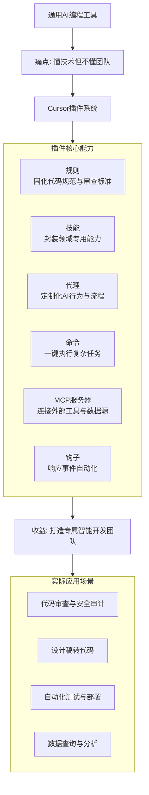

# cursor/plugins

[GitHub URL](https://github.com/cursor/plugins)

- **Stars**: 4819
- **Language**: TypeScript

> # Cursor 插件生态深度评测：将 AI 原生 IDE 变成你专属的“开发团队外挂”
> > 2026年的编程已不再是单打独斗，Cursor 的插件系统正在将你的 IDE 变成一个能调用无数工具、遵循团队规范、自动执行复杂工作流的“超级开发者”。
> ## 🧠 一句话总结
> Cursor 的插件系统是其 AI 原生 IDE 的核心扩展能力，它通过**模块化打包规则、技能、代理、命令、MCP 服务器和钩子**，将通用 AI 转化为**能理解你团队内部工具、工作流和代码规范的专属智能助手**，从根本上解决了 AI 编程工具“懂技术但不懂团队”的痛点。
> ## 🔍 背景与痛点：为什么需要插件系统？
> ### AI 编程的“最后一公里”问题
> 目前的 AI 编程工具（如 Cursor, GitHub Copilot）大多基于通用模型训练，它们就像一位才华横溢但刚入职的“通用型程序员”：
> -   **懂语言但不懂行话**：精通各种编程语言的语法和算法，但对你们团队特有的**内部工具链、缩写、代码规范、部署流程**一无所知。
> -   **能写代码但无法协同**：可以生成单个文件或函数，但难以理解**跨文件、跨服务的复杂业务逻辑**，更别提自动触发你们团队的 CI/CD 流程或通知系统。
> -   **是助手而非队员**：需要你手动描述每一个细节，无法像真正的团队成员那样**主动感知项目状态、执行预定义的工作流**。
> ### Cursor 插件：团队专属的“入职培训脚本”
> Cursor 的插件系统正是为了解决这些问题而生。它提供了一种结构化、可分发的方式，将你团队的**“入职培训手册”** 自动化并注入到 Cursor 的 AI 能力中。通过插件，你可以：
> -   **固化最佳实践**：将代码风格、架构模式、安全审查规则等硬编码为 AI 永久遵循的规则。
> -   **集成内部工具**：让 AI 能够直接与你们自建的 API、数据库、服务总线等“对话”，生成真正可用的代码。
> -   **自动化工作流**：将复杂的、多步骤的任务（如“从设计稿生成代码并部署到预发环境”）封装成 AI 可一键执行的命令。
> ```mermaid
> flowchart TD
>     A[通用AI编程工具] --> B[痛点: 懂技术但不懂团队]
>     B --> C[Cursor插件系统]
>     
>     subgraph D [插件核心能力]
>         D1[规则<br>固化代码规范与审查标准]
>         D2[技能<br>封装领域专用能力]
>         D3[代理<br>定制化AI行为与流程]
>         D4[命令<br>一键执行复杂任务]
>         D5[MCP服务器<br>连接外部工具与数据源]
>         D6[钩子<br>响应事件自动化]
>     end
>     
>     C --> D
>     
>     D --> E[收益: 打造专属智能开发团队]
>     
>     subgraph F [实际应用场景]
>         F1[代码审查与安全审计]
>         F2[设计稿转代码]
>         F3[自动化测试与部署]
>         F4[数据查询与分析]
>     end
>     
>     E --> F
> ```
> ## ⚡ 核心亮点与功能剖析
> Cursor 的插件系统并非简单的功能扩展，而是对 AI 能力的深度定制和编排。其核心亮点在于其**模块化设计**和**开放标准**。
> ### 1. 模块化组件：构建插件的积木块
> 一个 Cursor 插件是一个目录，其中包含一个**清单文件 (`plugin.json`)** 和任意数量的以下组件：
> | 组件 | 格式支持 | 描述 | 典型应用场景 |
> | :--- | :--- | :--- | :--- |
> | **规则 (Rules)** | Cursor Plugins | 持久化的 AI 指导和编码标准 (`.mdc` 文件) | 代码风格、命名规范、安全审查检查项 |
> | **技能 (Skills)** | 两者皆可 | 代理用于复杂任务的专业化能力 | 解析特定日志格式、调用内部API生成代码、自动化测试 |
> | **代理 (Agents)** | Cursor Plugins | 定制的代理配置和提示词 | 设置一个专门用于“性能优化”或“安全审计”的专属AI代理 |
> | **命令 (Commands)** | Cursor Plugins | 代理可执行的命令文件 | 一键“部署到预发环境”、“生成API文档并发布” |
> | **MCP 服务器** | 两者皆可 | 将 Cursor 连接到外部工具或数据源的服务 | 连接公司内部的知识库、数据库、CI/CD系统 |
> | **钩子 (Hooks)** | Cursor Plugins | 用于观察和代理行为的自动化脚本 | 代码提交前自动运行测试、合并PR后自动通知团队 |
> 这种设计使得你可以**按需组合**这些组件，构建出从简单的代码规范增强到复杂的多步骤自动化工作流的插件。
> ### 2. Agent Plugins 开放标准：生态繁荣的基石
> Cursor 支持 **Agent Plugins 开放标准**。这意味着：
> -   **跨平台兼容**：符合该标准的技能和 MCP 服务器不仅能在 Cursor 中使用，理论上也能在其他支持该标准的 AI 工具中运行，促进了生态的繁荣和资源的共享。
> -   **社区生态**：你可以从 [cursor.directory](https://cursor.directory) 浏览和安装由社区贡献的插件和 MCP 服务器，极大地扩展了 Cursor 的能力边界。
> ### 3. 开箱即用的官方与第三方插件库
> Cursor 提供了丰富的官方插件和与第三方工具的集成，覆盖了开发的全生命周期：
> -   **规划与设计**：Linear (任务管理)、Figma (设计转代码)
> -   **基础设施与服务**：AWS, Cloudflare, Vercel (部署与管理)、Stripe (支付集成)
> -   **数据与分析**：Databricks, Snowflake, Amplitude (查询数据与洞察)
> -   **日常办公**：**Google Workspace** (Gmail, Drive, Calendar) 、GitHub、Zoom、Salesforce 等
> 这些插件让你无需离开 IDE，就能调用各种工具，**将编程、沟通、部署、数据分析等流程无缝串联**。
> ## 🎯 目标人群与收益：谁最适合用，能得到什么？
> ### 核心目标人群
> 1.  **中大型团队的技术负责人/架构师**
>     -   **痛点**：团队规模大，代码规范难统一；新员工上手慢，最佳实践难以传承；重复性工作多（如代码审查、部署流程）。
>     -   **收益**：通过插件固化团队标准，让 AI 自动审查代码、生成符合架构的新代码、自动化重复流程，**将个人经验转化为团队资产**，大幅提升整体开发效率和代码质量。
> 2.  **有特定技术栈或领域知识的独立开发者/小团队**
>     -   **痛点**：通用 AI 对你使用的冷门框架或业务领域（如区块链、游戏开发、量化交易）不熟悉，生成代码需要大量修改。
>     -   **收益**：开发自己的技能插件，将领域知识“教”给 AI，让 Cursor 成为你专属的领域专家，**大幅减少调试和修改时间**。
> 3.  **追求极致效率的全栈开发者/自动化爱好者**
>     -   **痛点**：在多个工具间频繁切换（如 IDE、终端、浏览器、设计工具），工作流被打断。
>     -   **收益**：通过插件将所有工具集成到 IDE 中，用自然语言命令触发一系列自动化操作，**打造个人专属的“开发流水线”**。
> ### 具体收益
> | 收益维度 | 说明 | 量化示例（预估） |
> | :--- | :--- | :--- |
> | **开发效率提升** | 自动化重复任务、减少上下文切换、AI 生成更精准的代码。 | **代码生成效率提升 40-60%**，跨文件修改时间从小时级降至分钟级。 |
> | **代码质量与规范统一** | AI 持续遵循规则，自动进行审查和检测。 | **代码规范符合率提升至 95%+**，潜在安全漏洞在生成阶段就被拦截。 |
> | **知识沉淀与传承** | 将最佳实践、业务逻辑、内部工具使用方法固化到插件中。 | **新员工上手时间缩短 50-70%**，团队知识流失风险降低。 |
> | **工作流自动化** | 将复杂、多步骤的任务封装成命令，一键执行。 | 将“从设计稿到预发环境部署”的流程从**数小时缩短至数分钟**。 |
> ## ⚖️ 竞品/同类对比：Cursor 插件系统的独特竞争力
> | 特性 | Cursor 插件系统 | GitHub Copilot Extensions | VS Code 插件 (传统) | Claude Code Projects |
> | :--- | :--- | :--- | :--- | :--- |
> | **核心定位** | **AI 原生深度集成**，旨在从根本上增强 AI 能力本身。 | **功能扩展**，在 AI 补全/聊天基础上增加外部工具调用能力。 | **IDE 功能扩展**，与 AI 能力是两套独立体系。 | **项目级上下文管理**，侧重于让 AI 理解整个项目。 |
> | **AI 能力定制化深度** | ⭐⭐⭐⭐⭐<br>**最深**。可定制系统提示词、注入规则、改变代理行为，**从“根”上定制 AI**。 | ⭐⭐⭐☆<br>较深。可通过 Extensions 调用工具，但核心 AI 模型行为定制能力有限。 | ⭐☆☆☆☆<br>无。传统插件无法改变 AI 模型的输出和行为。 | ⭐⭐⭐⭐☆<br>深。可通过 `.claude` 文件和配置进行项目级定制，但插件化分发机制不如 Cursor 成熟。 |
> | **与 IDE 的集成度** | ⭐⭐⭐⭐⭐<br>**最高**。基于 VS Code 但深度重构，插件与 AI 能力、编辑器UI无缝融合。 | ⭐⭐⭐⭐☆<br>高。作为 VS Code 插件，集成度很高。 | ⭐⭐⭐☆☆<br>中高。是 VS Code 的原生扩展方式，但与 AI 能力割裂。 | ⭐⭐☆☆☆<br>低。主要在终端中运行，与图形化 IDE 集成度较弱。 |
> | **工作流自动化能力** | ⭐⭐⭐⭐⭐<br>**最强**。支持命令、钩子、MCP，可构建复杂的多步骤自动化流程。 | ⭐⭐⭐☆☆<br>中等。可通过触发命令或聊天进行简单操作，但编排复杂工作流能力较弱。 | ⭐⭐☆☆☆<br>弱。传统插件主要提供功能点，难以编排跨工具的复杂流程。 | ⭐⭐⭐☆☆<br>中等。擅长处理代码任务，但与外部工具的自动化集成能力有限。 |
> | **学习曲线与开发门槛** | ⭐⭐⭐☆☆<br>中等。需理解插件结构和各组件概念，开发有一定门槛。 | ⭐⭐☆☆☆<br>较低。Extensions 开发相对简单，但定制 AI 能力深度有限。 | ⭐⭐☆☆☆<br>低。VS Code 插件生态成熟，开发文档完善，入门容易。 | ⭐⭐⭐☆☆<br>中等。需要理解其配置文件和命令行交互方式。 |
> | **独特优势** | **最彻底的 AI 能力定制化**和**最强的 IDE 内工作流自动化**。 | **生态庞大**，与 GitHub 深度集成，补全体验流畅。 | **生态最成熟**，插件数量最多，几乎能找到任何功能扩展。 | **强大的代码库理解能力**，对大型项目维护和重构非常友好。 |
> **🏆 总结：** Cursor 插件系统的**核心竞争力**在于它不是在 IDE 上“贴”一个 AI，而是将 AI **深度融合进 IDE 的每一寸肌理**，并提供了**无与伦比的定制化深度和自动化能力**。它更适合那些希望**深度定制 AI 以符合自身团队规范和工作流**的开发者和团队。
> ## ⚠️ 局限与不足：客观存在的挑战
> 1.  **学习与开发门槛**：
>     -   要开发一个功能完善的插件，需要理解 **Cursor 的插件架构、各种组件（Rules, Skills, Agents, etc.）的概念和用法**，这对非技术背景或刚入门的开发者来说有一定挑战。
>     -   虽然有官方文档和示例，但社区资源和教程（尤其是中文）相比 VS Code 生态还不够丰富。
> 2.  **生态成熟度**：
>     -   Cursor 插件生态仍处于快速发展期，**高质量、经过广泛验证的第三方插件数量**远不如 VS Code 传统插件生态丰富。
>     -   部分插件可能存在**兼容性问题**（如与特定 Cursor 版本或操作系统的兼容性），或者文档不够详尽。
> 3.  **对 Cursor IDE 的依赖**：
>     -   插件系统是 Cursor **独有的**，无法在其他 IDE（如 VS Code、JetBrains）上使用。这意味着如果你选择了 Cursor 的插件生态，就必须**完全迁移到 Cursor IDE**。虽然 Cursor 基于 VS Code，配置迁移相对容易，但这是一个重要的决策点。
> 4.  **性能与稳定性考虑**：
>     -   过多或复杂的插件（尤其是涉及频繁外部 API 调用的 MCP 服务器）可能会对 IDE 的**性能和响应速度产生一定影响**。
>     -   插件的稳定性依赖于其开发者的维护质量，一个“有毒”的插件可能会导致 IDE 崩溃或行为异常。
> 5.  **企业级安全与治理**：
>     -   目前 Cursor 插件主要针对个人和小团队。对于大型企业，**缺乏内置的、细粒度的插件管理和安全控制机制**（如插件市场访问控制、插件审计流程、私有插件分发）。Cursor 官方表示正在构建**私有团队插件市场**以解决此问题，但这目前仍是一个“即将推出”的功能。
> ## 🛠️ 上手指南与代码示例：如何创建你的第一个插件
> ### 最小化插件结构
> 创建一个最基本的插件只需一个目录和一个清单文件。
> ```bash
> my-awesome-plugin/
> ├── .cursor-plugin/
> │   └── plugin.json      # 插件清单（必填）
> └── rules/
>     └── my-rule.mdc      # 一个规则文件（示例）
> ```
> ### 1. 创建清单文件 `plugin.json`
> 这是插件的“身份证”，告诉 Cursor 插件叫什么、是谁做的、有什么内容。
> ```json
> {
>   "name": "my-awesome-plugin",
>   "displayName": "我的超棒插件",
>   "description": "这是我的第一个 Cursor 插件，用于演示规则文件。",
>   "author": "Your Name",
>   "version": "0.0.1",
>   "license": "MIT",
>   "categories": ["Developer Tools"],
>   "contributes": {
>     "rules": [
>       {
>         "id": "my-rule",
>         "path": "rules/my-rule.mdc"
>       }
>     ]
>   }
> }
> ```
> ### 2. 创建规则文件 `rules/my-rule.mdc`
> 规则文件使用 Markdown 格式，用于告诉 AI 在编写代码时应该遵循什么规范。
> ```markdown
> ---
> id: my-rule
> name: 我的代码规范
> description: 确保生成的代码符合我的编码风格
> ---
> # 代码风格指南
> 请遵循以下规范编写所有代码：
> 1.  **函数命名**: 使用 camelCase，例如 `getUserData`。
> 2.  **变量命名**: 使用 camelCase，例如 `userName`。
> 3.  **常量命名**: 使用 UPPER_SNAKE_CASE，例如 `MAX_RETRY_COUNT`。
> 4.  **类命名**: 使用 PascalCase，例如 `UserService`。
> 5.  **注释**: 所有公共函数必须添加 JSDoc 注释说明其用途、参数和返回值。
> 6.  **错误处理**: 所有异步操作必须包含 try-catch 块进行错误处理。
> ## 示例
> **不好的示例**:
> ```javascript
> function get_data(u) {
>   return db.find(u);
> }
> ```
> **好的示例**:
> ```javascript
> /**
>  * 根据用户ID获取用户数据
>  * @param {string} userId - 用户ID
>  * @returns {Promise<Object>} 用户数据对象
>  */
> async function getUserData(userId) {
>   try {
>     const userData = await db.find({ id: userId });
>     return userData;
>   } catch (error) {
>     console.error('获取用户数据失败:', error);
>     throw error; // 重新抛出错误，由调用方处理
>   }
> }
> ```
> ```
> ### 3. 安装与测试
> 1.  在 Cursor 中，打开 `Customize` 页面（快捷键 `Cmd/Ctrl + ,`）。
> 2.  在 "Plugins" 部分，点击 "..." 菜单，选择 "Install from Directory..."。
> 3.  选择你的 `my-awesome-plugin` 文件夹。
> 4.  Cursor 会自动加载插件。你可以在插件列表中看到它。
> 5.  **测试规则**：打开一个新文件，用自然语言告诉 Cursor：“帮我写一个获取用户列表的函数”。Cursor 生成的代码应该会遵循你 `my-rule.mdc` 中定义的规范。
> ## 🚀 结语与行动建议：终极评判
> Cursor 的插件系统是一项**极具前瞻性和颠覆性**的创新。它远不止于“添加功能”，而是开创了一种 **“通过定制化 AI 来重塑和增强整个开发工作流”** 的新范式。
> ### ✅ 最终评价
> -   **创新性**：⭐⭐⭐⭐⭐ (前所未有地将 AI 深度定制化与 IDE 工作流自动化融合)
> -   **实用性**：⭐⭐⭐⭐☆ (对中大型团队和追求效率的开发者价值巨大，但对个人小项目可能有些“杀鸡用牛刀”)
> -   **易用性**：⭐⭐⭐☆☆ (开发插件有门槛，但使用和安装官方/社区插件相对简单)
> -   **生态成熟度**：⭐⭐⭐☆☆ (处于快速发展期，潜力巨大，但目前数量和质量有待提升)
> -   **推荐度**：⭐⭐⭐⭐☆ (强烈推荐给技术负责人、团队骨干和追求极致效率的开发者)
> ### 🎯 行动建议
> 1.  **如果你是个人开发者或小团队**：
>     -   **从使用开始**：先探索 Cursor 插件市场，安装一些官方插件（如 Google Workspace、GitHub）和社区插件，体验一下无缝集成带来的效率提升。
>     -   **创建简单规则**：从写一个 `.cursorrules` 文件或简单的规则插件开始，固化你个人的代码风格，让 AI 更懂你。
> 2.  **如果你是技术负责人或架构师**：
>     -   **评估团队价值**：思考团队中最重复、最易出错、最需要传承知识的环节。这些是插件能发挥最大价值的领域。
>     -   **启动试点项目**：选择一个非核心项目或新功能，尝试开发一个团队插件（例如，自动化代码审查流程、集成内部 API）。让一两位经验丰富的开发者主导。
>     -   **规划长期策略**：随着 Cursor 插件生态的成熟，考虑将**插件开发纳入团队的技术基础设施规划**，将其作为提升团队整体研发效能的关键投资。
> 3.  **如果你是插件开发者**：
>     -   **贡献社区**：尝试将你开发的高质量插件提交到 [cursor.directory](https://cursor.directory)，丰富社区生态。
>     -   **探索标准**：深入研究 Agent Plugins 开放标准，开发可跨平台使用的技能和 MCP 服务器，提升插件的通用价值。
> > **💡 未来展望**：随着 Cursor 官方对**私有团队插件市场**和更强大的**Agent 编排能力**的投入，我们可以预见，未来的 IDE 将不再只是一个代码编辑器，而是一个**集成了无数AI微智能体、能自动执行复杂工作流的“开发操作中心”**。Cursor 的插件系统正在引领这场变革。
> ---
> **💎 总结一下**：Cursor 插件系统是为那些**不满足于通用AI，希望将AI深度定制并融入自己团队DNA的开发者和团队**准备的。它需要一定的学习成本，但一旦驾驭，它将成为你手中最强大的“效率武器”，彻底改变你的编程方式。


## Details

# Cursor 插件生态深度评测：将 AI 原生 IDE 变成你专属的“开发团队外挂”
> 2026年的编程已不再是单打独斗，Cursor 的插件系统正在将你的 IDE 变成一个能调用无数工具、遵循团队规范、自动执行复杂工作流的“超级开发者”。
## 🧠 一句话总结
Cursor 的插件系统是其 AI 原生 IDE 的核心扩展能力，它通过**模块化打包规则、技能、代理、命令、MCP 服务器和钩子**，将通用 AI 转化为**能理解你团队内部工具、工作流和代码规范的专属智能助手**，从根本上解决了 AI 编程工具“懂技术但不懂团队”的痛点。
## 🔍 背景与痛点：为什么需要插件系统？
### AI 编程的“最后一公里”问题
目前的 AI 编程工具（如 Cursor, GitHub Copilot）大多基于通用模型训练，它们就像一位才华横溢但刚入职的“通用型程序员”：
-   **懂语言但不懂行话**：精通各种编程语言的语法和算法，但对你们团队特有的**内部工具链、缩写、代码规范、部署流程**一无所知。
-   **能写代码但无法协同**：可以生成单个文件或函数，但难以理解**跨文件、跨服务的复杂业务逻辑**，更别提自动触发你们团队的 CI/CD 流程或通知系统。
-   **是助手而非队员**：需要你手动描述每一个细节，无法像真正的团队成员那样**主动感知项目状态、执行预定义的工作流**。
### Cursor 插件：团队专属的“入职培训脚本”
Cursor 的插件系统正是为了解决这些问题而生。它提供了一种结构化、可分发的方式，将你团队的**“入职培训手册”** 自动化并注入到 Cursor 的 AI 能力中。通过插件，你可以：
-   **固化最佳实践**：将代码风格、架构模式、安全审查规则等硬编码为 AI 永久遵循的规则。
-   **集成内部工具**：让 AI 能够直接与你们自建的 API、数据库、服务总线等“对话”，生成真正可用的代码。
-   **自动化工作流**：将复杂的、多步骤的任务（如“从设计稿生成代码并部署到预发环境”）封装成 AI 可一键执行的命令。

## ⚡ 核心亮点与功能剖析
Cursor 的插件系统并非简单的功能扩展，而是对 AI 能力的深度定制和编排。其核心亮点在于其**模块化设计**和**开放标准**。
### 1. 模块化组件：构建插件的积木块
一个 Cursor 插件是一个目录，其中包含一个**清单文件 (`plugin.json`)** 和任意数量的以下组件：
| 组件 | 格式支持 | 描述 | 典型应用场景 |
| :--- | :--- | :--- | :--- |
| **规则 (Rules)** | Cursor Plugins | 持久化的 AI 指导和编码标准 (`.mdc` 文件) | 代码风格、命名规范、安全审查检查项 |
| **技能 (Skills)** | 两者皆可 | 代理用于复杂任务的专业化能力 | 解析特定日志格式、调用内部API生成代码、自动化测试 |
| **代理 (Agents)** | Cursor Plugins | 定制的代理配置和提示词 | 设置一个专门用于“性能优化”或“安全审计”的专属AI代理 |
| **命令 (Commands)** | Cursor Plugins | 代理可执行的命令文件 | 一键“部署到预发环境”、“生成API文档并发布” |
| **MCP 服务器** | 两者皆可 | 将 Cursor 连接到外部工具或数据源的服务 | 连接公司内部的知识库、数据库、CI/CD系统 |
| **钩子 (Hooks)** | Cursor Plugins | 用于观察和代理行为的自动化脚本 | 代码提交前自动运行测试、合并PR后自动通知团队 |
这种设计使得你可以**按需组合**这些组件，构建出从简单的代码规范增强到复杂的多步骤自动化工作流的插件。
### 2. Agent Plugins 开放标准：生态繁荣的基石
Cursor 支持 **Agent Plugins 开放标准**。这意味着：
-   **跨平台兼容**：符合该标准的技能和 MCP 服务器不仅能在 Cursor 中使用，理论上也能在其他支持该标准的 AI 工具中运行，促进了生态的繁荣和资源的共享。
-   **社区生态**：你可以从 [cursor.directory](https://cursor.directory) 浏览和安装由社区贡献的插件和 MCP 服务器，极大地扩展了 Cursor 的能力边界。
### 3. 开箱即用的官方与第三方插件库
Cursor 提供了丰富的官方插件和与第三方工具的集成，覆盖了开发的全生命周期：
-   **规划与设计**：Linear (任务管理)、Figma (设计转代码)
-   **基础设施与服务**：AWS, Cloudflare, Vercel (部署与管理)、Stripe (支付集成)
-   **数据与分析**：Databricks, Snowflake, Amplitude (查询数据与洞察)
-   **日常办公**：**Google Workspace** (Gmail, Drive, Calendar) 、GitHub、Zoom、Salesforce 等
这些插件让你无需离开 IDE，就能调用各种工具，**将编程、沟通、部署、数据分析等流程无缝串联**。
## 🎯 目标人群与收益：谁最适合用，能得到什么？
### 核心目标人群
1.  **中大型团队的技术负责人/架构师**
    -   **痛点**：团队规模大，代码规范难统一；新员工上手慢，最佳实践难以传承；重复性工作多（如代码审查、部署流程）。
    -   **收益**：通过插件固化团队标准，让 AI 自动审查代码、生成符合架构的新代码、自动化重复流程，**将个人经验转化为团队资产**，大幅提升整体开发效率和代码质量。
2.  **有特定技术栈或领域知识的独立开发者/小团队**
    -   **痛点**：通用 AI 对你使用的冷门框架或业务领域（如区块链、游戏开发、量化交易）不熟悉，生成代码需要大量修改。
    -   **收益**：开发自己的技能插件，将领域知识“教”给 AI，让 Cursor 成为你专属的领域专家，**大幅减少调试和修改时间**。
3.  **追求极致效率的全栈开发者/自动化爱好者**
    -   **痛点**：在多个工具间频繁切换（如 IDE、终端、浏览器、设计工具），工作流被打断。
    -   **收益**：通过插件将所有工具集成到 IDE 中，用自然语言命令触发一系列自动化操作，**打造个人专属的“开发流水线”**。
### 具体收益
| 收益维度 | 说明 | 量化示例（预估） |
| :--- | :--- | :--- |
| **开发效率提升** | 自动化重复任务、减少上下文切换、AI 生成更精准的代码。 | **代码生成效率提升 40-60%**，跨文件修改时间从小时级降至分钟级。 |
| **代码质量与规范统一** | AI 持续遵循规则，自动进行审查和检测。 | **代码规范符合率提升至 95%+**，潜在安全漏洞在生成阶段就被拦截。 |
| **知识沉淀与传承** | 将最佳实践、业务逻辑、内部工具使用方法固化到插件中。 | **新员工上手时间缩短 50-70%**，团队知识流失风险降低。 |
| **工作流自动化** | 将复杂、多步骤的任务封装成命令，一键执行。 | 将“从设计稿到预发环境部署”的流程从**数小时缩短至数分钟**。 |
## ⚖️ 竞品/同类对比：Cursor 插件系统的独特竞争力
| 特性 | Cursor 插件系统 | GitHub Copilot Extensions | VS Code 插件 (传统) | Claude Code Projects |
| :--- | :--- | :--- | :--- | :--- |
| **核心定位** | **AI 原生深度集成**，旨在从根本上增强 AI 能力本身。 | **功能扩展**，在 AI 补全/聊天基础上增加外部工具调用能力。 | **IDE 功能扩展**，与 AI 能力是两套独立体系。 | **项目级上下文管理**，侧重于让 AI 理解整个项目。 |
| **AI 能力定制化深度** | ⭐⭐⭐⭐⭐<br>**最深**。可定制系统提示词、注入规则、改变代理行为，**从“根”上定制 AI**。 | ⭐⭐⭐☆<br>较深。可通过 Extensions 调用工具，但核心 AI 模型行为定制能力有限。 | ⭐☆☆☆☆<br>无。传统插件无法改变 AI 模型的输出和行为。 | ⭐⭐⭐⭐☆<br>深。可通过 `.claude` 文件和配置进行项目级定制，但插件化分发机制不如 Cursor 成熟。 |
| **与 IDE 的集成度** | ⭐⭐⭐⭐⭐<br>**最高**。基于 VS Code 但深度重构，插件与 AI 能力、编辑器UI无缝融合。 | ⭐⭐⭐⭐☆<br>高。作为 VS Code 插件，集成度很高。 | ⭐⭐⭐☆☆<br>中高。是 VS Code 的原生扩展方式，但与 AI 能力割裂。 | ⭐⭐☆☆☆<br>低。主要在终端中运行，与图形化 IDE 集成度较弱。 |
| **工作流自动化能力** | ⭐⭐⭐⭐⭐<br>**最强**。支持命令、钩子、MCP，可构建复杂的多步骤自动化流程。 | ⭐⭐⭐☆☆<br>中等。可通过触发命令或聊天进行简单操作，但编排复杂工作流能力较弱。 | ⭐⭐☆☆☆<br>弱。传统插件主要提供功能点，难以编排跨工具的复杂流程。 | ⭐⭐⭐☆☆<br>中等。擅长处理代码任务，但与外部工具的自动化集成能力有限。 |
| **学习曲线与开发门槛** | ⭐⭐⭐☆☆<br>中等。需理解插件结构和各组件概念，开发有一定门槛。 | ⭐⭐☆☆☆<br>较低。Extensions 开发相对简单，但定制 AI 能力深度有限。 | ⭐⭐☆☆☆<br>低。VS Code 插件生态成熟，开发文档完善，入门容易。 | ⭐⭐⭐☆☆<br>中等。需要理解其配置文件和命令行交互方式。 |
| **独特优势** | **最彻底的 AI 能力定制化**和**最强的 IDE 内工作流自动化**。 | **生态庞大**，与 GitHub 深度集成，补全体验流畅。 | **生态最成熟**，插件数量最多，几乎能找到任何功能扩展。 | **强大的代码库理解能力**，对大型项目维护和重构非常友好。 |
**🏆 总结：** Cursor 插件系统的**核心竞争力**在于它不是在 IDE 上“贴”一个 AI，而是将 AI **深度融合进 IDE 的每一寸肌理**，并提供了**无与伦比的定制化深度和自动化能力**。它更适合那些希望**深度定制 AI 以符合自身团队规范和工作流**的开发者和团队。
## ⚠️ 局限与不足：客观存在的挑战
1.  **学习与开发门槛**：
    -   要开发一个功能完善的插件，需要理解 **Cursor 的插件架构、各种组件（Rules, Skills, Agents, etc.）的概念和用法**，这对非技术背景或刚入门的开发者来说有一定挑战。
    -   虽然有官方文档和示例，但社区资源和教程（尤其是中文）相比 VS Code 生态还不够丰富。
2.  **生态成熟度**：
    -   Cursor 插件生态仍处于快速发展期，**高质量、经过广泛验证的第三方插件数量**远不如 VS Code 传统插件生态丰富。
    -   部分插件可能存在**兼容性问题**（如与特定 Cursor 版本或操作系统的兼容性），或者文档不够详尽。
3.  **对 Cursor IDE 的依赖**：
    -   插件系统是 Cursor **独有的**，无法在其他 IDE（如 VS Code、JetBrains）上使用。这意味着如果你选择了 Cursor 的插件生态，就必须**完全迁移到 Cursor IDE**。虽然 Cursor 基于 VS Code，配置迁移相对容易，但这是一个重要的决策点。
4.  **性能与稳定性考虑**：
    -   过多或复杂的插件（尤其是涉及频繁外部 API 调用的 MCP 服务器）可能会对 IDE 的**性能和响应速度产生一定影响**。
    -   插件的稳定性依赖于其开发者的维护质量，一个“有毒”的插件可能会导致 IDE 崩溃或行为异常。
5.  **企业级安全与治理**：
    -   目前 Cursor 插件主要针对个人和小团队。对于大型企业，**缺乏内置的、细粒度的插件管理和安全控制机制**（如插件市场访问控制、插件审计流程、私有插件分发）。Cursor 官方表示正在构建**私有团队插件市场**以解决此问题，但这目前仍是一个“即将推出”的功能。
## 🛠️ 上手指南与代码示例：如何创建你的第一个插件
### 最小化插件结构
创建一个最基本的插件只需一个目录和一个清单文件。
```bash
my-awesome-plugin/
├── .cursor-plugin/
│   └── plugin.json      # 插件清单（必填）
└── rules/
    └── my-rule.mdc      # 一个规则文件（示例）
```
### 1. 创建清单文件 `plugin.json`
这是插件的“身份证”，告诉 Cursor 插件叫什么、是谁做的、有什么内容。
```json
{
  "name": "my-awesome-plugin",
  "displayName": "我的超棒插件",
  "description": "这是我的第一个 Cursor 插件，用于演示规则文件。",
  "author": "Your Name",
  "version": "0.0.1",
  "license": "MIT",
  "categories": ["Developer Tools"],
  "contributes": {
    "rules": [
      {
        "id": "my-rule",
        "path": "rules/my-rule.mdc"
      }
    ]
  }
}
```
### 2. 创建规则文件 `rules/my-rule.mdc`
规则文件使用 Markdown 格式，用于告诉 AI 在编写代码时应该遵循什么规范。
```markdown
---
id: my-rule
name: 我的代码规范
description: 确保生成的代码符合我的编码风格
---
# 代码风格指南
请遵循以下规范编写所有代码：
1.  **函数命名**: 使用 camelCase，例如 `getUserData`。
2.  **变量命名**: 使用 camelCase，例如 `userName`。
3.  **常量命名**: 使用 UPPER_SNAKE_CASE，例如 `MAX_RETRY_COUNT`。
4.  **类命名**: 使用 PascalCase，例如 `UserService`。
5.  **注释**: 所有公共函数必须添加 JSDoc 注释说明其用途、参数和返回值。
6.  **错误处理**: 所有异步操作必须包含 try-catch 块进行错误处理。
## 示例
**不好的示例**:
```javascript
function get_data(u) {
  return db.find(u);
}
```
**好的示例**:
```javascript
/**
 * 根据用户ID获取用户数据
 * @param {string} userId - 用户ID
 * @returns {Promise<Object>} 用户数据对象
 */
async function getUserData(userId) {
  try {
    const userData = await db.find({ id: userId });
    return userData;
  } catch (error) {
    console.error('获取用户数据失败:', error);
    throw error; // 重新抛出错误，由调用方处理
  }
}
```
```
### 3. 安装与测试
1.  在 Cursor 中，打开 `Customize` 页面（快捷键 `Cmd/Ctrl + ,`）。
2.  在 "Plugins" 部分，点击 "..." 菜单，选择 "Install from Directory..."。
3.  选择你的 `my-awesome-plugin` 文件夹。
4.  Cursor 会自动加载插件。你可以在插件列表中看到它。
5.  **测试规则**：打开一个新文件，用自然语言告诉 Cursor：“帮我写一个获取用户列表的函数”。Cursor 生成的代码应该会遵循你 `my-rule.mdc` 中定义的规范。
## 🚀 结语与行动建议：终极评判
Cursor 的插件系统是一项**极具前瞻性和颠覆性**的创新。它远不止于“添加功能”，而是开创了一种 **“通过定制化 AI 来重塑和增强整个开发工作流”** 的新范式。
### ✅ 最终评价
-   **创新性**：⭐⭐⭐⭐⭐ (前所未有地将 AI 深度定制化与 IDE 工作流自动化融合)
-   **实用性**：⭐⭐⭐⭐☆ (对中大型团队和追求效率的开发者价值巨大，但对个人小项目可能有些“杀鸡用牛刀”)
-   **易用性**：⭐⭐⭐☆☆ (开发插件有门槛，但使用和安装官方/社区插件相对简单)
-   **生态成熟度**：⭐⭐⭐☆☆ (处于快速发展期，潜力巨大，但目前数量和质量有待提升)
-   **推荐度**：⭐⭐⭐⭐☆ (强烈推荐给技术负责人、团队骨干和追求极致效率的开发者)
### 🎯 行动建议
1.  **如果你是个人开发者或小团队**：
    -   **从使用开始**：先探索 Cursor 插件市场，安装一些官方插件（如 Google Workspace、GitHub）和社区插件，体验一下无缝集成带来的效率提升。
    -   **创建简单规则**：从写一个 `.cursorrules` 文件或简单的规则插件开始，固化你个人的代码风格，让 AI 更懂你。
2.  **如果你是技术负责人或架构师**：
    -   **评估团队价值**：思考团队中最重复、最易出错、最需要传承知识的环节。这些是插件能发挥最大价值的领域。
    -   **启动试点项目**：选择一个非核心项目或新功能，尝试开发一个团队插件（例如，自动化代码审查流程、集成内部 API）。让一两位经验丰富的开发者主导。
    -   **规划长期策略**：随着 Cursor 插件生态的成熟，考虑将**插件开发纳入团队的技术基础设施规划**，将其作为提升团队整体研发效能的关键投资。
3.  **如果你是插件开发者**：
    -   **贡献社区**：尝试将你开发的高质量插件提交到 [cursor.directory](https://cursor.directory)，丰富社区生态。
    -   **探索标准**：深入研究 Agent Plugins 开放标准，开发可跨平台使用的技能和 MCP 服务器，提升插件的通用价值。
> **💡 未来展望**：随着 Cursor 官方对**私有团队插件市场**和更强大的**Agent 编排能力**的投入，我们可以预见，未来的 IDE 将不再只是一个代码编辑器，而是一个**集成了无数AI微智能体、能自动执行复杂工作流的“开发操作中心”**。Cursor 的插件系统正在引领这场变革。
---
**💎 总结一下**：Cursor 插件系统是为那些**不满足于通用AI，希望将AI深度定制并融入自己团队DNA的开发者和团队**准备的。它需要一定的学习成本，但一旦驾驭，它将成为你手中最强大的“效率武器”，彻底改变你的编程方式。
