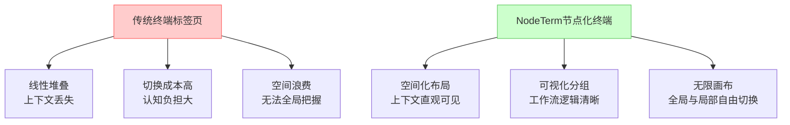
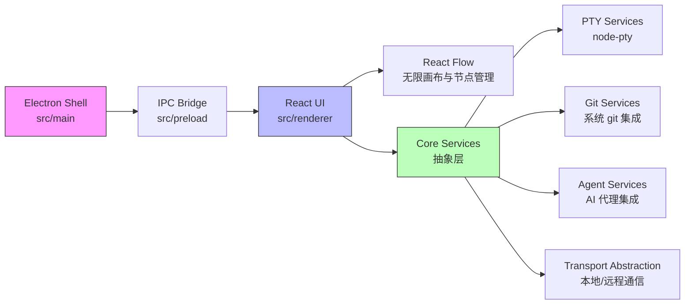

# eneskirca/nodeterm

[GitHub URL](https://github.com/eneskirca/nodeterm)

- **Stars**: 1275
- **Language**: TypeScript

## NodeTerm：无限画布上的节点化终端管理器

> 将传统终端映射到无限画布上，通过空间化布局替代标签页，实现多终端可视化管理。

- **Tags**: 终端模拟器, 可视化, Tmux, AI集成, 开源
- **Category**: 开发工具, 效率工具

## Details

# 🖥️ NodeTerm：你的终端工作流革命者——无限画布上的节点化终端管理器
> **一句话总结**：NodeTerm 是一款将传统终端窗口映射到无限可缩放画布上的开源工具，它通过**空间化布局**替代传统标签页，为多终端管理提供了全新的直观体验，尤其适合需要同时处理多个服务器、项目或复杂开发流程的开发者。
## 🔍 背景与痛点：传统终端的固有缺陷
### 传统终端的“标签页陷阱”
我作为一名开发者，深知传统终端模拟器（如 iTerm2、Windows Terminal）的**根本性设计缺陷**——它们采用**标签页堆叠**的方式组织多个终端窗口。这种设计在同时打开超过5-6个终端时会导致：
- **上下文丢失**：你需要记住“哪个终端在哪个目录运行什么进程”
- **切换成本高**：在标签页之间切换时，大脑需要重新加载上下文
- **空间浪费**：屏幕被分割成小窗口，无法整体把握所有任务的状态
### ADHD友好型解决方案的诞生
NodeTerm 的开发者 Eneş Kirca 正是意识到这些痛点，特别是对于**ADHD（注意力缺陷多动障碍）开发者**来说，传统终端的线性组织方式极大增加了认知负担。NodeTerm 通过**空间化布局**（Spatial Layout）将终端变成可拖拽、分组、标注的节点，让工作流变得**直观和可视化**，就像在真实白板上 organizing sticky notes 一样自然。
## ✨ 核心亮点与功能剖析
### 1. 无限画布上的节点化终端
NodeTerm 的核心创新是将每个终端会话变成一个**可自由拖拽、缩放、分组**的节点。想象一下，你可以在一个无限大的虚拟白板上放置多个终端窗口，它们不会互相重叠，也不会因为标签页太多而被隐藏。你可以：
-   **自由排列**：根据工作流逻辑将相关终端节点放在一起（如前端开发、后端服务、数据库连接）
-   **视觉分组**：用不同颜色、标签或分组框（Group节点）来组织相关任务
-   **全局视图**：通过平移和缩放画布，随时获取所有任务的全局概览

### 2. 会话持久化：tmux 集成
NodeTerm 深度集成了 tmux，这意味着：
-   **会话存活**：即使关闭 NodeTerm 应用或重启电脑，所有终端会话及其中的进程（如npm run dev、python server.py）**保持运行状态**
-   **无缝恢复**：重新打开 NodeTerm 时，所有终端节点会恢复到之前的布局和状态，进程继续运行
-   **真正分离**：只有当你点击节点上的“×”号时，对应的会话才会真正终止，这与传统终端关闭窗口就终止进程有本质区别
> 💡 **实用价值**：我经常在开发时需要同时运行前端开发服务器、后端API、数据库连接、测试脚本等。使用 NodeTerm，我可以将它们组织成一个工作区，下班时直接关闭应用，第二天打开后所有服务仍在运行，无需重新启动，极大提高了效率。
### 3. 多节点类型：不仅是终端
NodeTerm 的强大之处在于它支持多种节点类型，所有节点都可以放置在同一个画布上：
| 节点类型 | 功能描述 | 使用场景 |
| :--- | :--- | :--- |
| **终端节点** | 基于 xterm.js + tmux 的真实终端 | 运行命令、开发服务器、ssh连接 |
| **代理节点** | 预设的 AI 代理 CLI（Claude Code、Codex、Gemini） | AI 辅助编程、代码生成 |
| **聊天节点** | 集成 Claude 的聊天窗口 | 与 AI 交互讨论代码问题 |
| **便签节点** | 可添加文本、颜色、标签的便签 | 记录笔记、TODO、重要信息 |
| **编辑器节点** | Monaco 代码编辑器 | 快速查看/编辑代码文件 |
| **Diff节点** | Monaco 对比编辑器 | 查看代码变更差异 |
| **分组节点** | 将相关节点框在一起 | 按功能/项目组织终端组 |
| **Web/视频节点** | 在画布上嵌入网页或视频 | 查看文档、监控仪表盘 |
### 4. 远程项目与 SSH 支持
NodeTerm 支持通过 SSH 连接到远程服务器，并在**本地画布上管理远程终端**。这意味着：
-   **远程开发体验**：你可以在本地 NodeTerm 中打开远程服务器上的项目，终端、文件、git操作都在远程执行
-   **统一工作流**：无需在本地和远程之间切换，所有工作流都在同一个界面中完成
-   **零配置**：使用 SSH 密钥认证，无需复杂的设置
### 5. 源代码控制集成
NodeTerm 内置了类似 VS Code 的源代码控制功能：
-   **文件级操作**：暂存/取消暂存文件、丢弃更改、切换/创建分支
-   **提交同步**：提交、推送、同步、发布工作树
-   **GitHub 集成**：支持 `gh` CLI 登录，直接与 GitHub 交互
-   **AI 生成提交消息**：可以使用本地 AI 代理根据暂存的 diff 自动生成提交消息
## 🎯 目标人群与收益
### 主要用户群体
NodeTerm 特别适合以下人群：
1.  **全栈开发者**：同时管理前端、后端、数据库、测试等多个服务
2.  **DevOps 工程师**：需要同时监控多个服务器、容器和日志
3.  **AI 开发者**：频繁使用 AI 编程助手（如 Claude Code）需要上下文管理
4.  **数据科学家**：同时运行多个 Jupyter notebooks、数据处理脚本和模型训练任务
5.  **系统管理员**：需要同时管理多个远程服务器和系统监控
6.  **ADHD 开发者**：需要视觉化、空间化的工作流来保持专注
### 核心收益
| 收益维度 | 具体体现 |
| :--- | :--- |
| **效率提升** | 减少30-50%的终端切换时间，工作流更加连贯 |
| **上下文保持** | 所有任务状态一目了然，不再忘记“这个终端在做什么” |
| **空间化思维** | 利用人类强大的空间记忆能力，而非线性记忆 |
| **会话持久化** | 无需担心误关闭终端导致服务中断，工作流无缝恢复 |
| **远程开发体验** | 在本地管理远程服务器，无需多个终端窗口切换 |
## ⚔️ 竞品对比与定位
### 与传统终端模拟器的对比
| 特性 | NodeTerm | iTerm2 / Windows Terminal | tmux |
| :--- | :--- | :--- | :--- |
| **布局方式** | 无限画布节点化 | 标签页堆叠 | 窗格分割 |
| **会话管理** | 可视化节点 + tmux 集成 | 标签页管理 | 会话/窗口管理 |
| **远程开发** | 原生 SSH 项目支持 | 需手动 SSH 连接 | 需手动 SSH 连接 |
| **AI 集成** | 内置 AI 代理节点 | 需手动复制粘贴 | 需手动复制粘贴 |
| **源代码控制** | 内置 VS Code 风格 git 面板 | 无 | 无 |
| **学习曲线** | 中等（需适应节点概念） | 低 | 高 |
### 与其他新型终端工具的对比
-   **vscode-terminal-fusion**: VS Code 内置的终端管理，但受限于编辑器布局，不如 NodeTerm 灵活
-   **hyper**: 基于 Electron 的终端模拟器，但插件生态不如 NodeTerm 深度
-   **warp**: AI 原生终端，但仍是标签页布局，且为闭源付费软件
NodeTerm 的**独特定位**是：**开放源码 + 空间化布局 + 深度 AI 集成 + 远程开发支持**，它试图重新定义终端工作流的本质，而不仅是改进现有终端。
## ⚠️ 局限与不足
### 1. 学习曲线与习惯改变
NodeTerm 的最大障碍是**思维习惯的改变**。从线性标签页到空间化节点需要一定的适应期，特别是对于长期使用传统终端的开发者。初次使用时可能会感到困惑，不知道如何有效组织节点。
### 2. 资源占用
由于基于 Electron 和 React，NodeTerm 的**内存占用相对较高**（约200-300MB），同时运行多个终端节点和代理节点时，可能会对系统资源造成压力。对于配置较低的设备可能会有影响。
### 3. 平台支持限制
目前 NodeTerm 主要支持 **macOS 和 Linux**，Windows 用户无法直接使用。虽然可以通过 WSL（Windows Subsystem for Linux）间接使用，但体验会有所折扣。
### 4. 社区与生态
作为一个相对较新的项目（截至2024年），NodeTerm 的**社区规模和插件生态**尚不如 tmux 或 iTerm2 成熟。虽然核心功能完善，但高级自定义和第三方集成仍在发展中。
### 5. 移动端支持有限
虽然官方正在开发 iOS 伴侣应用，但**移动端支持仍不完善**。这意味着你无法在手机或平板上充分利用 NodeTerm 的功能，这对于需要远程监控的开发者来说是一个遗憾。
## 🏗️ 技术架构解析
### 技术栈
NodeTerm 采用了现代化的技术栈，确保了跨平台能力和用户体验：

### 架构设计亮点
1.  **三层分离架构**：
    -   `src/main`: Electron 主进程，负责应用生命周期和系统集成
    -   `src/preload`: 预加载脚本，作为主进程与渲染进程之间的安全桥梁
    -   `src/renderer`: React 渲染进程，负责所有 UI 和交互
2.  **核心抽象层 (Core Platform Seam)**：
    所有核心服务（PTY、工作区、Git、Agents）都位于 `src/core` 中，**不直接依赖 Electron**，而是通过一个小型平台接口进行交互。这意味着相同的代码可以：
    -   在 Electron 桌面应用中运行
    -   在浏览器 Server Edition 中运行（通过 WebSocket-RPC）
    -   未来可以在其他平台（如移动端）中运行
3.  **传输抽象 (TerminalTransport)**：
    渲染进程不直接与 node-pty 或 IPC 通信，而是通过 `TerminalTransport` 接口。这支持了：
    -   `LocalTransport`: 与本地主机通信
    -   `RemoteTransport`: 通过 SSH 与远程主机通信
    这种设计使得远程项目与本地项目体验完全一致。
4.  **React Flow 作为单一真相源**：
    所有节点状态由 React Flow 管理，项目会将序列化的节点保存到磁盘，而 tmux 负责会话的持久化。这种分离确保了 UI 状态和会话状态的独立性。
## 📦 上手门槛与部署体验
### 安装部署
NodeTerm 提供了多种安装方式，适合不同需求的用户：
1.  **预编译安装包**：
    -   **macOS**: 下载 `.dmg` 文件（支持 Apple Silicon 和 Intel），支持自动更新
    -   **Linux**: 提供自更新的 `AppImage` 或 `.deb` 包（适用于 Debian/Ubuntu）
    
    ```bash
    # Linux (Debian/Ubuntu)
    sudo apt install ./nodeterm-*.deb
    ```
2.  **从源代码构建**：
    适合开发者或希望自定义构建的用户：
    
    ```bash
    # 安装依赖
    npm install
    
    # 开发模式运行（带热重载）
    npm run dev
    
    # 生产构建
    npm run build
    
    # 预览生产构建
    npm start
    
    # 打包分发版本
    npm run dist          # macOS: 生成未签名的 .dmg
    npm run dist:linux    # Linux: 生成 AppImage + .deb
    ```
3.  **Server Edition（浏览器版）**：
    可以在服务器上运行无头版本，通过浏览器访问：
    
    ```bash
    # 开发模式运行服务器
    npm run server:dev
    
    # 然后在浏览器中访问 http://127.0.0.1:8443
    ```
### Docker 部署（建议）
虽然官方未直接提供 Docker 镜像，但基于其架构，我们可以轻松创建 Docker 容器：
```dockerfile
# Dockerfile 示例
FROM node:22-slim
# 安装必要依赖
RUN apt-get update && apt-get install -y \
    tmux \
    git \
    && rm -rf /var/lib/apt/lists/*
# 设置工作目录
WORKDIR /app
# 复制项目文件
COPY . .
# 安装依赖
RUN npm install
# 构建生产版本
RUN npm run build
# 暴露端口
EXPOSE 8443
# 启动服务器
CMD ["npm", "run", "server:prod"]
```
构建并运行：
```bash
# 构建镜像
docker build -t nodeterm-server .
# 运行容器（挂载项目目录和 SSH 密钥）
docker run -d \
  --name nodeterm \
  -p 8443:8443 \
  -v /path/to/projects:/projects \
  -v ~/.ssh:/root/.ssh \
  nodeterm-server
```
### 首次使用配置
1.  **启动应用**：首次启动 NodeTerm 时，会创建一个新的空白画布
2.  **创建终端节点**：按 `⌘T`（macOS）或 `Ctrl+T`（Linux）创建新终端
3.  **连接远程服务器**：在设置中配置 SSH 连接，然后创建远程项目
4.  **组织节点**：拖拽节点到理想位置，使用分组框组织相关节点
5.  **保存项目**：项目会自动保存，重启后恢复
## 🧪 Demo：实际使用流程演示
下面是一个典型的全栈开发工作流演示，展示 NodeTerm 如何提高效率：
### 场景：开发一个 Web 应用

### 具体步骤：
1.  **创建前端开发服务器**：
    -   按 `⌘T` 创建终端节点
    -   运行 `npm run dev` 启动 Vite 开发服务器
    -   将节点拖到画布左侧，标记为“前端”
2.  **创建后端 API 服务器**：
    -   按 `⌘T` 创建另一个终端节点
    -   运行 `npm run start` 启动 Express 服务器
    -   将节点放在前端节点下方，标记为“后端”
3.  **创建数据库连接**：
    -   创建终端节点
    -   运行 `psql -U user -d mydb` 连接 PostgreSQL
    -   放在后端节点旁边，标记为“数据库”
4.  **创建测试终端**：
    -   创建终端节点
    -   运行测试脚本 `npm test -- --watch`
    -   放在右侧，标记为“测试”
5.  **添加 AI 编程助手**：
    -   按 `⌘⇧C` 创建 Claude Code 代理节点
    -   用于代码生成和解释
    -   放在测试节点旁边
6.  **添加便签节点**：
    -   创建便签节点
    -   记录 TODO 列表和重要笔记
    -   链接到 AI 代理节点，提供上下文
7.  **分组组织**：
    -   使用分组框将所有节点框起来
    -   标记为“项目 X 开发工作区”
8.  **保存并关闭**：
    -   直接关闭应用
    -   所有终端中的进程继续运行
9.  **第二天恢复**：
    -   重新打开 NodeTerm
    -   所有终端节点恢复到原位，进程仍在运行
    -   无需重新启动任何服务
## 🤝 社区活跃度与生命力
### 项目状态
-   **更新频率**：项目相对活跃，主要功能持续更新中
-   **问题解决**：开发者响应问题及时，社区讨论活跃
-   **文档质量**：官方文档详尽，涵盖安装、配置、故障排除等各个方面
### 贡献指南
NodeTerm 欢迎社区贡献，特别是以下方面：
-   **问题报告**：在 GitHub Issues 中报告 bug 或提出功能请求
-   **代码贡献**：提交 Pull Request 改进功能或修复问题
-   **文档改进**：完善文档或翻译到其他语言
### 许可证
项目采用 **Business Source License 1.1 (BSL)**，这意味着：
-   可以**自由使用、修改和分发**，包括在生产环境中
-   **不能将其作为竞争产品或服务**提供
-   这是一种源代码可用许可证，鼓励开源协作，同时保护项目的商业可行性
## 🚀 架构扩展与未来展望
### Server Edition 的潜力
NodeTerm 的 Server Edition 尤其值得期待，它允许：
-   **云端开发**：在浏览器中访问远程开发环境，无需本地高配设备
-   **团队协作**：多个开发者可以共享同一个终端画布（未来可能的功能）
-   **移动访问**：通过手机浏览器监控服务器状态
### 移动端伴侣应用
官方正在开发 iOS 伴侣应用，这将允许：
-   **远程监控**：在 iPhone 或 iPad 上查看终端节点状态
-   **推送通知**：接收重要事件（如构建失败、测试通过）的推送通知
-   **轻量级操作**：执行简单的命令或查看日志
### 未来可能的功能
基于当前架构，NodeTerm 未来可能支持：
1.  **插件系统**：允许第三方扩展节点类型和功能
2.  **团队协作**：实时共享和协作编辑终端画布
3.  **云同步**：跨设备同步工作区布局和设置
4.  **更多 AI 集成**：支持更多 AI 编程助手和自定义代理
## 📊 综合评估与行动建议
### 最终评分
| 维度 | 评分（1-5星） | 评价 |
| :--- | :--- | :--- |
| **创新性** | ★★★★★ | 重新定义了终端工作流的空间化方式 |
| **功能性** | ★★★★☆ | 核心功能强大，但部分高级功能仍在开发中 |
| **易用性** | ★★★☆☆ | 需要适应新的思维模式，学习曲线中等 |
| **性能** | ★★★☆☆ | Electron 应用资源占用较高 |
| **稳定性** | ★★★★☆ | 基础功能稳定，但边缘情况可能存在 bug |
| **文档与支持** | ★★★★★ | 官方文档详尽，开发者响应及时 |
| **开放性** | ★★★★☆ | 开源且采用宽松的许可证，鼓励贡献 |
| **适用性** | ★★★★☆ | 对特定用户群体（如多终端开发者）价值极高 |
### 适合人群与不适合人群
**✅ 强烈推荐给**：
-   需要同时管理5个以上终端的开发者
-   频繁切换远程服务器的 DevOps 工程师
-   使用 AI 编程助手的开发者（如 Claude Code 用户）
-   有 ADHD 或需要空间化工作流的开发者
-   macOS 或 Linux 用户
**❌ 可能不适合**：
-   仅偶尔使用终端的开发者（传统终端已足够）
-   Windows 用户（虽然可以通过 WSL 使用，但体验不佳）
-   资源受限的设备（低配置笔记本或老式电脑）
-   喜欢简单、无需改变习惯的开发者
### 行动建议
1.  **立即尝试**：如果你符合目标用户画像，强烈建议下载试用（支持 macOS 和 Linux）
2.  **从简单场景开始**：先用一个项目尝试，不要试图一次性迁移所有工作流
3.  **探索节点组织**：花时间学习如何有效组织节点，这是掌握 NodeTerm 的关键
4.  **参与社区**：在 GitHub 上关注项目，参与讨论，甚至贡献代码
5.  **期待移动端**：如果你经常需要远程监控，可以等待移动端伴侣应用发布
### 结语
NodeTerm 不仅是一个终端模拟器，更是一种**新的思维方式和工作流哲学**。它通过空间化布局挑战了传统终端的线性设计，为需要同时处理多个复杂任务的开发者提供了**更直观、更高效、更符合人类认知习惯**的解决方案。
虽然它还存在学习曲线、资源占用等不足，但其**创新的核心理念**和**强大的实现能力**使其成为终端工作流领域的一次重要突破。如果你厌倦了在多个标签页之间切换，经常忘记哪个终端在做什么任务，那么 NodeTerm 值得你花时间学习和适应——它可能会彻底改变你的开发工作流。
> **最终建议**：NodeTerm 是一款“**高风险、高回报**”的工具。它需要你改变长期习惯，但一旦适应，将带来显著的效率提升。如果你是愿意尝试新工具、不害怕改变习惯的开发者，那么 NodeTerm 无疑是目前最值得尝试的终端创新之一。
