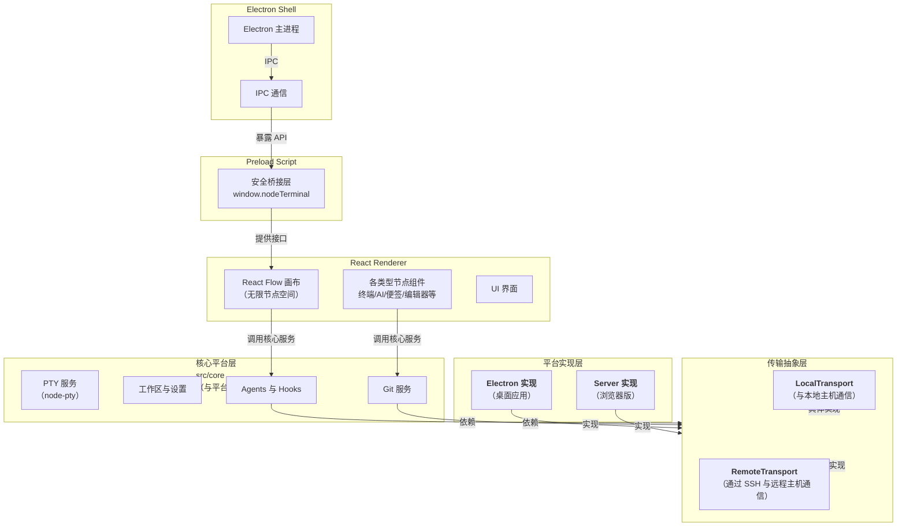

# eneskirca/nodeterm

[GitHub URL](https://github.com/eneskirca/nodeterm)

- **Stars**: 1166
- **Language**: TypeScript

## NodeTerm：基于无限画布的智能终端工作台

> 一款将终端变为可视化节点的无限画布工具，专为ADHD开发者设计，集成了AI、会话持久化与远程开发能力。

- **Tags**: Terminal, Developer Tools, AI Agent, Infinite Canvas, Productivity
- **Category**: 开发工具, AI 编程

## Details

# NodeTerm：为 ADHD 开发者设计的无限画布终端管理器
> **一句话总结**：NodeTerm 是一款基于**无限画布**的终端管理器，将多个终端作为可拖拽的节点置于同一个画布上，专为 ADHD 开发者及分散工作流设计，通过**空间布局**而非隐藏标签页的方式，帮助用户保持上下文连贯性和思维模型完整性。
## 🌌 背景与痛点：当传统终端成为开发效率的瓶颈
在软件开发中，**终端窗口**是开发者与系统交互的核心界面。然而，传统终端模拟器（如 iTerm2、Terminal.app、GNOME Terminal）的设计模式存在一个根本性缺陷：**基于标签页的堆叠管理方式**。
这种设计带来了几个难以避免的痛点：
-   **上下文丢失**：当多个终端任务并行时，频繁切换标签页会导致开发者难以快速定位和记忆每个终端的状态与用途，特别是对于**ADHD（注意缺陷多动障碍）开发者**或工作流分散的用户而言，这种“隐藏”状态会严重破坏思维的连贯性。
-   **会话脆弱**：关闭标签页意味着结束会话。若不使用额外的工具（如 `tmux` 或 `screen`），**运行中的进程（如开发服务器、构建任务）会随终端关闭而终止**，需要重新启动和配置，打断心流。
-   **视觉混乱与单一焦点**：传统终端一次只能聚焦一个窗口，无法满足需要同时监控多个服务输出（如前端、后端、数据库）的场景。开发者必须不断在窗口间切换，**认知负荷高**。
-   **远程管理不便**：通过 SSH 管理远程服务器时，本地终端与远程终端体验割裂，且**远程终端的会话持久性更难保障**。
NodeTerm 的诞生正是为了**颠覆这种“隐藏”模式**。它将终端带入了一个**无限画布**的空间，让每一个终端、每一个会话都成为一个**看得见、摸得着的实体**，从而从根本上解决了上下文管理和会话持久化的难题。
## ✨ 核心亮点与功能剖析：重新定义终端体验
NodeTerm 的核心创新在于其独特的**空间交互范式**和**强大的功能集成**。它不仅仅是一个终端复用工具，更是一个**集成了开发环境、AI 助手、版本控制和协作能力的现代化开发工作台**。
### 1. 无限画布与节点化终端（Infinite Canvas & Node-Based Terminals）
这是 NodeTerm 最具颠覆性的功能。它使用 `React Flow` 技术构建了一个**无限画布**，每个终端实例都被视为一个独立的“**节点**”（Node）。
-   **自由布局与组织**：你可以像在思维导图中一样，**拖拽、缩放、排列**这些终端节点。将相关的终端（如一个项目的后端、前端、数据库终端）**物理地放在一起**，并使用“**组**”（Group）节点将它们框选起来，形成一个视觉上和逻辑上紧密的“工作区”。这种**空间化组织**方式与人类大脑的**空间记忆**高度契合，能极大降低认知负担。
-   **标签与自定义**：每个终端节点都可以**点击重命名**，并设置**颜色标签**和**自定义标签**，方便快速识别和分类。AI 甚至可以**根据输出内容自动命名**你的终端，进一步节省脑力。

### 2. 会话持久化与 tmux 集成（Session Persistence）
NodeTerm 通过集成 `tmux` 实现了**真正意义上的会话持久化**。
-   **穿越重启的会话**：即使你**关闭整个 NodeTerm 应用甚至重启电脑**，所有终端节点中的**运行中进程（如 `npm run dev`、`python manage.py runserver`）都会保持存活**。下次打开时，所有节点状态和进程输出会**完美恢复**，就像从未离开过一样。点击节点上的“×”才是真正结束会话的操作。
-   **项目/标签页管理**：每个项目（如“电商项目”、“博客系统”）都有自己的独立画布和初始工作目录。你可以在不同项目之间切换，而不会丢失任何其他项目中正在运行的终端任务，实现了**真正的多任务并行开发**。
### 3. 超越终端的多元节点生态（Multi-Node Ecosystem）
NodeTerm 的强大之处在于它超越了“终端”的范畴，构建了一个**丰富的节点生态系统**，所有这些节点都可以共存于同一个画布上。
| 节点类型 | 核心功能 | 典型使用场景 |
| :--- | :--- | :--- |
| **🖥 终端节点** | 基于 `xterm.js` + `tmux` 的全功能终端 | 运行任何命令、开发服务器、数据库操作 |
| **🤖 Agent 节点** | 预设命令，一键启动 AI 编程助手（如 Claude Code, Codex, Gemini） | 让 AI 帮你编写、解释、调试代码 |
| **💬 Chat 节点** | 集成 Claude SDK 的聊天界面，支持流式输出、图片粘贴、权限提示 | 与 AI 进行对话，获取技术解答或创意灵感 |
| **📝 便签节点** | 自由文本笔记，可着色，可链接至 Agent 节点提供上下文 | 记录想法、API 端点、待办事项，并直接喂给 AI |
| **🗂 组节点** | 将相关节点框选在一起，作为整体移动和操作 | 组织一个微服务的所有组件（终端、便签、编辑器） |
| **✏️ 编辑器节点** | 基于 Monaco 编辑器（VS Code 同款）的代码编辑器 | 快速查看和编辑配置文件、Markdown 文档 |
| **🔀 差异节点** | Monaco 差异编辑器，显示 git 暂存/未暂存的更改 | 可视化审查代码变更，决定提交内容 |
| **🌐 网页/视频节点** | 在画布上渲染网页或视频 | 监控仪表盘（如 Grafana）、观看教程视频 |
> 💡 **场景演示**：你可以创建一个组节点，里面放入一个后端终端、一个前端终端、一个编辑器节点（编辑 `README.md`）、一个便签节点（记录 API 地址）、一个 Chat 节点（与 AI 讨论架构）和一个差异节点（查看待提交代码）。**整个开发环境一目了然**。
### 4. 智能代理集成与协作（AI Agent Integration）
NodeTerm 深度集成了 AI 能力，并将其无缝编织进开发工作流。
-   **内置 Agent 节点**：提供 **Claude Code, Codex, Gemini** 等热门 AI 编程助手的预设节点，点击即可启动对应的 CLI 工具。
-   **上下文链接（Context Links）**：这是 NodeTerm 的一个**杀手级特性**。你可以让两个不同的 Agent 节点（例如一个 Claude Code 和一个自定义 Agent）**互相读取对方的对话历史**，从而实现更复杂的多步自动化任务或协同编程。
-   **实时状态感知**：对于内置的四种 Agent，NodeTerm 通过**钩子（Hooks）** 机制实现了**实时状态监控**。节点上会显示“**运行中**”或“**需要你**”的徽章，并能看到子代理的卡片和实时输出。**无需屏幕抓取，稳定可靠**。
### 5. 远程工作与源控制集成（Remote Work & Source Control）
NodeTerm 是一个**面向现代分布式开发工具**。
-   **远程项目（SSH）**：你可以通过 SSH 在远程主机上打开一个项目。远程主机上的终端、文件操作、Git 命令都会在远程执行，但画布和操作界面是本地的。**远程开发体验与本地几乎无缝一致**。
-   **强大的源控制面板**：内置了类似 VS Code 的**Git 面板**，支持文件级的暂存/取消暂存、丢弃更改、切换/创建分支、提交、推送/同步、发布、工作树（Worktrees）等操作，并集成了 `gh` 命令行工具进行 GitHub 登录。所有操作都通过系统 `git` 命令完成，确保兼容性。
-   **AI 驱动的智能提交信息**：可以配置一个本地的 Agent CLI（如 `claude` 或 `codex`），让它**仅读取暂存的差异**，然后**自动生成规范且准确的提交信息**，节省写提交信息的时间并提高规范性。
### 6. 浏览器版与无头通知服务（Server Edition & Headless Notifications）
NodeTerm 的架构设计使其核心能力能够以多种形式呈现。
-   **服务器版（Server Edition）**：核心服务可以**以无头（headless）模式运行在 Linux 或 macOS 主机上**，并通过浏览器从任何地方访问。这意味着你的终端、编辑器、源控制、Agents 都可以**运行在一台性能强大的服务器上**，而你的客户端（笔记本、平板）只需一个浏览器即可连接，体验与桌面应用完全一致。它提供单用户认证（密码+安全 cookie）和 WebSocket 桥接。
-   **无头通知服务**：这是非常创新的一个功能。你可以将 NodeTerm 作为一个**systemd 服务安装在任何你通过 SSH 访问的 Linux 服务器上**。它会在后台静默运行，**监听本地 Agent 的状态**。当 Agent 进入“运行中”或“需要你”的状态时，它会通过 HTTPS 向你的手机推送**实时通知和动态活动（Live Activity）**，**而无需服务器暴露任何开放端口**（通知服务只监听本地 loopback）。推送权限通过你在手机上通过 SSH 授予的临时令牌进行管理，安全性极高。这让你可以**放心地让长时间运行的 AI 任务在远程服务器上继续，而手机会在需要你干预时及时通知你**。
## 🎯 目标人群与收益：谁最需要 NodeTerm？
### 🎯 核心目标用户
1.  **ADHD 开发者与注意力分散者**：这是 NodeTerm **最核心和最契合的受众**。无限画布和空间布局模式能极大缓解因多任务切换带来的注意力碎片化和焦虑感，**让混乱的工作流变得有序、可控且可视化**。
2.  **多项目并行开发者**：同时负责多个项目或微服务模块的开发者，NodeTerm 的项目隔离和会话持久化功能能让他们在不同任务间无缝切换，**保持所有服务持续运行**。
3.  **远程/云原生开发者**：经常需要通过 SSH 管理远程服务器、在云端进行开发、或需要随时监控远程服务状态的开发者。NodeTerm 的远程项目和浏览器版完美契合此场景。
4.  **AI 辅助编程的深度用户**：热衷于使用 AI 工具（Claude, Codex, Gemini 等）进行代码生成、解释、调试、重构的开发者。NodeTerm 为 AI 工具提供了**原生、集成且可视化**的交互界面和上下文管理能力。
5.  **追求极致开发效率与体验的极客**：喜欢折腾工具、追求极致工作流优化、希望在一个界面中完成尽可能多工作的开发者。
### 💸 带来的具体收益
| 痛点 | NodeTerm 的收益 |
| :--- | :--- |
| **终端切换频繁，丢失上下文** | **空间布局**让所有终端同时可见，**一目了然**，极大减少切换成本和记忆负担。 |
| **关闭终端后进程终止，需重启** | **tmux 会话持久化**，**重启应用后进程依旧运行**，保持开发状态连续。 |
| **同时监控多个服务输出困难** | **多节点同屏**，可将相关服务终端组织在一起，**实现全景监控**。 |
| **AI 对话上下文分散，难以管理** | **Chat 节点 + 上下文链接**，**集中管理 AI 对话**，并能让不同 Agent 互相共享上下文。 |
| **远程开发体验割裂，管理麻烦** | **远程项目 + 浏览器版**，**统一本地和远程操作体验**，随时随地接入开发环境。 |
| **提交信息写起来费时且不规范** | **AI 生成提交信息**，**节省时间并保证规范**。 |
## ⚔️ 竞品/同类对比：NodeTerm 在生态中的位置
为了更清晰地理解 NodeTerm 的独特竞争力，我们将其与一些相关工具进行对比。
| 特性维度 | NodeTerm | 传统终端 (iTerm2/Terminal.app) | 终端复用器 (tmux/screen) | VS Code 集成终端 | 其他可视化终端 (e.g., Hyper, Warp) |
| :--- | :--- | :--- | :--- | :--- | :--- |
| **核心范式** | **无限画布 + 节点化** | 标签页堆叠 | 会话/窗口分割 | 集成于编辑器 | 标签页/面板（通常） |
| **会话持久化** | ✅ **原生集成 (tmux)**，应用重启后进程存活 | ❌ 关闭即结束 | ✅ 强项，但需学习复杂命令 | ⚠️ 依赖设置，非原生 | ⚠️ 通常无 |
| **多任务可视化** | ✅ **全局空间布局**，所有任务同屏可见 | ❌ 隐藏在标签页中 | ⚠️ 可分割窗口，但认知负荷高 | ⚠️ 与编辑器内容分立 | ⚠️ 通常为面板 |
| **AI 集成** | ✅ **深度原生集成**，Agent 节点、上下文链接、状态感知 | ❌ 无 | ❌ 无 | ⚠️ 通过扩展，非原生 | ⚠️ 通常无或较弱 |
| **远程开发** | ✅ **原生支持 SSH 远程项目**，体验统一 | ⚠️ 通过 SSH 命令，体验割裂 | ✅ 强项，但需手动配置 | ⚠️ 通过 SSH 扩展，体验不一 | ⚠️ 通常无 |
| **源控制集成** | ✅ **强大内置 Git 面板**，AI 生成提交信息 | ❌ 无 | ❌ 无 | ✅ **内置且强大** | ❌ 无 |
| **生态与扩展性** | 🔄 **新兴项目**，生态正在构建 | ✅ **极其成熟**，插件丰富 | ✅ **极其成熟**，脚本丰富 | ✅ **极其成熟**，插件市场庞大 | 🔄 有一定插件生态 |
| **学习曲线** | 🔄 **需适应画布操作**，但概念直观 | ✅ **极低**，所见即所得 | 📈 **较高**，需记住大量命令 | ✅ **低**，VS Code 用户熟悉 | ✅ **低**，类似传统终端 |
**🎯 核心竞争力定位**：NodeTerm 并非要取代传统终端、tmux 或 VS Code，而是要**提供一个融合了它们精华的、面向未来和 AI 时代的全新开发环境范式**。它的独特优势在于**空间化交互**、**AI 的原生集成**以及**对远程开发和会话持久化的无缝支持**。它最适合作为**“主开发工作台”**，尤其吸引那些对工具创新有高要求、对工作流有独特见解的开发者。
## ⚠️ 局限与不足：客观看待其成长性
作为一款仍在快速演进中的创新产品，NodeTerm 目前也存在一些局限和不足：
1.  **平台支持**：目前主要支持 **macOS 和 Linux**。**Windows 用户无法直接使用**，这无疑会限制其用户群体。不过，鉴于其技术栈（Electron, React Flow），未来跨平台并非不可想象，但需作者投入资源。
2.  **学习曲线**：对于习惯了传统标签页式终端的用户，**初次接触 NodeTerm 的“无限画布”概念可能需要一个适应过程**。虽然操作直观（拖拽、缩放），但构建高效的个人工作流布局需要一些时间探索。
3.  **资源占用**：作为一个基于 Electron 的桌面应用，NodeTerm **对系统资源的占用（内存和CPU）通常会比原生终端模拟器（如 iTerm2）要高一些**。这对于配置较低的设备可能是一个考量因素。
4.  **生态与稳定性**：相较于已有几十年历史的 tmux 或 VS Code，NodeTerm 的**社区生态（插件、主题、脚本）和稳定性仍处于早期阶段**。虽然项目更新活跃，但遇到 Bug 或需要特定功能时，可能无法像成熟工具那样找到现成的解决方案。
5.  **macOS 签名问题**：目前 macOS 版本的构建尚未进行代码签名和公证，**首次打开时 Gatekeeper 会发出警告**。用户需要通过右键点击 → “打开”来绕过一次。这对于普通用户来说可能是一个额外的操作步骤和认知负担。
6.  **浏览器版功能限制**：目前浏览器版 Server Edition 中，**SDK Chat 节点仍仅限桌面应用**。这意味着在浏览器中无法获得完整的 Claude 聊天体验。
## 🚀 上手体验：部署与使用指南
### 📦 安装与启动
NodeTerm 提供了多种安装方式，覆盖了不同需求。
1.  **预构建安装包（推荐）**：
    *   访问 [nodeterm.dev](https://nodeterm.dev) 下载页面，它会自动检测你的平台并提供相应的安装包。
    *   **macOS**：下载 `.dmg` 文件（支持 Apple Silicon 和 Intel）。由于未签名，首次打开需**右键点击应用 → 选择“打开”** 来绕过 Gatekeeper 警告。
    *   **Linux (x64)**：可选择下载 **自更新的 AppImage** 或 `.deb` 包（适用于 Debian/Ubuntu 系列）。`.deb` 包可通过 `sudo apt install ./nodeterm-*.deb` 安装。
2.  **从源码构建**：
    NodeTerm 的开源项目允许你从源码构建，这适合想要定制或体验最新功能的开发者。
    ```bash
    # 克隆仓库
    git clone https://github.com/eneskirca/nodeterm.git
    cd nodeterm
    # 安装依赖（会自动根据 Electron 的 ABI 重新构建 node-pty）
    npm install
    # 开发模式运行（支持渲染器热更新）
    npm run dev
    # 生产构建
    npm run build
    # 预览生产构建
    npm start
    # 类型检查
    npm run typecheck
    # 运行测试
    npm test
    # 打包为本地 dmg (macOS) 或 AppImage/.deb (Linux)
    npm run dist
    npm run dist:linux
    ```
    *注意：构建需要 Node.js 20+，并推荐系统安装 tmux 以获得最佳的会话持久化体验。*
3.  **运行浏览器版 Server Edition**：
    如果想在服务器上运行并通过浏览器访问：
    ```bash
    # 在服务器上运行
    npm run server:dev
    # 然后在浏览器中打开 http://127.0.0.1:8443 并设置密码
    ```
### 🎯 基础使用工作流
1.  **创建第一个终端节点**：启动 NodeTerm 后，你可以使用快捷键 `⌘T`（macOS）或 `Ctrl+T`（Linux）创建新的终端节点，或者通过右键菜单选择“New Terminal”。
2.  **布局与组织**：
    *   **拖拽**终端节点到你想要的位置。
    *   使用鼠标滚轮或触控板**缩放**画布。
    *   右键点击画布，选择“**Group**”来创建一个组节点，然后将相关的终端节点**拖拽进组框**中。
3.  **命名与标签**：**双击终端节点**的标题栏可以重命名它。右键点击终端节点可以为其设置**颜色标签**和**自定义标签**。
4.  **体验会话持久化**：在一个终端中启动一个长期运行的进程，如 `npm run dev`。**完全关闭 NodeTerm 应用**。然后重新打开 NodeTerm，你会发现那个终端节点和 `npm run dev` 的进程都在**继续运行**，输出也一直在累积。
5.  **探索其他节点**：通过右键菜单或命令面板（`⌘K`）尝试创建不同类型的节点，如 Agent 节点、便签节点、编辑器节点等，体验它们的协同工作。
<details>
<summary><strong>🔧 高阶技巧：配置 AI 提交信息生成</strong></summary>
1.  确保你已安装并配置好你选择的 AI CLI 工具（如 `claude` 或 `codex`），并能在终端中正常运行。
2.  在 NodeTerm 的设置中（`⌘,`），找到 **AI Commit Message** 配置部分。
3.  输入你用来运行只读 AI 查询的命令，例如 `claude "Please generate a concise git commit message for this diff: {diff}"`。
4.  现在，当你有暂存的更改时，在 Git 面板中点击“**AI Generate Message**”按钮，NodeTerm 就会调用你配置的命令，将暂存的差异传递给 AI，并将生成的信息填入提交信息框。
</details>
## 🌟 架构与技术栈解析：为创新奠基
NodeTerm 的强大功能背后是一个精巧而现代化的技术架构。

其架构设计的核心思想是**分层与抽象**，从而实现了核心代码的**高度复用**和**多平台支持**。
-   **Electron, 三个上下文**：NodeTerm 采用经典的 Electron 架构，包含 `src/main`（Electron 主进程）、`src/preload`（预加载脚本，唯一的桥接层，通过 `window.nodeTerminal` 暴露受限的 API）和 `src/renderer`（React UI 渲染进程）。`src/shared` 则存放三者共享的类型定义和 IPC 通道名称。
-   **`CorePlatform` 接口**：这是架构的精妙之处。**所有核心服务**（PTY、工作区/设置、Git、Agents、Hooks）都位于 `src/core` 中，并实现一个**微小的平台接口**。这些核心服务**从不直接导入 Electron**。Electron 只是这个平台接口的**一种实现**。而**浏览器 Server Edition（`src/server`）** 则是另一种实现，它通过 WebSocket-RPC 桥接（`src/renderer/bridge` 在浏览器中填充 `window.nodeTerminal`）来启动**完全相同的核心服务**。这种设计实现了 **“一套代码，一个渲染器，多种壳”** 的目标。
-   **`TerminalTransport` 抽象**：渲染进程只依赖这个传输接口，从不直接与 IPC 或 `node-pty` 交互。`LocalTransport` 与本地主机通信，`RemoteTransport` 则通过 SSH 与远程主机上的 Agent 通信。这使得**远程项目能够无需修改 UI 代码即无缝集成**。
-   **React Flow 作为单一真相源**：React Flow 是画布和节点的**单一真相源**。项目将序列化的节点状态持久化到磁盘，而 tmux 则负责在应用重启后保持会话存活。
这种架构设计使得 NodeTerm 具备了**极强的扩展性和适应性**，未来新增平台（如移动端）或功能时，只需实现相应的平台接口即可，核心逻辑无需变动。
## 📜 社区、生态与许可
-   **开源协议**：NodeTerm 使用 **Business Source License 1.1 (BSL)**。这意味着你可以**自由使用、修改和再分发**它，甚至用于生产环境。**唯一的限制**是**不能将其作为竞争性的产品或服务进行提供**。这保护了项目作者的权益，同时鼓励社区贡献和非商业用途的自由探索。
-   **社区与支持**：
    *   项目在 GitHub 上开源，欢迎提交 Issue 和 Pull Request。
    *   提供官方支持渠道：[nodeterm.dev/support](https://nodeterm.dev/support) 和 [support@nodeterm.dev](mailto:support@nodeterm.dev)。
    *   **官方文档**：[nodeterm.dev/docs](https://nodeterm.dev/docs) 是学习使用的最佳起点，涵盖了入门、概念、Agents、远程访问和故障排除。
## 🎯 结语与行动建议：拥抱开发环境的未来
NodeTerm 远不止是一个“好用的终端”，它代表了一种**面向未来开发工作流的全新思考方式**。它通过**空间化交互**、**AI 的原生集成**和**对现代开发需求（远程、协作、持久化）的深刻理解**，为开发者打造了一个更直观、更强大、更高效的工作环境。
### 🧭 终极评判
| 维度 | 评分 | 评价 |
| :--- | :--- | :--- |
| **创新性** | ★★★★★ | 独创的无限画布节点范式，极具前瞻性。 |
| **实用性** | ★★★★☆ | 对 ADHD 和多任务开发者价值巨大，但生态仍需成长。 |
| **易用性** | ★★★★☆ | 概念直观，但需适应新交互模式，Windows 无缘。 |
| **功能完整性** | ★★★★☆ | 功能极其丰富且集成度高，浏览器版略有功能缺失。 |
| **性能与稳定性** | ★★★☆☆ | Electron 资源占用较高，作为新兴项目稳定性待加强。 |
| **社区与生态** | ★★★☆☆ | 项目活跃但社区较小，插件生态尚在萌芽。 |
**👉 行动建议**：
-   **如果你是 macOS/Linux 用户，且经常感到传统终端管理混乱**：**强烈建议你立即下载并尝试 NodeTerm**。给它一个下午的时间，按照官方文档探索其各种节点类型和布局可能性，你很可能会发现一个能显著提升效率和幸福感的新世界。
-   **如果你是重度 AI 编程助手用户**：NodeTerm 为你提供了**无与伦比的集成体验**。将 Agent 节点、便签节点和终端节点组合起来，构建你自己的 AI 辅助编程流水线，你会发现效率提升不止一点点。
-   **如果你是远程开发者或运维工程师**：不要错过 NodeTerm 的**远程项目和服务器版**。它们能让你摆脱本地和远程之间的割裂感，实现真正的“开发体验随处可达”。
-   **如果你是 Windows 用户**：目前只能**关注项目发展**，期待未来跨平台版本的发布。或者，你可以在 WSL2 中尝试运行 Linux 版本。
-   **如果你是工具开发者或极客**：NodeTerm 的**架构和开源代码**本身就是一个值得学习的研究对象。你可以研究其 `CorePlatform` 接口的设计，甚至考虑为它贡献插件或功能。
NodeTerm 目前仍处于快速迭代阶段，但它的核心思想和实现已经足够惊艳和实用。它或许不会立即取代你现有的所有工具，但它**极有可能成为你开发工具箱中那个最独特、最强大、也最让你爱不释手的“秘密武器”**。拥抱变化，尝试 NodeTerm，让你的开发环境从“堆叠”走向“空间”，从“隐藏”走向“可见”。
