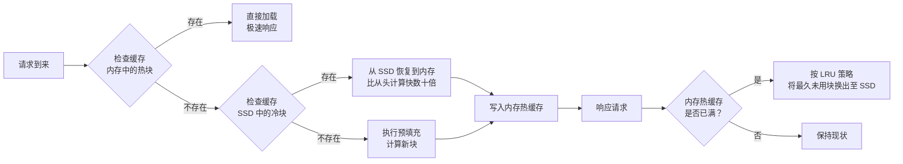
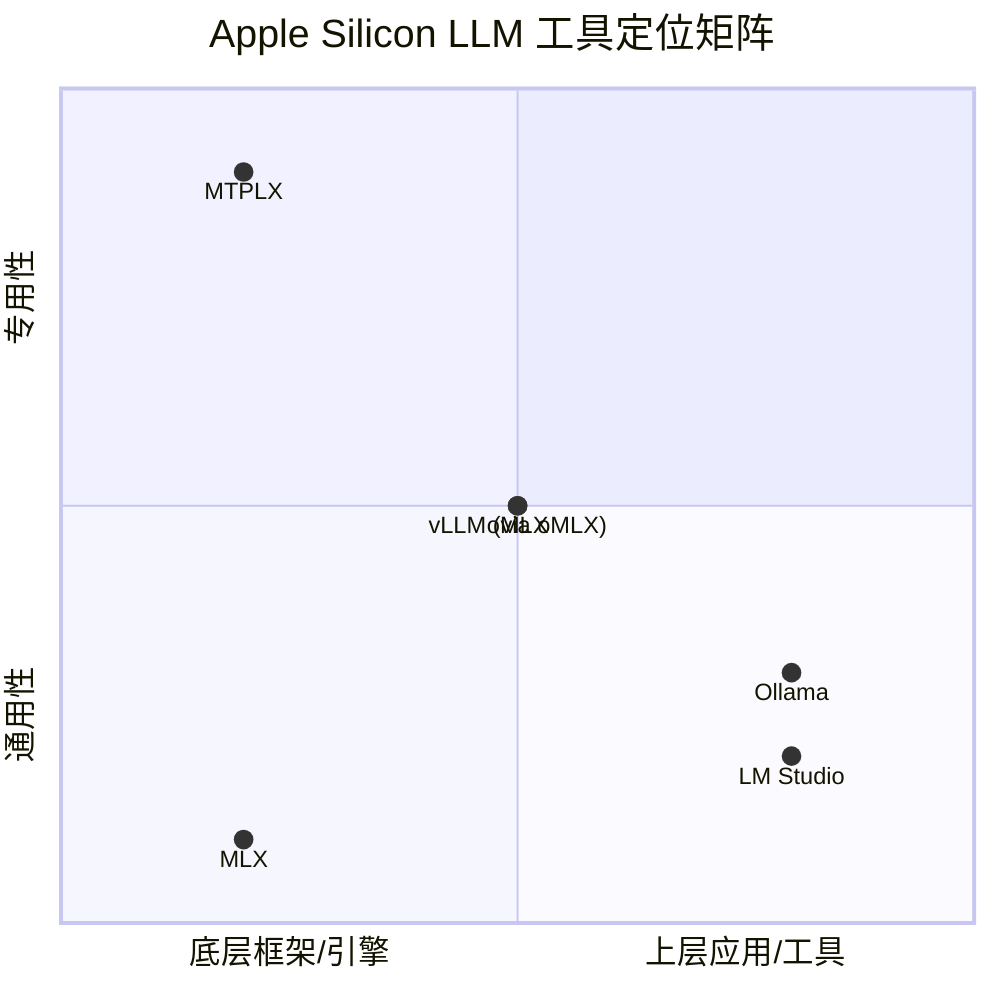

# jundot/omlx

[GitHub URL](https://github.com/jundot/omlx)

- **Stars**: 20679
- **Language**: Python

## oMLX：Mac 本地 AI 推理的终极引擎

> 专为 Apple Silicon 设计的本地 LLM 推理服务器，通过菜单栏管理、SSD 缓存和连续批处理提供极致流畅的本地 AI 体验。

- **Tags**: macOS, 本地大模型, MLX, 性能优化, Apple Silicon
- **Category**: 开发工具, 人工智能, 系统优化

## Details

# oMLX：让 Mac 成为本地 AI 的终极引擎
> 一句话总结：**oMLX 是专为 Apple Silicon 打造的本地 LLM 推理服务器，通过菜单栏管理、智能 SSD 缓存和连续批处理，让本地 AI 体验达到前所未有的流畅和高效。**
---
## 1. 背景与痛点：为什么需要 oMLX？
在 oMLX 出现之前，Apple Silicon 用户运行本地 LLM 面临着诸多挑战：
- **性能与便利的悖论**：现有服务器要么简单但功能受限，要么强大但配置复杂，难以兼顾易用性和性能。
- **内存压力与系统稳定性**：加载大型模型容易导致系统崩溃（OOM），需要精细的内存管理。
- **上下文切换效率低下**：编码代理（如 Claude Code）会频繁使 KV 缓存失效，导致相同前缀被重复计算，浪费算力。
- **模型管理混乱**：多模型加载/卸载、内存限制、自动淘汰等操作缺乏统一且直观的管理界面。
oMLX 的诞生正是为了解决这些核心痛点，它将**专业级推理性能**与**macOS 原生体验**完美结合。
## 2. 核心亮点与功能剖析
### 🔥 2.1 分层 KV 缓存（Hot + Cold Tiered Caching）
这是 oMLX 最具颠覆性的技术，其灵感来自 vLLM 的块管理机制，但针对 Mac 的硬件特性进行了极致优化。

**技术原理与价值**：
- **热缓存（RAM）**：高频访问的块常驻内存，提供毫秒级访问速度。
- **冷缓存（SSD）**：当内存热缓存满时，最久未用的块被换出至 SSD（以 safetensors 格式持久化）。当下次请求匹配到此前缀时，这些块**直接从 SSD 恢复到内存**，而不是从头重新计算。
- **跨会话持久化**：即使在服务器重启后，之前缓存的内容仍然可用，真正实现了“一次计算，多次复用”。
**带来的收益**：对于需要频繁切换上下文、回溯历史的工具（如编码代理、聊天机器人），其性能提升是**数量级**的。在博客实测中，Claude Code、OpenClaw 等工具的响应时间从90秒缩短至5秒。
### ⚡ 2.2 连续批处理（Continuous Batching）
oMLX 基于 mlx-lm 的 `BatchGenerator` 实现了高效的连续批处理。
- **问题**：传统的静态批处理效率低下，因为不同请求的完成时间不同，导致 GPU 等待。
- **解决方案**：连续批处理**动态地**将已完成请求的 token 立即分配给新请求，显著提升了 GPU 利用率和整体吞吐量。
**适用场景**：多用户并发、Agent 工具调用、API 服务等任何需要同时处理多个请求的场景。
### 🖥️ 2.3 原生 macOS 菜单栏应用与 Web 管理界面
oMLX 的开发者体验（DX）堪称典范。
- **菜单栏应用**：提供 `.dmg` 安装包，安装后可在顶部菜单栏直接控制服务器（启动/停止）、查看状态、管理模型。
- **强大的 Admin Dashboard**：内置一个功能完备的 Web UI（`http://localhost:8000/admin`），支持：
    - 📊 **实时监控**：查看内存使用、吞吐量、缓存命中率。
    - 🗂️ **模型管理**：从 HuggingFace 搜索并下载模型，一键加载/卸载，固定常用模型，设置模型别名、TTL（空闲超时自动卸载）。
    - 🎨 **配置档（Profiles）**：保存命名参数集（如不同采样策略），并可作为“虚拟模型”暴露给 API（如 `qwen3-8b:thinking`），无需额外内存。
    - 💬 **内置聊天界面**：直接与任何已加载的模型聊天，支持历史记录、图片上传（VLM/OCR）、暗黑模式。
    - 🧪 **性能基准测试**：一键测量模型的预填充（Prefill）和文本生成（Text Generation）速度。
### 🚀 2.4 多模型支持与集成生态
oMLX 是一个**统一的推理引擎**，而不仅仅是 LLM 服务器。
| 模型类型 | 支持情况 | 特点 |
| :--- | :--- | :--- |
| **文本 LLM** | ✅ 完全支持 | 核心功能，享受所有优化 |
| **视觉-语言模型（VLM）** | ✅ 完全支持 | 多图聊天、Base64/URL/文件图片输入、工具调用 |
| **OCR 模型** | ✅ 自动检测优化 | 识别 DeepSeek-OCR, DOTS-OCR, GLM-OCR |
| **嵌入模型（Embedding）** | ✅ 支持 | 用于语义搜索、RAG |
| **重排序模型（Reranker）** | ✅ 支持 | 提升检索相关性 |
**一键集成**：在 Admin Dashboard 中，可以轻松配置与 **OpenClaw, OpenCode, Codex, Hermes Agent, Cursor** 等工具的集成，无需手动编辑配置文件。
### 🌐 2.5 实验性多 Mac 联合推理
这是 oMLX 的一个极具前瞻性的功能，允许**将一个大型语言模型分片到多台内存 unequal 的 Mac 上**，通过 MLX pipeline ranks、Thunderbolt 或网络（RDMA/JACCL）进行协同推理。
- **价值**：突破了单台 Mac 内存上限，让你在 Mac 上能运行**超大模型**（如 122B 参数的 Qwen3.5-A10B-4bit）。
- **管理**：提供 Cluster Dashboard 处理对等发现、分片规划、负载均衡、性能调优等。
- **状态**：目前为实验性功能，需要从源码编译，但对拥有多台 Mac 的用户来说是“梦想成真”。
## 3. 目标人群与收益
| 用户类型 | 痛点 | oMLX 带来的收益 |
| :--- | :--- | :--- |
| **AI 开发者/研究员** | 本地调试模型、评估性能、快速迭代 | 极速推理、灵活配置、多模型统一管理、一键性能测试 |
| **编码工程师（使用 Agent）** | Claude Code, Cursor 等本地运行时速度慢、易卡顿 | 响应时间从90秒→5秒，流畅的编码体验 |
| **内容创作者/写作者** | 本地 AI 写作、翻译、摘要，依赖稳定、流畅的输出 | 持久化缓存保证长文本处理效率，菜单栏管理随时可用 |
| **隐私敏感用户** | 数据不能离线，需要完全本地化的 AI | 100% 本地运行，数据不离 Mac，完全掌控 |
| **技术爱好者/Mac 用户** | 想充分利用 Apple Silicon 的算力，体验最新技术 | 挖掘 Mac 潜能，享受极客乐趣，项目本身有 20k+ Star |
## 4. 竞品对比与定位
为了明确 oMLX 的独特价值，有必要将它与 Apple Silicon 生态中的其他工具进行对比。

### 核心区别
| 工具 | 定位 | 核心特点 | 与 oMLX 的关系 |
| :--- | :--- | :--- | :--- |
| **MLX** | **底层机器学习框架** | 苹果官方推出的高效张量计算和神经网路库，是 Apple Silicon 上的“PyTorch” | oMLX 的底层引擎 |
| **MTPLX** | **高性能推理引擎** | 专注于极致推理速度，优化核心计算内核，对特定模型有巨大速度提升 | 可与 oMLX 集成（作为后端），提供另一种速度选项 |
| **oMLX** | **生产级推理服务器** | 提供**功能完备**、**易用**、**稳定**的推理服务，专注于**管理、缓存、集成**和**开发者体验** | 可选择使用 MLX 或 MTPLX 作为后端引擎 |
| **Ollama / LM Studio** | **易用的模型运行工具** | 侧重于简单运行和管理模型，提供友好的界面和模型市场 | oMLX 在**性能**（缓存、批处理）、**管理**（多模型、配置）、**集成**方面更深入 |
> 💡 **结论**：**MLX 是引擎，MTPLX 是涡轮增压器，而 oMLX 则是整台高性能跑车**。它们是互补的而非竞争关系。你需要在 oMLX 中选择一个“引擎”（MLX 或 MTPLX）来驱动“跑车”。
## 5. 局限与不足
尽管强大，但 oMLX 也并非完美，它也有一些局限性需要考虑：
1.  **Apple Silicon 专属**：**仅支持 macOS 15.0+ (Sequoia) 和 Apple Silicon 芯片（M1/M2/M3/M4/M5）**。这是其定位决定的，但也意味着无法在 Intel Mac 或其他平台运行。
2.  **复杂功能的配置成本**：虽然菜单栏和 Web UI 极大地简化了操作，但**多 Mac 联合推理**、**自定义内核编译**等高级功能仍需要一定的技术背景和阅读文档的耐心。
3.  **对特定模型格式的依赖**：为确保最佳性能，一些模型（如 GLM-5.2, MiniMax M3）**需要安装编译好的自定义内核**。如果通过 pip 源码安装但未正确编译，性能会大幅下降（可能相差30倍）。官方 DMG 和 Homebrew `--with-custom-kernel` 版本已预编译。
4.  **社区与生态仍在成长**：虽然项目非常活跃（20k+ Star），但作为一个相对较新的项目（2025年活跃），其周边插件、集成案例的丰富度可能无法与 Ollama 等更老牌的项目相比。
5.  **资源占用与系统影响**：虽然设置了系统内存限制（默认为系统RAM - 8GB），但在运行大型模型时，**仍会占用大量系统资源**，可能会影响其他大型应用的运行。需要用户根据自身硬件进行权衡。
## 6. 安装、部署与快速开始
### 6.1 安装方式
oMLX 提供了极其简单的安装方式，满足不同用户的需求。
| 方式 | 适合人群 | 安装命令 | 特点 |
| :--- | :--- | :--- | :--- |
| **macOS App (推荐)** | **所有用户，尤其是小白** | 下载 `.dmg` 拖入 Applications | **最简单**，带自动更新，预编译所有内核，开箱即用 |
| **Homebrew** | 喜欢包管理的开发者 | `brew tap jundot/omlx && brew install jundot/omlx/omlx` | 命令行管理，可作为后台服务运行，更新方便 |
| **源码安装** | 需要自定义或参与开发 | `git clone https://github.com/jundot/omlx.git && pip install -e .` | 最灵活，可编译最新特性（如自定义内核、分布式） |
### 6.2 快速启动体验
1.  **启动服务器**：
    ```bash
    # 如果通过 macOS App 或 Homebrew 安装
    omlx start
    
    # 或者手动指定模型目录和端口（一次配置后持久化）
    omlx serve --model-dir ~/models --port 8000
    ```
2.  **访问管理界面**：
    打开浏览器，访问 `http://localhost:8000/admin`。你会看到一个功能丰富的仪表盘。
3.  **下载并加载模型**：
    - 在 Admin Dashboard 的“模型”选项卡中，点击“从 HuggingFace 下载”。
    - 搜索你想要的模型（例如 `Qwen/Qwen2.5-7B-Instruct`），选择版本和量化格式，点击下载。
    - 下载完成后，模型会自动出现在列表中，点击“加载”即可。
4.  **开始聊天**：
    - 在 Admin Dashboard 的“聊天”选项卡中，选择刚刚加载的模型。
    - 输入你的问题，开始体验！
5.  **通过 API 使用**：
    oMLX 提供 **OpenAI 兼容的 API**。你可以用任何支持 OpenAI API 的客户端（如 Python 的 `openai` 库、Postman、各种 AI 工具）连接到 `http://localhost:8000/v1`。
    ```python
    from openai import OpenAI
    
    client = OpenAI(
        base_url="http://localhost:8000/v1",
        api_key="dummy", # oMLX 不验证 API key，但格式需要符合
    )
    
    response = client.chat.completions.create(
        model="Qwen/Qwen2.5-7B-Instruct", # 或你在 Admin Dashboard 中设置的模型别名
        messages=[
            {"role": "system", "content": "You are a helpful assistant."},
            {"role": "user", "content": "Hello, how are you?"}
        ],
        stream=True,
    )
    
    for chunk in response:
        if chunk.choices[0].delta.content is not None:
            print(chunk.choices[0].delta.content, end="")
    ```
## 7. 性能基准与真实案例
### 7.1 官方基准测试
oMLX 官网提供了详细的性能基准测试（Performance Explorer）。其核心指标是**Prefill（提示处理）速度**和**Throughput（吞吐量）**。
> **一个惊人案例**：在 M3 Ultra (512GB) 上运行 **Qwen3.5-122B-A10B-4bit** 模型：
> - **Prefill**: 0 tok/s (得益于 SSD 缓存，历史上下文无需重新计算)
> - **Throughput**: ∞ (得益于连续批处理和缓存)
> - **SSD KV Cache**: 无驱逐 (缓存命中后直接恢复)
这体现了其缓存和批处理技术的强大威力。
### 7.2 真实案例：编码体验的质变
一位开发者分享了他在 Mac 上使用 Claude Code 的经历：
- **使用前（其他推理服务器）**：在处理一个大型项目时，Claude Code 每次回答都需要等待 **90秒**，因为上下文不断变化，导致 KV 缓存反复失效，模型不得不重新处理大量历史信息。
- **使用后（oMLX）**：回答时间缩短至 **5秒** 左右。这是因为 oMLX 将所有之前的上下文块缓存到了 SSD，当 Claude Code 回溯到之前的代码时，这些块被瞬间从硬盘恢复，而不是重新计算。
> **结论**：对于需要频繁、长上下文交互的工具（如编码代理、长对话、RAG），oMLX 的缓存技术带来的体验提升是**颠覆性**的。
## 8. 结语与行动建议
### 终极评判
oMLX 是一款**设计理念先进、技术实现精良、开发者体验极致**的本地 LLM 推理服务器。它不仅仅是一个工具，更是对 Apple Silicon 上本地 AI 基础设施的一次**深刻思考和重新定义**。
- **对于普通用户**：它提供了**最简单、最优雅**的方式在 Mac 上运行本地 AI，菜单栏管理和 Web UI 让技术门槛降到最低。
- **对于开发者/专业人士**：它提供了**生产级**的稳定性、**企业级**的功能（多模型管理、配置档、集成、性能监控）和**业界领先**的性能优化（SSD 缓存、连续批处理），是本地 AI 工作流的理想选择。
- **对于技术爱好者**：它是探索 Apple Silicon AI 性能极限、玩转分布式推理、体验前沿技术的绝佳平台。
**它的唯一“缺点”是过于专一——它只为 Apple Silicon 和 macOS 而生，但这正是它强大的根源。**
### 行动建议
1.  **如果你是 Mac 用户且想体验本地 AI**：
    - **立即行动**：下载 macOS App 版本（`.dmg`），它是最省心的选择。
    - 访问 `http://localhost:8000/admin`，从 HuggingFace 下载一个小模型（如 7B 参数）玩玩，感受其流畅度。
2.  **如果你是开发者/工程师**：
    - 将 oMLX 作为本地开发环境的默认推理引擎。
    - 尝试与你常用的工具（Cursor、Zed、VSCode 的 AI 插件）集成，体验其带来的效率提升。
    - 探索“配置档（Profiles）”功能，为不同工作流预设模型参数。
3.  **如果你是多 Mac 用户**：
    - 关注其“多 Mac 联合推理”功能的进展，这可能是未来在本地运行超大模型的关键方案。
4.  **如果你是贡献者/技术爱好者**：
    - 项目活跃，Issue 和 PR 处理速度快，社区友好。
    - 可以从源码编译，尝试最新的实验性功能，甚至为项目贡献代码。
**总而言之，如果你在 Apple Silicon 上寻找一个强大、智能、易用的本地 LLM 服务器，oMLX 目前就是** **终极答案**。它值得你花费几分钟时间安装和体验，一旦你习惯了它的便捷和速度，就很难再回到过去的方式了。**
> **最后，别忘了给项目点个 Star**：[https://github.com/jundot/omlx](https://github.com/jundot/omlx) ⭐️ 这不仅是对开发者的支持，也是让项目持续繁荣发展的关键动力。
