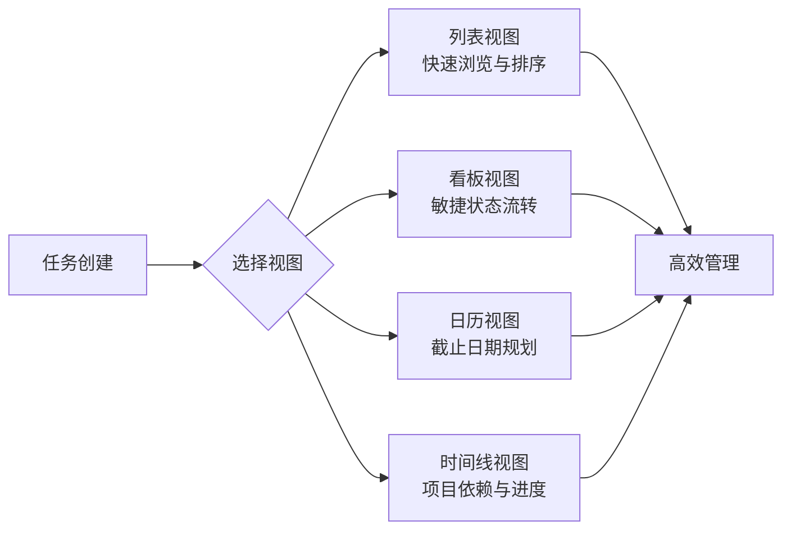

# makeplane/plane

[GitHub URL](https://github.com/makeplane/plane)

- **Stars**: 57831
- **Language**: TypeScript

## Plane：重构团队协作的开源项目管理引擎

> 开源免费的 Jira 替代方案，支持自托管、灵活定制与深度集成，为团队提供现代化协作体验。

- **Tags**: 开源, 项目管理, 自托管, Jira替代, DevOps
- **Category**: 开发工具, 团队协作, 生产力

## Details

# Plane：重构团队协作的开源项目管理引擎
> 一款正在以闪电般速度崛起的开源项目管理工具，用现代技术栈重新定义了团队协作的方式，已成为 GitHub 上星标超过 5.7 万颗的明星项目。
## 一句话总结
Plane 是一个现代化的开源项目管理平台，旨在成为 Jira、Linear、Monday 和 ClickUp 等商业工具的强大替代方案。它通过任务管理、冲刺规划、文档协作和问题分类（Triage）等功能，为团队提供一体化协作解决方案，其开源特性使得数据完全可控且定制能力无限。
---
## 🌍 背景与痛点：它为何诞生？
在软件开发和项目管理领域，**信息孤岛**、**流程僵化**和**工具割裂**是长期困扰团队的三大难题。传统工具要么过于复杂（如 Jira）导致学习成本高昂，要么功能单一（如 Trello）难以满足复杂需求，要么价格昂贵且数据被锁定在第三方平台（如 Linear）。
Plane 诞生于对这些痛点的深刻理解。它试图**平衡功能强大性与易用性**，通过开源方式让团队完全掌控自己的工作流程和数据。其背后的团队（Makeplane）意识到，现代敏捷团队需要的不是一个庞大的系统，而是一个能够**灵活适应各种工作流**、**促进即时沟通**、**提供决策洞察**的协作中枢。
> 💡 **核心痛点解决**：Plane 通过模块化设计和灵活的工作流引擎，解决了跨职能团队信息不对称的问题，同时保持了开源工具特有的可定制性优势。
## ✨ 核心亮点与功能剖析
### 1. 多视图任务管理系统
Plane 提供了**列表、看板、日历**和**时间线**等多种可视化方式。这意味着：
-   **列表视图**适合传统任务管理，可快速浏览和排序任务。
-   **看板视图**完美契合敏捷开发流程，直观展示任务状态流转。
-   **日历视图**帮助团队规划截止日期和里程碑。
-   **时间线视图**则能清晰呈现项目整体进度和依赖关系。

### 2. 灵活的权限控制与模块化架构
Plane 采用了**基于项目、模块和任务层级的细粒度权限控制机制**。这使得团队可以精确控制谁能查看、编辑或特定操作某个模块或任务，非常适合需要严格权限管理的企业或大型团队。
其技术架构采用**前后端分离**设计：
-   **前端**：基于 React + TypeScript 构建响应式界面，提供流畅的用户体验。
-   **后端**：通过 Django REST 框架提供 API 服务，确保接口的稳定性和扩展性。
-   **数据库**：使用 PostgreSQL 实现数据持久化，支持复杂查询和事务处理。
-   **设计原则**：遵循领域驱动设计（DDD），将任务管理、用户权限和项目配置等核心功能封装为独立模块，并通过**插件系统**扩展功能。
### 3. 实时协作与无缝集成
Plane 的**实时协作引擎**通过 WebSocket 技术实现任务状态同步和即时通知，有效消除了信息传递延迟。这意味着：
-   当队友更新任务状态时，你无需刷新页面即可看到变化。
-   通过 **@提及** 和评论功能，可以在任务上下文中直接沟通，避免信息在不同工具间跳转和丢失。
-   **GitHub 同步**功能可将代码提交自动关联到 Plane 任务，实现开发过程全链路可追溯。
### 4. 智能自动化与工作流定制
Plane 允许团队定义**自定义工作流和自动化规则**。例如：
-   当任务从“开发中”变为“待测试”时，自动通知测试人员并创建相应的测试任务。
-   通过“Command + K”菜单快速执行常用操作，提升操作效率。
-   **周期（Cycles）** 功能支持管理冲刺和迭代，提供燃尽图等可视化工具来监控项目进度。
## 🎯 目标人群与收益
### 谁最适合使用 Plane？
| 目标人群 | 核心收益 | 使用场景示例 |
| :--- | :--- | :--- |
| **敏捷开发团队** | 完美适配 Scrum/Kanban 流程，GitHub 深度集成，代码与任务无缝关联。 | 软件开发、迭代管理、Bug 追踪。 |
| **初创公司** | 开源免费，数据完全可控，成本极低，快速搭建无需采购流程。 | 产品规划、任务分配、跨部门协作。 |
| **远程团队** | 实时协作、清晰任务上下文、减少沟通噪音，提升异步协作效率。 | 分布式团队、跨时区合作、内容创作。 |
| **注重数据安全的企业** | 支持私有化部署，数据完全掌控在内网，符合合规要求。 | 金融、医疗、政府等对数据敏感的行业。 |
| **技术团队** | API 开放，可深度定制和扩展，满足独特工作流和自动化需求。 | 需要高度自定义流程的研发团队。 |
### 核心收益总结
-   **降本增效**：开源免费，无订阅费用；自动化减少重复工作，提升团队效率。
-   **数据掌控**：支持私有化部署，数据完全属于你，不再被第三方平台锁定。
-   **灵活定制**：通过工作流和权限自定义，完美适配任何团队流程，而非被迫适应工具。
-   **无缝集成**：与 GitHub、GitLab 等开发工具深度集成，形成高效开发闭环。
-   **现代体验**：简洁直观的界面设计，低学习成本，让团队成员快速上手。
## ⚔️ 竞品对比
为了更清晰地展现 Plane 的定位，下表将其与几款主流工具进行了对比。
| 特性维度 | **Plane (开源)** | **Jira (商业)** | **Linear (商业)** | **ClickUp (商业)** |
| :--- | :--- | :--- | :--- | :--- |
| **成本** | **✅ 免费 (自托管)** | ❌ 昂贵订阅 | ❌ 昂贵订阅 | ❌ 免费版限制多/付费 |
| **数据控制** | **✅ 完全掌控 (可自托管)** | ❌ 云端托管 | ❌ 云端托管 | ❌ 云端托管 |
| **定制能力** | **✅ 极高 (工作流、权限、插件)** | ✅ 高 | ⚠️ 中等 | ⚠️ 中等 |
| **集成能力** | **✅ GitHub 深度集成 (官方)** | ✅ 广泛 | ✅ GitHub 深度集成 | ✅ 广泛 |
| **学习成本** | **✅ 低** | ❌ 高 | ⚠️ 中等 | ⚠️ 中等 |
| **界面设计** | **✅ 现代、简洁** | ❌ 传统、臃肿 | ✅ 现代、精致 | ✅ 现代、功能多 |
| **开源生态** | **✅ 活跃 (可自行开发功能)** | ❌ 封闭 | ❌ 封闭 | ❌ 封闭 |
| **最佳适用场景** | **追求掌控、定制、成本效益的团队** | 大型企业、传统流程 | 设计驱动、注重体验的团队 | 需要一揽子解决方案的团队 |
**独特竞争力**：Plane 在**开源免费**与**强大功能**之间找到了最佳平衡点。它不像 Jira 那样笨重，不像 Linear 那样封闭且昂贵，也不像 ClickUp 那样功能堆砌。它为那些**重视数据主权、追求灵活定制、且希望控制成本**的团队，提供了一个兼具现代设计和强大功能的理想选择。
## ⚠️ 局限与不足
尽管 Plane 表现出色，但它也存在一些需要考虑的方面：
1.  **自托管的技术门槛**：对于非技术背景的团队，**自行部署和维护服务器**（即使使用 Docker Compose）仍可能是一个挑战。虽然官方提供了安装脚本，但初始配置、SSL 证书设置、数据备份、性能优化等仍需要一定的技术知识和时间投入。
2.  **功能仍在快速发展中**：作为一个较新的开源项目，Plane 的功能**仍在快速迭代和完善**中。一些高级功能（如更高级的自动化、报表、某些集成）可能尚处于早期阶段或通过插件提供，与成熟商业工具相比在某些细分功能上可能略显不足。
3.  **社区与企业支持**：开源项目的支持主要依赖于社区。对于需要**企业级 SLA（服务级别协议）、7x24小时技术支持或定制化开发服务**的大型组织，可能仍需要考虑商业方案或寻求官方付费支持服务（Plane 提供商业版，提供额外功能和支持）。
4.  **移动端体验**：目前 Plane 的**移动端体验可能不如其网页端完美**。虽然响应式设计可在手机上使用，但原生移动应用的缺失可能会影响需要在外频繁协作的团队成员体验。
> ⚠️ **总结来说**：Plane 更适合**具备一定技术能力**的团队，或者愿意投入少量资源进行部署和维护的团队。对于完全零技术背景、只希望开箱即用且不介意数据托管的团队，商业 SaaS 工具可能仍是更省心的选择。
## 🚀 部署体验与上手指南
### 技术栈与架构
-   **前端**：React + TypeScript
-   **后端**：Django REST Framework
-   **数据库**：PostgreSQL
-   **缓存**：Redis (用于会话和缓存)
-   **文件存储**：MinIO (S3 兼容对象存储) 或本地存储
-   **部署方式**：Docker & Docker Compose (推荐)
### 上手门槛与部署体验
Plane 的部署体验对技术团队来说**相当友好**，尤其是采用官方推荐的 Docker Compose 方式。
**📋 前置条件**：
-   一台服务器（推荐配置：**2核CPU, 4GB内存**用于测试；生产环境建议**4核CPU, 8GB内存**和足够的磁盘空间）
-   安装了 **Docker** 和 **Docker Compose** (Plugin)
-   一个域名（可选，用于生产环境访问）
**🚀 快速部署步骤**（使用官方安装脚本）：
1.  **运行安装脚本**：
    ```bash
    curl -fsSL https://prime.plane.so/install/ | sh -
    ```
    脚本会引导你完成交互式安装，包括设置域名、选择安装模式（Express或Custom）等。
2.  **访问与初始化**：
    安装完成后，通过浏览器访问你设置的域名（如 `http://plane.yourdomain.com` 或 `http://your-server-ip`），即可看到 Plane 的初始化设置页面。
3.  **创建工作空间与项目**：
    按照指引创建你的第一个工作空间（Workspace）和项目（Project），就可以开始添加任务、设置工作流和邀请团队成员了。
**🐳 Docker Compose 配置示例**（核心服务）：
```yaml
# 官方提供的 docker-compose.yml 通常包含以下关键服务
services:
  plane-web:           # 前端应用
    image: makeplane/plane-frontend:stable
    ports:
      - "3000:3000"
  plane-api:           # 后端 API 服务
    image: makeplane/plane-backend:stable
    environment:
      - POSTGRES_HOST=plane-postgres
      - REDIS_HOST=plane-redis
  plane-worker:        # 后台异步任务处理器
    image: makeplane/plane-worker:stable
    depends_on:
      - plane-api
      - plane-redis
  plane-postgres:      # PostgreSQL 数据库
    image: postgres:15-alpine
    volumes:
      - pgdata:/var/lib/postgresql/data
  plane-redis:         # Redis 缓存
    image: redis:7-alpine
  plane-minio:         # MinIO 对象存储（用于文件附件）
    image: minio/minio:latest
    command: server /data
```
<details>
<summary>🔧 <strong>部署实践与排错提示</strong></summary>
-   **端口冲突**：确保服务器上 80、443（用于 Nginx 反向代理和 HTTPS）、3000（前端）等端口未被占用。
-   **镜像拉取失败**：在中国大陆部署时，可能需要为 Docker 配置镜像加速器，以加速拉取 Plane 和其他基础镜像。
-   **权限问题**：确保运行 Docker 的用户有足够的权限，或将用户添加到 `docker` 用户组（`sudo usermod -aG docker $USER`）。
-   **数据持久化**：务必为数据库、MinIO 等服务配置数据卷（Volumes）映射，确保数据在容器重启或更新后不会丢失。
-   **HTTPS 配置**：生产环境强烈建议使用 Let's Encrypt 等免费 SSL 证书，可通过 Nginx 反向代理配置。
</details>
### 社区活跃度与生命力
Plane 的开源社区非常活跃，这为项目的长期健康发展提供了强大动力：
-   **GitHub 热度**：在 GitHub 上已获得超过 **57.8k Stars** 和 **5.5k Forks**，这通常意味着社区认可度高、开发者参与度强。
-   **更新频率**：项目**更新非常频繁**，GitHub 仓库显示已有超过 7,100 次提交，几乎每周都有新功能和改进发布。
-   **Issue 响应**：社区对问题（Issues）的响应速度较快，许多功能请求和 Bug 报告都能在较短时间内得到关注和修复。
-   **生态扩展**：除了核心项目，官方还维护了**文档仓库（makeplane/docs）** 和 **开发者文档（makeplane/developer-docs）**，以及各种插件和集成，生态正在逐步繁荣。
## 📖 核心代码示例与工作流展示
### 1. 自定义工作流（Workflow）配置
Plane 允许为每个项目定义唯一的工作流状态和转换规则。以下是一个典型敏捷开发工作流的 JSON 配置示例（概念性）：
```json
{
  "workflow": {
    "states": [
      { "id": "backlog", "name": "待办", "color": "#E0E0E0" },
      { "id": "todo", "name": "进行中", "color": "#FF9800" },
      { "id": "in_review", "name": "评审中", "color": "#2196F3" },
      { "id": "done", "name": "已完成", "color": "#4CAF50" },
      { "id": "cancelled", "name": "已取消", "color": "#9E9E9E" }
    ],
    "transitions": [
      { "from": "backlog", "to": "todo", "label": "开始处理" },
      { "from": "todo", "to": "in_review", "label": "提交评审" },
      { "from": "in_review", "to": "done", "label": "通过评审" },
      { "from": "in_review", "to": "todo", "label": "需修改" },
      { "from": "todo", "to": "backlog", "label": "挂起" }
    ]
  }
}
```
### 2. GitHub 同步与自动化
通过 Plane 的 GitHub 集成，你可以将代码提交自动关联到任务。例如，提交信息中包含 `Plane #123`，即可将此提交与 Plane 中 ID 为 123 的任务关联。

## 🔮 未来展望与终极评判
Plane 的未来值得期待。其清晰的发展路线图和活跃的社区表明，它有望在以下方向继续演进：
-   **AI 能力增强**：更强大的智能任务预测、自动化分类、内容生成等。
-   **移动端原生应用**：推出 iOS 和 Android 原生应用，提升移动体验。
-   **更丰富的集成生态**：与更多开发工具、通讯平台（如 Slack）、设计工具等深度集成。
-   **企业级功能完善**：更高级的审计日志、SSO（单点登录）、更精细的权限控制等。
### 🏆 终极评判
**Plane 是一款极具潜力和颠覆性的开源项目管理工具**。它精准地抓住了现代团队对**数据掌控、灵活定制、成本效益和现代体验**的核心诉求，并通过扎实的技术实现和活跃的社区构建，提供了一个真正能打的商业替代方案。
**✅ 强烈推荐给**：
-   敏捷开发团队、初创公司、远程团队。
-   **任何希望摆脱工具束缚、掌控自己工作流和数据**的团队。
-   具备基本技术能力（或愿意少量投入学习），愿意通过自托管换取长期自由和成本优势的团队。
**❌ 可能需要再考虑**：
-   完全零技术背景、只希望开箱即用且不介意数据托管的团队。
-   对某些高度垂直、极其小众的行业标准功能有绝对刚性需求的团队（Plane 的通用性和定制性或许能满足，但需验证）。
**💎 最终建议**：
如果你和你的团队正在寻找一个**既能满足现代协作需求，又不想被任何商业工具绑架**的项目管理方案，那么 Plane 绝对是目前市场上最值得你花时间体验和部署的选择之一。它不仅仅是一个工具，更代表了一种**开源、自主、协作优先**的团队工作理念的未来趋势。
