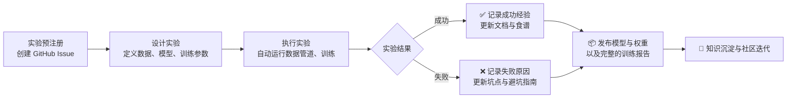

# marin-community/marin

[GitHub URL](https://github.com/marin-community/marin)

- **Stars**: 2598
- **Language**: Python

## Marin：开放构建基础模型的新范式

> 全程透明、可复现的AI大模型研发框架与开放社区

- **Tags**: 大模型, 开源, 可复现性, 训练框架, Open Science
- **Category**: 开发工具, AI 框架, 开源社区

## Details

# 全景深度评测 Marin：开放构建基础模型的新范式
> **一句话总结**：Marin 是一个**致力于全程开放构建基础模型的开源框架与社区**，它通过记录从数据到训练、评估的每一步（包括失败实验），为研究人员、开发者和爱好者提供了可复现、可贡献的模型研究开发新范式。
## 🌊 一、背景与痛点：封闭式开发的困境与开放的曙光
### 1.1 核心问题：为什么我们需要 Marin？
当前，尽管开源权重模型（如 Llama、Gemma）层出不穷，但真正的“**开放**”模型研发仍面临巨大挑战：
*   **“开源”不等于“开放”**：许多声称“开源”的模型仅提供权重，却**未公开训练代码、数据配方、超参数及失败实验记录**。这导致结果难以复现，科学性存疑，创新迭代缓慢。
*   **模型研发的“黑盒”**：在学术和工业界，训练一个大型语言模型（LLM）涉及**数据筛选、清洗、Token化、预训练、后训练、评估**等多个复杂环节。这些过程的决策依据和失败经验，往往随着项目结束而消失，无法为他人提供借鉴。
*   **高门槛与重复劳动**：构建模型需要**庞大的算力资源、专业的工程知识和实践经验**。缺乏系统化、可复用的框架和工具，导致许多研究者重复踩坑，资源浪费严重。
*   **缺乏协作与共享平台**：模型研发缺乏一个像传统软件开发那样，能让全球开发者基于开源代码进行协作、贡献、共同优化的**开放实验室**。
Marin 正是为解决这些痛点而生。它不仅仅是一个工具，更是一个**开放科学理念驱动的研究计划、软件平台和社区**，致力于将基础模型研发的全过程透明化、可编程化。
### 1.2 背后的理念：开放开发（Open Development）
Marin 的核心信念是 **“开放开发”**（Open Development）。这远超传统的开源范畴：
*   **全程透明记录**：从原始数据到最终模型，**每一个实验步骤、每一次决策、甚至每一次失败的实验**都被详细记录在 GitHub Issue 和文档中。
*   **可复现性与可验证性**：所有训练脚本、数据混合配方、超参数设置都公开可查，任何人都可以尝试复现或改进实验。
*   **社区驱动的创新**：它邀请全球的爱好者、研究人员和开发者共同参与，贡献新的架构、算法、数据集或评估方法，形成一个活跃的开放实验室。
## 🔍 二、核心亮点与功能剖析：Marin 的独特价值
Marin 的价值体现在其**系统化的框架、丰富的实践经验和开放的社区生态**。
### 2.1 开源框架与平台：端到端管理模型研发
Marin 提供了一套**集成化的工具和代码库**，用于管理模型研发的整个生命周期。其核心功能包括：
| 功能模块 | 核心能力 | 解决痛点 |
| :--- | :--- | :--- |
| **🧪 实验管理** | 像写代码一样定义实验步骤（数据准备、训练、评估），步骤间可自动依赖管理，支持在 GPU/TPU 上运行。 | 手动管理流程混乱、易出错、难以追踪和复现。 |
| **📊 数据处理** | 内置数据集 Token化、混合、过滤等管道，支持从 Hugging Face 等平台直接加载。 | 数据工程繁琐，缺乏标准化流程。 |
| **🚀 模型训练** | 集成先进的训练优化技术（如 Mixture of Experts、MuonH、PKO），支持分布式训练。 | 实现复杂优化技术门槛高，分布式训练配置困难。 |
| **📝 实验文档化** | 所有实验**预先注册**（GitHub Issue），**过程实时记录**，结果与代码关联，形成可搜索的知识库。 | 实验记录零散，知识沉淀不足，失败经验难以分享。 |
其代码结构（基于 Python）设计精巧，**核心训练代码基于 `Levanter` 库**，并利用 `fray` 进行集群资源管理。一个简单的实验流程可以定义为一个**有向无环图（DAG）**，系统会自动执行，确保每个步骤的输入输出都被妥善管理。
### 2.2 开放科学实践：记录所有知识，包括失败
这是 Marin 最颠覆性的亮点。它**彻底改变了知识共享的方式**：
*   **实验预注册（Preregistration）**：每个实验都先创建一个 GitHub Issue，清晰阐述**假设、方法、预期结果和成功指标**，这避免了“事后诸葛亮”和数据挖掘偏差。
*   **过程实时文档化**：实验的运行日志、中间结果、遇到的坑和**所有失败的尝试**都被持续更新到 Issue 和文档中。例如，其 `marin-8b-base` 模型的训练脚本和完整的**复盘报告（retro）** 都公开可查。
*   **“食谱”（Recipe）文化**：他们不仅提供代码，还提供详细的“**模型训练食谱**”，例如 `Delphi` 缩放套件，它提供了从 3e18 到 1e23 FLOPs 的模型缩放配方，以及如何从公开数据集（Nemotron-CC, StarCoderData, ProofPile 2）确定性地混合数据。这相当于告诉了大家“**怎么做**”和“**为什么这么做**”。

### 2.3 实战验证的模型与前沿技术探索
Marin 不仅仅是一个框架，它更是**前沿技术探索的实践者**。他们用自己训练的模型来验证其方法论。
*   **已验证的模型**：他们曾训练了一个 **8B 参数的模型**，该模型在其**基准测试套件中表现优于 Llama 3.1 8B**。他们还训练了 **32B 参数的模型**（`marin-32b-base`）并已发布权重。这些模型的成功，证明了其开放开发模式的可行性与先进性。
*   **前沿研究：混合专家（MoE）模型**：当前，Marin 的核心研究重点是**从零开始预训练一个大规模（5e24 FLOPs，超过5000亿总参数）的混合专家模型**。MoE 模型是下一代大模型的关键方向，能有效在扩大模型容量的同时保持推理效率。Marin 已在 MoE 专家负载均衡等方面进行了深入探索并发表了研究成果。
*   **缩放定律研究**：通过 **`Delphi` 缩放套件**，他们研究了如何用更小的模型预测更大模型的性能，旨在**为训练超大规模模型提供科学指导**，避免算力浪费。
## 🎯 三、目标人群与收益：谁能从中受益？
Marin 的目标用户明确，但所带来的收益却辐射更广：
| 目标人群 | 典型需求 | 使用 Marin 的核心收益 |
| :--- | :--- | :--- |
| **🧪 AI 研究人员 / 博士生** | 希望复现、验证、改进最新模型架构和训练算法，进行可复现研究。 | **🔬 获取前沿研究细节**：获得比论文更详细、更真实的工程实现细节和失败经验，**极大降低科研门槛**，加速创新。 |
| **👨‍💻 模型开发者 / 工程师** | 需要训练自己领域的基础模型，或优化现有模型的性能。 | **🛠️ 获得工程化最佳实践**：学习到经过大规模验证的**数据工程、分布式训练、集群调度**等实战经验，**少走弯路**，提升效率。 |
| **📊 数据科学家 / 领域专家** | 拥有领域数据，希望训练特定领域的基础模型，但缺乏模型训练经验。 | **📈 快速上手与聚焦业务**：借助 Marin 的框架和食谱，可以**快速启动领域模型训练**，无需从零开始构建底层基础设施。 |
| **👨‍🏫 开源爱好者 / 学生** | 想深入学习大模型训练的全过程，理解其背后的原理。 | **🧩 获得沉浸式学习体验**：通过阅读**完整的实验日志、代码和复盘报告**，**获得最真实、最全面的学习材料**，不再是“纸上谈兵”。 |
| **🏢 企业 / 组织** | 需要训练企业专属的基础模型，要求可控、合规、可追溯。 | **🔒 提供合规与可控的起点**：Marin 的**全程透明、可复现**的特性，正好满足企业对模型研发过程的合规性、安全性和可追溯性要求。 |
> 💡 **综合收益**：对所有人而言，Marin 最核心的价值在于**将模型研发从“艺术”和“黑盒”转化为可复制、可验证、可协作的“工程科学”**。它让你能**站在巨人的肩膀上，甚至能看到巨人踩过的坑**。
## ⚔️ 四、竞品/同类对比：Marin 在生态系统中的位置
为了更清晰地理解 Marin 的定位，我们将其与相关项目进行对比：
| 特性维度 | **Marin** | **Hugging Face Transformers** | **EleutherAI Pythia** | **BigScience** |
| :--- | :--- | :--- | :--- | :--- |
| **🎯 核心定位** | **开放研发全流程框架**（实验管理+数据+训练+文档） | **模型推理与微调库**（侧重模型应用） | **开源模型+复现研究**（侧重模型与数据） | **大规模开源模型项目**（侧重模型合作） |
| **📚 开放范围** | **🔥 极度开放**：代码、数据、配方、**实验记录、失败经验** | **相对开放**：模型代码、权重、部分数据 | **开放**：模型权重、部分数据、论文 | **开放**：模型权重、部分数据、论文 |
| **🔧 技术栈与工具** | **集成化框架**（`Levanter` + `fray`），**支持TPU** | **PyTorch库**，生态庞大，易用 | **PyTorch代码**，复现研究 | **分布式训练工具**（Megatron-DeepSpeed） |
| **👥 社区与协作** | **🔥 活跃开放社区**，**实验驱动**，基于GitHub Issue协作 | **庞大开发者社区**，以模型分享和讨论为主 | **研究导向社区**，以复现和讨论为主 | **大规模合作项目**，以一次性合作为主 |
| **🎓 学习曲线** | **⚠️ 中等偏陡**：需要理解框架概念、实验设计 | **平缓**：对初学者友好，资源丰富 | **中等**：需要理解研究复现 | **陡峭**：参与大规模项目门槛高 |
| **🏆 独特优势** | **🔥 全程透明、失败分享、可复现性、可协作性** | **生态最丰富、易用性最高、模型最多** | **研究深度、数据复现** | **模型规模、合作广度** |
| **⚠️ 主要局限** | 生态规模不及HF，学习门槛相对较高 | 不提供模型训练全流程的深度工程实践 | 项目已结束，更新停止 | 一次性合作，缺乏持续迭代机制 |
**Marin 的核心竞争力**在于其**独特的开放开发理念**。它并非要取代 Hugging Face 或其他工具，而是提供了一个**补充性的、专注于“从零到一”模型研发的透明实验平台**。它更像一个**“开放AI实验室”**，而不仅仅是一个“模型市场”或“工具库”。
## ⚠️ 五、局限与不足：你需要了解的挑战
尽管 Marin 极具潜力，但它并非没有门槛和局限：
1.  **学习曲线与工程门槛**：理解并有效使用 Marin 的框架概念（如实验步骤、资源管理）需要一定的**工程背景和编程能力**。它不像 HF 的 `AutoModel` 那样开箱即用，更适合**有一定经验的开发者或研究人员**。
2.  **算力与成本要求**：训练有竞争力的基础模型，**依然需要庞大的算力资源**（如多个 A100 GPU 或 TPU Pod）。虽然 Marin 本身是免费的，但其背后的训练成本对个人和小团队而言仍非常巨大。
3.  **生态成熟度与社区规模**：相比 Hugging Face，Marin 的**社区规模、插件生态和周边工具仍在发展中**。这意味着在遇到问题时，能找到现成解决方案或获得帮助的渠道可能相对有限。
4.  **持续维护与长期支持**：作为一个由社区和机构共同维护的项目，其**长期发展方向和稳定性取决于社区的持续投入和贡献**。虽然目前活跃，但未来仍存在不确定性。
5.  **并非“即插即用”的解决方案**：你需要投入时间**深入阅读文档、研究实验报告和代码**，才能真正理解并驾驭它。它提供的是“渔具”而非“渔获”。
## 📚 六、上手指南：开始你的第一个实验
Marin 提供了详尽的官方文档和教程。以下是其核心上手路径：
```mermaid
flowchart LR
    A[1. 环境准备<br>安装 Python 3.10+ 和 Git] --> B[2. 克隆仓库并安装<br>git clone https://github.com/marin-community/marin.git<br>pip install -e ".[all]"]
    B --> C[3. 运行第一个教程<br>训练一个 TinyStories 模型]
    C --> D[4. 深入阅读与探索<br>查看实验报告、食谱、Issue]
    D --> E[5. 贡献与互动<br>在 Discord 交流、提交 Issue 或 PR]
```
**核心代码示例：训练一个极简模型**
以下是其官方文档中训练一个极简模型的精简示例，展示了 Marin 的核心用法：
```python
from marin.execution.step_runner import StepRunner
from marin.experiment.data import tokenized
from marin.experiment.train import train_lm
from experiments.llama import llama_nano
from experiments.marin_tokenizer import marin_tokenizer
from levanter.optim import AdamConfig
from fray.cluster import ResourceConfig
# 1. 定义Token化数据步骤 - 惰性计算，不立即下载
tinystories_tokenized = tokenized(
    name="tokenized/tinystories",
    source="roneneldan/TinyStories", # Hugging Face数据集
    tokenizer=marin_tokenizer,
    sample_count=1000, # 仅取1000个样本，用于快速教程
)
# 2. 定义训练步骤 - 依赖于上一步的tokenized数据
nano_tinystories_model = train_lm(
    name="checkpoints/marin-nano-tinystories",
    version="v1",
    model=llama_nano, # 极小的nano模型架构
    optimizer=AdamConfig(learning_rate=6e-4, weight_decay=0.1),
    datasets={tinystories_tokenized: 1.0}, # 使用100%的tokenized数据
    batch_size=4,
    seq_len=2048,
    num_train_steps=100, # 仅训练100步，用于教程
    evals=None, # 不进行评估
    resources=ResourceConfig.with_cpu(), # 使用CPU资源
)
if __name__ == "__main__":
    # 3. 执行步骤 - 自动解析依赖并运行
    StepRunner().run([nano_tinystories_model])
```
> 💡 **解读**：这段代码清晰地展示了 Marin 的**实验步骤化、依赖自动化和资源声明式**的特点。`tokenized` 和 `train_lm` 都是步骤，后者通过 `datasets` 参数依赖于前者。`StepRunner` 会自动执行这些步骤。
**深入学习资源**：
*   **📘 官方文档**：[https://marin.readthedocs.io](https://marin.readthedocs.io) - **必读**！包含安装、教程、实验报告和开发者指南。
*   **🧪 实验报告**：在 `marin/community/marin` 仓库的 `docs/reports/` 目录下，有他们训练各种模型的完整复盘报告，是**无价的学习资料**。
*   **💬 社区支持**：加入他们的 [Discord 服务器](https://discord.gg/J9CTk7pqcM) ，与社区成员和核心开发者直接交流。
*   **🔍 深度阅读**：在 GitHub 仓库的 `experiments/` 目录下，有大量实际实验的配置文件和脚本，是学习高级用法的最佳途径。
## 🔮 七、未来展望与行动建议
### 7.1 终极评判：它值得你投入时间吗？
**如果你的目标是：**
- ✅ **深入研究**模型训练的底层机制和工程实践。
- ✅ **开发并训练**自己领域的基础模型。
- ✅ **追求极致的**可复现性和透明化。
- ✅ **参与一个开放、前沿、以实验为驱动的**AI社区。
**那么，Marin 绝对是一个值得你花时间深入研究和投入的项目。** 它提供了目前开放源社区中最系统、最透明、最深入的模型研发框架和知识库。它不是一条捷径，而是一条通往真知的坚实道路。
**如果你的目标是：**
- ❌ 快速微调一个现成的模型来完成特定任务。
- ❌ 找到一个开箱即用的、最先进的模型权重用于推理。
- ❌ 学习基础的模型应用（如 RAG、Agent）而非训练。
**那么，Marin 可能不是你的最优解。** Hugging Face 的 Transformers 和 PEFT 库、或 LangChain 等框架可能更直接有效。
### 7.2 给不同用户的行动建议
| 用户类型 | 立即行动 | 短期目标（1-3个月） | 长期目标（6-12个月） |
| :--- | :--- | :--- | :--- |
| **🧪 AI 研究人员 / 博士生** | **阅读1-2个完整的实验复盘报告**（如 `marin-8b-retro`）。 | **复现一个小规模的实验**（如教程中的TinyStories），理解框架。 | **基于Marin框架，验证自己提出的一个新算法或数据配方**。 |
| **👨‍💻 模型开发者 / 工程师** | **安装并运行第一个教程**，熟悉框架流程。 | **深入阅读其数据处理管道和训练脚本**，学习最佳实践。 | **尝试用Marin训练一个自己领域的小型模型**，积累经验。 |
| **📊 数据科学家 / 领域专家** | **在Discord上提问**，了解社区动态和资源。 | **尝试使用其数据管道处理自己的数据**。 | **与团队合作，计划基于Marin训练领域专属模型**。 |
| **👨‍🏫 开源爱好者 / 学生** | **阅读官方教程和文档**，建立整体概念。 | **阅读几个GitHub Issue**，感受开放的实验文化。 | **参与社区讨论，提交文档改进或小Bug修复**，开始贡献。 |
### 7.3 对 Marin 项目的未来展望
Marin 代表了AI开放科学的一个重要方向。其未来发展的潜力在于：
*   **社区生态的扩张**：随着更多研究者和开发者的加入，其**数据集、模型、实验食谱的丰富度**将呈指数级增长，形成真正的“开放模型研发集市”。
*   **工具链的整合与优化**：未来可能与更多工具（如Weights & Biases、Ray、vLLM等）深度整合，提供更**无缝的开发体验**。
*   **标准化与规范化的引领**：其“实验预注册”和“过程透明”的理念，有望成为**可复现AI研究的行业标准**，推动整个学术社区的进步。
*   **降低大规模训练的门槛**：通过持续分享高效的训练配方、集群调度工具（如Iris调度器）和缩放定律研究，为个人和中小团队提供**训练大模型的可能性**。
## 💎 结语：Open Development 的未来
Marin 的伟大之处不在于其代码本身，而在于其**背后的理念——一种对开放、透明、协作科学的坚定信念**。它试图将基础模型研发从少数巨头的“黑盒”中解放出来，将其转变为**全球协作、透明验证、共同进步的“白盒”工程**。
这条路注定充满挑战，但 Marin 已经迈出了坚实的一步。对于渴望真正理解、参与并推动AI发展的你来说，**Marin 不仅是一个工具，更是一个机遇**——一个参与到这场开放科学运动中、并从中汲取力量、贡献力量的机遇。
> **“不畏风暴，因为我在学习如何航行。”** —— Marin 仓库的引言
>
> **愿你也能在 Marin 的开放实验室中，找到自己的航向，并学会乘风破浪。**
