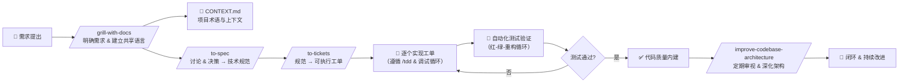

# mattpocock/skills

[GitHub URL](https://github.com/mattpocock/skills)

- **Stars**: 235629
- **Language**: Shell

## Matt Pocock's Skills：让 AI 编程助手成为真正“高级工程师”的实战指南

> 一套将资深工程师经验转化为可复用AI技能的开源项目，让Claude Code等工具像专家一样思考与编码。

- **Tags**: 开源项目, GitHub, AI 技能, TDD, 工作流
- **Category**: AI 编程, 开发者工具

## Details

# Matt Pocock's Skills：让 AI 编程助手成为真正“高级工程师”的实战指南
> **一句话总结**：Matt Pocock's Skills 是一套**将资深软件工程师的实战经验转化为可复用、可组合 AI 编程技能**的开源项目，通过 `/grill-with-docs`、`/tdd`、`/to-spec` 等技能，让 Claude Code、Cursor 等编码助手真正理解项目上下文、遵循团队规范，并像资深工程师一样思考、编码和架构设计。
---
## 🌟 一、背景与痛点：AI 编程助手为何常常“失灵”？
在 AI 编程工具（如 Claude Code、Cursor、GitHub Copilot）日益普及的今天，许多开发者发现它们虽强大，但存在几个核心痛点：
1.  **沟通失准（Misalignment）**：你希望AI实现一个功能，但最终产出代码与预期相去甚远。这源于人类需求与AI理解之间的**语言鸿沟**和**上下文缺失**。
2.  **对话冗长（Verbosity）**：AI 缺乏对项目**领域术语和业务上下文**的理解，导致其使用通俗语言而非准确的项目术语，对话效率低下，难以快速切入核心。
3.  **代码质量不可控**：AI 生成的代码**缺乏自动化测试验证**和**高效的调试反馈循环**，容易产生难以追踪的 Bug。
4.  **代码库熵增（Software Entropy）**：在 AI 加速下，代码库复杂度增长远超人类维护速度，迅速演变为“**泥球（Ball of Mud）**”，难以维护和扩展。
Matt Pocock（知名技术教育者、TypeScript 专家）正是洞察到这些痛点，将自己多年积累的工程实践、思考模式和工具使用经验，提炼成一套**可被 AI 编程工具直接理解和执行的“技能（Skills）”**，旨在解决上述问题，让 AI 真正成为团队中一位“懂得规矩、经验丰富的虚拟高级工程师”。
## ⚙️ 二、核心亮点与功能剖析：它如何解决痛点？
Matt Pocock's Skills 的核心价值在于它**并非一套自动化流程或框架，而是一套将人类工程师的“隐形知识”（如心智模型、最佳实践、决策逻辑）显性化、可复用化的指令集合**。它通过一系列精心设计的 Skill（技能）来解决上述痛点。
### 1. 核心技能深度解析
下表概括了其核心技能及其解决的问题，帮助你快速了解其工作原理和收益：
| 技能名称 (Skill) | 核心作用 | 解决的痛点 | 关键收益 |
| :--- | :--- | :--- | :--- |
| **`/grill-with-docs`** | **“ grilled with documents”** - 通过系统性的提问来**明确需求**，并引导你建立或更新项目的 `CONTEXT.md` 文档（共享语言）。 | **沟通失准**<br>**对话冗长** | - **需求精准对齐**：避免“想A做B”的情况。<br>- **建立共享语言**：将业务术语（如“materialization cascade”）而非冗长描述嵌入代码和文档，**极大提升 AI 的理解精度和后续对话效率**。 |
| **`/tdd`** | **“测试驱动开发”** - 引导 AI 遵循 **“红-绿-重构”** 循环：先写一个失败的测试，再实现代码使其通过，最后重构优化。 | **代码质量不可控**<br>**缺乏验证反馈** | - **质量内建**：保证代码行为符合预期，**显著减少 Bug**。<br>- **提供持续反馈**：为 AI 生成代码提供可靠的验证循环，使其“看得见”自己的错误。 |
| **`/to-spec`** | **“转为规范”** - 将前期的讨论、决策和需求**压缩成一份清晰的技术规范（Spec）**，明确模块、接口和实现要点。 | **沟通失准**<br>**缺乏工程化文档** | - **决策固化**：将模糊需求转化为可执行的技术蓝图。<br>- **减少上下文传输开销**：Spec 是向 AI 提供精确、紧凑上下文的最佳方式，尤其适合**应对大型项目**的上下文窗口限制。 |
| **`/to-tickets`** | **“转为工单”** - 将技术规范**拆解为一系列小的、可独立追踪的工单（Tickets）**，每个工单足够简单，适合单次 AI 会话完成。 | **沟通失准**<br>**任务过大导致AI“眩晕”** | - **任务分解**：将史诗级任务（Epic）降维成 AI 能准确把握的小任务。<br>- **追踪进度**：与 GitHub、Linear、Jira 等issue tracker集成，**实现开发的可视化和可管理性**。 |
| **`/improve-codebase-architecture`** | **“改善代码库架构”** - 定期扫描代码库，**识别出可以进一步抽象、深化的模块**（Deep Modules），提出重构建议。 | **代码库熵增**<br>**架构腐化** | - **主动维护设计**：在代码腐烂前主动出击，保持系统简洁和可维护性。<br>- **传授设计思维**：向 AI 展示什么是“好的设计”，让其具备架构意识。 |
| **`/diagnosing-bugs`** | **“诊断Bug”** - 将系统的调试流程封装为**分阶段的、结构化的排查循环**，引导 AI 高效定位问题根源。 | **代码质量不可控**<br>**调试效率低下** | - **系统化调试**：避免随机尝试，**提升 Bug 修复的效率和成功率**。 |
### 2. 工作流：一个完整的 AI 辅助开发闭环
Matt Pocock's Skills 的真正强大之处在于**技能之间的组合与嵌套**，形成了一套高效的、符合现代软件工程最佳实践的 AI 辅助开发工作流。下图清晰地展示了其核心流程：

### 3. 独特设计理念：从“Vibe Coding”到“Real Engineering”
Matt Pocock 明确区分了两种不同的 AI 编程模式：
*   **Vibe Coding**：仅仅利用 AI 快速生成大量代码，缺乏规范、测试和架构思考，代码质量难以保证，项目最终可能变成一个“泥球”。
*   **Real Engineering**：**将软件工程的根本原则（如明确的需求、测试驱动、架构设计、持续集成）融入 AI 的工作流**，用 AI 来**加速和增强**这些原则的执行，而非替代它们。
他的 Skills 项目正是为了**推动开发模式从前者向后者转变**，让 AI 成为一位**遵循工程纪律、懂得协作的高级工程师**，而非一个不知疲倦的“代码生成器”。
## 🎯 三、目标人群与收益：谁应该使用它？
| 目标用户 | 核心收益 | 最适合的场景 |
| :--- | :--- | :--- |
| **🧑‍💻 软件工程师（任何经验水平）** | - **提升代码质量和稳定性**（通过TDD、调试循环）<br>- **学会如何更有效地与AI编程工具沟通**<br>- **掌握更系统的开发方法论** | 个人项目、学习新技术、提升编码实践 |
| **👨‍👩‍👧‍👦 技术团队负责人/架构师** | - **统一团队的AI开发规范和最佳实践**<br>- **降低新成员的学习成本和AI磨合时间**<br>- **保持代码库的长期健康性和可维护性** | 团队协作、架构演进、代码审查、规范制定 |
| **🚀 独立开发者/初创公司** | - **以一人之力，完成团队级别的工程质量和效率**<br>- **快速构建出稳定、可扩展的产品**<br>- **节省时间，专注于业务逻辑和产品创新** | MVP开发、产品迭代、小团队协作 |
| **🤖 AI 编码工具深度用户** | - **挖掘工具的最大潜力**<br>- **解决“它不按我想要的做”的核心痛点**<br>- **将AI从“助手”升级为“伙伴”** | 优化工作流、突破使用瓶颈、追求极致效率 |
## ⚖️ 四、竞品/同类对比：它为何独特？
| 特性维度 | Matt Pocock's Skills | GitHub Copilot | Cursor | 其他通用Prompt工程 |
| :--- | :--- | :--- | :--- | :--- |
| **核心定位** | **工程化的AI技能与工作流** | **代码自动补全** | **AI对话与编码集成** | **单次提示词优化** |
| **设计哲学** | **强调工程原则（TDD、Spec、架构）** | **上下文感知的代码补全** | **对话式开发与IDE深度集成** | **技巧性、一次性** |
| **项目理解** | **通过 `CONTEXT.md` 和 Spec 深度理解** | **依赖当前文件和少量上下文** | **可通过对话注入项目上下文** | **难以形成持续共享的上下文** |
| **工作流集成** | **高度集成、结构化的开发闭环** | **分散的补全操作** | **以对话为核心的线性流程** | **碎片化、无序** |
| **学习曲线** | **中等（需理解工程概念）** | **低（即插即用）** | **低（交互直观）** | **低（易于尝试）** |
| **长期价值** | **构建可持续的工程化能力** | **提升编码效率** | **提升编码效率** | **解决临时问题** |
**💡 核心竞争力**：它的独特竞争力在于**将软件工程的“纪律”和“智慧”内化为AI可执行的指令**，这是其他工具所不具备的深度。它不只是一个工具，更是一套**可学习、可复制、可传播的工程思维模型**。
## ⚠️ 五、局限与不足：需要客观看待的方面
1.  **学习成本不低**：要充分发挥其价值，用户需要**具备一定的软件工程基础概念**（如TDD、领域驱动设计、架构模式）。对完全的新手来说，可能需要先学习这些原理。
2.  **初期设置需要投入**：首次使用需要运行 `/setup-matt-pocock-skills` 并配置项目上下文（如选择 Issue Tracker、标签策略），这需要一些时间。
3.  **依赖用户的工程素养**：项目本身提供的是“技能”，但**最终效果取决于用户是否真正理解并愿意遵循这些工程原则**。它不会魔法般地让一个不注重质量的团队突然写出好代码。
4.  **模型能力要求**：一些技能（如 `/grill-with-docs`、`/to-spec`）对模型的**理解能力、推理能力和上下文窗口大小**有较高要求。较弱的模型可能难以完美执行复杂技能。
5.  **需要主动维护共享语言**：`CONTEXT.md` 和 Spec 是关键，但它们需要**随着项目的演进而主动更新**，否则会过时。这需要团队的自律。
## 🚀 六、安装、部署与使用：从零到一
### 1. 安装方式（二选一）
Matt Pocock 提供了两种哲学不同的安装方式，你可以根据喜好选择：
| 方式 | 命令 | 特点 | 适合人群 |
| :--- | :--- | :--- | :--- |
| **🧩 Claude Code 插件** | `claude plugins install mattpocock-skills`<br>或在会话中：`/plugin install mattpocock-skills` | **订阅制**：以只读形式安装，**自动更新**，无需手动管理。**推荐首选**。 | 追求省心、希望始终使用最新版本的 Claude Code 用户 |
| **📂 可编辑文件** | `npx skills@latest add mattpocock/skills` | **所有权**：将技能文件**复制到你的项目中**，你可以随意修改、定制，**完全掌控更新节奏**（通过 `npx skills update`）。 | 喜欢折腾、希望深度定制、团队内部部署和协作 |
### 2. 核心使用流程（首次使用）
安装后，在你的编码代理中（如 Claude Code）运行：
```bash
/setup-matt-pocock-skills
```
它会引导你完成一些一次性配置：
1.  选择你的 **Issue Tracker**（GitHub, Linear, 或本地 Markdown 文件）。
2.  设置你在工单分类时使用的**标签**（用于 `/triage` 等技能）。
3.  指定保存生成的文档（如 Spec, ADR）的**位置**。
配置完成后，你就可以开始使用核心技能了。**强烈建议从 `/grill-with-docs` 开始你的第一个需求**。
### 3. 一个简单示例：使用 `/grill-with-docs`
假设你想为项目添加一个用户反馈收集功能。
1.  **触发技能**：在 AI 对话框中输入：
    ```bash
    /grill-with-docs 我需要实现一个用户反馈收集功能
    ```
2.  **AI 提问**：AI 会开始系统地提问，例如：
    *   “反馈收集的入口应该放在哪里？”
    *   “需要收集哪些字段？是否必填？”
    *   “提交后的反馈数据存储在哪里？如何通知管理员？”
    *   “有哪些异常场景需要考虑（如网络错误）？”
3.  **你回答问题**：你一一回答。
4.  **AI 生成/更新 `CONTEXT.md`**：AI 会根据对话，**将“用户反馈”、“反馈条目”、“管理员通知”等术语定义为项目的共享语言**，并更新 `CONTEXT.md` 文件。
5.  **输出 Spec 摘要**：AI 可能会给出一个初步的功能摘要，作为下一步 `/to-spec` 的基础。
## 🔮 七、未来展望：AI 辅助开发的标准化
Matt Pocock's Skills 的成功（**截至2026年8月，GitHub Star 数已达227.8k，全球排名第20位**）预示着一个趋势：**AI 辅助开发正在走向标准化和工程化**。未来，我们可能会看到：
*   **更多“领域专家技能”**：不仅限于通用工程，还会出现针对特定技术栈（如React、Go）、特定业务领域（如电商、金融）的专属技能包。
*   **技能的团队共享与治理**：大型企业将创建自己的**企业级技能库**，统一编码规范、安全策略和架构模式，并通过版本控制管理。
*   **与CI/CD的深度集成**：技能生成的测试、Spec、Ticket将直接与流水线联动，实现“**AI 提交 -> 自动化测试 -> 自动部署**”的闭环。
*   **更智能的上下文管理**：技能可能自动从代码、文档、注释中**学习并进化项目的共享语言**，减少人工维护成本。
## 📌 八、结语与行动建议：给你的终极评判
### 🏆 综合评价
Matt Pocock's Skills 是一个**开创性、极具洞察力的项目**。它成功地将**软件工程的硬核知识与AI的强大能力相结合**，解决了AI编程工具当前最核心的痛点——**上下文理解不足、工程化缺失、质量不可控**。它不仅是一个工具集合，更是一套**可推广的、经过实践检验的AI辅助开发方法论**。
**👍 优点**：
*   **深度解决痛点**：直指AI开发的核心问题。
*   **设计精妙**：技能组合可形成强大、闭环的工作流。
*   **思想开放**：MIT开源，鼓励社区定制和分享。
*   **文档详实**：每个技能都有清晰的Markdown说明和示例。
**👎 缺点**：
*   **学习曲线**：需要一定的工程基础。
*   **维护成本**：需要团队主动维护共享文档。
*   **模型依赖**：对AI模型的能力有要求。
### 🎯 最终建议与行动指南
| 如果你... | 那么... | 推荐行动 |
| :--- | :--- | :--- |
| **🔥 是追求代码质量和长期可维护性的开发者** | **强烈推荐立即尝试** | 1.  用Claude Code插件安装。<br>2.  从一个新项目或小需求开始，**只用 `/grill-with-docs` 和 `/tdd`**。<br>3.  体验一下“与一位资深工程师结对编程”的感觉。 |
| **👨‍👩‍👧‍👦 是技术团队的负责人** | **应该评估引入团队** | 1.  自己先试用，理解其理念。<br>2.  与团队分享，评估工程基础是否匹配。<br>3.  考虑在下一个项目中试点，**制定团队自己的 `CONTEXT.md` 和编码规范**。 |
| **🚀 是独立开发者或初创公司** | **这可能是你构建产品的秘密武器** | 1.  **不要等，现在就用**。它能让你以一己之力，达到团队级别的工程纪律。<br>2.  关注 `/to-spec` 和 `/to-tickets`，这能帮你有效管理复杂度。 |
| **🌱 是刚入门编程的新手** | **可以学习，但需先补充基础** | 1.  先花时间学习 **TDD、基础设计模式、如何编写清晰的需求**。<br>2.  再来使用Skills，你会事半功倍，理解更深。 |
> **💡 一句话终极建议**：如果你厌倦了AI生成代码后还需要花费大量时间调试和维护，渴望让AI真正成为你的**“技术伙伴”而非“代码生成器”**，那么 **Matt Pocock's Skills 值得你投入时间学习和实践**。它很可能是你今年最值得学习的开发技能之一。
**立即开始**：
```bash
# 1. 安装 Claude Code 插件（最省心）
claude plugins install mattpocock-skills
# 2. 或者，安装可编辑版本到项目
npx skills@latest add mattpocock/skills
# 3. 在你的AI编码工具中，运行
/setup-matt-pocock-skills
# 4. 开始你的第一个技能体验
/grill-with-docs 我想实现一个[你的需求]
```
让工程化实践为AI赋能，而非让AI成为破坏工程化的催化剂。Matt Pocock's Skills 为你指明了道路。
