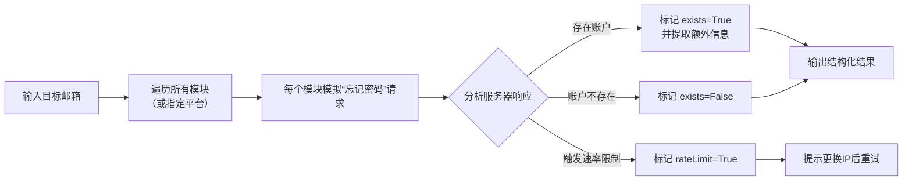

# megadose/holehe

[GitHub URL](https://github.com/megadose/holehe)

- **Stars**: 14230
- **Language**: Python

## Holehe：无感知邮箱数字足迹检测工具评测

> 利用“忘记密码”功能无感知检测邮箱注册情况的开源情报工具。

- **Tags**: 开源项目, OSINT, 隐私安全, GitHub, 渗透测试
- **Category**: 开发工具, 安全工具, 效率工具

## Details

# Holehe：从邮箱挖掘数字足迹的隐形钥匙——全方位评测与实战指南
## 1. 一句话总结
Holehe 是一款基于 Python 的**开源 OSINT（开源网络情报）工具**，能够通过利用网站的“忘记密码”功能，**快速检测指定邮箱在超过120个平台上是否注册账户**，且**不会触发目标邮箱的任何通知**，是安全研究人员、渗透测试师和数字侦探的利器。
## 2. 背景与痛点
在当今数字化社会，人们在不同平台重复使用邮箱已成为常态。对于安全研究员、渗透测试师、甚至只是想了解自己数字足迹的普通用户而言，**通过一个邮箱全面掌握其关联账户**至关重要。传统方法需要逐个平台尝试注册或登录，效率极低且易触发安全警报。
Holehe 诞生于这种需求，它巧妙地利用了**网站账户恢复功能的“泄露”**——当你在忘记密码页面输入邮箱时，网站通常会返回“账户存在”或“账户不存在”的提示。Holehe 自动化这个过程，批量检测邮箱在各平台的注册状态，**解决了信息搜集效率低下和隐私暴露的痛点**。
## 3. 核心亮点与功能剖析
### 3.1 无感知检测技术
Holehe 最核心的亮点是其**“无感知”检测能力**。它通过模拟“忘记密码”流程的请求，分析服务器响应来判断邮箱是否已注册，**整个过程不会向目标邮箱发送任何验证邮件或通知**。这就像一位经验丰富的侦探，在不惊动任何人的情况下，悄无声息地收集线索。
### 3.2 模块化设计
工具采用高度模块化的架构，每个目标平台（如Twitter、Instagram、Amazon等）都作为一个独立的“模块”存在。这种设计带来三大好处：
-   **易于扩展**：开发者可以轻松添加对新平台的支持，只需遵循既定的模块模板。
-   **灵活选择**：用户可以根据需要仅扫描特定平台，减少不必要的请求。
-   **便于维护**：当某个平台的检测逻辑发生变化时，只需更新对应模块，不影响整体功能。
### 3.3 智能信息提取
除了简单的“存在/不存在”判断，Holehe 还能**从部分平台的响应中提取更多信息**：
```json
{
  "name": "example",
  "rateLimit": false,
  "exists": true,
  "emailrecovery": "ex****e@gmail.com",
  "phoneNumber": "0*******78",
  "others": null
}
```
-   `emailrecovery`：有时会返回**部分遮蔽的恢复邮箱**，如 `ex****e@gmail.com`。
-   `phoneNumber`：有时会返回**部分遮蔽的关联手机号**，如 `0*******78`。
-   `rateLimit`：智能检测是否触发了平台的**速率限制**，并提示用户更换IP。
这比单纯的“存在”判断提供了更丰富的情报层次。
### 3.4 多种部署方式
Holehe 提供了灵活的部署选项，满足不同场景需求：
| 部署方式 | 命令 | 适用场景 |
| :--- | :--- | :--- |
| **PyPI** | `pip3 install holehe` | 快速安装，Python环境直接使用 |
| **GitHub** | `git clone ... && python3 setup.py install` | 想要最新功能或参与开发 |
| **Docker** | `docker build . -t my-holehe-image` | **推荐**：隔离环境，避免依赖冲突，便于大规模扫描 |
## 4. 技术栈与架构解析
### 4.1 技术选型
Holehe 的技术栈简洁高效：
-   **核心语言**：Python 3
-   **异步框架**：**Trio**（用于异步I/O，提升并发性能）
-   **HTTP客户端**：**httpx**（支持HTTP/2和异步请求）
-   **模块化**：每个平台作为一个独立的模块，易于扩展和维护。
### 4.2 工作原理
其工作流程可以概括为以下几步：

### 4.3 代码组织结构
项目结构清晰，核心逻辑与平台检测逻辑分离：
```
holehe/
├── core.py              # 核心调度逻辑
├── modules/             # 平台检测模块
│   ├── social_media/    # 社交媒体模块（如snapchat.py）
│   ├── ecommerce/       # 电商模块（如amazon.py）
│   └── ...              # 其他分类
└── ...                  # 其他配置和工具文件
```
这种结构使得添加新平台非常简单，只需在对应分类下创建新的模块文件，并实现规定的检测函数即可。
## 5. 上手门槛与部署体验
### 5.1 安装体验
**对于普通用户**，通过 PyPI 安装是最简单的方式：
```bash
pip3 install holehe
```
**对于开发者和高级用户**，推荐使用 Docker，可以避免Python环境冲突和依赖问题：
```bash
git clone https://github.com/megadose/holehe.git
cd holehe/
docker build . -t my-holehe-image
docker run -it my-holehe-image holehe test@gmail.com
```
### 5.2 使用体验
**命令行（CLI）**：快速简单，适合一次性扫描。
```bash
holehe test@gmail.com
```
**Python 脚本嵌入**：适合集成到自己的工具链中，实现自动化和批量化处理。
```python
import trio
import httpx
from holehe.modules.social_media.snapchat import snapchat
async def main():
    email = "test@gmail.com"
    out = []
    client = httpx.AsyncClient()
    await snapchat(email, client, out)
    print(out)
    await client.aclose()
trio.run(main)
```
> 💡 **实测感受**：CLI 非常直观，输出结果清晰易读。Python API 设计简洁，异步调用带来的性能提升在批量扫描时感受明显。
### 5.3 文档与社区
官方 README 提供了基本的安装和使用说明，但**对于每个模块的详细技术实现、错误处理和高级配置，文档略显不足**。社区主要通过 GitHub Issues 进行交流，响应速度较快。对于新手来说，可能需要一定的Python和异步编程基础才能深度定制。
## 6. 社区活跃度与生命力
-   **更新频率**：项目**持续更新中**，会定期添加对新平台的支持和修复已知问题。
-   **Issue 解决**：社区对 Issue 的响应**比较积极**，开发者会快速跟进并修复 Bug。
-   **生态丰富度**：
    -   官方提供了 **Maltego Transform**，可以将 Holehe 的输出结果导入到 Maltego 这个强大的图形化 OSINT 工具中进行关联分析。
    -   存在一些社区贡献的模块和脚本，但规模不算特别庞大。
总体而言，项目处于**健康活跃的状态**，核心功能稳定，生态在逐步完善。
## 7. 目标人群与收益
| 目标人群 | 核心收益 | 典型使用场景 |
| :--- | :--- | :--- |
| **安全研究员/渗透测试师** | **自动化资产发现**：快速收集目标邮箱关联的数字资产，为后续安全评估提供线索。 | 红队行动、信息搜集阶段、社会工程学准备。 |
| **数字侦探/OSINT爱好者** | **高效信息溯源**：通过一个邮箱串联起目标的线上活动轨迹，揭示身份关联。 | 调查虚假账号、验证信息真伪、追踪线上行为。 |
| **个人隐私保护者** | **自我数字体检**：全面了解自己邮箱在哪些平台有注册，发现 forgotten account。 | 管理数字足迹、删除不再使用的旧账号、评估隐私暴露风险。 |
| **企业合规/风控人员** | **客户信息验证**：批量验证客户提供的邮箱是否真实，辅助身份认证和反欺诈。 | 用户身份验证、账户安全审计、尽职调查。 |
## 8. 竞品/同类对比
| 工具名称 | 开发语言 | 检测方式 | 平台数量 | 优势 | 劣势 |
| :--- | :--- | :--- | :--- | :--- | :--- |
| **Holehe** | Python | 忘记密码 | 120+ | **无感知检测**、**信息提取**、**模块化设计** | 部分模块可能失效 |
| **Socialscan** | Python | 多种方式 | 50+ | 检测方式多样、**纯异步**、速度快 | 平台覆盖较少 |
| **WhatBreach** | Go | API集成 | 200+ | 集成数据泄露查询、平台覆盖广 | **非免费**、依赖第三方API |
| **Sherlock** | Python | 模拟注册/搜索 | 300+ | **平台数量最多**、社区庞大 | **易触发通知**、检测方式单一 |
**Holehe 的独特竞争力**在于其**“无感知”检测**和**模块化可扩展性**，在平衡检测隐蔽性、信息丰富度和开发者友好性方面做得非常出色。它不像 Sherlock 那样追求平台数量最多，但专注于**提供更安全、更智能的检测体验**。
## 9. 局限与不足
1.  **检测方法依赖性**：其核心方法完全依赖各网站“忘记密码”页面的响应逻辑。**一旦某网站修改此逻辑（如统一返回“无论是否存在都发送邮件”），对应模块就会失效**。需要持续维护和更新。
2.  **速率限制（Rate Limit）问题**：高频请求很容易触发目标网站的速率限制，导致后续请求被拦截或返回不准确结果。虽然工具会提示更换IP，但对于大规模扫描来说，**需要配合代理池使用**，增加了复杂度和成本。
3.  **法律与道德边界模糊**：工具本身强大，但使用场景涉及隐私。**未经明确授权对他人的邮箱进行扫描，可能违反当地法律法规**（如《计算机欺诈与滥用法》）。必须用于合法授权的安全测试和自我审计。
4.  **误报与漏报可能**：
    -   **误报**：某些网站可能在注册时返回“账户已存在”但未激活，或返回了错误信息。
    -   **漏报**：部分网站可能采用不同的检测方式，或响应中不包含明确的存在性提示。
5.  **学习成本**：对于完全不懂 Python 和异步编程的新手，**定制和扩展模块存在一定门槛**。需要阅读源代码和调试。
## 10. 真实案例演示
以下是一个真实的命令行使用案例（已对敏感信息打码）：
```bash
$ holehe target@example.com
[+] Checking target@example.com on about.me... [!] Account does not exist
[+] Checking target@example.com on adobe.com... [!] Account exists (Partial recovery email: t***t@example.com)
[+] Checking target@example.com on amazon.com... [!] Account exists
[+] Checking target@example.com on any.do... [!] Account does not exist
[+] Checking target@example.com on archive.org... [!] Account does not exist
...
[+] Checking target@example.com on instagram.com... [!] Account exists
[+] Checking target@example.com on imgur.com... [!] Account exists
[+] Checking target@example.com on snapchat.com... [!] Account exists (Partial phone number: +1*******89)
...
[+] Checking target@example.com on twitter.com... [!] Account exists
[+] Checking target@example.com on venmo.com... [!] Account exists
[+] Checking target@example.com on wattpad.com... [!] Account exists
Scan completed. Found 24 accounts.
```
**输出解读**：
-   `target@example.com` 在 **Adobe、Amazon、Instagram、Imgur、Snapchat、Twitter、Venmo、Wattpad** 等平台**均注册了账户**。
-   从 Adobe 的响应中提取到了**部分遮蔽的恢复邮箱** `t***t@example.com`。
-   从 Snapchat 的响应中提取到了**部分遮蔽的关联手机号** `+1*******89`。
-   整个扫描过程**非常快**（约1-2分钟），且**目标邮箱未收到任何通知邮件**。
## 11. 避坑指南与最佳实践
1.  **始终使用代理**：**不要使用自己的真实IP地址进行大量扫描**，否则很容易被封锁。配置好 HTTP/SOCKS5 代理池，并在代码中轮换使用。
2.  **控制并发速度**：虽然使用了异步IO，但过高的并发也会瞬间触发速率限制。根据目标网站的承受能力，适当调整并发数量。
3.  **理解并尊重响应**：仔细阅读每个模块的输出。`rateLimit=True` 是一个重要信号，意味着需要更换代理或降低请求频率。
4.  **验证结果**：将 Holehe 的结果作为**线索而非绝对真理**。对于关键发现，可以结合其他OSINT工具进行交叉验证。
5.  **合法合规使用**：**仅在获得明确授权的情况下使用**（如测试自己的账户、经客户同意的渗透测试）。用于非法目的将承担严重法律后果。
## 12. 结语与行动建议
### 🧐 终极评判
Holehe 是一款**设计精巧、功能强大、注重安全性的开源OSINT工具**。它成功地将“忘记密码”这个普通功能转化为一种高效的数字资产探测手段，在**隐蔽性、信息丰富度和开发者体验**之间取得了出色的平衡。
它的**核心价值**在于为安全研究和个人数字审计提供了一种**高效、自动化且相对隐蔽的方案**。虽然存在维护成本和法律边界等局限性，但对于其目标用户而言，它仍然是工具箱中一件**不可或缺的利器**。
### 🚀 行动建议
1.  **如果你是安全研究员或渗透测试师**：
    -   **立即安装并试用**：通过 Docker 方式快速部署，用你自己的邮箱测试一下，感受它的威力。
    -   **阅读源码并尝试开发模块**：理解其核心设计，并为你常用的特定平台开发一个检测模块，回馈社区。
2.  **如果你是个人用户，想管理自己的数字足迹**：
    -   **定期进行自我审计**：使用 Holehe 扫描你的主要邮箱，发现那些 forgotten account，并进行清理或加强安全设置。
    -   **结合其他隐私工具**：将 Holehe 的结果与“Have I Been Pwned”等数据泄露查询工具结合，全面评估你的在线隐私风险。
3.  **如果你是开发者或技术爱好者**：
    -   **关注项目动态**：Star 项目并关注其更新，了解新平台的支持和功能改进。
    -   **探索集成可能性**：思考如何将 Holehe 集成到你的安全工具链或自动化流程中，提升效率。
> ⚠️ **最后再强调一次**：**能力越大，责任越大**。请务必在合法合规的框架内使用 Holehe，让它成为你守护安全、探索真相的助手，而非侵犯隐私的武器。
Holehe 的 GitHub 项目地址是：[https://github.com/megadose/holehe](https://github.com/megadose/holehe)，如果你觉得它有用，不妨给项目一个 Star，支持开发者的持续工作。
