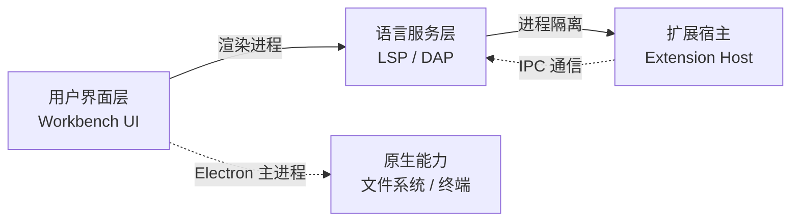

# microsoft/vscode

[GitHub URL](https://github.com/microsoft/vscode)


## VS Code 深度评测：把插件生态做成操作系统级的代码编辑器

> 微软开源的免费代码编辑器，靠轻量内核加插件生态成为全球5000万开发者的默认工具。

- **Tags**: VS Code, 微软, 代码编辑器, 插件生态, 开源
- **Category**: 开发工具, 开源项目, 编辑器

## Details

# VS Code 深度评测：一款把「插件生态」做成操作系统级别的编辑器
> **一句话总结**：VS Code 是用 Electron + TypeScript 铸成的开源代码编辑器，它用「轻量内核 + 疯狂生长的插件生态」这套组合拳，十年间把 Eclipse、Sublime、Atom 逐一挑落马下，成了全球 5000 万开发者的默认工作台；**如果你只装一个开发工具，装它准没错——但前提是你得懂怎么「驯服」它。**
---
## 一、背景与痛点：它诞生的那一年，编辑器世界正在打仗
把时间拨回 2015 年 4 月，微软在 Build 大会上宣布开源 Visual Studio Code。彼时的编辑器格局是这样的：
- **Eclipse / Visual Studio（重）**：功能齐全但启动动辄几十秒，Java 开发者苦其久矣；
- **Sublime Text（快）**：丝滑流畅但是闭源，且插件生态封闭；
- **Atom（理念先进）**：GitHub 出品、Web 技术打造，却慢得像蜗牛，被戏称「一个操作系统包了个编辑器壳」；
- **Vim / Emacs（强）**：可定制性天花板，但学习曲线垂直如峭壁，劝退一代又一代新手。
VS Code 的破局思路极其聪明：**用 Electron 拿到 Atom 的跨平台 + Web 生态红利，但把「性能优化」和「内核精简」做到极致**，再把所有重活儿外包给插件。它不跟 Vim 拼极客深度，也不跟 IDE 拼重量级功能，而是卡在中间最肥的那片市场——**「打开就能写，想要啥装啥」**。
十年过去，这个仓库已经长成 GitHub 上的一棵巨树：约 **19 万+ Star、3300+ 贡献者、15.6 万+ Commit、210 个 Release**，最新版本迭代到 1.118.x，每周仍有上百次代码推送。
---
## 二、核心亮点与功能剖析：为什么它能赢？
### 2.1 技术栈与架构解析：Electron 不是原罪，架构才是
很多人一听「Electron」就摇头：不就是 Chrome 套壳吗？这个理解只对了一半。VS Code 的架构精妙之处在于，**它把 Electron 的「重」用到了刀刃上**，用三层分工把它变成一台精密机器：

- **Workbench（界面层）**：负责 UI 渲染，基于微软自家 Monaco 编辑器（就是把它抽出来就变成了 `monaco-editor`，被无数在线 IDE 复用）；
- **Extension Host（扩展宿主）**：所有插件跑在**独立的子进程**里，一个插件崩溃，主界面稳如老狗，这是 Atom 一直没做好的关键；
- **LSP（Language Server Protocol）**：微软发明的协议，把「语言智能」从编辑器里剥离成独立服务。这一个标准直接重塑了整个行业——你现在用的任何现代编辑器，几乎都在用 LSP。
**用个比喻**：如果把 IDE 比作餐厅，传统 IDE 是中央厨房什么都自己做，重但慢；Sublime 是街边快餐店，快但只卖固定几样；VS Code 则像一家**美食广场**——场地（Electron）租金不便宜，但每个档口（插件）独立经营、独立倒闭，主广场永远营业。
### 2.2 插件生态：这才是真正的护城河
截至 2026 年，VS Code Marketplace 已经是**全球最大的代码编辑器插件市场**，有大量插件月收入稳定过万美元——GitHub Copilot 是绝对头牌，CodeGPT、BLACKBOX.AI、Tabnine 等紧随其后。这不是「有插件」这么简单，而是**形成了一个完整的开发者经济生态**：
- **语言支持**：Python、Go、Rust、Java 几乎所有主流语言都有官方或准官方级插件；
- **AI 编码**：Copilot 之外，Cursor、Cline、Continue、Codeium 等都在其上跑；
- **DevOps**：Docker、Kubernetes、Terraform、Remote-SSH 全覆盖；
- **定制玩家**：主题、图标、Vim 键位模拟、Notion 同步……只有想不到。
**插件生态的本质是「平台化」**——微软不再是一个编辑器厂商，而是一个**开发者工具的分发渠道和标准制定者**。这就是为什么 Cursor（AI 编辑器独角兽）干脆基于 VS Code Fork 起家，而不是从零造轮子。
### 2.3 上手门槛与部署体验：装完就能用，但调教有讲究
- **安装**：官网下载安装包，三分钟搞定，Win/Mac/Linux 全平台；
- **中文**：装个 `Chinese (Simplified)` 插件即可；
- **Settings Sync**：登录 GitHub 账号，所有配置跨设备云同步；
- **Docker / Codespaces**：VS Code 可以直接 attach 到容器里开发，配合 GitHub Codespaces 甚至能在浏览器里跑完整 IDE。
新手友好度极高，**但装得越多越卡，这是后文要谈的坑**。
### 2.4 Demo 代码示例：写一个最简单的 VS Code 插件
理解一个编辑器最好的方式就是给它写插件。**VS Code 的插件其实就是一个带 `package.json` 的 Node.js 项目**，核心是「声明你要贡献什么 + 写激活逻辑」。下面是最经典的 Hello World 示例：
**`package.json`（插件清单）**：
```json
{
  "name": "hello-vscode",
  "displayName": "Hello VSCode",
  "publisher": "your-name",
  "version": "0.0.1",
  "engines": { "vscode": "^1.80.0" },
  "activationEvents": [],
  "contributes": {
    "commands": [
      {
        "command": "hello-vscode.hi",
        "title": "Say Hello"
      }
    ]
  },
  "main": "./extension.js"
}
```
**`extension.js`（插件逻辑）**：
```javascript
const vscode = require('vscode');
function activate(context) {
  const disposable = vscode.commands.registerCommand(
    'hello-vscode.hi',
    () => {
      vscode.window.showInformationMessage('Hello from my first extension!');
    }
  );
  context.subscriptions.push(disposable);
}
function deactivate() {}
module.exports = { activate, deactivate };
```
这段代码的关键在于 `contributes` 字段——它告诉 VS Code「我要往命令面板里注册一个叫 Say Hello 的命令」。**声明式编程（manifest）+ 命令式逻辑（JS）**，这套模式让插件系统清晰可审计，是 VS Code 插件生态能爆炸式增长的技术基石。
跑起来只需三步：
```bash
npm install -g yo generator-code
yo code          # 选 "New Extension (JavaScript)"
F5               # 在 VS Code 里启动调试窗口
```
---
## 三、目标人群与收益
| 人群 | 核心收益 | 典型用法 |
|---|---|---|
| **编程新手** | 免费 + 界面友好 + 中文生态成熟 | 写 Python/前端入门项目 |
| **全栈工程师** | 一个工具通吃前后端 + DevOps | 前端 React + 后端 Node + Docker |
| **远程/云开发** | Remote-SSH + Codespaces | 在云端容器里写本地体验的代码 |
| **数据科学家** | Jupyter 原生集成 + Variable Explorer | 交互式 Notebook + Pandas 调试 |
| **学生/研究者** | 免费 + LaTeX/Markdown 全支持 | 写论文 + 做实验 + 顺手 Git 管理 |
| **插件开发者** | 庞大用户盘子 + 完整 API 文档 | 开发工具、做副业、甚至变现 |
---
## 四、竞品/同类对比：VS Code 在 2026 年的真实排位
AI 编辑器大爆发之后，VS Code 不再是「无脑首选」，而是变成「最稳的那个」。看一张真实对比表：
| 维度 | **VS Code** | **Cursor** | **Zed** | **JetBrains IntelliJ** | **Sublime Text** |
|---|---|---|---|---|---|
| **内核** | Electron + TypeScript | 基于 VS Code Fork | Rust 原生 | Java (JVM) | C++ 自研 |
| **启动速度** | 中等（2-5 秒） | 中等 | **极快（< 1 秒）** | 慢（5-20 秒） | 极快 |
| **内存占用（空闲）** | 200-800 MB | 类似或更高 | **< 150 MB** | 1-3 GB | **< 100 MB** |
| **AI 能力** | Copilot + Agent Mode | **业界领先（Tab 补全/后台 Agent）** | 内置 Agent | JetBrains AI | 无原生 AI |
| **插件生态** | **最大** | 兼容 VS Code 插件 | 较小，增长中 | 中等，但 Java 生态深 | 中等 |
| **开源协议** | MIT（核心开源） | 闭源 | **GPL 开源** | 闭源 | 闭源 |
| **价格** | 完全免费 | $20/月起 | 免费为主 | 个人版订阅制 | $99 买断 |
| **适合谁** | **全场景默认选项** | 重度 AI 协作开发者 | 性能敏感、Linux 用户 | Java/企业级开发 | 极简主义者 |
**关键判断**：
- **Cursor 的崛起**恰恰证明了 VS Code 架构的成功——它 Fork 了 VS Code 就能直接获得插件生态，省下 3 年开发时间；2026 年 Cursor 在 AI 编码工具中占据约 17.9% 的使用率，但它的底层依然是 VS Code。
- **Zed** 走的是完全不同的路线：用 Rust 重写整个编辑器，性能碾压 Electron 系，但插件生态和 AI 集成还在追赶。**它适合被 VS Code 的卡顿折磨到崩溃的人，但不适合需要大量特定语言插件的人**。
- **JetBrains** 在企业级 Java/Kotlin 开发上依然是王者，重构能力、调试深度无可替代，但普通人用 VS Code 性价比远胜。
---
## 五、局限与不足：它不是神，只是当前最优解
### 5.1 资源占用：Electron 的原罪
这是 VS Code 被诟病最多的问题。空闲状态下 VS Code 占用 **200-800 MB 内存**，一旦装上十几个插件、开多个窗口、跑上 Language Server，轻松突破 **1.5 GB**。对比 Zed 的百兆以内，差距是代际级别的。
**避坑建议**：
- 定期用内置的「运行正在运行的扩展」命令（`Ctrl+Shift+P` → `Developer: Show Running Extensions`）查看哪个插件在吃资源；
- 卸载不用的插件，别囤积；
- 大型 Java 项目老实去用 IntelliJ。
### 5.2 微软的「开源」带点小九九
VS Code 的 GitHub 仓库确实是 MIT 协议开源的，但**官方发布的二进制版本并非纯开源**——它捆绑了遥测、专有的 Marketplace、部分闭源组件。这就是为什么社区搞出了 **VSCodium**（完全去遥测、使用 Open VSX 插件市场的社区构建版）。
如果你在意隐私、在公司有合规要求，或者在欧洲受 GDPR 约束，VSCodium 是值得了解的替代品。**代价是**：Open VSX 的插件比 Microsoft Marketplace 少，一些商业插件（如官方 Copilot）不可用。
### 5.3 插件质量参差不齐
Marketplace 的审核门槛很低，导致大量低质、重复甚至恶意插件混杂其中。**安装插件前最好看一下下载量和评分**，别看见名字顺眼就装。
### 5.4 AI 时代的定位焦虑
随着 Cursor、Windsurf、Zed 等原生 AI 编辑器兴起，VS Code 的 Copilot 虽然在不断进化（Agent Mode、MCP 支持、多模型切换），但**「AI-first」的交互范式**上已不再领先。GitHub Universe 2025 上微软主推的 Agentic Development 是追赶的方向，但用户对它的评价是「够用但不是最爽」。
### 5.5 大型项目仍是短板
百万行级的 Java/C++ 企业项目，VS Code 的索引速度、重构能力、调试深度与 IntelliJ / CLion 仍有差距。这不是 bug，是产品定位——它本来就不打算做「重 IDE」。
---
## 六、结语与行动建议：终极评判
> **VS Code 不是一个完美的编辑器，它是一个把「不完美」外包给插件生态的操作系统。**
它的胜利不在于某个功能有多惊艳，而在于**建立了一套让全世界的开发者都愿意为它写插件的经济系统**。这就是为什么即使 Cursor、Zed 层出不穷，VS Code 的 Star 数还在稳步上涨、月活还在突破 5000 万。
**给你的三步行动建议**：
1. **如果你是新手**：直接下载安装，装上 Python / Prettier / GitLens 三件套就能开工，别一上来就折腾配置。
2. **如果你是老手**：花半小时学一下 `settings.json` 和 Keybindings，把 VS Code 调成你自己的形状——这是它和普通编辑器的分水岭。
3. **如果你是 AI 时代的玩家**：VS Code + Copilot Agent Mode 是「稳定派」，Cursor 是「激进派」，Zed 是「性能派」。**先在 VS Code 上把 AI 编码的肌肉练出来，再考虑要不要切换**——因为无论切到哪个 Fork，技能都能直接迁移。
一句话收尾：**十年前它杀出重围靠的是「轻 + 快 + 可扩展」，十年后它依然稳坐王座靠的是「生态 + 标准 + 微软输得起」。短期内，你找不到比它更稳的默认选项。**
