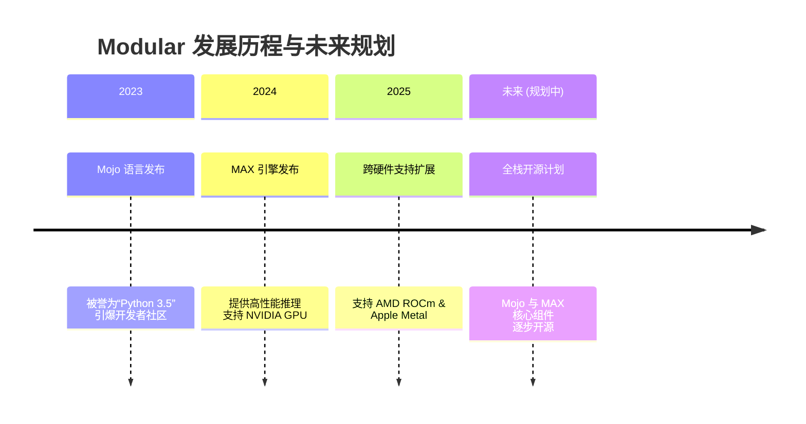

# modular/modular

[GitHub URL](https://github.com/modular/modular)

- **Stars**: 29253
- **Language**: Mojo

## Modular 平台深度评测：用 Mojo 重写 AI 基础设施

> 融合 Mojo 语言与 MAX 引擎的 AI 原生平台，兼顾 Python 开发效率与 C++ 级性能，重新定义 AI 模型部署范式。

- **Tags**: Mojo语言, 高性能推理, 模型部署, 跨硬件, Modular
- **Category**: AI 编程, 开发工具, 基础设施

## Details

# 🔥 Modular 平台评测：用 Mojo 重写 AI 基础设施，一场颠覆性的性能革命
> 一句话总结：**Modular 是一个融合了高性能 Mojo 编程语言和 MAX 引擎的 AI 原生平台，它以 Python 语法与 C++ 级性能的极致结合，正在重新定义 AI 模型部署与高性能计算的开发范式。**
---
## 📊 1. 核心概览与快速对比
Modular 是由 LLVM 和 Swift 编译器之父 Chris Lattner 创立的 AI 基础设施公司，其核心产品是 **Mojo 编程语言**和 **MAX 高性能推理引擎**。下表快速展示其定位与特点：
| 维度 | Modular 平台 | 传统方案 (如 PyTorch + vLLM) |
| :--- | :--- | :--- |
| **核心定位** | **AI 原生统一平台**，语言+引擎+云一体化 | 分散工具链，需组装多种组件 |
| **性能表现** | **极致性能**，单引擎吞吐量高达 2150 tok/s | 性能依赖组合，优化复杂度高 |
| **开发体验** | **Python 语法**，接近零学习成本，无需重写代码 | 需掌握多种工具链和优化技术 |
| **硬件支持** | **GPU 无关**，统一支持 NVIDIA, AMD, Apple Silicon | 多数仅支持 NVIDIA，适配工作量大 |
| **生态整合** | **一站式依赖**，从内核到云完全统一 | 需管理多个依赖，版本兼容性复杂 |
| **适用场景** | **高性能生产部署**、AI 基础设施研发、跨硬件应用 | 快速原型开发、学术研究、非关键路径 |
---
## 🔍 2. 背景与痛点：为何 Modular 横空出世？
AI 基础设施领域长期存在三大核心痛点：
1.  **性能与开发效率的悖论**：要极致性能，必须使用 C++/CUDA，但开发效率低、学习曲线陡峭；要快速迭代，只能用 Python，但性能天花板明显。
2.  **硬件碎片化与部署复杂**：NVIDIA GPU 一统天下的局面正在被 AMD、Apple Silicon 等打破。为不同硬件优化模型内核（Kernel）需要重复劳动，维护成本高昂。
3.  **工具链碎片化与集成难题**：开发者需要拼凑 vLLM、TensorRT-LLM、SGLang 等多种工具，版本兼容、性能调优、系统稳定性都成问题。
Modular 的诞生正是为了从根本上解决这些问题。其核心思想是：**用一门新语言（Mojo）重写 AI 计算的底层，并构建一个统一的引擎（MAX）来屏蔽硬件差异**，从而在保持 Python 开发效率的同时，获得 C++ 级别的性能。

---
## ⚡ 3. 核心亮点与功能剖析
### 3.1 Mojo 语言：Python 的语法，C++ 的速度
Mojo 的设计哲学是 **“Pythonic 的语法 + Rust 的安全 + C++ 的性能”**。它旨在成为 Python 的“超集”（Superset），这意味着现有 Python 代码可以相对容易地迁移，而通过添加类型和特性，能获得巨大的性能提升。
-   **零成本抽象与编译器优化**：Mojo 基于 MLIR（Multi-Level Intermediate Representation）编译基础设施。当你为代码添加类型注解时，编译器能进行深度优化，**代码运行速度可比 Python 快数万倍**（官方宣称最高可达 68,000 倍，但实际提升取决于具体场景）。
-   **内存安全与所有权模型**：借鉴了 Rust 的**所有权（Ownership）**和**生命周期（Lifetimes，Mojo 中称为“Origins”）** 概念，在编译期就能避免内存安全问题，同时无需垃圾回收（GC）的开销，这对性能至关重要。
-   **编译时元编程与自动调优**：Mojo 提供强大的 `comptime` 机制，允许在编译时生成和优化代码。其内置的**自动调优（Autotuning）** 能针对特定硬件找到最优的内核实现，无需手动编写大量 CUDA 代码。
> 💡 **技术原理解析 - 为什么 Mojo 这么快？**
> Mojo 的速度并非魔法，而是源于其编译器技术。它不像 Python 那样解释执行字节码，而是将代码编译成高效的机器码。当你添加类型后，编译器能进行激进优化（如循环展开、向量化），而其**所有权模型**消除了运行时内存管理的开销。你可以把它想象成：**用 Python 写代码，但有个编译器在背后默默把它重写成了极致优化的 C++ 代码**。

<strong>🔧 深度技术：Mojo 的编译器架构</strong>

Mojo 的编译器基于 MLIR 构建，这是一个多层次的中间表示框架。其编译流程大致如下：
1.  **前端解析与类型检查**：将 Mojo 源代码解析为 AST，并进行类型检查。
2.  **MLIR 转换**：将 AST 转换为 MLIR 表示。MLIR 的分层特性允许在不同抽象层次进行优化（例如，在向量、张量、循环等不同层面）。
3.  **自动调优与代码生成**：针对目标硬件（CPU/GPU），自动选择或生成最优的内核实现，并最终生成机器码。
4.  **链接与执行**：生成可执行文件或库，供运行时调用。
这种架构使得 Mojo 能够**以声明式的方式描述计算，而由编译器负责生成高性能的底层代码**，这是其“可移植性能”的基础。

### 3.2 MAX 引擎：高性能推理的“瑞士军刀”
MAX（Modular Accelerated eXecution）是 Modular 推出的**高性能推理引擎和模型服务框架**，它的核心是**图编译（Graph Compilation）**技术。
-   **图编译与单内核优化**：MAX 不会像传统框架那样逐算子执行，而是将整个模型编译成一个**优化的计算图**。它使用 Mojo 编写的**高度优化的内核库**，这些内核能自动适应不同的硬件后端（NVIDIA CUDA、AMD ROCm、Apple Metal）。这意味着**同一套代码可以在不同硬件上获得近乎最优的性能**。
-   **卓越的吞吐量与低延迟**：在密集模型（如 LLaMA 系列）和高并发场景下，MAX 展现了顶级的性能。第三方测试表明，其吞吐量可达 **2,150 tokens/秒**，首 token 时间（TTFT）P50 低至 **105ms**，在对比中领先于 vLLM 等主流引擎。
-   **OpenAI 兼容与易部署**：MAX 提供与 OpenAI API 兼容的端点，这意味着你可以**无缝替换掉现有的推理后端**，而无需大幅修改应用代码。它支持从 Hugging Face 等平台直接加载模型，大大简化了部署流程。
> ⚠️ **注意**：MAX 的性能优势在**密集模型**（Dense Models）和**高并发**场景下尤为明显。对于稀疏模型或极其低延迟要求的单请求场景，其他引擎可能仍有优势。
### 3.3 统一平台与云服务：从代码到生产的闭环
Modular 的野心远不止语言和引擎。它提供**Modular Cloud**，这是一个托管式的推理服务。其核心优势在于：
-   **异构基础设施与成本优化**：Modular Cloud 能**智能调度任务到不同硬件（NVIDIA、AMD、甚至 Apple Silicon）上**，帮助你找到**最佳的性能-成本比**。你无需关心底层硬件细节，只需关注模型本身。
-   **“一次构建，随处部署”**：基于 MAX 的硬件无关性，你开发的模型可以轻松部署到任何云平台或本地环境，**避免了被单一硬件供应商绑定**的风险。
-   **无缝集成与开发体验**：Modular 提供了详尽的文档、SDK 和工具链，旨在让开发者能像使用 Python 库一样轻松地使用其高性能能力。
---
## 👥 4. 目标人群与收益：谁该立即拥抱 Modular？
| 目标人群 | 核心痛点 | Modular 解决方案与收益 |
| :--- | :--- | :--- |
| **AI 工程师 / 研究员** | Python 代码跑得慢，但不想学 C++/CUDA；模型部署性能调优困难 | **🚀 用 Mojo 重写关键模块**，性能飞跃；**📦 用 MAX 部署模型**，一键获得生产级性能，**节省大量优化时间** |
| **平台团队 / DevOps** | 需要支持多种硬件；维护复杂多变的推理服务栈；成本控制压力大 | **🔄 MAX 的硬件无关性**，简化异构环境管理；**💡 Modular Cloud 的智能调度**，直接优化成本；**🛡️ 统一栈**，降低运维复杂度 |
| **AI 初创公司 / 产品团队** | 需要快速迭代，但产品性能要求高；缺乏专业系统优化团队 | **⚡ 快速获得高性能**，无需专家投入；**🔌 API 兼容**，快速集成；**🎯 专注业务逻辑**，基础设施交给 Modular |
| **高性能计算 (HPC) 开发者** | 需要极致性能，但传统系统编程语言学习曲线陡峭 | **🔧 用 Mojo 替代 C++**，开发效率提升，性能不妥协；**🌐 一次编写，跨硬件运行**，扩大应用范围 |
---
## 🥊 5. 竞品/同类对比：Modular 在生态中的位置
| 特性 | **Modular (MAX + Mojo)** | **vLLM** | **TensorRT-LLM** | **SGLang** |
| :--- | :--- | :--- | :--- | :--- |
| **核心架构** | **图编译 + 自研内核** | PagedAttention + Continuous Batching | NVIDIA 自研深度优化 | 结构化生成语言 |
| **性能优势** | **🏆 密集模型吞吐量领先** | 通用场景性能均衡 | **NVIDIA GPU 上极致性能** | 共享前缀场景低延迟 |
| **硬件支持** | **NVIDIA + AMD + Apple Metal** | NVIDIA + AMD | **仅 NVIDIA** | NVIDIA + AMD |
| **开发模型** | **Mojo 编写内核**，Python API | Python API | **需要 Python & CUDA** | Python API |
| **易用性** | **⭐⭐⭐⭐⭐** (API 友好，统一栈) | **⭐⭐⭐⭐** (Python 生态) | **⭐⭐** (学习曲线陡峭) | **⭐⭐⭐⭐** (Python 友好) |
| **最佳适用场景** | **追求极致性能、跨硬件部署、生产环境** | **通用推理、快速部署、广泛模型支持** | **NVIDIA GPU、极致性能、定制化需求强** | **共享前缀、低延迟、复杂推理流程** |
> 💡 **关键洞察**：Modular 的独特竞争力在于其**“硬件无关的高性能”**和**“从内核到云的统一栈”**。如果你只使用 NVIDIA GPU 且需要极致的单卡性能，TensorRT-LLM 可能仍是更优选择；但如果你需要支持多种硬件，或希望用一种语言解决从开发到部署的所有问题，Modular 提供了一个前所未有的吸引人的方案。
---
## ⚠️ 6. 局限与不足：你必须知道的现实
尽管 Modular 愿景宏大且技术先进，但目前仍存在一些局限：
1.  **Mojo 生态尚在成长中**：Mojo 语言仍相对年轻，其**标准库、第三方库数量和成熟度**远不及 Python。这意味着许多 Python 的现成轮子无法直接使用，可能需要自己实现或等待社区贡献。
2.  **学习曲线存在**：虽然 Mojo 语法像 Python，但其**类型系统、所有权模型、`comptime` 等概念**对从 Python 转来的开发者来说仍需要学习。它不是“无脑”替代 Python，而是需要理解其背后的设计理念。
3.  **开源程度与企业策略**：目前，Mojo 和 MAX 的**核心组件并未完全开源**。Modular 提供了社区版，但一些高级功能和企业级支持可能需要商业授权。其开源节奏和社区策略仍需观察。
4.  **生产环境验证时间**：MAX 作为新引擎，虽然早期基准测试表现惊艳，但在**超大规模、极端复杂的生产环境中**的长期稳定性、可靠性验证仍需更多时间和案例积累。
5.  **对稀疏模型支持**：如前所述，MAX 在**稀疏模型（Mixture of Experts）** 等场景下的优化和性能表现，可能不如一些专门针对这些场景优化的引擎（如某些 vLLM 的分支或专有解决方案）。
---
## 🧭 7. 结语与行动建议
### 7.1 终极评判
Modular 无疑是近年来 AI 基础设施领域**最具颠覆性和野心**的项目之一。它不是在修补旧世界，而是**用全新的技术栈和理念重新构建AI的计算底座**。其核心价值在于：
-   **打破性能与效率的悖论**：让开发者用 Python 的语法，写出 C++ 的性能。
-   **终结硬件碎片化噩梦**：一次编写，在 NVIDIA、AMD、Apple Silicon 上都能获得近乎最优的性能。
-   **提供从代码到云的统一体验**：极大降低了高性能 AI 应用的开发、部署和运维复杂度。
它目前最大的短板是**生态成熟度**，但技术实力和背后团队（Chris Lattner）让它有巨大的潜力快速弥补这一点。
### 7.2 行动建议
-   **如果你是 AI 工程师/研究员**：
    -   **立即行动**：去 **[Mojo Playground](https://developer.modular.com/)** 申请体验，写几行代码感受其速度。
    -   **深入学习**：阅读官方文档，重点理解类型、所有权、`comptime` 等核心概念。尝试用 Mojo 重写一个性能关键的小型 Python 函数。
    -   **评估迁移**：对于你项目中的性能瓶颈模块（如自定义内核、数值计算密集型代码），评估是否适合用 Mojo 重写。
-   **如果你是平台团队/技术决策者**：
    -   **密切关注**：将 Modular 视为未来的一个重要战略选项。邀请 Modular 进行技术演示，了解其在你们特定硬件和模型上的性能表现。
    -   **小规模试点**：选择非关键业务，尝试使用 MAX 部署一个模型，评估其性能、稳定性和开发体验。
    -   **规划长期路线**：考虑将 Modular 纳入未来的技术规划，特别是当你需要支持异构硬件或寻求更高性能时。
-   **如果你是初学者/爱好者**：
    -   **保持关注**：这是一项值得学习的未来技术。可以开始了解 Mojo 的基本语法，思考它如何解决 Python 的痛点。
    -   **不要焦虑**：目前 Python 生态的丰富性仍是 Mojo无法替代的。专注于掌握 Python 和主流框架（PyTorch），同时为未来可能的变化做好准备。
> **Modular 的出现，标志着 AI 基础设施正从“组装时代”迈向“原生统一时代”。它或许不会立即取代一切，但它无疑为我们指明了一个更高效、更开放、更符合未来的发展方向。** 🚀
