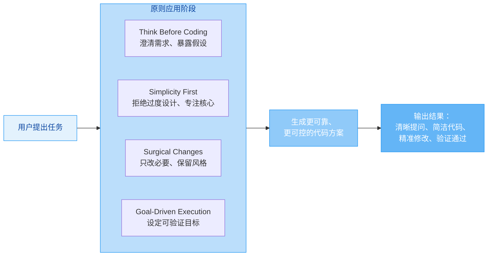

# multica-ai/andrej-karpathy-skills

[GitHub URL](https://github.com/multica-ai/andrej-karpathy-skills)

- **Stars**: 207346

## Karpathy-Inspired Claude Code Guidelines 深度评测

> 通过四大核心原则，让 AI 编程助手从易出错变得精准可控。

- **Tags**: GitHub, Claude, Cursor, 代码规范, 自动化
- **Category**: AI 编程, 开发工具, 效率提升

## Details

# Karpathy-Inspired Claude Code Guidelines：让 AI 编程助手从“灵性”走向“精明”的实用指南
> 一个解决 LLM 编程助手常见问题的配置文件，让 AI 编程助手变得更可靠、更可控。
Andrej Karpathy 在 X 上指出了大语言模型（LLM）在编程时的一些**典型问题**：它们会“替你做错误假设并沉默地沿着这个错误方向走下去”、“不管理困惑、不寻求澄清、不暴露不一致之处”、“喜欢过度设计代码和 API、膨胀抽象层、不清理死代码”。这些观察非常精准，点出了当前 LLM 编程助手的核心痛点。
`multica-ai/andrej-karpathy-skills` 这个 GitHub 项目正是**为了解决这些核心痛点而生**。它通过一个简单的 `CLAUDE.md` 文件，为 Claude Code（或其他 AI 编程助手）注入了四条核心原则，旨在将 LLM 的编程行为从“容易出错的自动驾驶”转变为“谨慎可靠的副驾驶”。
## 🔍 背景与痛点：为什么需要这样的指南？
当前 AI 编程助手（如 Claude Code、GitHub Copilot、Cursor 等）虽然极大提升了开发效率，但它们的行为模式存在一些**系统性缺陷**：
1.  **默认沉默与猜测**：遇到模糊需求时，它们倾向于**沉默地选择一种解释**并执行，而不是主动询问。这就像一个不问同事就自作主张修改代码的开发者，往往会方向跑偏。
2.  **过度工程化倾向**：它们特别喜欢“炫技”，为简单任务构建**复杂的抽象层**和“灵活”的接口，导致代码库膨胀和维护成本上升。为当前不会用、未来可能也不会用的功能预留位置。
3.  **“医生处方”式改动**：在编辑现有代码时，它们有时会**顺手“优化”** 邻近的、与任务无关的代码或注释。这类似于医生看感冒时，顺便建议你做个全身检查，初衷虽好，但超出范围。
4.  **缺乏闭环验证**：它们在执行任务时，**缺乏明确的成功标准**，容易在未完全验证的情况下认为任务已完成，导致隐藏的 bug 或未达预期的行为。
这些问题会**严重浪费开发者时间**，需要反复沟通、审查、回退和修复。Karpathy 的洞察为我们提供了**精准的问题定义**，而这个项目则给出了**系统的解决方案框架**。
## ⭐ 核心亮点与功能剖析
这个项目的核心价值在于它将 Karpathy 的观察**结晶为四条可操作、可验证的原则**，并通过一个简单的配置文件将其注入到 AI 编程助手中。
### 四大核心原则
| 原则 | 核心思想 | 解决的问题 |
| :--- | :--- | :--- |
| **🧠 Think Before Coding (先思考再编码)** | **不要假设，不要隐藏困惑，暴露权衡** | **错误假设、隐藏困惑、缺失权衡** |
| **⚡ Simplicity First (简洁至上)** | **用最少的代码解决问题，不做投机性设计** | **过度复杂、膨胀抽象** |
| **🔪 Surgical Changes (精准手术式修改)** | **只修改必须修改的，只清理自己制造的混乱** | **“附带”改动、未经请求的“优化”** |
| **🎯 Goal-Driven Execution (目标驱动执行)** | **定义成功标准，循环验证直到达成** | **缺乏验证、反复返工** |

### 🔬 深入理解四大原则
#### 1. **Think Before Coding (先思考再编码)**
这是**防止方向性错误的第一道防线**。它强制 AI 在开始编码前进行显式推理。
-   **明确陈述假设**：如果需求有歧义，不要猜，而是**直接询问用户**。
-   **呈现多种解释**：当存在多种理解方式时，不要默默选择一种，而是**列出主要选项供用户选择**。
-   **在必要时推回**：如果发现更简单的方案能达到目的，**主动提出并说明理由**。
-   **困惑时停止**：遇到不理解的地方，**明确指出并请求澄清**，而不是胡乱猜测。
> 💡 **类比**：这就像一个靠谱的顾问，在接手任务前，会先和你明确目标、边界、资源和约束，确保双方理解一致，而不是立即动手。
#### 2. **Simplicity First (简洁至上)**
这是**对抗“过度工程化”的核武器**。它让 AI 专注于解决当前问题，而非构建“完美”但臃肿的解决方案。
-   **不做超出要求的功能**：用户没要的，一概不做。
-   **不为一次性使用的代码创建抽象**：直接写具体实现，复制粘贴也可以。
-   **不做未被请求的“灵活性”或“可配置性”**：提前为可能的变更设计是最大的浪费。
-   **不为不可能的场景添加错误处理**：代码越复杂，bug 越多。
-   **如果200行能变成50行，就重写它**。
> 🧪 **检验标准**：**“高级工程师会觉得这过度设计了吗？”** 如果答案是肯定的，就简化。
#### 3. **Surgical Changes (精准手术式修改)**
这是**确保修改安全、可控的黄金法则**。它将代码改动限定在绝对必要的范围内。
-   **不要“改进”相邻的代码、注释或格式**：即使你觉得写得不好，只要不影响你的任务，就别动。
-   **不要重构没坏的东西**：除非是任务明确要求或由你的改动直接导致。
-   **匹配现有风格**：即使你用不同方式写得更清楚，也要遵循项目的既定风格。
-   **发现无关死代码，提出来但别删**：让项目主人决定。
-   **只清理你自己制造的“孤儿”**：如果你的改动导致某些导入、变量或函数变得无用，**删除它们**。但不要删项目中原本就有的死代码。
> ⚠️ **关键**：**每一行改动都应该能直接追溯到用户的请求**。如果改动解释为“顺便优化一下”，就是违规。
#### 4. **Goal-Driven Execution (目标驱动执行)**
这是**将“把事做对”转化为“事已做对”的关键**。它将模糊的命令转化为明确的、可验证的目标。
-   **将命令式语句转换为声明式目标**：
    -   ❌ “添加验证” → ✅ “为无效输入编写测试，然后让它们通过”
    -   ❌ “修复这个bug” → ✅ “编写一个能复现该bug的测试，然后让该测试通过”
    -   ❌ “重构X” → ✅ “确保重构前后所有测试都通过”
-   **为多步骤任务制定简短计划**：明确步骤和每步的验证点。
    ```bash
    1. [步骤] → 验证: [检查项]
    2. [步骤] → 验证: [检查项]
    3. [步骤] → 验证: [检查项]
    ```
-   **强大的成功标准让AI可以自主循环验证**，而弱标准（“让它工作起来”）则需要反复澄清。
> 💡 **Karpathy 的核心洞察**：**“LLM在满足特定目标方面异常出色……不要告诉它做什么，给它成功标准，然后看着它去达成。”** 这个原则捕捉到了这个精髓。
## 🎯 目标人群与收益：谁最需要它？
### 目标人群
-   **AI 编程助手（尤其是 Claude Code）的重度用户**：如果你每天大量依赖 AI 生成或修改代码，这个工具能极大提升你的**开发效率和代码质量**。
-   **技术团队负责人/代码审查者**：它能帮助你**规范团队使用 AI 的行为**，减少因 AI 导致的“随机”代码膨胀和风格不一致问题，让代码审查更聚焦于业务逻辑而非 AI 的“自由发挥”。
-   **追求高质量、可维护代码的个人开发者**：如果你讨厌 AI 写的“屎山”，喜欢简洁清晰的代码，这个指南就是你的“洁癖守护者”。
-   **Cursor 用户**：该项目专门提供了 Cursor 的项目规则（`.cursor/rules/karpathy-guidelines.mdc`），让同样的指南在 Cursor 中生效。
### 核心收益
1.  **减少沟通成本**：AI 会**主动提问**而非沉默猜测，避免了方向性错误带来的反复修正。
2.  **提升代码质量**：拒绝过度设计，**代码更简洁、更聚焦、更易维护**。
3.  **降低审查风险**：改动更**精准、可追踪**，不会附带“惊喜”或“惊吓”，代码审查更高效。
4.  **节省调试时间**：通过**目标驱动和循环验证**，在生成代码时就能发现并避免许多潜在的 bug，而非在测试或运行时才发现。
5.  **塑造更好的工作流**：它引导用户**以更清晰、更结构化的方式与 AI 交互**，这种习惯反过来也会提升你与人类同事的沟通效率。
## 🆚 竞品/同类对比：它有何独特竞争力？
在 AI 编程助手优化领域，这个项目并非唯一尝试，但其**理念深度和实用性**非常突出。
| 特性维度 | andrej-karpathy-skills | GitHub Copilot | Cursor AI | 其他自定义 Prompt 项目 |
| :--- | :--- | :--- | :--- | :--- |
| **核心理念** | **系统性解决LLM编程缺陷** | **代码补全与生成** | **IDE内AI集成与项目管理** | **特定场景优化** |
| **优势** | **源自权威洞察、原则清晰、可验证、可定制** | **普及度高、接入方便** | **与IDE深度融合、上下文理解强** | **针对性强** |
| **劣势** | **需手动配置、依赖特定AI(Claude)** | **易产生幻觉、缺乏全局思维** | **付费、学习成本** | **碎片化、不成体系** |
| **独特竞争力** | **🔥 提供了一套完整、经过验证的、可操作的原则体系，从根本上改善AI编程行为，而非仅仅修补表面。** |  |  |  |
其独特竞争力在于它**不是另一个 AI 工具，而是一个让现有 AI 工具（尤其是 Claude）变“聪明”的规则引擎**。它没有创造新功能，而是**重新定义了 AI 与开发者的交互范式**，从“模糊命令”到“精准契约”，从“被动猜测”到“主动沟通”，从“炫技输出”到“价值交付”。
## ⚠️ 局限与不足：它不是万能的
尽管这个指南非常强大，但也存在一些**固有的局限性和需要注意的地方**：
1.  **学习曲线**：开发者和 AI 都需要一点时间适应。初期可能会觉得 AI “变得啰嗦了”，因为它开始问很多问题。**这是好事，但需要耐心**。
2.  **效率权衡**：指南本身指出，这些原则**偏向谨慎而非速度**。对于**微不足道的任务**（如简单的拼写修正、明显的一行修改），应用全套流程可能过于繁琐。**需要用判断力**，并非每次更改都需要全套严谨。
3.  **生态绑定**：当前实现主要针对 **Claude Code** 和 Cursor。虽然理念通用，但若你主要使用其他 AI 编程助手（如 GitHub Copilot Chat、Tabnine 等），需要自行转换或寻找类似方案。
4.  **不能替代人类审查**：它极大提升了 AI 的可靠性，但**不能完全替代人类的代码审查和测试**。AI 仍然可能产生幻觉或遇到未被覆盖的边缘情况。终极信任仍需建立在理解和验证上。
5.  **依赖项目结构**：其“精准修改”原则高度依赖于良好的项目结构和清晰的代码组织。在代码本身混乱不堪的项目中，AI 也难以准确判断“必要”和“不必要”的改动边界。
## 🚀 结语与行动建议：我的终极评判
**`andrej-karpathy-skills` 是一个“小而美”、“专而精”的神器。** 它用一个简洁的文件，撬动了 AI 编程助手行为模式的大改善，其**性价比和投入产出比极高**。
-   **如果你是 Claude Code 或 Cursor 的用户**：**立即安装并尝试它**。它可能会彻底改变你与 AI 编程的交互体验，从“希望它别乱来”变为“信任它能靠谱地工作”。
-   **如果你是技术负责人**：**考虑将此指南作为团队使用 AI 的规范**。它能帮你建立一套清晰的“AI 编程契约”，减少沟通成本，提升代码库的长期健康度。
-   **如果你是追求效率的开发者**：**即使你暂时不用，其核心思想也值得深思**。“Think Before Coding”、“Simplicity First”、“Surgical Changes”、“Goal-Driven”这些原则不仅适用于 AI，也是优秀工程师的日常实践。
> **🌟 总结一句话**：它让 AI 编程助手从“一个可能会自作主张的聪明实习生”，成长为一个“懂得何时提问、何时简化、如何精准执行、并能自我验证的专业副驾驶”。对于任何希望将 AI 编程助手转化为**可信赖、可预测、高价值生产力工具**的开发者来说，这都是一个**不可或缺的配置项**。
### 📖 安装与使用指南
你可以通过两种方式安装这个指南：
#### **选项 A：通过 Claude Code 插件（推荐）**
```bash
# 1. 先添加市场
/plugin marketplace add forrestchang/andrej-karpathy-skills
# 2. 然后安装插件
/plugin install andrej-karpathy-skills@karpathy-skills
```
这会将指南作为 Claude Code 插件安装，使其在所有项目中可用。
#### **选项 B：通过 CLAUDE.md 文件（按项目）**
```bash
# 新项目
curl -o CLAUDE.md https://raw.githubusercontent.com/forrestchang/andrej-karpathy-skills/main/CLAUDE.md
# 已有项目（追加内容）
echo "" >> CLAUDE.md
curl https://raw.githubusercontent.com/forrestchang/andrej-karpathy-skills/main/CLAUDE.md >> CLAUDE.md
```
这会将指南内容写入你项目的 `CLAUDE.md` 文件中。
#### **自定义与扩展**
你可以将这些指南与**项目特定的规则合并**。在你的 `CLAUDE.md` 中添加类似以下内容：
```markdown
## 项目特定指南
- 使用 TypeScript 严格模式
- 所有 API 端点必须有测试
- 遵循 `src/utils/errors.ts` 中现有的错误处理模式
```
这样，AI 就会同时遵循通用原则和项目规范。
开始使用吧，让你的 AI 编程助手真正为你所用，而不是让你为它所用。
