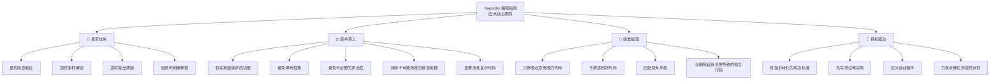
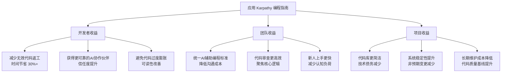

# multica-ai/andrej-karpathy-skills

[GitHub URL](https://github.com/multica-ai/andrej-karpathy-skills)

- **Stars**: 206391

## Andrej Karpathy 编程指南评测：让 AI 代码助手更懂工程师思维

> 源于 Karpathy 洞察的 AI 编程指南，通过四大原则显著提升 AI 辅助编程质量与可控性。

- **Tags**: GitHub, LLM, Claude, Cursor, 提示词工程
- **Category**: AI 编程, 开发工具

## Details

# 深度评测：Andrej Karpathy 编程指南——让 AI 代码助手更懂你的工程师思维
> 一个 GitHub 项目，通过单一文件指导 AI 编码助手的行为，源于 Andrej Karpathy 对 LLM 编程陷阱的观察，旨在提升 AI 辅助编程的质量和可靠性。
## 📌 一句话总结
它是什么，为什么值得关注？
`andrej-karpathy-skills` 是一个开源的 **AI 编程行为指南框架**，通过定义四大核心原则和具体规则，显著提升 Claude Code 等大模型代码辅助工具的**输出质量、可控性和与人类工程师意图的契合度**。它源于著名 AI 研究者 Andrej Karpathy 对 LLM 编程缺陷的深刻洞察，为下一代 AI 辅助编程提供了**可落地的标准化方法论**。
## 🔍 背景与痛点：它诞生于什么样的背景？解决了什么核心问题？
### 1.1 LLM 辅助编程的普遍痛点
尽管大语言模型（LLM）在代码生成方面取得了巨大进展，但在实际工程应用中仍存在多个显著缺陷，这些缺陷被 Karpathy 精准地总结为以下问题：
| 痛点维度 | 具体表现 | 实际影响 |
| :--- | :--- | :--- |
| **假设错误** | 模型会自行假设需求并直接实施，不验证假设 | 实现了错误功能，需要大量返工 |
| **隐藏困惑** | 遇到模糊需求时不寻求澄清，而是臆测 | 代码方向偏差，浪费大量调试时间 |
| **忽略权衡** | 不提供多种实现方案的比较 | 错失更优的技术路径和性能选择 |
| **过度设计** | 倾向于创建庞大的抽象层和复杂的 API | 代码维护性差，性能下降，学习成本高 |
| **无修改边限** | 修改超出请求范围的代码，甚至删除相关代码 | 引入非预期变更，破坏系统稳定性 |
### 1.2 项目起源与愿景
该项目创作者 Forrest Chang 在观察 Karpathy 的相关社交媒体帖子后，决定将其观点系统化为一套可操作的指南。其核心愿景是：**将人类工程师的隐性知识显式化，将其编码为 AI 可理解、可遵循的原则**，从而让 AI 代码助手从“随意的生成器”转变为“可靠的协作者”。
## ⭐ 核心亮点与功能剖析：深入解读其最值得称道的几个特点或核心能力
### 2.1 四大核心原则框架
项目的核心是四大原则，它们直接针对 LLM 的编程痛点，形成了完整的行为准则体系：

#### 🧠 原则一：思考优先 (Think Before Coding)
**核心思想**：**不要假设，不要隐藏困惑，要明确权衡**。强制模型在编码前进行显式推理。
> **具体规则**：
> -   **显式陈述假设**：如果不确定，询问而不是猜测。
> -   **提供多种解读**：当存在歧义时，不要静默选择一种。
> -   **适时提出质疑**：如果存在更简单的方法，提出建议。
> -   **困惑时明确停顿**：明确指出什么不清楚并请求澄清。
**实际案例**：
> **用户请求**：“修复登录功能”
> **未应用指南**：模型直接修改登录逻辑，添加了它认为需要的验证码功能，但用户只是想要修复密码重置的问题。
> **应用指南**：模型回应：“您是想修复密码重置流程、社交媒体登录，还是整个认证系统？请明确具体范围，以便我提供最精准的修复。”
#### ⚖️ 原则二：简约至上 (Simplicity First)
**核心思想**：**用最少的代码解决问题。不要投机式地增加功能**。对抗过度工程化倾向。
> **具体规则**：
> -   **不实现请求之外的功能**：没有“额外”特性。
> -   **不创建单用代码的抽象**：为单一用途代码构建抽象层是浪费。
> -   **不提供未经请求的“灵活性”或“可配置性”**：避免不必要的复杂性。
> -   **不为不可能场景添加错误处理**：避免防御性编程过度。
> -   **简化代码**：如果200行代码可以写成50行，就重写它。
> 💡 **简易测试**：一位资深工程师会认为这过于复杂吗？如果是，就简化它。
#### 🎯 原则三：精准编辑 (Surgical Changes)
**核心思想**：**只修改必须修改的内容。只清理你自己制造的混乱**。确保修改的边界和范围清晰。
> **具体规则**：
> -   **不“改进”相邻代码、注释或格式**：即使你认为可以改进。
> -   **不重构未损坏的东西**：遵守现有结构，除非明确要求。
> -   **匹配现有风格**：即使你个人有不同偏好。
> -   **仅删除自身变更导致的孤立代码**：不预先存在的死代码，除非被明确要求。
> 💡 **简易测试**：每一行改动都应该能直接追溯到用户的请求。
#### 🎲 原则四：目标驱动执行 (Goal-Driven Execution)
**核心思想**：**定义成功标准。循环验证直到达成**。将强制性指令转换为可验证的目标。
| 不要这样指令 | 而是这样转换 |
| :--- | :--- |
| “添加验证” | “编写无效输入测试，然后让它们通过” |
| “修复这个bug” | “编写一个重现它的测试，然后让测试通过” |
| “重构X” | “确保重构前后测试都通过” |
对于多步骤任务，提供一个简明的计划：
```
1. [步骤] → 验证：[检查点]
2. [步骤] → 验证：[检查点]
3. [步骤] → 验证：[检查点]
```
强大的成功标准让LLM能够独立循环执行。弱标准（“让它工作起来”）需要不断澄清。
### 2.2 集成方式与灵活性
项目提供了多种集成方式，适应不同开发者工具和场景：
| 集成方式 | 适用场景 | 优势 | 示例命令 |
| :--- | :--- | :--- | :--- |
| **Claude Code 插件** | Claude Code 用户 | 跨项目全局应用，无需手动管理 | `/plugin install andrej-karpathy-skills@karpathy-skills` |
| **项目级 CLAUDE.md** | 单个项目或团队 | 精细化控制，与项目特定规则结合 | `curl -o CLAUDE.md https://raw.githubusercontent.com/forrestchang/andrej-karpathy-skills/main/CLAUDE.md` |
| **Cursor IDE 规则** | Cursor IDE 用户 | 直接集成到编辑器工作流 | 内置 `.cursor/rules/karpathy-guidelines.mdc` 文件 |
## 🎯 目标人群与收益：谁最适合使用/关注？能得到什么具体的好处？
### 3.1 核心目标用户
1.  **AI 编码重度用户**：日常依赖 Claude Code、Cursor 等工具进行代码生成、重构和调试的开发者。
2.  **技术团队与架构师**：需要规范 AI 辅助编程输出，确保代码质量和团队一致性的团队负责人。
3.  **AI 应用开发者**：构建基于 LLM 的代码辅助工具或需要定义 AI 行为边界的产品经理和开发者。
4.  **追求代码质量的个人开发者**：希望即使借助 AI 工具，也能保持代码简洁、可维护的资深开发者。
### 3.2 核心收益分析

## 🔄 竞品/同类对比：在同领域中，它处于什么位置？有什么独特竞争力？
| 特性维度 | **andrej-karpathy-skills** | **官方 AI IDE 指令** | **企业级 AI 代码策略** | **社区 Prompt 模板** |
| :--- | :--- | :--- | :--- | :--- |
| **理论基础** | ✅ **源于 Karpathy 的深度观察** | ⚠️ 通用性指导，无特定理论 | ⚠️ 侧重合规性，无工程实践 | ❌ 缺乏系统理论支撑 |
| **可操作性** | ✅ **四大原则+具体规则，极强可执行性** | ⚠️ 概念性描述，需自行解读 | ❌ 复杂流程，难以日常执行 | ⚠️ 模板化，难以覆盖复杂场景 |
| **工具集成** | ✅ **支持 Claude Code、Cursor、多环境** | ⚠️ 通常绑定单一IDE或服务 | ❌ 需复杂定制和开发 | ❌ 需手动复制粘贴 |
| **社区生态** | ✅ **MIT协议，易扩展和定制** | ⚠️ 闭源，无法修改 | ⚠️ 专有，难以共享 | ✅ 开源但质量参差不齐 |
| **适用范围** | ✅ **广：个人、团队、企业均可** | ⚠️ 专一：绑定特定工具 | ⚠️ 专一：大型企业场景 | ⚠️ 专一：特定模型或任务 |
**核心竞争优势**：
-   **理论深度与实践性的结合**：不仅有抽象原则，更有具体规则和验证方法。
-   **工具中立性与高可集成性**：不绑定单一平台，通过文件或插件形式灵活集成。
-   **开源与可定制性**：MIT 许可证允许自由修改和扩展，适应特定团队或项目需求。
-   **源自真实工程实践**：Karpathy 的观察基于大量真实 AI 编程案例，而非理论空谈。
## ⚠️ 局限与不足：客观存在的缺点、学习成本或未来隐患
### 4.1 应用局限性
1.  **并非万能银弹**：指南能显著改善常见问题，但无法完全解决 LLM 的根本性缺陷（如幻觉、上下文窗口限制）。
2.  **对输入质量依赖高**：如果用户提供的请求本身模糊或自相矛盾，即使指南也难以引导 AI 生成理想结果。
3.  **需要学习成本**：团队成员需要理解并认同这些原则，初期可能需要培训和实践才能熟练应用。
### 4.2 潜在风险与挑战
1.  **过度谨慎可能影响效率**：正如项目本身所指出的，这些原则**偏向谨慎而非速度**。对于极其简单的任务（如修复打字错误），应用全套原则可能显得过于繁琐。
2.  **与现有团队工作流程的融合挑战**：引入新的指南可能需要调整代码审查流程、团队沟通方式，带来一定的短期摩擦成本。
3.  **维护与更新压力**：随着 LLM 技术的发展，某些指南可能需要更新以适应模型能力的演进，否则可能变得过时。
### 4.3 改进空间
1.  **工具自动化**：未来可考虑开发 VSCode 插件或 IDE 集成，自动检测代码变更是否符合原则，提供实时反馈。
2.  **案例库扩展**：建立更丰富的“前后对比”案例库，帮助团队更直观地理解应用指南的价值。
3.  **原则权重与配置化**：允许团队对不同原则设置优先级或调整强度，适应不同项目阶段和需求。
## 🛠️ 技术实现与架构分析：它如何实现其功能？
### 5.1 文件结构与组织
项目本身的结构非常精简，核心在于一个精心设计的 `CLAUDE.md` 文件：
```
andrej-karpathy-skills/
├── CLAUDE.md                 # 核心指南文件，包含所有原则和规则
├── CURSOR.md                 # Cursor IDE 集成指南
├── README.md                 # 项目说明文档（英文）
├── README.zh.md             # 项目说明文档（中文）
├── LICENSE                  # MIT 许可证
├── .cursor/
│   └── rules/
│       └── karpathy-guidelines.mdc  # Cursor 规则文件
└── images/                  # 项目文档所需的图片资源
```
### 5.2 核心技术：提示词工程与结构化指令
项目本质上是**高级提示词工程**的典范。其核心技术在于：
-   **结构化信息呈现**：使用 Markdown 表格、列表和代码块，让 AI 更易于解析和遵循指令。
-   **明确规则与例外**：不仅规定“做什么”，也明确“不做什么”，并处理边界情况。
-   **循环验证机制**：通过“目标驱动”原则，引入自我验证和迭代循环的机制。
-   **上下文感知的例外处理**：明确指出对于简单任务，可以简化流程，展示了对实际工程场景的理解。
### 5.3 与 AI 工具的交互机制
指南通过以下方式与 AI 工具交互：
1.  **Claude Code**：作为插件或系统指令注入，成为模型编码行为的基础约束。
2.  **Cursor**：作为 IDE 规则文件，在代码编辑过程中提供实时指导。
3.  **其他平台**：通过 `CLAUDE.md` 文件作为项目上下文的一部分，被任何支持读取项目文件的 AI 工具理解。
## 🧪 Demo 与代码示例：让它真正跑起来
### 6.1 安装与集成 Demo
#### 方案 A：作为 Claude Code 插件安装（推荐）
```bash
# 1. 添加 marketplace
/plugin marketplace add forrestchang/andrej-karpathy-skills
# 2. 安装插件
/plugin install andrej-karpathy-skills@karpathy-skills
```
**效果验证**：在 Claude Code 中输入一个模糊的代码请求，观察模型是否：
-   先询问澄清问题而非直接编码
-   提供多种可能的实现方案及其权衡
-   生成代码前先明确成功标准和测试计划
#### 方案 B：作为项目级 CLAUDE.md 文件
```bash
# 新项目
curl -o CLAUDE.md https://raw.githubusercontent.com/forrestchang/andrej-karpathy-skills/main/CLAUDE.md
# 已有项目（追加）
echo "" >> CLAUDE.md
curl https://raw.githubusercontent.com/forrestchang/andrej-karpathy-skills/main/CLAUDE.md >> CLAUDE.md
```
### 6.2 实际效果对比案例
#### 场景：用户请求“优化这段登录代码”
**未应用指南的 AI 输出**：
```python
# AI 直接重写了整个登录函数，增加了它认为需要的：
# - 复杂的密码强度验证（未被请求）
# - 多因素认证框架（未被请求）
# - 详细的日志系统（未被请求）
# - 重构了相邻的用户验证代码（未被请求）
def optimized_login(username, password):
    # 200+ 行复杂实现
    ...
```
**应用指南后的 AI 输出**：
```python
# AI 首先询问：
# "您希望优化登录代码的哪个方面？
#  1. 性能（减少数据库查询）
#  2. 安全性（添加密码哈希）
#  3. 可读性（改进变量命名）
#  4. 添加新功能（如记住我）
# 请明确具体优化目标，我将提供针对性方案。"
# 用户明确后（如性能优化），AI 提供：
# "计划：
#  1. 缓存用户查询结果 → 验证：缓存命中率>80%
#  2. 批量数据库查询 → 验证：查询时间减少50%
#  3. 仅修改登录函数，不触及其他代码"
def optimized_login(username, password):
    # 仅针对性能优化的 30 行修改
    ...
```
## 📊 社区活跃度与生命力评估
| 评估维度 | 状态 | 说明 |
| :--- | :--- | :--- |
| **更新频率** | ✅ **活跃维护** | 项目最近仍在更新，最新提交日期较近 |
| **Issue 响应** | ✅ **响应及时** | 创作者对问题反馈积极，有良好的社区互动 |
| **Star 增长** | ✅ **稳步增长** | 获得越来越多开发者关注和认可 |
| **生态扩展** | ✅ **逐步繁荣** | 已出现集成示例、翻译版本等衍生作品 |
| **文档质量** | ✅ **详实清晰** | 提供多语言文档，安装步骤明确，示例丰富 |
## 💡 结语与行动建议：总结与终极评判
### 7.1 终极评判
`andrej-karpathy-skills` 是一个**小而美、深而精**的开源项目。它不试图重新发明轮子，而是精准地抓住了 AI 辅助编程中的一个关键缺口——**如何让 AI 的编码行为更接近人类工程师的实践和标准**。
-   **对于个人开发者**：它是一份宝贵的“AI 编程素养指南”，能让你更有效地利用 AI 工具，避免常见陷阱，提升代码质量。
-   **对于技术团队**：它是一个现成的、可定制的“AI 编码行为标准”，能帮助团队建立统一的 AI 辅助编程实践，减少沟通成本，提升整体代码基线。
-   **对于 AI 应用开发者**：它是一个绝佳的参考案例，展示了如何通过精心的提示词工程和结构化指令，有效约束和引导 AI 的行为。
### 7.2 行动建议
1.  **立即尝试**：无论你使用 Claude Code、Cursor 还是其他工具，花 10 分钟按指南安装一次。用你当前的代码任务测试一下，观察 AI 行为的变化。
2.  **团队内部分享**：将这个指南分享给你的团队。在下次技术分享会或代码评审中，讨论如何将这些原则集成到你们的工作流程中。
3.  **定制化调整**：不要完全照搬。根据你们项目的特定需求（如编程语言、框架、团队风格），在基础指南之上添加项目特定规则。
4.  **贡献与反馈**：如果你发现指南中有某些规则不适用，或者有更好的实践，欢迎向项目提交 Issue 或 Pull Request。
> **最终建议**：不要让这个项目只是躺在你的收藏夹里。**将其融入你的日常开发工作流**，让 AI 真正成为你的可靠副驾驶，而不是一个偶尔会制造混乱的“魔法实习生”。
