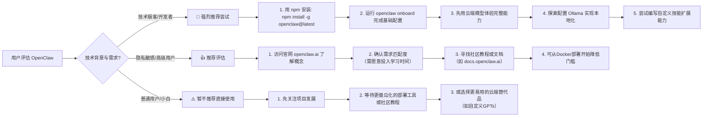

# openclaw/openclaw

[GitHub URL](https://github.com/openclaw/openclaw)

- **Stars**: 387392
- **Language**: TypeScript

## OpenClaw 深度评测：你的专属个人 AI 助手

> 开源、自托管、跨平台的本地 AI 智能体系统，旨在保障数据隐私并实现任务自动化。

- **Tags**: 开源项目, AI智能体, 数据隐私, 自动化, Ollama
- **Category**: AI 编程, 开发工具, 生活效率

## Details

# OpenClaw 深度评测：你的专属个人 AI 助手，未来已来 🦞
## 一句话总结
OpenClaw 是一个**开源、自托管、跨平台**的 AI 智能体系统，它能在你本地机器上运行，并通过你偏爱的消息平台（如 Telegram、Signal、iMessage 等）接收指令，执行复杂任务，最终实现“**你的 AI 为你工作，而不是公司为你工作**”的愿景。它非常适合重视数据隐私、需要高度定制化和自动化任务的技术极客、开发者及高级用户。
---
## 背景与痛点：为什么我们需要 OpenClaw？
### 1.1 数据主权与隐私的呼唤
在 ChatGPT、Claude 等云端 AI 服务盛行的时代，一个核心痛点日益凸显：**你的数据流向了哪里？** 每次与这些服务交互，你的对话、上下文甚至代码片段都可能被收集到公司的服务器上，用于模型训练或商业分析。对于处理敏感数据、需要严格隐私保护的个人或企业来说，这是一个不可接受的妥协。
OpenClaw 的诞生就是为了解决这个问题。它采用**完全本地化**的部署方式（当然也支持云端），所有处理过程在你的机器上完成，你的数据**从未离开你的掌控**。这就像为你自己的数据筑起了一道坚不可摧的防火墙。
### 1.2 自动化任务的繁琐与成本
开发者、内容创作者或任何需要频繁重复操作特定工作流的人，都深陷于“复制-粘贴-执行”的循环中。虽然有了 GitHub Actions、Zapier 等自动化工具，但它们通常缺乏**智能决策能力**和**自然语言交互**的灵活性。
OpenClaw 不仅是一个工具，更是一个**具备规划和执行能力的智能体**。你可以用自然语言告诉它“帮我每天早上整理一下头条新闻并生成摘要”，它就能自动规划、分步执行、并在 Telegram 上给你结果。其背后的**成本控制**也是一大亮点：通过使用本地模型（如 Ollama）或混合云策略，避免了单纯依赖云端 API 可能产生的高额账单（有用户报告在 Claude 上单周消耗超过$200）。
### 1.3 “Any OS, Any Platform” 的愿景
OpenClaw 的口号是 **“Any OS. Any Platform. The lobster way.”**。这意味着它致力于成为一款**真正通用、无缝集成到你现有数字生活**的 AI 助手，无论你使用 macOS、Windows 还是 Linux，无论你习惯在 Telegram、WhatsApp 还是 Slack 上沟通，它都能无缝嵌入，为你提供统一、强大的智能服务。
---
## 核心亮点与功能剖析
### 🔥 2.1 多模型支持与灵活配置（你的大脑，你选）
OpenClaw 最大的亮点之一是其**与底层大模型解耦**的设计。它不依赖单一模型，而是通过一个统一的配置文件 `~/.openclaw/openclaw.json` 来管理不同的 AI 提供商（Provider）。
```json
// ~/.openclaw/openclaw.json
{
  "providers": {
    "anthropic": {
      "apiKey": "sk-ant-your-key-here"
    },
    "openai": {
      "apiKey": "sk-your-key-here"
    },
    "ollama": {
      "apiBase": "http://localhost:11434/v1"
    }
  },
  "agents": {
    "defaults": {
      "model": "anthropic/claude-opus-4-5"
    }
  }
}
```
这意味着你可以：
-   **混合使用模型**：让 Claude 处理复杂推理，GPT-4o 处理创意任务，Llama3 处理简单的日常查询，甚至根据任务动态切换。
-   **完全本地运行**：通过配置 Ollama 提供商，所有请求都经过你本地的模型（如 Llama3:8b），**实现零成本、绝对隐私**的体验。当然，本地模型的智能程度与云端旗舰模型有差距，但对于许多任务已足够。
-   **成本优化**：为不同类型的任务分配不同成本和能力的模型，精细控制 API 费用。
### 🧩 2.2 强大的智能体系统与工具集成
OpenClaw 的核心是一个**智能体（Agent）运行时**，它不仅理解自然语言，更能**规划、分解任务、调用工具并执行**。其配置系统非常灵活，支持：
-   **注入提示文件**：如 `AGENTS.md`, `SOUL.md`, `TOOLS.md` 等用于定义智能体的行为模式、性格和可用工具。
-   **技能（Skills）系统**：你可以编写自定义的“技能”，即用自然语言描述的具体任务逻辑，并存放在 `~/.openclaw/workspace/skills/<skill>/SKILL.md`。这极大地扩展了其能力边界。
-   **丰富的工具生态**：它内置或可以轻松集成各种工具来访问文件系统、执行终端命令、查询网页、操作数据库等，从而真正“做事情”，而不仅仅是“说说话”。
### 🤝 2.3 无缝集成消息平台
OpenClaw 通过你**日常使用的消息应用**与你交互。支持 Telegram、Signal、iMessage、Slack、WhatsApp 等多种平台。这意味着你无需打开新应用，只需在熟悉的聊天界面里发送指令，就能得到 AI 的帮助。这种设计极大地降低了使用门槛，使其能真正融入你的工作流。
### 🛠️ 2.4 精心设计的开发者体验（DX）
对于开源项目，上手难度至关重要。OpenClaw 提供了**多种安装方式**，极大地简化了部署流程：
```bash
# 使用 npm 一键安装（推荐）
npm install -g openclaw@latest
openclaw onboard --install-daemon
# 从源码安装（适合贡献者）
git clone https://github.com/openclaw/openclaw.git
cd openclaw
pnpm install && pnpm build && pnpm ui:build
pnpm link --global
openclaw onboard --install-daemon
```
`openclaw onboard` 命令会引导你完成初始设置，包括配置连接的消息平台等。其官方文档（[docs.openclaw.ai](https://docs.openclaw.ai)）也相当清晰完善。
---
## 目标人群与收益：谁最适合用？能得到什么？
| 目标用户 | 核心收益 | 典型使用场景 |
| :--- | :--- | :--- |
| **👨‍💻 开发者与极客** | **自动化繁琐任务**（如部署、测试、代码审查）、**构建个人知识库问答**、**本地开发环境AI助手** | “帮我检查一下PR里的潜在安全问题”、“把这个项目的所有TODO整理成列表” |
| **🔒 隐私敏感型用户** | **数据绝对本地化**、**零数据泄露风险**、**无需信任第三方** | 处理机密文档、个人财务数据、健康记录的查询与总结 |
| **🚀 高级内容创作者/运营** | **自动化内容生产与分发**、**社交媒体管理**、**数据分析与报告生成** | “帮我监控Twitter上关键词，并生成每日热点简报”、“自动整理并发布博客文章” |
| **🏢 中小企业/团队** | **低成本内部AI助手**、**定制化工作流自动化**、**降低对昂贵SaaS依赖** | 自动化客户支持初筛、内部文档查询、生成营销文案、协助项目管理 |
**💡 核心收益总结**：
-   **提升效率**：将重复性任务自动化，释放时间和创造力。
-   **降低成本**：通过使用本地模型或混合策略，显著减少AI API调用费用。
-   **增强控制**：数据所有权和AI行为完全掌控在自己手中，可高度定制。
-   **无缝集成**：融入现有沟通工具，学习成本低，使用体验流畅。
---
## 竞品/同类对比：它处于什么位置？
| 特性维度 | **OpenClaw** | **AutoGPT / AgentGPT** | **LangChain** | **云端AI助手（如ChatGPT）** |
| :--- | :--- | :--- | :--- | :--- |
| **定位** | **自托管、平台级个人AI智能体** | 实验性、研究导向的AI智能体框架 | **AI应用开发框架** | 云端、通用目的AI对话服务 |
| **部署方式** | **本地/自托管**（支持Docker） | 本地/云端 | 本地/云端（库） | **纯云端** |
| **数据隐私** | **★★★★★ 完全本地可控** | ★★★★☆ 本地可控但配置复杂 | ★★★☆☆ 取决于实现 | ★☆☆☆☆ 数据上传至云端 |
| **易用性** | ★★★★☆ **配置后交互简单** | ★★☆☆☆ 需要较强技术能力 | ★★☆☆☆ 需要编程开发 | ★★★★★ 开箱即用，零配置 |
| **定制化** | ★★★★★ **极高（通过配置与技能）** | ★★★★☆ 高（通过代码） | ★★★★★ **极强（通过编程）** | ★★☆☆☆ 有限（通过插件/功能） |
| **集成能力** | ★★★★★ **深度集成消息平台与本地系统** | ★★★☆☆ 有限 | ★★★★★ **可集成任意API与服务** | ★★★☆☆ 有限（通过官方集成） |
| **成本** | **★★★★★ 可零成本（本地模型）** | ★★★☆☆ 可能产生API成本 | ★★★☆☆ 取决于后端模型 | ★★☆☆☆ 按使用量计费，潜在成本高 |
**🎯 独特竞争力**：
OpenClaw 填补了 **“用户友好、隐私优先、高度可集成的个人AI智能体”** 这一市场空白。它比 AutoGPT 更易用和成熟，比 LangChain 更面向最终用户而非开发者，比云端AI助手更注重隐私和本地化。其 **“消息平台作为前端”** 的设计理念使其能真正融入用户的数字生活，而非成为一个孤岛应用。
---
## 局限与不足：客观看待它的缺点
### ⚠️ 3.1 技术门槛与学习成本
虽然提供了安装脚本和引导，但对于**完全没有技术背景的用户**，初次配置（尤其是设置本地模型或处理API密钥）仍有相当难度。理解 `openclaw.json` 配置、编写技能（SKILL.md）也需要一定的逻辑思维和文档阅读能力。
### ⚠️ 3.2 本地模型的性能权衡
完全本地运行虽然免费且隐私，但**本地模型的智能程度、响应速度和稳定性远不及云端旗舰模型（如GPT-4o, Claude 3.5 Sonnet）**。对于复杂推理、创意写作或需要大量上下文的任务，体验可能不佳。**混合部署**是更现实的选择，但这又增加了配置复杂度。
### ⚠️ 3.3 生态与社区活跃度
作为开源项目，其**生态成熟度和社区规模**远不及 ChatGPT 或 LangChain。虽然文档不错，但第三方教程、插件、技能分享资源相对较少。遇到问题时，可能需要更多自行摸索或查阅源码。
### ⚠️ 3.4 资源消耗与稳定性
运行一个智能体框架，尤其是同时连接多个消息平台并保持心跳检测，**会对本地计算机资源（CPU、内存）造成一定压力**。同时，作为仍在快速迭代的项目，**稳定性可能不如商业软件**，偶尔遇到Bug或更新导致的不兼容也在所难免。
---
## 结语与行动建议：我的终极评判
### 🏆 综合评分：4.2/5.0
OpenClaw 是一个**极具前瞻性和实用价值的开源AI项目**。它抓住了“**数据主权**”和“**个人智能体**”两大未来趋势，并提供了相当出色的解决方案。虽然目前对技术用户更友好，但其潜力和愿景令人兴奋。
### 🧭 给不同用户的行动建议

### 🔮 未来展望
OpenClaw 的愿景——一个**真正属于你的、能融入你所有数字生活的AI助手**——无疑是激动人心的。若其能继续降低用户上手门槛（如提供图形化配置界面）、进一步优化与本地模型的集成性能、并繁荣社区生态，它完全有可能成为下一代个人计算的核心界面之一。
> **💡 最后提醒**：开源项目的发展速度惊人。今天的局限可能明天就被解决。如果你对其理念感兴趣，不妨给它一个 Star（[github.com/openclaw/openclaw](https://github.com/openclaw/openclaw)），保持关注，或许在不久的将来，它就能成为你数字生活中不可或缺的“龙虾”伙伴。
