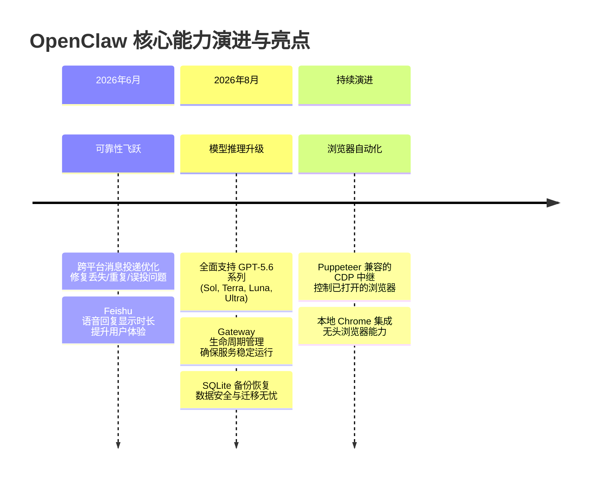
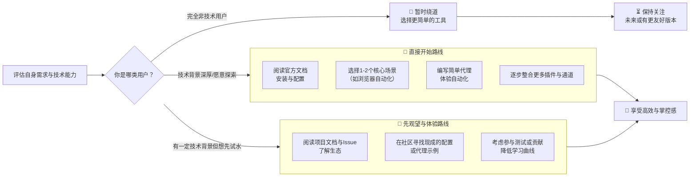

# openclaw/openclaw

[GitHub URL](https://github.com/openclaw/openclaw)


## OpenClaw：开源个人 AI 助手与自动化工作流中枢

> 一个强大且可高度定制的跨平台开源个人 AI 助手，助你全方位掌控数字工作流。

- **Tags**: 开源, 自动化, AI助手, 工作流, 浏览器自动化
- **Category**: AI 编程, 生活效率, 开发工具

## Details

# OpenClaw 深度评测：你的开源个人 AI 助手——全方位掌控工作流，一个都不许少 🦞
> GitHub 上一颗闪亮的星，OpenClaw 用开源的方式，把“个人 AI 助手”从概念拉到了现实，它可能正悄悄改变你与数字世界交互的方式。
## 📌 一句话总结
**OpenClaw** 是一个**强大、可高度定制、且跨平台的开源个人 AI 助手框架**。它让你能在任何操作系统、任何平台上，通过统一的界面和深度整合，将 AI 能力无缝融入你的日常工作流、自动化任务和知识管理中，其核心魅力在于**极致的灵活性、强大的插件生态和开放的精神**。
## 🔍 背景与痛点：它为何而生？
想象一下，你的数字生活如同一个**纷乱的国际机场**：代码在 GitHub 上、沟通在 Telegram、日程在日历、知识库在 Notion、文件在本地磁盘……而你，就像一个疲惫的塔台指挥官，不停地在这些“航班”间穿梭、切换、协调。这是现代知识工作者共同的痛点：**信息分散、工具割裂、重复劳动、效率低下**。
传统的 AI 助手（如 ChatGPT 网页版、Copilot）往往：
*   **是“客人”而非“主人”**：它们存在于浏览器或特定应用中，无法深入你的系统底层。
*   **缺乏深度整合**：无法与你的邮件、即时通讯、代码库、本地文件等核心数据源无缝联动。
*   **定制能力有限**：难以针对你独特的工作流进行自动化编排和个性化指令。
*   **存在隐私与安全顾虑**：将敏感数据发送至云端处理，总让人心有戚戚焉。
**OpenClaw 诞生的使命，就是解决这些痛点**。它的愿景是成为一个**“数字管家”**，一个能被你完全掌控、深度部署于本地或你信任的云环境中、并能像一位经验丰富的秘书一样，**主动**而非被动地协助你管理数字生活的智能中枢。它遵循“**The lobster way**”（龙虾之道，寓意坚毅与强大），致力于为你打造一个真正属于个人、能适应任何环境的 AI 助手。
## ⭐ 核心亮点与功能剖析
OpenClaw 的强大源于其精心设计的架构和不断演进的特性。其核心亮点可概括为：

### 1. 🤖 无与伦比的模型支持与灵活性
OpenClaw 对最新 AI 模型的支持**非常迅速且全面**。最新版本已支持 **GPT-5.6 Sol, Terra, Luna, 和 Ultra** 等多种推理模型。这意味着你可以：
*   **自由选择**：根据任务复杂度和成本预算，在不同模型间切换。
*   **本地化部署**：支持通过 API 密钥连接 OpenAI 等服务，也支持部署本地模型（通过 Codex 运行时）。
*   **未来就绪**：框架设计对模型切换保持中性，新模型出现后能快速集成。
### 2. 🌐 无处不在的通道整合 (Channels)
这是 OpenClaw 的**杀手锏**。它像一个万能适配器，能将 AI 能力注入你使用的各种平台：
*   **即时通讯**：Telegram、WhatsApp、Matrix、Google Chat、iMessage、飞书 (Feishu)、Mattermost 等。
*   **开发平台**：与 GitHub Actions、Issues 深度集成。
*   **工作流自动化**：可作为其他工具（如 Zapier、IFTTT）的触发器或执行器。
**其卓越之处在于，它针对这些通道做了大量可靠性优化**。例如，修复了 Google Chat 消息路由问题、飞书语音回复显示时长等，确保**回复、命令、队列消息和附件更不易丢失、重复或误投**，这极大地提升了它的实用性和信任度。
### 3. 🧩 强大的插件生态与自动化 (Agents & Capabilities)
OpenClaw 通过**插件 (Plugins)** 和**代理 (Agents)** 体系扩展其核心能力：
*   **内置工具**：如 `browser` 插件，可通过 Chrome DevTools Protocol (CDP) 控制本地或远程的 Chrome 浏览器，实现网页操作、数据抓取、自动化测试等。
*   **自定义代理**：你可以编写 JavaScript/TypeScript 脚本，定义复杂的、多步骤的自动化任务。例如，一个“会议助手”代理可以：在日历中查找会议 → 查找参会人资料 → 准备议程 → 发送邀请 → 记录会议纪要并归档。
*   **记忆与上下文**：通过 `memory-core` 等插件，AI 能拥有持久化记忆，理解你的长期偏好和历史对话，使交流更自然高效。
### 4. 🛠️ 友好的开发者体验与部署 (Gateway & CLI)
OpenClaw 提供了一个名为 **Gateway** 的核心服务，作为所有插件和通道的中央调度器。其部署和运维体验相当不错：
*   **多种安装方式**：支持通过 npm、Git 源码编译、一键安装脚本等多种方式安装。
*   **内置系统守护**：在 macOS 上可作为 LaunchAgent，在 Linux/WSL2 上可作为 systemd 用户服务，实现开机自启和自动重启。
*   **完善的诊断工具**：`openclaw doctor` 可快速检查配置问题，`openclaw logs --follow` 可实时查看日志，`openclaw gateway status` 可检查服务状态。
*   **Docker 与 Kubernetes 支持**：文档中提供了容器化部署的方案，适合在云端或本地集群中稳定运行。
### 5. 🔒 安全、可靠与注重细节的工程设计
OpenClaw 在工程实践中展现了极高的成熟度：
*   **数据安全与备份**：提供了**紧凑、经过验证的 SQLite 备份和全新目标恢复命令**，让你能轻松备份整个 AI 大脑的状态，并在新环境中快速恢复。
*   **可靠性优先**：发布策略和更新频繁强调修复“粗糙边缘”（rough edges），如 misplaced replies, stuck sends, reconnects 等问题，致力于打造一个值得依赖的生产级工具。
*   **活跃的社区与迭代**：拥有超 **3,000 名注册参与的开发者活动**，Issue 和 Pull Request 处理活跃（截至搜索时，有 3.7k Issues 和 2.2k PRs），更新频繁（版本号如 2026.8.1-beta.3），表明项目生命力旺盛。
## 👥 目标人群与收益
OpenClaw 并非面向所有人，但它对特定人群而言，可能是**效率革命性的工具**。
| 目标人群 | 核心收益 | 典型使用场景 |
| :--- | :--- | :--- |
| **👨‍💻 技术极客与开发者** | **自动化开发工作流**，将代码审查、测试部署、文档生成等任务交给 AI 代理。 | 自动为 GitHub Issue 生成代码补丁、通过浏览器插件抓取网站数据并写入数据库、在 Slack 中监控 CI/CD 状态并报警。 |
| **🧠 知识工作者与创作者** | **构建个人知识图谱**，AI 帮助整理、链接、生成内容，成为第二大脑。 | 通过浏览器插件阅读网页并自动归档到笔记软件、根据指令撰写邮件、在多个通讯平台间自动同步重要信息。 |
| **🏢 团队与小型企业** | **降低协作成本**，将 AI 作为团队共享助手，统一处理消息、任务和知识。 | 创建团队专属的机器人，自动分配 Jira 任务、在会议中记录纪要并生成待办事项、统一管理客户支持工单。 |
| **🔐 注重隐私与数据安全人士** | **完全掌控数据**，可选择本地部署，将敏感信息保存在自己的环境中。 | 运行完全离线的本地模型、处理公司机密文档、管理个人财务和健康数据。 |
> 💡 **核心收益总结**：OpenClaw 能为你带来的**最直接收益**是**将原本分散、重复、需要手动切换工具的数字任务，集中交给一个可靠、可编程的 AI 大脑去自动执行**，从而**释放你的创造力，让你专注于真正高价值的决策和创新**。
## ⚔️ 竞品/同类对比
OpenClaw 在个人 AI 助手的赛道上，其定位独特。下表将其与一些知名选项进行了对比：
| 特性维度 | **OpenClaw** | **GitHub Copilot** | **ChatGPT 网页版/桌面版** | **AutoGPT / AgentGPT** | **其他开源项目 (如 LangChain)** |
| :--- | :--- | :--- | :--- | :--- | :--- |
| **核心定位** | **个人工作流中枢与自动化平台** | **代码编写辅助工具** | **通用对话与生成AI** | **自主AI代理框架** | **AI应用开发框架** |
| **开源程度** | ✅ **完全开源** (核心代码 + 插件) | ❌ 闭源 | ❌ 闭源 | ✅ 开源 (但通常更复杂) | ✅ 开源 |
| **平台整合度** | ⭐⭐⭐⭐⭐ **极高** (深度整合数十个平台) | ⭐⭐⭐⭐ **高** (主要集成于IDE) | ⭐⭐ **中** (主要依赖网页或桌面应用) | ⭐⭐ **中** (通常通过浏览器或其他工具间接交互) | ⭐⭐⭐ **中** (需自行开发整合) |
| **定制与自动化能力** | ⭐⭐⭐⭐⭐ **极强** (可编写自定义代理) | ⭐⭐⭐ **中** (有限的自定义规则) | ⭐⭐ **低** (主要靠Prompt) | ⭐⭐⭐⭐ **高** (可定义复杂目标) | ⭐⭐⭐⭐⭐ **极高** (完全编程控制) |
| **易用性/上手门槛** | ⭐⭐⭐ **中高** (需了解基本配置和编程) | ⭐⭐⭐⭐⭐ **极高** (开箱即用) | ⭐⭐⭐⭐ **高** (界面直观) | ⭐⭐ **中低** (需要技术背景和调试) | ⭐⭐ **中低** (开发者工具) |
| **隐私与数据控制** | ✅ **可完全本地化** | ❌ 依赖云端 | ❌ 依赖云端 | ❌ 依赖云端 (通常) | ✅ 可完全本地化 |
| **适用人群** | **技术用户、效率追求者、需要深度整合的人** | **所有开发者** | **所有用户** | **技术极客、研究者** | **AI应用开发者** |
**OpenClaw 的独特竞争力在于：**
*   **“个人工作流中枢”的定位**：它不是单一功能的工具，而是**一个为你量身打造的、可编程的“数字操作系统”**，这是其他任何竞品都无法比拟的。
*   **极致的开放性与本地化优先**：对于重视数据主权和技术自主性的用户来说，OpenClaw 提供了**无与伦比的自由度**。
*   **强大的社区驱动的生态**：庞大的插件库和活跃的社区，使其能持续进化，覆盖更多场景。
## ⚠️ 局限与不足
没有工具是完美的，OpenClaw 也有其需要权衡和注意的地方：
1.  **学习曲线与配置门槛**：这并非一个“开箱即用”的玩具。你需要具备**一定的技术背景**（如了解命令行、JSON 配置、基本的编程概念），并愿意投入时间阅读文档、进行初始配置和调试。对于完全非技术用户，上手可能存在挑战。
2.  **性能与资源消耗**：作为一个功能强大的后台服务，**Gateway 进程会持续占用一定的系统资源（CPU、内存）**。尤其是在同时运行多个插件和代理时，对低配设备或笔记本电脑可能造成压力。有用户反馈运行速度较慢，可能与硬件配置和插件数量有关。
3.  **依赖性与稳定性风险**：
    *   **对第三方服务的依赖**：其强大的通道整合能力依赖于第三方平台（如 Telegram, WhatsApp, 飞书等）的API稳定性。如果这些平台修改API或限制权限，OpenClaw 的对应功能可能会受影响。
    *   **模型API的依赖**：若使用云端模型（如GPT-5.6），则会产生API费用，并受到服务可用性和速率限制的影响。
4.  **安全与运维责任**：虽然提供了强大的功能，但**把权力给你，也把责任给了你**。你需要自行管理 API 密钥、负责更新软件、处理潜在的安全漏洞（如保持依赖库更新）。对于不想承担这些运维责任的用户，这可能是一个负担。
5.  **文档与社区支持**：尽管项目文档正在持续完善（支持多种语言），但对于如此复杂的系统，某些高级功能和故障排查的文档仍可能不够详尽或存在滞后。社区支持虽然活跃，但解决问题有时需要一定的自行探索能力。
## 🧭 实战体验：安装与核心功能演示
> ⚠️ **注意**：以下操作基于 Linux/macOS 环境。Windows 用户可能需要使用 WSL2 或参考官方文档进行适配。
### 1. 快速安装
OpenClaw 提供了多种安装方式，最便捷的是使用官方的一键安装脚本：
```bash
# 使用官方安装脚本安装最新稳定版
curl -fsSL --proto '=https' --tlsv1.2 https://openclaw.ai/install.sh | bash -s -- --install-method git --version main
```
安装完成后，验证安装：
```bash
# 确认 CLI 可用
openclaw --version
# 检查配置问题
openclaw doctor
# 验证 Gateway 服务状态
openclaw gateway status
```
若希望开机自启，可执行：
```bash
# macOS 或 Linux/WSL2
openclaw onboard --install-daemon
```
### 2. 核心功能演示：浏览器自动化
`browser` 插件是 OpenClaw 最强大且最具代表性的功能之一，它允许你通过 CDP 协议控制 Chrome 浏览器。
**前提条件**：确保本地已安装 Chrome 浏览器。
**配置与验证**：
```bash
# 1. 创建浏览器配置文件（首次运行）
openclaw browser profiles
# 2. 启动浏览器并连接到 OpenClaw（这会打开一个已登录的 Chrome 会话）
openclaw browser start --browser-profile openclaw
# 3. 在另一个终端，测试插件是否正常加载
openclaw logs --follow | grep -i browser
```
**真实案例演示：自动搜索并摘要网页内容**
假设我们想让 AI 助手自动访问一个技术博客文章，提取其核心内容并摘要。
*   **用户输入（在已配置的频道，如 Telegram）**：
    > `@openclaw 帮我访问 https://example.com/blog/ai-trends 这篇文章，用中文写一份200字左右的摘要。`
*   **OpenClaw 内部处理流程（简化）**：
    1.  **代理接收指令**：`@openclaw` 触发一个代理任务。
    2.  **调用 browser 工具**：代理内部调用 `browser.navigate` 和 `browser.content` 工具。
    3.  **执行浏览器操作**：通过 CDP 协议，控制已打开的 Chrome 浏览器访问该 URL，并获取页面文本内容。
    4.  **调用大模型摘要**：将获取到的网页文本作为 Prompt 的一部分，发送给配置的大模型（如 GPT-5.6 Sol），要求生成中文摘要。
    5.  **返回结果**：将模型生成的摘要返回给用户，在原频道中显示。
*   **AI 输出（在 Telegram 中）**：
    > 这篇文章探讨了2026年AI领域的三大趋势：**多模态大模型的成熟**、**AI代理从辅助到自主的演进**，以及**开源AI生态的爆发式增长**。作者认为，未来AI将更深入地融入物理世界，成为个人和企业的标配基础设施。开源项目如OpenClaw的兴起，正推动这一变革。
> 💡 **体验价值**：这个案例展示了 OpenClaw 如何将**浏览器自动化**与**大模型理解**无缝结合，自动化一个原本需要手动打开浏览器、阅读、复制、粘贴、再让AI摘要的繁琐流程。你可以轻松想象将其扩展到：**批量抓取数据、自动填写表单、监控网页变化、甚至自动化游戏脚本**等无数场景。
## 🔮 结语与行动建议
OpenClaw 是一个**充满野心、工程化出色、且真正践行“个人AI助理”理念**的开源项目。它绝非一个简单的聊天机器人，而是一个**为你量身打造的、可编程的数字生产力中枢**。
**终极评判：**
*   **对于技术用户和效率追求者而言**，OpenClaw 是一个**宝藏**。它赋予了你前所未有的权力去掌控和自动化你的数字生活，其潜力只受限于你的想象力和编程能力。
*   **对于非技术用户**，目前可能**门槛过高**。建议先从更简单的工具入手，或寻找社区中其他用户分享的现成代理和配置。
*   **其最大价值在于“开放”和“整合”**。如果你愿意投入时间学习，它回报你的将是**效率和自由度的大幅提升**。
**行动建议：**

**最终，OpenClaw 代表了个人计算的一个重要方向：** 越来越多的智能将不再被锁定在“应用”或“云”中，而是成为**我们个人数字环境中的一个可编程、可掌控的组成部分**。如果你渴望这种未来的数字生活，那么 OpenClaw 绝对值得你投入时间去探索和驾驭。
