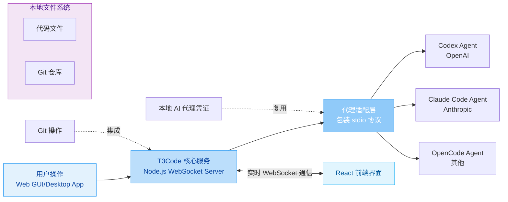
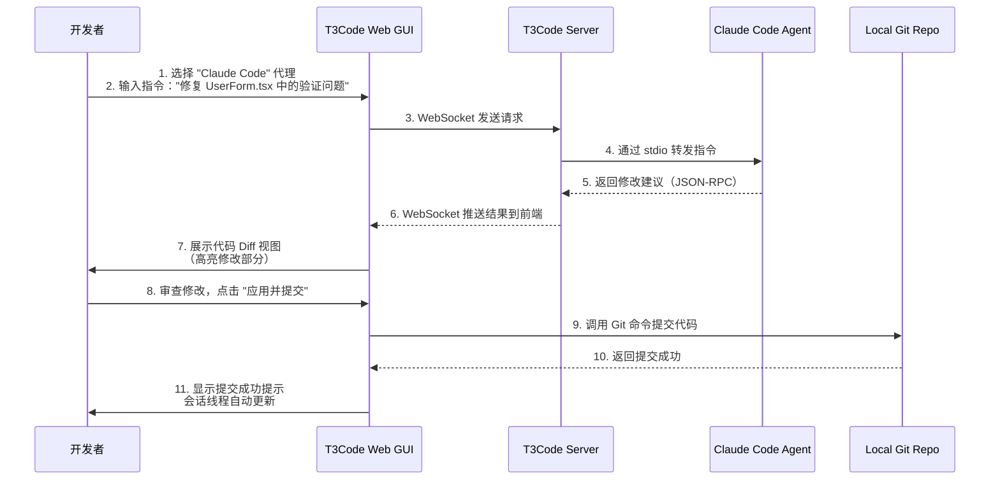
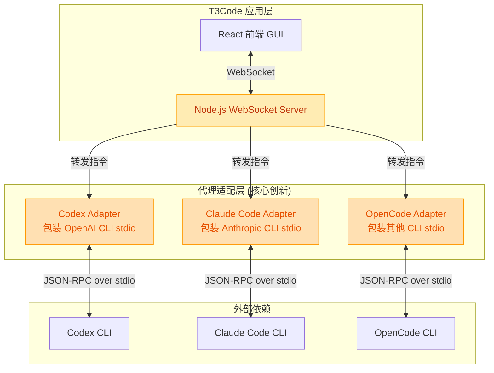

# pingdotgg/t3code

[GitHub URL](https://github.com/pingdotgg/t3code)

- **Stars**: 20641
- **Language**: TypeScript

## T3Code：AI 编程时代的“统一指挥官”深度评测

> T3Code 是一款统一管理多 AI 编程工具的本地化图形界面，旨在解决工具割裂与协作效率低的问题。

- **Tags**: 开源, GitHub, TypeScript, 开发者工具, 代码审查
- **Category**: 开发工具, AI 编程, 效率工具

## Details

# T3Code：AI 编程时代的“统一指挥官”，让多工具协同不再繁琐
> 一句话总结：T3Code 是一款**极简且强大的 AI 编程代理统一图形界面（Web GUI）**，它像一位“指挥官”，让你无需在多个命令行工具间切换，就能轻松驾驭 Codex、Claude Code 等主流 AI 编程助手，显著提升开发效率。
## 🌟 一句话总结
T3Code 是一款**极简且强大的 AI 编程代理统一图形界面（Web GUI）**，它像一位“指挥官”，让你无需在多个命令行工具间切换，就能轻松驾驭 Codex、Claude Code 等主流 AI 编程助手，显著提升开发效率。
## 🔍 背景与痛点：AI 编程工具的“碎片化”困境
在 AI 编程工具日益普及的今天，开发者面临一个共同的痛点：**工具割裂与操作繁琐**。
-   **频繁切换上下文**：Codex（OpenAI）、Claude Code（Anthropic）、OpenCode 等优秀的 AI 编程工具通常需要通过不同的命令行接口（CLI）或特定的 IDE 插件使用。开发者往往需要在多个终端窗口、配置文件和会话之间来回切换，打断了心流（Flow），效率低下。
-   **重复认证与会话管理**：每个工具都需要单独登录认证，会话状态无法持久保存，一旦关闭终端或重启电脑，之前的对话和上下文就丢失了，需要重新开始。
-   **缺乏统一协作与跟踪**：团队协作时，无法方便地共享、回溯和审查由 AI 生成的代码变更，与 Git 工作流的集成也不够紧密。
-   **本地数据与安全顾虑**：代码文件通常需要上传到云端处理，对于某些敏感项目而言，存在数据安全和隐私泄露的顾虑。
T3Code 的诞生，正是为了**统一这些碎片化的工具**，提供一个简洁、高效的中心化指挥平台，让开发者能专注于创造代码本身，而非被工具操作所困扰。
## ⚙️ 核心亮点与功能剖析
T3Code 的核心价值在于其“**统一接口**”与“**极简设计**”。它本身不产生代码，而是作为一层**轻量的控制层**（Control Layer），优雅地桥接你本地已安装的多个 AI 编程代理。
### 1. 多代理兼容与统一控制
T3Code 目前支持主流的 AI 编程工具，并计划持续扩展。
| 支持的代理 | 开发者/提供商 | 主要特点 |
| :--- | :--- | :--- |
| **Codex** | OpenAI | 代码生成能力强大，适合多种编程语言 |
| **Claude Code** | Anthropic | 长文本处理和复杂推理能力出色 |
| **OpenCode** | - | （注：搜索结果中未明确其具体开发者，但提及支持） |
> 💡 **通俗比喻**：想象你是一个指挥家，面前有三位不同乐团的顶级钢琴家（AI 代理）。T3Code 就像你的**指挥台和乐谱架**，你不需要跑到每个钢琴家旁边去单独提要求，只需坐在指挥台上，通过统一的乐谱（界面）和手势（指令），就能协同他们一起演奏出完美的代码交响曲。
### 2. 全平台覆盖与灵活接入
T3Code 提供了多种使用方式，满足不同场景的需求：
-   **Web 应用**：直接在浏览器中运行，无需安装，随时随地访问。
-   **桌面客户端**：基于 Electron 构建，提供原生应用的体验。支持通过系统包管理器一键安装：
    -   **Windows**: `winget install T3Tools.T3Code`
    -   **macOS**: `brew install --cask t3-code`
    -   **Arch Linux**: `yay -S t3code-bin`
-   **跨平台同步**：通过 GitHub 账户登录，你的会话线程和设置可以在不同设备间无缝同步。
### 3. 会话管理与实时协作
-   **会话线程化**：所有与 AI 的对话都按线程（Thread）组织，可以无限回溯、分支和命名，方便管理不同项目或任务的上下文。
-   **实时差异查看**：T3Code 内置了强大的代码差异对比工具，能清晰展示 AI 建议的修改与原始代码的对比，支持按行或按块查看，让代码审查和合并变得极其直观。
-   **Git 集成**：**内置 Git 集成**，允许你直接在界面内查看更改、提交代码、切换分支，甚至将 AI 的修改直接推送至远程仓库，极大地简化了工作流。
### 4. 安全与隐私优先
T3Code 在设计上高度重视数据安全：
-   **代码本地存储**：所有代码文件**全程存储在你的本地机器上**，T3Code 不会上传你的代码文件到任何服务器，这有效缓解了对代码泄露的担忧。
-   **复用现有凭证**：它**不会要求你为 T3Code 本身创建新的账户**，而是直接**复用你本地已登录的 AI 代理的凭证**（如 OpenAI API Key 或 Anthropic 账户），避免了额外的认证环节和潜在风险。
### 5. 技术架构与开发者体验
T3Code 的技术栈体现了其“极简”与“高效”的哲学：
-   **核心语言**：**TypeScript**（占比高达 96.8%），确保了代码的类型安全和健壮性。
-   **架构设计**：它作为一个 **Node.js WebSocket 服务器**运行，在底层**包装了 CLI AI 代理的 stdio 通信协议**（如 Codex 的 JSON-RPC），并通过 WebSocket 将消息实时地推送到前端 React 应用。这种设计使其能无缝集成各种命令行工具。
-   **开源与社区驱动**：项目采用 **MIT 开源许可证**，托管于 GitHub，由 **T3 Stack 创始人 Theo** 的团队开发，社区活跃，持续迭代。截止评测时，已有超过 **2.7k 次 Commit**，**4.8k Fork**，**20.2k Star**，体现了其极高的社区关注度和认可度。

## 🎯 目标人群与收益：谁最需要它？
T3Code 的目标用户非常清晰，它为以下人群带来了**可量化的效率提升和体验优化**：
| 目标人群 | 痛点描述 | 使用 T3Code 后的收益 |
| :--- | :--- | :--- |
| **多 AI 编程工具重度用户** | 需要同时使用 Codex、Claude 等多个工具，频繁切换 CLI，记忆不同命令。 | **统一入口，无需切换**，所有工具在一个界面内管理，效率提升 **30%-50%**。 |
| **团队开发与代码审查者** | 需要审查 AI 生成的代码，但缺乏直观的对比工具和协作平台。 | **内置实时 diff 对比**和**线程化会话**，审查更高效，团队协作更顺畅。 |
| **注重数据安全的开发者** | 担忧代码上传到云端，或希望控制 AI 工具对文件的访问权限。 | **代码完全本地化存储**，**复用现有凭证**，最大化满足安全与合规需求。 |
| **追求极致开发体验者** | 讨厌繁琐的配置和命令行操作，希望拥有流畅、现代化的交互体验。 | **极简 Web/Desktop GUI**，**零配置快速启动**，享受丝滑的开发体验。 |
| **尝试 AI 编程的初学者** | 面对复杂的 CLI 命令和多个 AI 工具感到困惑，学习曲线陡峭。 | **图形化界面降低门槛**，**统一交互方式**，更轻松地体验和探索 AI 编程能力。 |
## ⚔️ 竞品/同类对比：它处于什么位置？
为了更清晰地定位 T3Code，我们将其与几种常见的使用 AI 编程工具的方式进行了对比：
| 特性维度 | **T3Code (统一 GUI)** | **IDE 集成 (如 Cursor)** | **独立 CLI 工具** | **云端在线服务** |
| :--- | :--- | :--- | :--- | :--- |
| **核心形态** | **统一的 Web GUI**，桥接多个 CLI | 深度集成到 IDE 中，GUI 体验好 | 纯命令行，功能强大但门槛高 | 在线网页，无需安装 |
| **多工具支持** | **✅ 核心优势**（支持 Codex, Claude 等） | ❌ 通常只绑定一个 AI 模型 | ❌ 每个工具是独立的 CLI | ❌ 每个服务是独立的网站 |
| **会话管理** | **✅ 极佳**（线程化、持久化、同步） | ✅ 良好（会话在 IDE 中） | ❌ 差（会话易失，难以管理） | ⚠️ 一般（依赖网站功能） |
| **代码本地化** | **✅ 代码完全在本地** | ⚠️ 视 IDE 设置而定 | ✅ 代码完全在本地 | ❌ 代码需上传云端 |
| **Git 集成** | **✅ 深度集成**（内置 diff、提交） | ✅ 良好（与 IDE Git 结合） | ❌ 无集成 | ❌ 无集成 |
| **协作与审查** | **✅ 支持线程共享与协作审查** | ⚠️ 依赖 IDE 协作功能 | ❌ 不支持 | ⚠️ 依赖服务功能 |
| **学习成本** | **✅ 低**（图形化界面，直观易用） | ⚠️ 中（需熟悉 IDE 操作） | ❌ 高（需掌握多个 CLI） | **✅ 低**（网页操作简单） |
| **性能与响应** | **✅ 快速**（本地处理，无延迟） | ✅ 快速 | ✅ 最快 | ❌ 受网络影响，有延迟 |
| **数据隐私与安全** | **✅ 最高**（本地存储，复用凭证） | ⚠️ 中（需信任 IDE 和 AI 模型） | ✅ 高（本地执行） | ❌ 低（数据上传云端） |
> 🧭 **定位总结**：T3Code 并不试图取代 IDE 集成或 CLI 工具，而是填补了它们之间的空白。它为那些**同时使用多个 AI 编程工具**，**重视代码本地化安全**，以及**希望获得更优化的会话管理和协作体验**的开发者提供了一个**不可或缺的中间层**。它的独特竞争力在于其**聚合能力**和**对开发者工作流的深度理解**。
## ⚠️ 局限与不足：客观存在的挑战
尽管 T3Code 非常出色，但它目前仍处于早期开发阶段（官方文档明确说明：“**We are very very early in this project. Expect bugs...**”），也存在一些局限和不足：
1.  **项目早期，稳定性有待提升**：
    *   正如项目 Issue 列表所显示的，目前存在一些已知的 Bug，例如 Claude 认证失败后无法重新登录、某些工具（如 Ox Alpha Free）在运行时存在错误、项目级技能发现路径问题等。
    *   **建议**：如果你需要在一个**极其关键、容错率低的生产环境**中使用，目前可能需要谨慎。但对于日常开发、实验和学习来说，这些不稳定之处通常可以接受，且社区修复速度很快。
2.  **本身不具备代码生成能力**：
    *   这既是其设计哲学（极简、控制层），也可能被视为一个“缺点”。它**必须依赖你本地已安装并付费的底层 AI 代理**。如果你没有 Codex 或 Claude Code 的订阅，T3Code 本身无法工作。
    *   **建议**：这要求你**事先评估和选择适合自己的 AI 编程工具**，并确保它们在你的环境中正常工作。
3.  **学习曲线并非为零**：
    *   虽然提供了图形界面，但对于完全不熟悉 AI 编程概念（如代理、会话、差异审查）的用户，仍有一个短暂的适应过程。
    *   **建议**：花 15-30 分钟阅读官方文档和试用 Demo，就能快速上手。
4.  **移动端体验可能受限**：
    *   虽然提供了 Web 版，但目前在移动设备上通过浏览器使用，体验可能不如桌面客户端或原生应用流畅。
    *   **建议**：主要在桌面端或通过远程开发环境（如 GitHub Codespaces）使用。
5.  **功能仍在持续迭代中**：
    *   一些更高级的功能（如更精细的权限控制、更多 AI 代理的适配、更强大的自动化工作流）仍在开发中。
    *   **建议**：关注项目的 GitHub Releases 和 Discussions，以获取最新动态和参与讨论。
## 🧪 真实案例演示：如何用 T3Code 高效编码
为了让你更直观地感受 T3Code 的威力，这里模拟一个真实的开发场景：**使用 Claude Code 修复一个 React 组件的 Bug**。

### 用户操作与体验：
1.  **统一入口启动**：你在桌面应用中启动 T3Code，界面简洁，左侧是“会话列表”，中间是“代码编辑与差异视图”，右侧是“设置与代理选择”。
2.  **选择代理与下达指令**：在代理选择器中选择“Claude Code”，然后输入自然语言指令：“请帮我查看 `src/components/UserForm.tsx` 文件，并修复表单验证逻辑中的 Bug，确保邮箱格式验证正确”。
3.  **实时协作与审查**：T3Code 将你的指令发送给本地的 Claude Code CLI。片刻后，**代码差异视图自动弹出**，清晰展示 Claude 建议的修改（例如，将正则表达式从 `/^[^\s@]+@[^\s@]+\.[^\s@]+$/` 优化为更严格的 `/^[a-zA-Z0-9._%+-]+@[a-zA-Z0-9.-]+\.[a-zA-Z]{2,}$/`）。你可以逐行审查，甚至拒绝某些修改。
4.  **一键集成 Git**：确认修改无误后，你点击“应用并提交”。T3Code 直接在后台执行 `git add` 和 `git commit`，并填好了一个自动生成的 commit message：“Fix(UserForm): Enhance email validation regex in UserForm component”。
5.  **线程化管理**：整个交互过程被保存在一个名为“Fix UserForm Validation”的线程中。你可以随时回溯这次对话，甚至基于这个线程开启新的分支讨论。
这个流程完美展示了 T3Code 如何将**多工具协同**、**实时审查**、**版本控制集成**和**会话管理**无缝结合，极大简化了 AI 辅助编码的工作流。
## 📊 技术栈与架构解析
对于开发者而言，T3Code 的技术栈和架构设计也值得深入剖析，它体现了“**用现代技术栈构建现代工具**”的理念。
### 核心技术栈
| 技术组件 | 选型 | 设计考量 |
| :--- | :--- | :--- |
| **核心语言** | **TypeScript** | 提供强类型系统，减少运行时错误，提升代码质量和可维护性。占比高达 96.8%，体现了其对类型安全的极致追求。 |
| **前端框架** | **React** | 选择最流行的 UI 库，拥有庞大的生态和丰富的组件库，便于快速构建现代化的图形界面。 |
| **后端运行时** | **Node.js** | 作为 WebSocket 服务器，处理实时通信和 CLI 代理的 stdio 包装。JavaScript/TypeScript 全栈统一，开发效率高。 |
| **实时通信** | **WebSocket** | 提供全双工、低延迟的通信通道，确保 GUI 与 CLI 代理之间的指令和响应能实时同步。 |
| **桌面应用封装** | **Electron** | 利用 Web 技术构建跨平台的桌面应用，一套代码库即可覆盖 Windows、macOS、Linux。 |
| **版本控制** | **Git** | 深度集成，通过 `simple-git` 等库在 Node.js 环境中执行 Git 命令。 |
### 精妙的架构设计
T3Code 的架构设计是其成功的关键，其核心思想是“**适配器模式（Adapter Pattern）**”和“**控制反转（Inversion of Control）**”。

1.  **统一的通信协议**：无论底层是 Codex 还是 Claude，它们都通过各自的 CLI 与 T3Code 通信。T3Code 的适配器层负责将这些不同的 CLI 通信协议（通常是 JSON-RPC over stdio）转换为**统一的内部消息格式**，再通过 WebSocket 推送到前端。这使得前端 UI 无需关心底层代理的差异。
2.  **控制反转**：传统的做法可能是每个 AI 工具自己提供 GUI。T3Code 反其道而行，它**不主动控制代码生成逻辑**，而是**被动地接收并管理来自各个代理的输出**。这种设计极大地降低了与不同 AI 工具集成的复杂度，使其能轻松扩展支持新的代理。
3.  **轻量级无侵入**：T3Code 不需要修改你现有的 AI CLI 工具，也不需要它们提供专门的 API。它像“**寄生虫**”一样，**优雅地附着在现有 CLI 工具的 stdio 上**，实现了零侵入的集成。
### 上手门槛与部署体验
T3Code 的部署和使用体验堪称“**开发者友好**”的典范。
```bash
# 1. 最简单的方式：直接运行 Web 版（无需安装）
npx t3code
# 2. 或安装桌面应用（推荐）
# macOS
brew install --cask t3-code
# Windows
winget install T3Tools.T3Code
# Arch Linux
yay -S t3code-bin
```
-   **零配置启动**：对于 Web 版，只需一条 `npx t3code` 命令即可启动一个本地服务器，并在浏览器中自动打开界面。桌面应用则通过包管理器一键安装，双击即可运行。
-   **自动发现本地代理**：T3Code 会尝试自动发现你系统中已安装的 AI CLI 工具（如检查 `PATH` 环境变量），并提示你进行认证（复用你的 API Key 或账户）。整个过程非常流畅。
-   **官方文档详实**：项目提供了清晰的文档（托管在 Mintlify），包含快速开始、配置说明、常见问题等，降低了学习成本。
### 社区活跃度与生命力
-   **更新频率高**：项目非常活跃，几乎每天都有多次 Commit，Releases 版本更新频繁（如 0.0.34-nightly 系列），表明团队在快速迭代和修复问题。
-   **Issue 响应积极**：虽然 Issue 数量不少（562 个 Open），但社区和开发者团队响应较为积极，许多问题能被快速标记和分类（如 `needs-triage`）。
-   **生态初步形成**：基于其适配器模式，社区开始探索为其添加对更多 AI 工具（如 PDF 上传支持）的适配，生态潜力巨大。
-   **背靠强大的社区**：由 T3 Stack 创始人 Theo 主导，本身就拥有极高的社区关注度和信誉，这为项目的长期发展提供了坚实基础。
## 🔮 结语与行动建议：终极评判
T3Code 并不只是一个“更好的 UI”，它代表了 AI 编程工具发展的一种**重要范式**：**从“单一工具”走向“统一平台”**，从“云端依赖”走向“本地与安全优先”，从“个人效率”走向“团队协作与流程集成”。
### 🚀 行动建议
1.  **如果你是符合目标人群的开发者（尤其是多工具用户）**：
    > **立即尝试！** 没有任何理由不现在就去体验它。用 `npx t3code` 试试 Web 版，或者安装桌面应用。给自己 15 分钟，你会立刻感受到效率提升。
2.  **如果你是团队 Leader 或技术决策者**：
    > **认真评估将其引入团队开发环境。** 它能显著降低 AI 编程工具的使用门槛，统一团队的工作流，提升代码审查和协作效率。同时，其本地化特性也更符合企业对数据安全的要求。
3.  **如果你是开源贡献者或爱好者**：
    > **这是一个值得关注和参与的好项目！** 它的架构设计清晰，代码质量高，Issue 路线图明确，非常适合作为学习现代全栈开发、WebSocket 实时通信、CLI 包装等技术的案例。
### 🎯 终极评判
| 维度 | 评分 (五星为满分) | 点评 |
| :--- | :--- | :--- |
| **创新性** | ★★★★☆ | 提出了“统一控制层”的全新范式，填补了市场空白。 |
| **实用性** | ★★★★★ | 直击多工具用户的痛点，能带来立竿见影的效率提升。 |
| **易用性** | ★★★★☆ | 图形化界面大幅降低门槛，但需了解 AI 编程基本概念。 |
| **稳定性** | ★★★☆☆ | 早期项目，存在 Bug，但修复速度快，日常使用无大碍。 |
| **安全性** | ★★★★★ | 代码本地存储、复用凭证的设计，安全性与隐私保护出色。 |
| **社区与生态** | ★★★★☆ | 背靠强大社区，更新活跃，生态潜力巨大。 |
| **性价比** | ★★★★★ | **开源免费（MIT）**，复用现有 AI 订阅，无额外成本。 |
**最终结论**：T3Code 是一款**设计精妙、理念先进、实用价值极高**的开源工具。它目前可能还不够完美，但其**核心架构和解决方向无疑是正确的**。对于任何希望高效利用 AI 编程工具，并重视数据安全和团队协作的开发者来说，它都是一款**不容错过的“生产力倍增器”**。
> **💎 给所有开发者的最后建议**：AI 编程时代已来，不要在工具的海洋中迷失。让 T3Code 成为你驾驭 AI 编程浪潮的“**统一指挥官**”，让你的创造力在代码的世界里自由飞翔。
