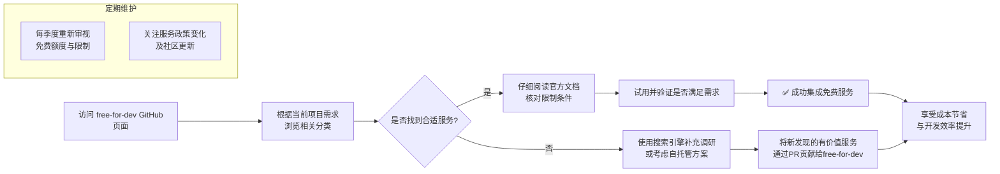

# ripienaar/free-for-dev

[GitHub URL](https://github.com/ripienaar/free-for-dev)

- **Stars**: 134408
- **Language**: HTML

## GitHub 项目 free-for-dev 深度评测：开发者免费资源宝库

> 一个由社区维护的免费开发者资源聚合清单，帮助开发者快速找到靠谱的 SaaS/PaaS 免费方案，节省选型与成本。

- **Tags**: GitHub, 免费资源, DevOps, 技术选型, 开源项目
- **Category**: 开发工具, 资源聚合

## Details

# GitHub 深度评测：free-for-dev - 开发者的免费资源宝库
> 一句话总结：这是一个由社区维护的**免费开发者资源聚合清单**，专注于SaaS、PaaS和IaaS服务的免费层级，为开发者节省大量选型与成本决策时间。
## 1 背景与痛点：它为何诞生？
在现代软件开发中，开发者需要依赖众多第三方服务——从代码托管、CI/CD管道、监控告警到数据库和AI模型。这些服务大多采用"免费试用"或"免费层级"策略，但：
-   **信息极度分散**：各服务商的免费计划政策晦涩难懂，且频繁变化，开发者需要逐一翻阅文档。
-   **决策成本高昂**：初创团队和个人开发者往往预算有限，需要精准匹配功能与成本，但缺乏统一的对比依据。
-   **隐性门槛多**：许多"免费"套餐隐藏着流量限制、功能缩水或短期时效等陷阱。
-   **资源浪费严重**：重复调研和试错消耗了本应用于编码和创新的宝贵时间。
`free-for-dev` 项目正是为了解决这些痛点而诞生。它由 R.I. Pienaar 发起，并通过社区协作（已有超过1600人贡献Pull Request）形成了一个**聚焦基础设施开发者（DevOps、系统管理员等）的权威免费资源索引**。
## 2 核心亮点与功能剖析
### 2.1 精准定位与严格筛选
该项目最突出的价值在于其**明确的范围界定和质量控制**：
-   **服务类型聚焦**：专注于对基础设施开发者有用的服务（如SaaS、PaaS、IaaS），而非通用的所有免费资源。
-   **免费层级定义严格**：
    -   必须提供**永久免费层级**（Free Tier），而不仅仅是短期免费试用（Free Trial）。
    -   如果是限时免费，有效期至少需**一年**。
    -   **安全要求**：不接受在付费层级中才提供TLS加密等基础安全功能的服务。
-   **排除自托管软件**：仅收录即服务（as-a-Service）的解决方案，不收录需要自行部署维护的开源软件。
这些筛选标准确保了收录资源的**高相关性**和**高可靠性**，避免了信息过载。
### 2.2 结构化的分类体系
项目采用了**详尽且逻辑清晰的目录结构**，覆盖了开发者可能需要的绝大多数服务类别：
| 类别 | 示例服务 | 典型免费额度 |
| :--- | :--- | :--- |
| **🚀 Major Cloud Providers** | Google Cloud, AWS, Azure | 见下方详解 |
| **📊 Analytics, Events, and Statistics** | Google Analytics, Mixpanel | 基础事件追踪与报表 |
| **🤖 APIs, Data and ML** | OpenAI, Hugging Face | 每月一定量的API调用 |
| **📦 Artifact Repos** | JFrog Artifactory, Sonatype Nexus | 有限制的包存储与下载 |
| **🔌 BaaS (Backend as a Service)** | Firebase, Supabase | 数据库、认证、文件存储 |
| **🛡️ CDN and Protection** | Cloudflare, Cloudflare Workers | 全球CDN加速与基础防护 |
| **🔄 CI and CD** | GitHub Actions, GitLab CI | 每月一定量的构建分钟数 |
| **📝 CMS** | Strapi, Contentful | 内容条目与API调用次数限制 |
| **🔍 Code Quality** | SonarQube, CodeClimate | 代码分析扫描行数限制 |
| **🧪 Testing** | BrowserStack, Sauce Labs | 每月一定量的实时测试分钟数 |
| **🔐 Security and PKI** | Let's Encrypt, ZeroSSL | 免费SSL证书颁发 |
| **👤 Authentication, Authorization, and User Management** | Auth0, Clerk | 每月活跃用户数(MAU)限制 |
### 2.3 活跃的社区与持续维护
-   **强大的社区贡献**：通过Pull Request模式，全球开发者共同维护列表，确保信息**实时更新**和**广泛覆盖**。
-   **动态变化**：免费政策随时可能变动，社区模式能快速响应，**淘汰已失效或大幅缩水的服务**，**新增有价值的优惠**。
-   **透明度**：每个条目都直接链接至服务的官方文档，便于用户核对和深入理解。
## 3 竞品/同类对比：它的独特价值
| 特性 | **free-for-dev** | **其他资源列表/博客文章** | **搜索引擎自行搜索** |
| :--- | :--- | :--- | :--- |
| **信息精准度** | ★★★★★ (严格筛选，聚焦DevOps) | ★★★☆☆ (可能包含非相关项) | ★★☆☆☆ (信息零散，广告干扰) |
| **更新频率** | ★★★★★ (实时社区维护) | ★★★☆☆ (依赖作者更新频率) | ★★★★☆ (搜索引擎能反映最新，但需甄别) |
| **结构化程度** | ★★★★★ (分类清晰，易于导航) | ★★★☆☆ (可能只是简单列表) | ★☆☆☆☆ (无结构) |
| **覆盖广度** | ★★★★★ (涵盖数十个类别) | ★★★☆☆ (通常主题较窄) | ★★★★★ (理论上最广，但筛选成本极高) |
| **可信度** | ★★★★★ (社区审核+官方链接) | ★★★☆☆ (依赖单一作者观点) | ★★☆☆☆ (需自行验证大量来源) |
| **使用门槛** | ★★★★☆ (需懂英文，有一定技术基础) | ★★★☆☆ (同左) | ★★★☆☆ (搜索技巧要求高) |
**核心竞争力**：`free-for-dev` 并非旨在成为最全面的列表，而是通过**严格筛选、结构化组织和社区驱动**，成为**开发者最可靠、最高效的免费资源决策起点**。它是一个“经过验证的入口”，而非“原始数据的堆砌”。
## 4 目标人群与收益：谁最适合使用？
### 4.1 核心目标用户
1.  **初创团队与独立开发者**：这是**最大的受益群体**。他们预算紧张，但需要快速构建和验证产品原型。`free-for-dev` 能帮助他们快速找到覆盖全栈（从后端、数据库、CI/CD到监控、分析）的免费方案，极大降低初始启动成本。
2.  **DevOps工程师与系统管理员**：项目本身定位为“对基础设施开发者有用”，因此这些人能从中发现许多用于**日志管理、监控、告警、自动化部署、容器编排**等方面的专业工具免费版。
3.  **学生与学习者**：提供了一个**绝佳的学习和实践环境**。他们可以用免费的真实服务资源来学习和实践现代软件开发的各个环节，而无需担心产生高昂费用。
4.  **技术决策者与架构师**：在进行技术选型和成本估算时，能快速了解主流服务的免费层级边界，为团队制定更经济的混合云或多云策略提供参考。
### 4.2 核心收益
-   **💰 直接节省成本**：避免为仅需基础功能的服务付费，每年可节省数千甚至数万美元的基础设施开销。
-   **⏱️ 大幅提升效率**：**将数天甚至数周的调研选型时间压缩到几分钟**。无需再在各个服务官网间反复对比。
-   **🧭 降低决策风险**：通过社区验证的列表，减少了踩到“免费陷阱”或选择不靠谱服务的风险。
-   **🚀 加速创新与验证**：更低成本的试错能力，让开发者能更自由地尝试新技术和进行产品验证。
-   **📚 持续学习与发现**：定期浏览能了解行业新趋势和新工具，拓宽技术视野。
## 5 深度剖析：三大云厂商的免费层级对比
`free-for-dev` 详细列出了主流云服务商的免费额度，这对开发者尤为宝贵。下表对比了三大巨头的一些核心服务：
| 服务类别 | Google Cloud Platform (GCP) | Amazon Web Services (AWS) | Microsoft Azure |
| :--- | :--- | :--- | :--- |
| **计算 (Compute)** | **Cloud Run**: 2百万请求/月, 36万GB-秒内存/月 **Cloud Functions**: 2百万次调用/月 **Compute Engine**: 1个e2-micro实例(30GB HDD) | **Lambda**: 1百万次请求/月 **EC2**: (通常需要申请试用) | **Functions**: 1百万次请求/月 **App Service**: 10个应用(60 CPU分钟/天) |
| **存储 (Storage)** | **Cloud Storage**: 5GB存储, 1GB网络出站流量/月 **Firestore**: 1GB存储, 5万次读取/日 | **S3**: (通常5GB标准存储) **EBS**: (通常有免费试用) | **Blob Storage**: (通常5GB LRS热存储) |
| **数据库 (Database)** | **Cloud Firestore**: (见上) **Cloud SQL**: (通常有免费试用) | **DynamoDB**: 25GB存储, 200个容量单位 | **Cosmos DB**: (通常有免费试用) |
| **分析 (Analytics)** | **BigQuery**: 每月1TB查询量, 10GB存储/月 | ** Athena**: (通常有免费查询额度) | **Synapse Analytics**: (通常有免费试用) |
| **AI/ML** | **Google AI Studio**: 免费访问Gemini等模型 **Kaggle Notebooks**: 4核CPU, 30GB RAM, 每周30小时GPU/TPU | **SageMaker**: (通常有免费试用) **Rekognition**: (通常有免费调用) | **Azure OpenAI**: (通常有免费试用) **Azure ML**: (通常有免费计算) |
> 💡 **使用策略**：
> -   **混合利用**：针对不同需求选择最优云服务商的免费服务，例如用GCP的Cloud Run托管容器应用，用AWS的S3存储静态资源，用Azure的DevOps进行CI/CD。
> -   **注意限制**：免费额度通常有**区域限制**（如GCP的e2-micro实例仅限于特定区域）、**流量限制**（如网络出站流量）和**功能限制**（如不支持某些高级特性）。
> -   **长期规划**：免费额度是“启动资金”，当产品增长超出限额时，需提前规划付费迁移方案。
## 6 局限与不足：客观存在的缺点
尽管 `free-for-dev` 极其有用，但它也存在一些局限性：
1.  **信息解读门槛**：列表本身只是信息索引，**用户仍需自行理解技术术语和限制条件**。例如，“360,000 GB-seconds memory”对新手来说可能难以估算实际能支持多少请求。
2.  **更新延迟与潜在遗漏**：社区维护虽快，但不可能做到**实时**。某个服务的免费政策刚刚调整，列表可能需要几天到几周才能更新。同时，极其小众或新兴的服务也可能未被收录。
3.  **“免费”的隐形成本**：
    -   **学习曲线**：使用一个新服务需要投入时间学习其API和文档，这本身是一种成本。
    -   **数据迁移风险**：未来如果需要迁移到付费方案或其他服务商，可能面临数据迁移的复杂性和成本。
    -   **性能与可靠性**：免费节点的性能（如CPU、IOPS）通常较低，且可能不如付费节点稳定，不适合生产环境的高负载场景。
4.  **地域限制**：许多免费服务仅限于特定地区（尤其是美国），中国地区的开发者可能无法直接访问或享受同等待遇。
5.  **过度依赖风险**：对于个人项目或学习来说完全没问题，但对于商业项目，过度依赖“免费”层级可能会在业务增长时造成**不可预期的中断或成本爆炸**。
## 7 结语与行动建议
### 7.1 终极评判
`free-for-dev` 是一个**经过精心打磨、社区驱动、极其高效**的开发者免费资源聚合工具。它通过**严格筛选、结构化分类和持续更新**，完美地解决了“**信息分散、决策成本高**”的核心痛点。对于任何希望降低基础设施成本、加速项目启动、或进行技术探索的开发者而言，它都是一个**必加书签、定期查阅的神器**。
它的价值远不止于一个“列表”，更是一个**连接开发者与优质免费服务的桥梁**，一个**激发创新和学习的资源库**，以及一个**降低技术选型风险的决策支持系统**。
### 7.2 行动建议

1.  **立即行动**：
    -   **立即访问**并**Star**这个GitHub仓库：[https://github.com/ripienaar/free-for-dev](https://github.com/ripienaar/free-for-dev)。将其作为你技术选型的**起点**。
    -   根据你当前的项目（哪怕只是一个想法），去对应的分类里寻找可用的免费服务。**试一试**，这不会花你一分钱。
2.  **明智使用**：
    -   **永远、永远、永远**直接跳转到**服务的官方文档**，仔细阅读其免费层级的具体限制（配额、功能、地域等）。`free-for-dev` 是索引，不是合同。
    -   对于**生产环境**，即使使用免费层级，也要做好**监控和告警**，确保在接近限额时能收到通知，避免服务中断。
    -   将 `free-for-dev` 视作一个**动态资源**，每季度花10分钟重新审视一下你正在使用的服务，看看政策是否有变化。
3.  **贡献与回馈**：
    -   如果你发现了一个不在列表里、但符合标准的优质免费服务，**勇敢地提交一个Pull Request**。这是开源社区精神的核心，也能让这个项目越来越好。
    -   如果发现列表中的信息已过时或错误，同样可以通过PR帮助修正。
> **最后提醒**：`free-for-dev` 是一把“利剑”，能帮你披荆斩棘，但如何挥舞它、何时用它，仍需你根据自己的项目阶段、技术需求和长远规划来决定。**免费是手段，而非目的**。你的目标始终是构建出色的产品和服务。
