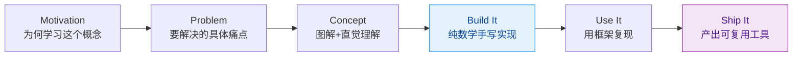

# rohitg00/ai-engineering-from-scratch

[GitHub URL](https://github.com/rohitg00/ai-engineering-from-scratch)

- **Stars**: 48203
- **Language**: Python

## AI Engineering From Scratch 深度评测

> 从数学原理到生产级Agent的系统性AI工程开源学习指南。

- **Tags**: AI工程, 大模型, Agent开发, 深度学习, 系统化学习
- **Category**: AI 编程, 开源教程, 技术教育

## Details

# 🔧 AI Engineering From Scratch：从零构建AI系统的终极开源指南
> 一份让35K+ GitHub星标用户从API调用者进化为AI工程师的完整学习路径，503节课、20个阶段、320小时内容，教你从数学原理到生产级Agent的完整工程能力。
## 📌 一句话总结
AI Engineering From Scratch 是一套**完全开源、免费且系统化的AI工程学习课程**，它通过"先从零构建、再使用框架"的独特方法论，帮助学习者从底层数学原理开始，逐步掌握深度学习、Transformer、大语言模型、自主Agent等AI核心技术，最终具备**独立开发、调试和部署生产级AI系统**的能力。
## 🌐 背景与痛点：它为何诞生？
### 当前AI学习领域的三大困境
1.  **理论实践脱节**：84%的学生已经在使用AI工具，但只有18%的人觉得自己在专业上做好了与其协同工作的准备。大多数课程要么只讲论文原理，要么只教API调用，学习者陷入"知其然不知其所以然"的困境。
2.  **碎片化学习**：现有的AI材料分散在论文、博客、框架文档中，缺乏一条连贯的学习路径。学习者可能学会调Hugging Face，却不知道Attention机制的具体实现。
3.  **工程能力缺失**：即使掌握了模型原理，许多开发者仍无法将模型可靠地集成到产品中，无法处理生产环境中的性能、安全、监控等问题。
### AI Engineering From Scratch的解决方案
该项目由开发者rohitg00创建（同时也是Agent Memory持久化记忆方案的开发者），旨在填补这一巨大鸿沟。它采用**MIT协议开源**，包含**503节课、20个学习阶段**，总计约**320小时的引导式内容**，覆盖Python/TypeScript/Rust/Julia四种编程语言。
其核心理念是：**每个算法都从原始数学公式开始实现，然后再通过生产级库（如PyTorch）复现，让你清楚地看到框架底层究竟在做什么**。
## ⚡ 核心亮点与功能剖析
### 1. 独特的教学方法论："先构建，再使用"
这是该项目最与众不同的地方。每节课都遵循严格的结构：

**案例演示：以Transformer的Attention机制为例**
-   **传统课程**：直接展示Attention公式，然后教你如何调用Hugging Face的Transformer模型
-   **本项目做法**：
    1.  **从零实现**：先手写矩阵乘法来实现Attention机制，从零推导softmax函数
    2.  **框架复现**：在PyTorch中用同样的逻辑复现这个Attention模块
    3.  **深度理解**：通过对比，你清晰地明白了Hugging Face模型底层究竟在运行什么，为什么某些参数会影响输出
### 2. 庞大而系统的知识体系
课程内容从基础数学到前沿AI技术，分为20个不可逾越的阶段，确保知识体系的完整性和连贯性：
| 阶段 | 核心内容 | 实践产出 |
| :--- | :--- | :--- |
| **Phase 0-1** | 开发环境、数学基础（线性代数、概率论、梯度下降等） | 开发环境配置、数学运算工具 |
| **Phase 2-3** | 经典机器学习（SVM、决策树）、深度学习核心（MLP、优化器） | 可调用的模型实现库 |
| **Phase 4-7** | 计算机视觉（CNN、ResNet）、NLP（RNN、Transformer）、语音处理 | 图像分类器、文本生成器 |
| **Phase 8-10** | 生成式AI（GAN、Diffusion）、从零实现LLM | 图像生成器、小型语言模型 |
| **Phase 11-13** | LLM工程（提示工程、RLHF、LoRA）、多模态、工具协议 | 提示词优化器、模型微调工具 |
| **Phase 14-20** | Agent开发、MCP服务器、多模态系统、生产部署 | 自主Agent集群、可部署的AI服务 |
### 3. 每节课都产出可复用工具
这不是一门光听课的课程，而是一门**需要你亲自运行、修改并交付真实工具的课程**。每节课结束时，你都会得到一个**可复用的产出物**：
-   **Prompt模板**：针对特定任务的高效提示词
-   **Skill文件**：Claude Code等AI编程工具的技能定义
-   **Agent定义**：可执行多步骤任务的自主Agent
-   **MCP服务器**：Model Context Protocol服务器，用于将外部工具连接到AI模型
这些产出物会存入`outputs/`目录，可直接安装到你日常的AI工作流中。学完之时，你不仅理解了AI工程，更拥有了一套亲手打造的工具箱。
### 4. AI辅助的学习体验
该仓库的每一节课都设计为**配合AI编程Agent使用**。内置了两个Claude Code技能：
-   **`/find-your-level`**：运行一个包含10个问题的诊断测试，将你现有的知识映射到起始阶段，并生成**个性化的学习路径**（含预估时长）
-   **`/check-understanding <phase>`**：生成每个阶段的8个问题，帮助你检查掌握程度
这意味着你可以根据自己的基础和目标，获得量身定制的学习计划，避免盲目跟从。
## 🎯 目标人群与收益：谁最适合学习？
| 目标人群 | 收益与价值 |
| :--- | :--- |
| **AI从业者/算法工程师** | 补齐底层原理与工程化短板，助力独立搭建企业级AI链路、完成模型微调与部署，是职场进阶的必备资料 |
| **传统软件程序员** | 借助课程切入AI赛道，掌握Agent、大模型对接等热门技术，拓宽技术边界，适配AI+软件开发趋势 |
| **新媒体、运营、行政人员** | 无需深耕复杂代码，重点学习prompt工程、简易Agent搭建，制作专属自动化AI工具，大幅提升办公效率 |
| **在校计算机学生** | 摆脱碎片化学习，依靠系统化课程搭建完整AI知识体系，从零夯实基础，向专业AI方向转型 |
| **独立开发者/创业者** | 基于课程产出的组件快速搭建轻量化AI产品，低成本实现AI项目落地，打造个人副业或创业产品 |
**核心收益**：从"**接口调用者**"转变为"**全链路开发者**"，具备**理解系统深度、构建可靠产品、调试失败原因、做出智能设计决策**的能力。你将不再被黑盒模型束缚，能够真正掌控AI技术，将其转化为稳定可靠的产品。
## 🔄 竞品/同类对比：它处于什么位置？
| 维度 | AI Engineering From Scratch | Fast.ai | deeplearning.ai | huggingface课程 |
| :--- | :--- | :--- | :--- | :--- |
| **核心理念** | **从零构建再框架** | 自顶向下 | 理论与实践结合 | 框架实用导向 |
| **数学深度** | ⭐⭐⭐⭐⭐ 极深（从第一性原理） | ⭐⭐ 较浅 | ⭐⭐⭐⭐ 较深 | ⭐⭐ 较浅 |
| **工程实践** | ⭐⭐⭐⭐⭐ 极强（每节课产出工具） | ⭐⭐⭐ 强 | ⭐⭐⭐ 中等 | ⭐⭐⭐⭐ 强 |
| **系统全面性** | ⭐⭐⭐⭐⭐ 极全（20阶段，320小时） | ⭐⭐⭐ 较窄（专注深度学习） | ⭐⭐⭐⭐ 较全 | ⭐⭐ 较窄（专注HuggingFace） |
| **学习曲线** | ⭐⭐⭐⭐ 陡峭但系统 | ⭐⭐⭐⭐ 平缓 | ⭐⭐⭐ 中等 | ⭐⭐⭐⭐ 较平缓 |
| **开源免费** | ✅ 完全免费 | ✅ 免费但部分付费 | 部分免费 | ✅ 免费 |
| **特色** | **真正的AI工程百科全书** | 快速上手深度学习 | 学术权威性强 | 框架实战最佳 |
**独特竞争力**：它是目前**唯一一个**如此强调"从数学第一性原理到生产级工程全链路"的开源AI课程。它不教你"怎么用"，而教你"怎么造"，填补了AI教育市场最核心的空白。
## ⚠️ 局限与不足：客观存在的挑战
1.  **学习门槛极高**：从零开始构建算法意味着你需要扎实的**数学基础**（线性代数、概率论、微积分）和**编程能力**。这不是一个"零基础友好"的课程，更适合有一定技术背景的学习者。
2.  **时间成本巨大**：320小时的内容意味着即使每天学习2小时，也需要近半年时间。这是一个**长期的投资**，不适合追求速成的人。
3.  **内容仍在更新中**：虽然503节课已大部分完成，但项目仍在积极开发中（已有96节完成），部分阶段可能还未最终定稿，需要学习有一定的耐心和探索精神。
4.  **缺乏视频讲解**：课程以文字和代码为主，没有配套的视频讲解。对于视觉型学习者或需要手把手教学的人来说，可能是一个挑战。
5.  **社区生态仍在发展**：虽然已有8.4k Fork和47.6k Star，但相比一些老牌课程，其社区答疑和互动氛围可能还不够成熟。
## 🚀 部署体验与上手指南
### 系统要求与部署
```bash
# 1. 克隆仓库
git clone https://github.com/rohitg00/ai-engineering-from-scratch.git
# 2. 进入项目目录
cd ai-engineering-from-scratch
# 3. 创建虚拟环境（推荐Python 3.8+）
python -m venv venv
source venv/bin/activate  # Linux/Mac
# 或
venv\Scripts\activate  # Windows
# 4. 安装依赖（根据各阶段的requirements.txt）
pip install -r requirements.txt
```
> 💡 **硬件要求**：普通电脑即可运行基础案例，但运行深度学习模型建议配备**NVIDIA GPU**（至少8GB显存）或使用云端GPU环境（如Colab、Lambda Labs）。
### 学习路径规划
对于初学者，推荐从**Phase 0（开发环境配置）** 开始，然后逐步进入**Phase 1（数学基础）**。对于有一定基础的学习者，可以使用内置的`/find-your-level`技能进行水平诊断，生成个性化的学习路径。
**每个阶段的学习建议**：
1.  **阅读Lesson Catalog**：在官网查看[完整课程目录](https://aiengineeringfromscratch.com/catalog.html)，了解每个阶段的内容
2.  **按顺序学习**：严格遵循20个阶段的顺序，**不可跳过基础**，因为知识是层层递进的
3.  **动手实践**：每节课都要亲自运行代码，修改参数，观察输出，理解原理
4.  **产出物管理**：将每节课的产出物（prompt、skill、agent）保存好，逐步积累你的个人工具箱
## 🔍 社区活跃度与生命力
-   **Star/Fork数据**：47.6k Stars, 8.4k Forks（数据持续增长中），表明极高的社区认可度和参与度
-   **更新频率**：仓库有1,676次提交，仍在积极维护和更新中
-   **Issue与PR**：33个开放Issue，79个Pull Requests，社区参与度较高
-   **作者背景**：作者rohitg00同时是多个知名AI项目的开发者，具备丰富的AI工程实践经验
## 💻 代码示例与学习体验
让我们以一个简单的线性回归实现为例，展示课程的教学风格：
**传统课程**：直接教你调用`sklearn.linear_model.LinearRegression`
**本项目做法**：
```python
# 第一步：从零实现最小二乘法
import numpy as np
def least_squares(X, y):
    """计算最小二乘解"""
    theta = np.linalg.inv(X.T @ X) @ X.T @ y
    return theta
# 第二步：使用PyTorch框架复现
import torch
def torch_linear_regression(X, y):
    """使用PyTorch实现线性回归"""
    model = torch.nn.Linear(X.shape[1], 1)
    criterion = torch.nn.MSELoss()
    optimizer = torch.optim.SGD(model.parameters(), lr=0.01)
    
    for epoch in range(100):
        optimizer.zero_grad()
        outputs = model(X)
        loss = criterion(outputs, y)
        loss.backward()
        optimizer.step()
    
    return model
```
通过对比两种实现，你不仅理解了线性回归的数学原理，还明白了框架内部是如何优化和计算的。
## 📝 结语与行动建议
### 终极评判：这是AI教育的"圣经"，但需要你付出真正的努力
AI Engineering From Scratch 不是一份轻松的学习指南，而是一部**AI工程的百科全书**。它为真正想要掌控AI技术、而不仅仅是使用AI工具的学习者提供了**最完整、最系统、最深入**的学习路径。
**如果你是**：
-   ✅ 愿意投入**半年以上时间**系统学习AI
-   ✅ 具备**扎实的数学和编程基础**
-   ✅ 希望从**接口调用者进化为AI工程师**
-   ✅ 想要**真正理解AI系统的工作原理**
那么，**这个项目就是为你准备的**。它可能是你开源AI教育中最宝贵的资源。
**如果你是**：
-   ❌ 只想快速应用AI工具
-   ❌ 数学基础薄弱
-   ❌ 无法投入大量学习时间
-   ❌ 更喜欢视频讲解而非文字
那么，你可能需要从更轻量级的课程开始，或者在学习这个项目的同时补充基础知识。
### 行动建议
1.  **立即访问项目**：[GitHub仓库](https://github.com/rohitg00/ai-engineering-from-scratch) | [官网](https://aiengineeringfromscratch.com)
2.  **诊断你的水平**：使用内置的`/find-your-level`技能，了解你的知识缺口
3.  **制定学习计划**：根据诊断结果，规划你的学习路径和时间表
4.  **从Phase 0开始**：即使有基础，也从开发环境配置开始，确保学习环境正确
5.  **加入社区**：在GitHub上关注项目，参与讨论，与其他学习者交流
> **最后的话**：AI技术正在重塑我们的世界，但真正能够驾驭这项技术的人，永远是那些**理解其原理、能够构建系统、解决问题**的人。AI Engineering From Scratch 为你提供了成为这样一个人的**完整路线图**。现在，就由你自己决定是否踏上这段旅程。
