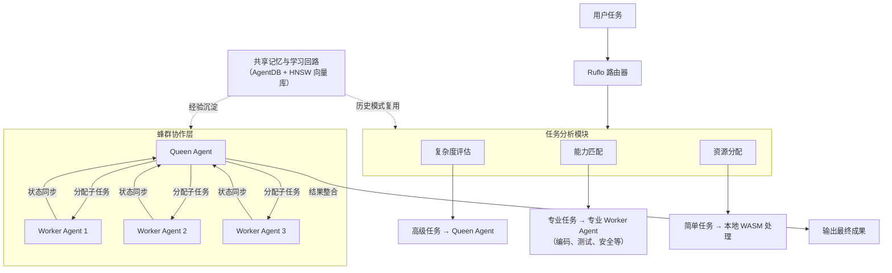
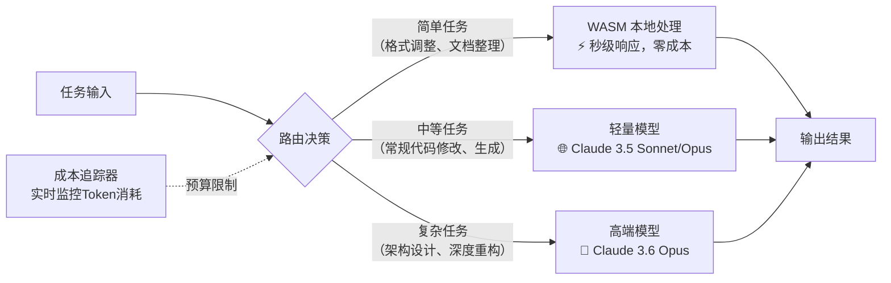
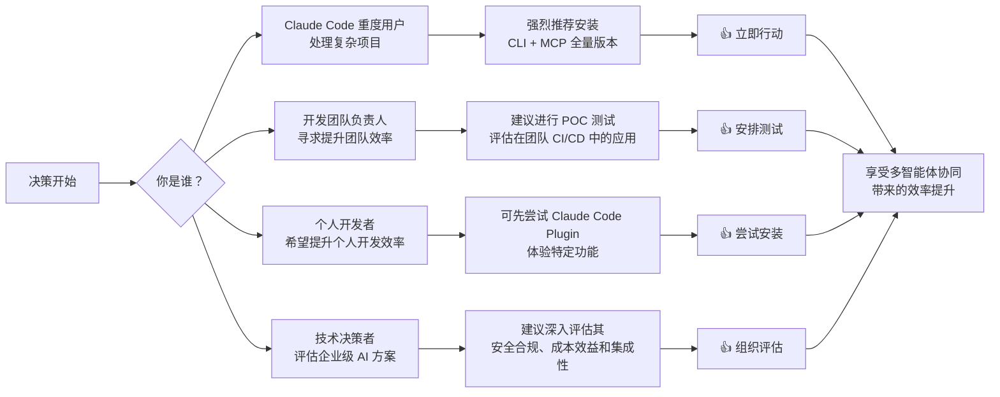

# ruvnet/ruflo

[GitHub URL](https://github.com/ruvnet/ruflo)


## Ruflo: Claude Code 多智能体编排平台评测

> Ruflo 是一个为 Claude Code 打造的企业级多智能体编排平台，通过蜂群协作与持久化记忆显著提升开发效率并降低 API 成本。

- **Tags**: Claude, Multi-Agent, DevOps, GitHub, 效率工具
- **Category**: 开发工具, AI 编程

## Details

# Ruflo: 给 Claude Code 装上“神经系统”的多智能体编排平台
> 一行命令将单兵作战的 AI 助手变成协同作战的智能体团队，让软件开发效率提升 2.5 倍，Token 成本降低 75%。
## 1. 一句话总结
Ruflo 是一个面向 Claude Code 的**企业级多智能体编排平台**，它通过蜂群式架构协调 100+ 个专业智能体，让多个 AI 像工程团队一样协作完成任务，并具备跨会话记忆、自学习和跨机器安全通信能力。
## 2. 背景与痛点
Ruflo 的诞生直接回应了当前 AI 辅助开发中的三大核心瓶颈：
-   **协作缺失**：单个 AI Agent 无法共享上下文，面对复杂任务时“各自为战”，效率低下。
-   **记忆断裂**：会话结束，所有经验归零。AI 助手无法从过去的成功中学习，重复犯同样错误。
-   **规模受限**：复杂任务只能串行执行，无法并行处理多环节，上下文窗口有限导致长任务信息丢失。
这些问题在涉及多模块协作、跨团队开发、长期项目维护的企业级场景中尤为突出。Ruflo 前身为 **Claude Flow**，由开发者 rUv（Reuven Cohen）创建，2026 年初正式更名为 Ruflo，寓意着“心流状态”（Flow）和作者网名“Ru”的结合。
## 3. 核心亮点与功能剖析
Ruflo 的核心在于其四层架构设计，它像一个“智能体元框架”（Meta-Harness），为 Claude Code 这块“高性能显卡”装上了“集群调度器 + 长期记忆 + 同事通讯”。
### 3.1 智能路由与蜂群协作 (Swarm Intelligence)
Ruflo 内置 **100+ 个专业智能体**，覆盖编码、测试、安全审计、架构设计、文档撰写等全开发链路。它采用 **Queen-Worker 层级调度**模式，支持多种蜂群拓扑（层级、网格、环形）。

其路由准确率据称可达 **89%**，能将任务智能分配至最合适的智能体处理，显著提升协作效率。多智能体间通过共识算法（如 Raft、拜占庭容错）自动解决冲突，避免任务丢失。
### 3.2 持久化向量记忆与自学习 (Adaptive Memory)
Ruflo 内置 **RuVector 持久化向量记忆库**，基于 PostgreSQL 与 HNSW 算法实现高速向量搜索。其 **自进化神经架构 SONA** 与 **EWC++ 防遗忘技术**让 Ruflo 能自动提炼并存储任务经验，在后续相似需求中实现记忆复用。
| 记忆特性 | 技术实现 | 效果 |
| :--- | :--- | :--- |
| **高速检索** | HNSW 算法 + PostgreSQL | 2万条向量规模下比暴力检索快约1.9倍，recall@10 约0.99 |
| **跨会话记忆** | 向量数据库 + 会话索引 | 记住过去所有会话的经验，避免灾难性遗忘 |
| **模式复用** | SONA 自学习 + EWC++ | 成功模式可被后续任务复用，持续提升协作效果 |
### 3.3 三级智能路由与成本优化
Ruflo 设计了 **三级智能路由系统**，根据任务复杂度动态选择最经济的处理方式，大幅降低 API 成本：

官方数据显示，这种智能路由机制可使 API 调用成本**降低高达 75%**，Claude 能力上限提升 **2.5 倍**。
### 3.4 企业级安全与联邦通信 (Federation)
Ruflo 内置 **企业级安全防护体系**，包括提示词注入防御、PII 敏感信息检测、安全扫描等。其 **Federation 联邦通信机制**允许不同机器上的 Agent 安全发现、认证并协作，敏感数据出站前自动过滤，非常适合跨团队、跨云区域的协作场景。
> 💡 **比喻**：Federation 就像是 Agent 之间的“Slack”，让它们可以安全地“聊天”和“协作”，同时企业可以像管理内部通信一样管理 Agent 之间的信息交换。
## 4. 目标人群与收益
### 4.1 核心受益人群
| 用户类型 | 痛点 | Ruflo 带来的收益 |
| :--- | :--- | :--- |
| **个人开发者** | 处理复杂项目时上下文丢失、单任务效率低、重复劳动 | 任务拆分并行处理、跨会话记忆、Token 成本降低75% |
| **开发团队** | 协作成本高、任务分配不均、知识难以共享 | 多智能体协同工作流、团队经验沉淀、跨机器安全通信 |
| **DevOps/运维** | CI/CD 流水线自动化程度低、测试覆盖率不足、安全漏洞难发现 | 自动化测试生成、持续安全审计、成本追踪与预算控制 |
| **技术架构师** | 复杂系统设计决策难追踪、架构演进文档缺失 | 自动化架构决策记录（ADR）、架构模式复用、知识图谱构建 |
### 4.2 具体收益体现
-   **效率提升**：多智能体并行处理任务，整体开发效率提升 **2-3 倍**。
-   **成本降低**：智能路由和本地处理大幅减少高端模型调用，**API 成本降低最高达 75%**。
-   **质量保证**：内置的测试生成、安全审计、代码审查智能体，自动保障代码质量。
-   **知识沉淀**：团队经验和决策自动记录在向量记忆中，避免“知识随人员流动而流失”。
## 5. 竞品/同类对比
在多智能体编排领域，Ruflo 与其他框架有显著差异：
| 特性维度 | Ruflo | LangGraph | AutoGen | CrewAI |
| :--- | :--- | :--- | :--- | :--- |
| **核心定位** | Claude Code 专用企业级编排平台 | 通用 Agent 编排框架 | 通用多智能体对话框架 | 通用多智能体协作框架 |
| **集成深度** | **原生集成 Claude Code** | 通用 LLM 集成 | 通用 LLM 集成 | 通用 LLM 集成 |
| **记忆系统** | **持久化向量记忆 + 自学习** | 简单记忆机制 | 简单记忆机制 | 简单记忆机制 |
| **安全防护** | **企业级安全防护 + 联邦通信** | 基础安全机制 | 基础安全机制 | 基础安全机制 |
| **学习曲线** | **中等（需了解 Claude Code）** | 中等 | 中等 | 中等 |
| **生产就绪** | **企业级（高可靠性）** | 探索阶段 | 探索阶段 | 探索阶段 |
| **独特优势** | **成本优化、Claude 生态深度绑定** | 灵活性高、社区支持好 | 对话交互强 | 易用性好、可视化强 |
> 💡 **核心差异化优势**：Ruflo 是目前唯一**专为 Claude Code 打造**的、具备**企业级可靠性**和**成本优化能力**的多智能体编排平台。它不是与 Cursor、Aider 等工具竞争，而是为 Claude Code “加持”，将其能力放大到企业级规模。
## 6. 局限与不足
尽管 Ruflo 功能强大，但也存在一些局限性和潜在风险：
### 6.1 生态依赖风险
Ruflo 深度绑定 Anthropic 的 Claude Code 和 MCP 生态。如果未来 Claude Code 内化了多智能体调度能力，Ruflo 的核心价值可能被削弱。这是一种“寄生”风险，不过目前来看，Anthropic 尚未表现出要内化这种复杂能力的迹象。
### 6.2 学习曲线与复杂度
虽然安装只需一条命令，但**充分理解和配置 Ruflo 需要时间**。用户需要理解蜂群拓扑、共识算法、记忆机制等概念，对新手有一定门槛。错误配置可能导致性能下降甚至任务失败。
### 6.3 活跃度与稳定性
项目目前处于**高频迭代阶段**（已有 1,488+ 个 release），版本号多为 alpha 版本，说明其快速演进的同时，稳定性可能存在波动。对于追求极致稳定的生产环境，需要谨慎评估。
### 6.4 资源消耗
运行多智能体蜂群和向量记忆库需要**一定的系统资源**（尤其是内存和存储）。在资源受限的环境下可能影响性能。
### 6.5 文档与社区支持
尽管项目在 GitHub 上非常活跃（53.4K+ stars, 6.1K+ forks），但其**文档和社区资源相比 LangChain 等成熟项目仍显不足**，遇到问题时可能需要更多时间排查。
## 7. 上手体验与部署
Ruflo 提供了两种安装路径，满足不同用户的需求：
| | **Claude Code Plugin** | **CLI + MCP 全量安装** |
| :--- | :--- | :--- |
| **安装复杂度** | 低（命令安装插件） | 中（`npx ruflo init wizard` 交互式向导） |
| **功能完整性** | 插件特定功能 | **完整 Ruflo 能力**（98个Agent、60+命令、30技能） |
| **文件生成** | 无 | `.claude/`, `.claude-flow/`, `CLAUDE.md`, 配置文件 |
| **MCP 服务器** | 仅 `ruflo-core` 自带 | **自动注册所有 MCP 服务器** |
| **钩子系统** | 无 | **完整 Hooks 系统**（27个钩子） |
| **最佳用途** | 轻量级尝试、特定插件功能 | **生产环境、完整功能体验** |
### 7.1 快速开始（CLI + MCP 全量安装）
```bash
# 1. 安装 Node.js 20+ 版本
# 2. 运行交互式安装向导
npx ruflo@latest init wizard
# 3. 在 Claude Code 中注册 Ruflo 为 MCP 服务器
claude mcp add claude-flow -- npx ruflo@latest mcp start
# 4. 照常使用 Claude Code，Ruflo 会在后台自动路由和协调
```
安装完成后，你的项目目录会自动生成必要的配置文件和助手脚本。
### 7.2 基本使用示例
初始化后，你可以像平时一样使用 Claude Code，但背后 Ruflo 已经开始工作：
```markdown
# 用户输入
"帮我重构用户服务模块，需要：
1. 分析现有代码结构
2. 识别潜在性能瓶颈
3. 提出重构方案
4. 生成单元测试
5. 进行安全审计"
# Ruflo 后台自动处理（用户无感知）
1. 路由器将任务拆解为子任务
2. 分配给相应的智能体：
   - 分析智能体（分析代码结构）
   - 性能优化智能体（识别瓶颈）
   - 架构师智能体（提出方案）
   - 测试生成智能体（生成单元测试）
   - 安全审计智能体（进行安全审计）
3. 各智能体并行工作，通过共享记忆和消息通信
4. 结果汇总，整合后输出给用户
# 用户看到的输出
一份完整的重构报告，包括：
- 代码结构分析报告
- 性能瓶颈清单及优化建议
- 详细的重构方案
- 自动生成的单元测试代码
- 安全审计报告（无漏洞）
- 下一步行动计划
```
## 8. 社区与生态
Ruflo 拥有**活跃的社区和丰富的插件生态**：
-   **GitHub 活跃度**：截至 2026 年 5 月，拥有 **53.4K+ Stars** 和 **6.1K+ Forks**，20 位贡献者，已发布 **1,488+ 个版本**，更新频率极高。
-   **插件市场**：提供 **33 个原生插件**，覆盖从核心编排到具体业务场景的各个方面。
-   **企业采用**：已有多家企业开始评估并采用 Ruflo 用于生产环境，尤其在自动化测试、安全审计和 CI/CD 流水线增强方面。
## 9. 结语与行动建议
### 9.1 终极评判
Ruflo 是一个**设计精良、架构先进、且极具前瞻性**的多智能体编排平台。它精准地解决了当前 AI 辅助开发中的核心痛点，并通过**卓越的成本优化、企业级安全和深度 Claude 生态集成**，在众多类似项目中脱颖而出。
它不仅仅是一个工具，更代表了一种**范式转变**：从“单智能体辅助”到“多智能体协同”，从“临时解决方案”到“企业级工程实践”。
### 9.2 行动建议

**立即行动建议**：
1.  **如果你是 Claude Code 重度用户**：毫不犹豫地执行 `npx ruflo@latest init wizard`，体验多智能体协同带来的效率飞跃。
2.  **如果你是团队负责人**：建议在团队中安排 POC 测试，重点评估其在自动化测试、代码审查和安全审计方面的价值。
3.  **如果你是个人开发者**：可以从 Claude Code Plugin 开始，逐步探索 Ruflo 的能力，找到最适合你的使用方式。
> ⚠️ **注意事项**：由于项目仍处于快速迭代阶段，建议在**非关键项目**上先进行试用，熟悉其配置和行为模式后再用于核心生产环境。
**未来展望**：随着 AI 技术的不断发展，多智能体协同将成为企业级 AI 应用的标准模式。Ruflo 凭借其先发优势和深度集成，有望成为 Claude 生态中这一领域的**事实标准**。密切关注其发展，并积极参与社区建设，将使你在未来的 AI 工程化浪潮中占据先机。
