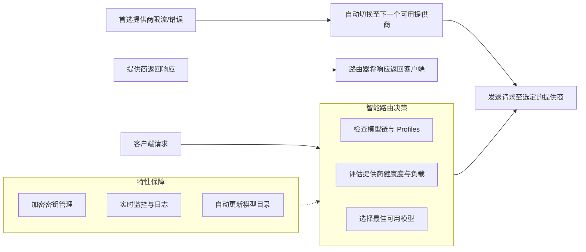

# tashfeenahmed/freellmapi

[GitHub URL](https://github.com/tashfeenahmed/freellmapi)

- **Stars**: 19708
- **Language**: TypeScript

## FreeLLMAPI 深度评测：聚合全球免费大模型资源的智能路由器

> 聚合29家厂商免费额度，统一OpenAI接口，零成本调用强大AI能力。

- **Tags**: 开源项目, LLM, API聚合, 智能路由, 免费额度
- **Category**: AI 编程, 开发工具, 效率工具

## Details

# FreeLLMAPI 深度评测：聚合全球免费大模型资源的“瑞士军刀”式路由器
> **一句话总结**：FreeLLMAPI 是一个能将 **29家大模型厂商的免费额度**（合计约**每月40亿Token**）聚合为**一个统一OpenAI兼容接口**的智能路由器，它通过自动故障转移、智能选择和加密密钥管理，让你真正实现“零成本”调用强大AI能力。
## 1 背景与痛点：为何需要免费模型聚合器？
在AI飞速发展的今天，几乎每家主流AI厂商（Google、Anthropic、OpenAI、Meta、Mistral、Cohere、智谱等）都提供**免费API额度**。单看每家的额度都不大，通常只是“尝鲜”级别，但将其叠加起来却是一个惊人的数字：**24家厂商、128个免费模型**，合计每月可达**17-40亿免费Token**。
然而，直接使用这些免费额度存在明显痛点：
-   **管理混乱**：需要维护24套不同的SDK、API Key和认证机制
-   **限速难题**：每家厂商都有独特的速率限制（RPM、TPM），手动跟踪并遵守极其困难
-   **稳定性差**：单个免费模型服务容易触发限流或宕机，导致应用中断
-   **更新频繁**：免费模型列表、额度规则和兼容性变化频繁，需要持续跟进
FreeLLMAPI正是为解决这些问题而生。它像一个智能“Token经济”整合平台，将分散的免费资源集中化管理，让你用一个Key、一个接口，就能调用整个AI世界的免费能力。
## 2 核心亮点与功能剖析
### 2.1 聚合28家免费模型供应商
FreeLLMAPI最核心的价值在于其**惊人的覆盖度**。它集成了29家免费LLM提供商（如Google AI、Groq、OpenRouter、智谱AI等），涵盖**251个模型家族、358个免费模型端点**。这意味着你可以从**一个平台**访问从小型快速模型到大型强大模型的全谱系免费资源。
| 提供商示例 | 免费模型示例 | 特色与优势 |
| :--- | :--- | :--- |
| Google AI | Gemini Pro | 强大的多模态能力和复杂推理 |
| Groq | Llama 3-70b | 极快推理速度（Token生成速度远超传统GPU） |
| OpenRouter | 多种开源模型 | 路由到最便宜、最快的可用模型 |
| 智谱AI | GLM-4 | 中文理解和生成能力强大 |
| 自定义 | llama.cpp, LM Studio | 支持本地模型或任何OpenAI兼容端点 |
### 2.2 智能路由与自动故障转移
FreeLLMAPI的核心是它的**智能路由器**。当你发送一个请求时，它会：
1.  **智能选择模型**：根据预设的“**Fallback Chain**”（备用链）或“**Profiles**”（模型链），自动选择最合适的模型。比如，你可以设置一个“**编程链**”优先使用代码能力强的模型（如Codex、GPT-4），一个“**创意链**”优先使用想象力丰富的模型（如Claude、Gemini）。
2.  **自动故障转移**：当首选模型遇到**429（速率限制）** 或**5xx错误**时，路由器会自动、无缝地切换到下一个可用的模型或提供商。这整个过程对客户端应用完全透明。
3.  **速率限制管理**：它内置了**精细的速率限制跟踪**，能够学习和适应每个提供商的实际限制，确保请求量始终在免费额度的安全范围内，避免触发限流。

### 2.3 统一且兼容的接口
FreeLLMAPI最大的便利性在于它提供了**完全兼容OpenAI API的接口**（`/v1/chat/completions`, `/v1/completions`, `/v1/images/generations`, `/v1/audio/speech`, `/v1/embeddings`）。这意味着：
-   **无缝集成**：你现有的任何使用OpenAI SDK的代码（无论是Python的 `openai` 库、还是其他语言的SDK）都**无需修改**，只需将 `base_url` 指向你的FreeLLMAPI服务，并将 `api_key` 替换为FreeLLMAPI生成的统一Key，即可立即享受聚合后的免费资源。
-   **多协议支持**：除了OpenAI格式，它还原生支持Anthropic Messages API (`/v1/messages`)，让Claude Code和官方SDK也能无缝接入。
-   **工具调用与结构化输出**：它完美支持OpenAI风格的 `tools`（工具调用）、`response_format`（JSON模式）等高级特性，并能在不同提供商之间自动转换这些格式，解决了不同模型API不完全一致的问题。
### 2.4 高级特性：融合模型与提示压缩
-   **Fusion（融合模型）**：这是一个非常前瞻性的功能。当你指定 `model="fusion"` 时，路由器会**将你的提示同时发送给多个不同的免费模型**（一个Panel，面板），然后由一个“**Judge模型**”来综合这些模型的草稿，生成一个最终的高质量答案。这相当于一次请求就获得了“**群策群力**”的智慧，能有效提升回答的全面性和准确性。
<details>
<summary><b>🔧 查看Fusion模型的工作流程</b></summary>
```mermaid
flowchart LR
    A[用户发送请求<br>model="fusion"] --> B[路由器]
    
    B --> C[并行将提示发送给<br>多个预选免费模型面板]
    
    C --> D[每个模型生成草稿答案]
    
    D --> E[所有草稿答案提交给<br>独立的Judge模型进行综合评估]
    
    E --> F[Judge模型生成最终<br>综合答案]
    
    F --> G[路由器将最终答案返回给用户]
```
</details>
-   **提示压缩（Prompt Compression）**：这是一个可选的、智能化的请求优化功能。它会在请求发送前，**自动对提示进行去重、过滤工具输出、压缩重复JSON、修剪过时的上下文**。这不仅能显著减少Token消耗（尤其在长对话中），还能加快模型的推理速度，一举两得。
### 2.5 安全性与运维特性
-   **加密密钥管理**：所有你添加的提供商API Key在本地数据库中均使用**AES-256-GCM加密**，仅在内存中解密后用于单次请求。你永远只需要向应用提供一个由FreeLLMAPI生成的统一 `freellmapi-...` Key，无需向任何第三方暴露原始密钥。
-   **自更新模型目录**：FreeLLMAPI会**每天从官方源同步两次最新的模型目录**。这意味着当某个提供商推出新的免费模型、调整额度或修复兼容性问题时，你的FreeLLMAPI服务会**自动获取更新**，无需手动干预或重启服务。
-   **管理后台与监控**：内置了一个**React构建的Web管理后台**，你可以通过浏览器轻松地：
    -   添加/删除/编辑提供商API Key
    -   调整Fallback Chain的优先级
    -   创建和管理不同的模型链（Profiles）
    -   查看实时请求日志和**p50/p95延迟等性能指标**
    -   使用内置的Playground测试不同模型的效果
## 3 目标人群与收益：谁最该用？
### 3.1 核心目标用户
| 用户类型 | 核心需求 | FreeLLMAPI带来的收益 |
| :--- | :--- | :--- |
| **个人开发者/黑客** | 零成本测试、学习AI原型、个人项目 | **完全免费的Token**，无需付费即可调用最新最强模型，大幅降低学习与开发成本。 |
| **初创公司/MVP验证团队** | 快速验证想法、控制初期成本、寻求低成本方案 | **极低的验证成本**，将宝贵的资金投入到产品核心而非Token上；一个API统一管理，省心省力。 |
| **教育机构/学生** | 教学、课程项目、研究实验 | **免费的教学资源**，无需为每个学生账号申请额度和配置，一个服务即可供全班使用。 |
| **AI爱好者/研究者** | 比较不同模型效果、探索新模型特性 | **一站式模型实验室**，轻松切换和对比数十个模型，进行prompt工程和模型能力探索。 |
### 3.2 核心收益
1.  **💰 真正的零成本**：将分散的免费额度整合，形成可观的“**免费Token池**”，基本覆盖个人和小团队的日常需求，**无需付费**即可获得强大AI能力。
2.  **⚡ 极大提升开发效率**：**无需再学习多个SDK**，无需再为处理不同API的错误和限流而烦恼。统一的接口和智能路由让你能专注于业务逻辑，而非基础设施。
3.  **🛡️ 增强应用稳定性**：**自动故障转移**机制让你的应用或服务具备“**高可用性**”，即使某个免费模型服务出现问题，也能自动切换，确保业务不中断。
4.  **🌍 拥抱最新模型**：**自更新的模型目录**让你总能第一时间使用到新推出的免费模型，无需手动更新代码，紧跟AI发展前沿。
## 4 竞品/同类对比
为了更清晰地定位FreeLLMAPI，我们将其与常见的几种方案进行对比：
| 特性 | FreeLLMAPI | 手动管理多个API Key | 付费API聚合平台（如OpenRouter） | 本地模型（如Ollama） |
| :--- | :--- | :--- | :--- | :--- |
| **成本** | **免费（聚合免费额）** | 免费（但分散） | 通常付费（或聚合免费额但收费） | 硬件成本高，但软件免费 |
| **模型多样性** | **极高（29家，358+模型）** | 高（需手动集成） | 高 | 取决于下载的模型 |
| **便利性** | **★★★★★（一键部署，统一接口）** | ★（需编写复杂代码） | ★★★★★（统一接口，但付费） | ★★★（需配置本地环境） |
| **稳定性** | **★★★★★（智能故障转移）** | ★（单点故障风险高） | ★★★★（通常有备份） | ★★★★（依赖本地硬件稳定性） |
| **隐私性** | **★★★★☆（密钥加密，自托管）** | ★★★☆☆（密钥分散管理） | ★★★☆☆（需信任第三方平台） | ★★★★★（完全本地） |
| **功能特性** | **丰富（融合模型、提示压缩、多协议）** | 基础 | 基础-丰富 | 基础（依赖本地模型支持） |
| **最佳场景** | **个人/小团队零成本开发、MVP验证** | 简单项目、极客爱好 | **生产环境、需要可靠服务支持** | **极敏感数据、完全离线需求** |
> **🎯 核心定位**：FreeLLMAPI并非要替代付费的、生产级API聚合平台（如OpenRouter），也并非要替代本地模型方案。它的**独特价值**在于为**个人开发者、学习者和小型团队**提供了一个**强大、免费、高度自动化的免费模型整合方案**，填补了“个人玩具项目”和“生产付费方案”之间的巨大空白。
## 5 局限与不足
没有任何工具是完美的，FreeLLMAPI也不例外，客观认识其局限性非常重要：
1.  **⚠️ 免费额度的固有限制**：免费额度终究是有限的。对于**高并发、大规模生产应用**，其免费总额度可能仍显不足。它更适合**个人项目、测试、学习、MVP验证**等场景，而非支撑需要大量Token的商业服务。
2.  **📊 模型性能与可靠性差异**：聚合的免费模型在**响应速度、回答质量、稳定性**上可能参差不齐。虽然智能路由会尝试选择最好的，但整体体验和一致性可能仍不如单一的、经过优化的付费模型服务。
3.  **🔐 自托管责任**：需要你**自行部署和运维**（尽管Docker很简单）。这意味着你需要：
    -   保证服务器的稳定性和安全性。
    -   定期备份数据库（包含加密的API Key）。
    -   为服务器的成本和电量买单（除非你用闲置电脑）。
4.  **🧩 依赖网络**：所有请求都需要经过你的FreeLLMAPI服务器，这会**增加一点延迟**（通常可忽略不计），并且要求你的服务器与提供商的网络连接良好。
5.  **⚡ 功能更新节奏**：虽然模型目录会自动更新，但**新功能的添加和Bug修复**取决于开源项目的维护节奏。对于一些非常前沿的API特性，可能存在滞后。
## 6 上手门槛与部署体验
### 6.1 部署方式与门槛
FreeLLMAPI提供了多种部署方式，以满足不同用户的需求和偏好：
```mermaid
flowchart LR
    A[FreeLLMAPI 部署方式] --> B[最推荐：Docker / Docker Compose]
    A --> C[最便捷：一键安装脚本]
    A --> D[最传统：从源码安装]
    A --> E[Windows专属：.exe安装器]
    A --> F[云端体验：HuggingFace Space<br>（无需服务器）]
    
    subgraph B [Docker部署]
        B1[安装Docker & Docker Compose]
        B2[运行一键安装脚本<br>curl -fsSL https://freellmapi.co/install.sh | bash]
        B3[或手动克隆仓库并创建.env文件]
        B4[启动容器 docker compose up -d]
    end
    
    subgraph C [一键安装脚本]
        C1[确保系统有curl和bash]
        C2[运行安装脚本]
        C3[脚本自动完成所有配置]
    end
    
    subgraph D [从源码安装]
        D1[安装Node.js v20+]
        D2[安装Git]
        D3[克隆仓库并npm install]
        D4[生成加密Key并配置.env]
        D5[npm run build && npm run dev]
    end
    
    subgraph E [Windows安装器]
        E1[下载Releases中的.exe文件]
        E2[双击运行安装器]
        E3[按提示完成安装]
    end
    
    subgraph F [HuggingFace Space]
        F1[无需准备服务器]
        F2[在HF Space中fork该项目]
        F3[等待构建完成]
        F4[访问分配的URL]
    end
    
    B --> G[访问 http://localhost:3001<br>进入管理后台]
    C --> G
    D --> G
    E --> G
    F --> H[访问分配的Space URL<br>注意需设置为Private以保护密钥]
    
    G --> I[添加提供商API Key]
    G --> J[配置Fallback Chain与Profiles]
    G --> K[复制统一API Key]
    G --> L[开始调用API]
    
    H --> I
    H --> J
    H --> K
    H --> L
```
<details>
<summary><b>🔧 查看Docker Compose部署的核心步骤</b></summary>
1.  **确保环境**：已安装Docker和Docker Compose。
2.  **创建项目目录**：
    ```bash
    mkdir ~/freellmapi && cd ~/freellmapi
    ```
3.  **创建环境变量文件（.env）**：生成加密Key并创建`.env`文件。
    ```bash
    ENCRYPTION_KEY="$(openssl rand -hex 32)"
    printf "ENCRYPTION_KEY=%s\nPORT=3001\n" "$ENCRYPTION_KEY" > .env
    ```
4.  **启动服务**：
    ```bash
    docker compose up -d
    ```
5.  **访问管理后台**：打开浏览器访问 `http://localhost:3001`，首次访问需设置管理员邮箱和密码。
</details>
### 6.2 核心代码与使用示例
部署成功后，使用起来极其简单。以下是使用Python `openai` 库的示例：
```python
from openai import OpenAI
# 指向你的FreeLLMAPI服务
client = OpenAI(
    base_url="http://localhost:3001/v1",  # 或你的服务器地址
    api_key="freellmapi-你的统一密钥",     # 在Keys页面获取
)
# 发送请求 - 使用 "auto" 让路由器自动选择最佳模型
response = client.chat.completions.create(
    model="auto",  # 也可以指定特定模型，如 "google/gemini-pro"
    messages=[
        {"role": "system", "content": "你是一个乐于助人的AI助手。"},
        {"role": "user", "content": "用简单的比喻解释什么是FreeLLMAPI？"}
    ]
)
print(response.choices[0].message.content)
```
**关键点**：
-   `base_url` 改为你FreeLLMAPI服务的地址（`/v1` 是前缀）。
-   `api_key` 使用在FreeLLMAPI管理后台 **Keys** 页面头部生成的统一密钥。
-   `model="auto"` 是最智能的方式，让路由器根据你的Fallback Chain自动选择当前最佳、最可用的模型。你也可以指定特定模型，如 `google/gemini-pro`。
### 6.3 社区活跃度与生命力
-   **Star数与趋势**：在GitHub上已获得**14.8k+的Star**，表明其受到了开发社区的广泛欢迎和关注，是一个相当热门的项目。
-   **更新频率**：项目**持续活跃维护**，能快速响应免费模型市场的变化，及时更新模型目录和修复问题。
-   **文档与生态**：提供了**详尽的官方文档**、安装指南、API参考和架构说明。社区也围绕它产生了丰富的教程和博客（如本文参考的几篇），形成了良好的知识生态。
-   **付费支持**：官方也提供了 **$19/年的付费托管服务**（freellmapi.co），为不想自托管的用户提供了另一种选择，也证明了项目有持续发展的商业模式支撑。
## 7 结语与行动建议：终极评判
FreeLLMAPI是一个**设计精巧、实用价值极高**的开源项目。它精准地抓住了个人开发者和小团队在AI开发中的核心痛点——**成本与便利性**，并通过一个**优雅、强大且完全免费**的方案予以解决。它就像是一个“Token经济的整合器”，将零散的免费资源汇聚成一股强大的力量。
**🏆 综合评价**：
-   **创新性**：★★★★★（聚合免费模型的概念本身极具创新性，智能路由和融合模型等高级功能更是锦上添花）
-   **实用性**：★★★★★（能直接解决用户的实际痛点，提供立竿见影的价值）
-   **易用性**：★★★★☆（Docker部署简单，但初学者可能需要花时间理解配置和模型链概念）
-   **可靠性**：★★★★☆（智能故障转移机制大大提升了可靠性，但免费模型本身的稳定性是其上限）
-   **性价比**：★★★★★（**完全免费**，提供的价值远超其所需投入的时间成本）
**🚀 行动建议**：
1.  **如果你是个人开发者、学生或正在验证AI想法的创业者**：**强烈推荐立即尝试**。花一个下午部署和配置，它很可能成为你未来开发AI应用不可或缺的“**免费算力底座**”。
2.  **如果你已经在使用多个免费模型API**：**FreeLLMAPI可以立即简化你的工作流程**，提升稳定性，并帮你更好地利用和管理这些资源。
3.  **如果你主要使用付费的、生产级API**：**FreeLLMAPI可以作为你开发、测试和学习的“沙盒环境”**，极大降低开发和实验成本，同时为你提供一个免费、可靠的备用方案。
**⚠️ 使用须知**：
-   **遵守各提供商的免费政策**：虽然FreeLLMAPI帮你管理限速，但请确保你了解并遵守每个提供商的免费额度和使用条款，**不要滥用**。
-   **用于个人学习和实验**：它非常适合这些场景，但请勿将其用于需要高可靠性、高并发或涉及敏感数据的生产环境，那应该选择付费的、有SLA保障的服务。
-   **关注项目发展**：AI领域日新月异，定期关注GitHub仓库的更新，以获取最新的模型和功能。
总而言之，FreeLLMAPI是一个**真正能让你“白嫖”到AI时代红利**的强大工具。它降低了AI开发的门槛，让每个人都能更平等、更低成本地接触和使用最前沿的AI能力。这，正是开源精神的最佳体现。
