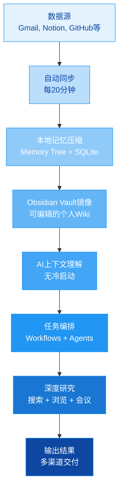

# tinyhumansai/openhuman

[GitHub URL](https://github.com/tinyhumansai/openhuman)

## OpenHuman 评测：你的本地优先、记忆超强的个人AI超级大脑

> 构建持久化、本地记忆的AI个人超级大脑，像贴身智能助理一样持续学习你的数据和工作流。

- **Tags**: AI助手, 本地部署, 知识管理, 自动化, 隐私保护
- **Category**: 开发工具, 生活效率, AI 编程

## Details

# OpenHuman 评测：你的本地优先、记忆超强的个人AI超级大脑
> **一句话总结**：OpenHuman 是一个构建持久化、本地记忆的AI个人超级大脑，它像贴身智能助理一样持续学习你的数据和工作流，并通过强大的编排能力和研究能力，帮你高效完成复杂任务。
---
## 🧠 1. 背景与痛点：为什么需要 OpenHuman？
在AI助手泛滥的今天，大多数产品都有一个共同问题：**它们对你一无所知**。每次对话都是冷启动，你需要反复解释你的项目、你的习惯、你的数据源。即使你提供了API密钥或连接了账号，它们也往往只能浅层次地访问数据，无法形成长期记忆、无法理解你的工作上下文。
OpenHuman 诞生的初衷就是解决这个核心痛点。它通过以下方式构建真正的个人知识图谱：
- **本地优先的记忆**：将你的所有数据（Gmail、Notion、GitHub、Slack等）压缩并存储为本地Markdown文件，构建一个持久化的知识库。
- **持续学习**：每20分钟自动同步一次数据，让AI始终保持最新的上下文。
- **无冷启动**：首次使用后就能理解你的整个工作世界，无需数周“训练”。

<strong>🔍 技术细节：Karpathy式的知识库原理</strong>

OpenHuman的灵感来自Andrej Karpathy提出的LLM知识库概念。它通过以下方式实现：
1. **数据压缩**：将所有原始文档、邮件、聊天记录等转换为结构化的Markdown文件。
2. **记忆树（Memory Tree）**：构建一个分层级的树状结构，每个节点代表一个知识点，并附有相关性评分。
3. **SQLite本地存储**：所有数据存储在本地SQLite数据库中，确保隐私和快速访问。
4. **Obsidian Vault镜像**：自动生成一个Obsidian vault，你可以像编辑个人Wiki一样直接查看和编辑这些记忆。

---
## 🌟 2. 核心亮点与功能剖析
OpenHuman 的核心能力可以分为三个方面：**记忆大脑**、**编排能力**和**深度研究**。
### 2.1 🧠 记忆大脑：你的第二大脑
| 功能 | 描述 | 实际收益 |
| :--- | :--- | :--- |
| **Memory Tree + Obsidian Wiki** | 将数据压缩为评分的Markdown树，存储在本地SQLite中，并镜像为Obsidian vault | 你可以像浏览个人Wiki一样查看AI的记忆，甚至手动编辑它，确保准确性 |
| **100+ OAuth集成** | 一键连接Gmail、Notion、GitHub、Slack等主流服务 | 无需手动配置API密钥，几秒钟就能让AI了解你的全部数字生活 |
| **自动同步（Auto-fetch）** | 每20分钟自动拉取最新数据 | AI始终拥有最新的上下文，不会过时 |
| **潜意识（Subconscious）** | 后台持续运行，差异分析你的数据，推进目标，生成早报 | 你不需要主动触发，AI就在后台默默为你准备一切 |
| **TokenJuice压缩** | 将工具输出压缩到最多80%的token | 大幅降低API成本，让超长上下文成为可能 |
### 2.2 🕸️ 编排能力：智能任务自动化
OpenHuman 的编排能力让其能够自主执行复杂任务，而不仅仅是回答问题：
- **工作流自动化（Workflows）**：AI可以提出自动化方案，你在画布上审查并保存，然后它就可以执行这些可复用的工作流。
- **持久化图运行**：基于开源的`tinyagents`框架，确保任务完成，即使卡住也能被引导或返回根本原因。
- **双核架构**：一个快速反射代理处理入站流量，一个深度推理核心分配工作负载。
- **代理经济（Agent Economy）**：通过`tiny.place`平台，代理之间可以加密协作，甚至执行任务并收取报酬（USDC）。
### 2.3 🔬 深度研究：超强的信息获取与整合
OpenHuman 不仅仅是聊天机器人，它是一个真正的深度研究助理：
- **SuperContext**：在你开始提问之前，它就已经扫描了你的记忆和文件，没有冷启动。
- **内置高级工具**：
  - **网络搜索**：由Exa驱动的托管搜索，无需API密钥。
  - **浏览器工具**：真正的浏览器，可以与网页交互。
  - **会议代理**：可以加入Meet、Zoom、Teams等会议，自动记录、总结并创建行动项。
- **多模态能力**：图像生成（Seedream/SeedEdit）、视频生成（Seedance/Veo）和原生语音处理（Whisper）。
- **17个消息渠道**：支持Telegram、Discord、Slack、WhatsApp、Signal、iMessage以及原生邮件（IMAP IDLE + SMTP）。

---
## 🎯 3. 目标人群与收益
### 3.1 谁最适合使用 OpenHuman？
| 用户类型 | 核心痛点 | OpenHuman带来的收益 |
| :--- | :--- | :--- |
| **知识工作者/研究人员** | 需要处理大量信息，构建个人知识库，快速整合多源信息 | 自动化构建个人知识图谱，快速研究并总结复杂主题 |
| **开发者/工程师** | 需要管理多个项目、代码库、文档，希望AI真正理解项目上下文 | 无需反复解释项目，AI直接读取代码库和文档，提供精准建议 |
| **创业者/产品经理** | 需要监控多渠道信息（邮件、Slack、GitHub），快速决策 | 自动聚合所有信息，生成每日简报，智能识别优先级 |
| **内容创作者/写作者** | 需要整理大量素材，寻找灵感，管理多个项目 | 自动整理所有笔记和资料，提供写作建议和灵感挖掘 |
| **隐私敏感用户** | 不信任云端AI，希望数据完全本地化 | 本地优先架构，数据不上传（除非明确允许），完全控制 |
### 3.2 具体收益示例
1.  **效率提升**：你不需要再反复向AI解释“我的项目结构”、“我的客户是谁”、“我的写作风格是什么”，OpenHuman已经全都知道。
2.  **成本节约**：TokenJuice压缩技术大幅降低API调用成本，使用超长上下文也不会破产。
3.  **知识管理**：自动构建的个人知识库比手动维护更全面、更智能，且通过Obsidian可以随时查看和编辑。
4.  **任务自动化**：复杂的多步骤任务可以编排为工作流，AI自动执行，释放你的时间。
5.  **隐私安全**：数据优先存储在本地，你可以选择“隐私模式”确保没有任何推理请求离开你的机器。
---
## ⚔️ 4. 竞品/同类对比
| 产品 | 核心定位 | 记忆能力 | 编排能力 | 本地优先 | 部署难度 | 商业模式 |
| :--- | :--- | :--- | :--- | :--- | :--- | :--- |
| **OpenHuman** | 个人AI超级大脑 | ⭐⭐⭐⭐⭐ 本地持久记忆 | ⭐⭐⭐⭐⭐ 强大编排 | ✅ 完全本地优先 | ⭐⭐⭐ 有安装包，但配置多 | 订阅制 自带API额度 |
| **LangChain** | AI应用开发框架 | ⭐⭐ 需手动实现 | ⭐⭐⭐⭐⭐ 开发工具 | ⚠️ 通常云端 | ⭐⭐ 需要编程能力 | 开源 需自备API |
| **AutoGPT** | 自主任务执行 | ⭐ 短期记忆 | ⭐⭐⭐⭐⭐ 自主性强 | ❌ 通常云端 | ⭐⭐⭐⭐ 需配置环境 | 开源 需自备API |
| **MemGPT** | 记忆增强AI | ⭐⭐⭐⭐ 层级记忆 | ⭐⭐⭐ 基础编排 | ⚠️ 可本地部署 | ⭐⭐⭐ 需配置环境 | 开源 需自备API |
| **Obsidian + 插件** | 个人知识管理 | ⭐⭐⭐⭐ 手动管理 | ⭐ 无编排能力 | ✅ 完全本地 | ⭐⭐⭐⭐⭐ 最简单 | 免费+付费插件 |
**OpenHuman 的独特竞争力**：
-   **真正的本地优先**：不是“本地可用”，而是“默认本地”，数据完全掌控在自己手中。
-   **无冷启动的即时记忆**：连接账号后立即可用，无需数周训练。
-   **强大的编排能力**：不只是聊天，而是能执行复杂任务的智能助理。
-   **极低的接入门槛**：提供安装包，无需编程知识，UI优先的设计。
---
## ⚠️ 5. 局限与不足
尽管OpenHuman功能强大，但它也有明显的局限性和挑战：
1.  **部署与学习成本**：
    -   虽然有安装包，但配置OAuth连接、理解记忆树和编排概念仍有一定学习曲线。
    -   对于完全非技术用户，初次设置可能仍需一定时间理解。
2.  **性能与资源消耗**：
    -   本地存储和处理大量数据会占用磁盘空间，持续同步和后台处理可能影响电脑性能。
    -   在旧硬件上运行可能不够流畅。
3.  **依赖集成服务**：
    -   记忆的丰富性严重依赖于你能连接的OAuth服务数量。如果你使用的服务不在其列表中，就无法自动获取数据。
    -   某些服务（如企业内部工具）可能无法通过OAuth连接。
4.  **早期阶段的不稳定性**：
    -   官方明确标注为“早期Beta（Early Beta）”，正在积极开发中，预期会有“粗糙边缘”。
    -   可能遇到bug、功能变化或不稳定的情况。
5.  **商业模式的不确定性**：
    -   当前是订阅制，自带API额度。但长期来看，价格如何调整、BYOK（自带密钥）模式如何收费，尚不明确。
    -   对于重度用户，成本可能成为一个考虑因素。
6.  **语言与本地化支持**：
    -   虽然支持多语言（包括简体中文），但核心功能和高级工具可能以英文优化为主。
    -   部分高级功能（如会议代理）可能对非英语环境的支持有限。
---
## 🚀 6. 结语与行动建议
### 终极评判：OpenHuman 是什么？
OpenHuman 是一个**雄心勃勃的尝试**，它试图构建一个真正属于你个人的、能持续学习、能自主行动的AI超级大脑。它不仅仅是一个工具，更像是一个**数字世界的“第二大脑”和“智能助理”的结合体**。
它的核心价值在于：
-   **记忆的持久性和深度**：不是简单的关键词搜索，而是真正的知识理解和关联。
-   **编排的自主性**：能理解复杂目标，并将其分解为可执行的任务。
-   **隐私的保障性**：本地优先的设计让你完全掌控自己的数据。
**但是**，它目前仍处于**早期阶段**，需要用户有一定的技术背景和耐心来应对可能的不稳定性和学习曲线。它更适合作为**技术爱好者、知识工作者和深度AI用户**的高生产力工具，而非普通用户的“一键式”解决方案。
### 行动建议
#### ✅ **如果你是以下类型，强烈建议尝试**：
1.  **开发者/工程师**：希望AI能真正理解你的代码库和项目，提供精准的代码建议和自动化。
2.  **知识工作者/研究人员**：需要管理大量信息，构建个人知识库，进行深度研究。
3.  **隐私敏感的AI爱好者**：希望体验AI的强大能力，但不想将数据上传到云端。
4.  **技术尝鲜者**：喜欢探索前沿工具，不介意遇到bug和需要一定的配置。
#### ⚠️ **如果你是以下类型，建议观望**：
1.  **非技术用户**：只想简单聊天，不想配置任何东西。
2.  **Mac用户（旧型号）**：担心性能和资源消耗。
3.  **完全依赖中国本土服务**：主要使用微信、钉钉等，与OAuth集成列表重叠度低。
### 🎯 **立即行动的三个步骤**：
1.  **访问官网并下载**：前往 [tinyhumans.ai/openhuman](https://tinyhumans.ai/openhuman) 下载适合你操作系统的安装包。
2.  **连接核心账号**：安装后，优先连接你使用最频繁的1-2个服务（如Gmail、GitHub或Notion），体验即时记忆的魔力。
3.  **探索核心功能**：
    -   打开Obsidian Vault，查看AI是如何理解和组织你的数据的。
    -   尝试一个复杂任务，观察AI是如何将其分解并执行的。
    -   开启“隐私模式”，体验完全本地化的推理能力。
> 💡 **最后提示**：OpenHuman 的价值随着你连接的数据量和使用的深度而指数级增长。给它一点时间，让它学习你的世界，然后你会发现，它真的能成为你不可或缺的数字伙伴。
