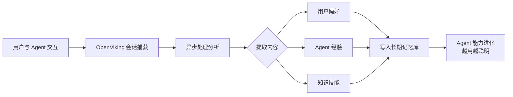
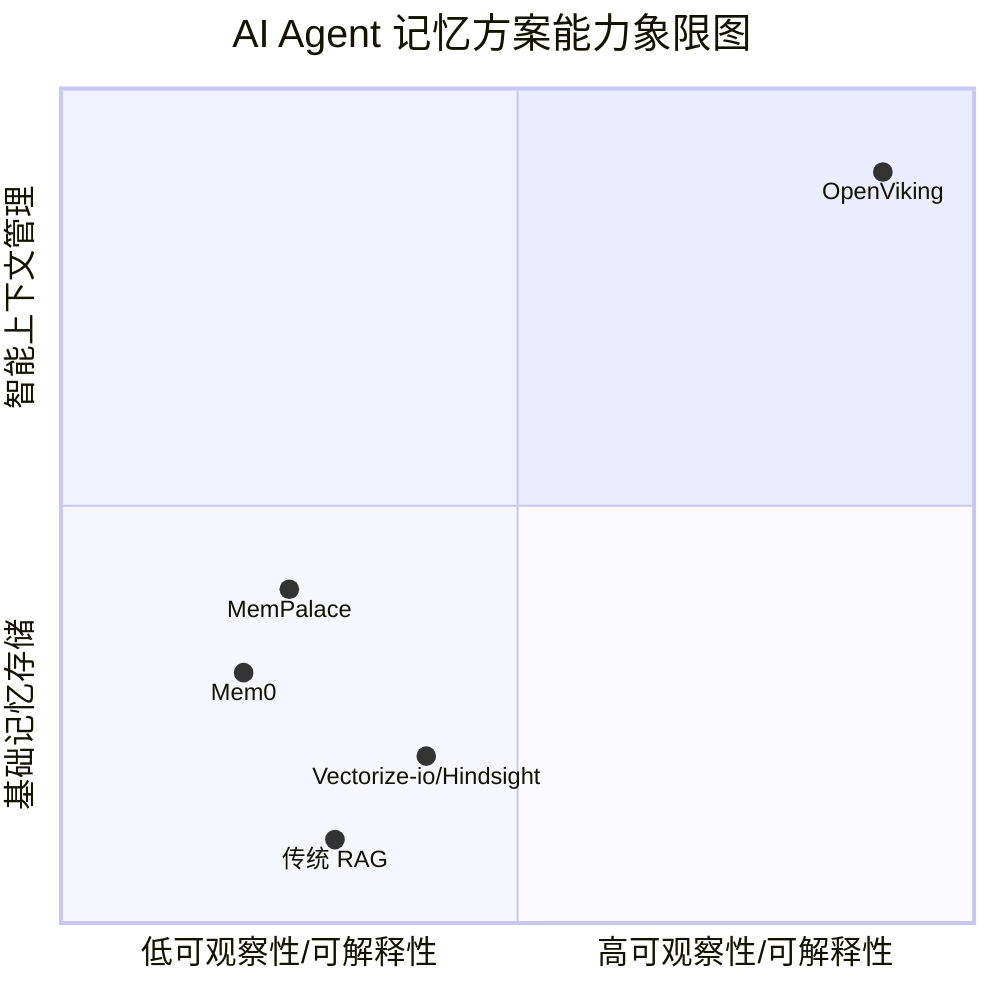

# volcengine/OpenViking

[GitHub URL](https://github.com/volcengine/OpenViking)

- **Stars**: 33903
- **Language**: Python

## OpenViking：给 AI Agent 装上「持久大脑」的开源利器

> 开源的 AI Agent 上下文数据库，通过虚拟文件系统统一管理记忆与知识，大幅降低 Token 成本并提升检索可控性。

- **Tags**: Agent, RAG, 开源项目, 字节跳动, 上下文管理
- **Category**: 开发工具, AI 编程, 数据库

## Details

# OpenViking：给 AI Agent 装上「持久大脑」的开源利器
> 一句话总结：OpenViking 是一个开源的 **AI Agent 上下文数据库**，它通过**虚拟文件系统**统一管理 Agent 的记忆、知识与技能，解决了传统 RAG 系统中**上下文碎片化、检索不可控、成本高昂**等核心痛点，让 Agent 拥有了真正的“持久化记忆”和“可观察思考”能力。
## 🧠 背景与痛点：AI Agent 的“失忆症”
AI Agent 的强大很大程度上依赖于其对上下文的感知和记忆能力。然而，现有的 Agent 开发普遍面临五大难题：
1.  **上下文碎片化**：Agent 的记忆、知识库和技能散落在不同的数据库、文件或聊天记录中，难以统一管理和高效利用。
2.  **长期上下文成本高昂**：在长对话或复杂任务中，将所有历史对话或全部文档上下文传递给 LLM，不仅消耗巨额 Token，计算成本也急剧上升。
3.  **RAG 检索质量参差不齐**：传统的检索增强生成（RAG）通常基于扁平的向量搜索，缺乏结构化上下文，检索结果可能缺乏关键背景信息，导致答案准确性下降。
4.  **检索行为不可观察**：传统的 RAG 系统像一个“黑盒”，当 Agent 给出错误答案时，开发者难以追溯是哪个信息片段、通过什么路径被错误检索的。
5.  **记忆迭代仅限于对话历史**：许多 Agent 的“记忆”仅仅是轮次间的对话历史，缺乏将知识、技能和经验自动沉淀、结构化并形成长期记忆的能力。
OpenViking 正是在这样的背景下诞生，旨在通过一个**统一的、可观察的、智能分层**的上下文数据库，从根本上解决这些问题。
## ⚡ 核心亮点与功能剖析
OpenViking 的设计哲学非常独特，它将 Agent 所需的所有上下文（记忆、资源、技能）映射到一个**虚拟文件系统（VFS）** 中，并通过 `viking://` 协议进行访问。这为 Agent 提供了一个**确定性、可导航、可操作**的上下文管理范式。
### 1. 🗂️ 统一虚拟文件系统 (VFS) 与 Viking URI
这是 OpenViking 最核心的创新。它将所有类型的上下文内容都抽象为文件和目录，并通过统一的 `viking://` URI 进行访问和操作。
```bash
# 示例：Viking URI 结构
viking://resources/my-project/docs/api.md         # 项目资源文档
viking://user/{user_id}/memories/preferences/coding # 用户偏好记忆
viking://agent/{agent_id}/skills/search-web      # Agent 技能
viking://session/{session_id}/messages.jsonl     # 会话记录
```
Agent 可以像开发者操作本地文件系统一样，通过标准的文件系统命令（如 `ls`, `tree`, `find`, `grep`）来浏览、定位、检索上下文。这彻底改变了 Agent 与上下文交互的方式，从“黑盒查询”变为“透明导航”。
### 2. 📚 智能分层加载机制
OpenViking 对存入的每个内容（文件、目录）都会自动处理成三个层次（L0, L1, L2），并按需加载，**极大节省了 Token 消耗和推理延迟**。
| 层级 | 内容 | Token 量（近似） | 用途 |
| :--- | :--- | :--- | :--- |
| **L0 (Abstract)** | 一句话摘要 | ~100 Tokens | **快速相关性判断**，用于初步检索和过滤 |
| **L1 (Overview)** | 核心信息与使用场景 | ~2k Tokens | 任务规划与推理，提供结构化上下文 |
| **L2 (Details)** | 完整原始数据 | 按需加载 | **详细内容读取**，仅在真正需要时加载 |
这种设计意味着，Agent 在大多数情况下只需处理 L0 和 L1 层，只有在确认需要深入细节时，才会按需加载 L2 层内容。官方数据显示，在用户记忆任务中，**输入 Token 可减少 34.3%–91.0%**，**查询延迟降低 58.45%–66.10%**。
### 3. 🔍 目录递归检索与观察性
OpenViking 的检索算法并非简单的向量搜索。它会先基于向量检索找到**最相关的高层目录**，然后**逐层向下递归检索**，直到找到最相关的文件或片段。这种方式确保了检索结果始终带有**完整的上下文路径**。
更重要的是，**每一次检索的路径（Trajectory）都会被完整记录**。开发者或 Agent 可以直观地看到：
-  哪个关键词匹配了哪个目录的 L0 摘要？
-  为什么选择了这条路径而不是另一条？
-  最终答案是基于哪一层级的哪个信息得出的？
这赋予了系统前所未有的**可观察性和可调试性**，是诊断和优化 Agent 行为的利器。
### 4. 🧠 会话即记忆
OpenViking 会自动将 Agent 的会话（Session）进行异步处理，从中提取用户偏好、Agent 经验、成功案例和失败教训，并将其**结构化地写入长期记忆库**。这意味着，Agent 的能力会随着使用而**持续进化**，真正实现了“越用越聪明”。

### 5. 🔌 丰富的生态集成
OpenViking 提供了与众多主流 AI Agent 框架和工具的集成，包括：
*   **开发工具**：Claude Code, Codex, Cursor, Trae 等
*   **Agent 框架**：OpenClaw, Hermes, LangChain/LangGraph 等
*   **协议支持**：MCP (Model Context Protocol) Clients
此外，它还提供了 **OpenViking Helper** 桌面应用（Beta），用于可视化配置、会话追踪和本地记忆管理。
## 🎯 目标人群与收益
| 目标人群 | 痛点 | OpenViking 带来的收益 |
| :--- | :--- | :--- |
| **AI Agent 开发者** | 上下文管理复杂、记忆不持久、检索效果不可控 | **统一、高效的上下文管理**，**可观测的检索路径**，**显著降低 Token 成本**和**推理延迟**，**加速开发与调试** |
| **企业应用架构师** | 构建复杂的多 Agent 协作系统、知识库整合困难 | **为 Agent 提供共享的、结构化的上下文数据库**，解决“**Too Many Agents**”问题，提升整体系统可靠性与性能 |
| **研究者与爱好者** | 探索 Agent 记忆与学习机制、需要可复现的实验环境 | **清晰的架构与可观察的内部行为**，**提供标准化的记忆评估基准**（如 LoCoMo, tau2-bench），是研究 Agent 智能化的理想平台 |
| **技术决策者** | 评估 AI Agent 技术栈的先进性与可持续性 | **源自字节跳动**（Volcengine），**架构前瞻**，**开源活跃**（GitHub Star 近 5k），**代表 Agent 记忆技术的前沿方向** |
## ⚖️ 竞品对比与定位
AI Agent 记忆领域竞争激烈，OpenViking 的独特定位使其脱颖而出。

1.  **vs. 传统 RAG + 向量数据库**：
    *   **传统 RAG**：侧重于非结构化文档的检索，缺乏对 Agent 记忆、技能和会话历史的统一管理，检索路径不透明，成本高。
    *   **OpenViking**：**超越传统 RAG**，通过 VFS 统一管理所有上下文类型，提供分层加载和路径可观察性，是专为 Agent 设计的“上下文操作系统”。
2.  **vs. Mem0 / MemPalace 等专用 Agent 记忆库**：
    *   **Mem0 等**：专注于提供持久的、键值对式的记忆存储接口，但通常不涉及复杂的上下文结构化和智能分层检索。
    *   **OpenViking**：不仅提供持久化，更核心的是提供了**结构化的上下文管理**和**智能的检索与加载机制**，其**文件系统范式**和**可观察性**是独特优势。
3.  **vs. 企业级知识管理平台（如 Confluence）**：
    *   **企业平台**：服务于人类，非 Agent 原生，API 集成成本高，无法进行智能分层和递归检索。
    *   **OpenViking**：**专为 Agent 设计**，通过协议（Viking URI）和文件系统命令直接交互，是 Agent 原生的“知识大脑”。
## ⚠️ 局限与不足
1.  **学习曲线**：其**虚拟文件系统（VFS）和分层概念**需要一定的理解成本。对于完全传统 RAG 的开发者来说，需要转变思维范式。
2.  **生态成熟度**：尽管已集成多种框架，但整个生态仍在快速发展中。一些集成可能需要一定的配置和调试，**Helper 桌面应用也仍处于 Beta 阶段**。
3.  **资源占用**：对于海量资源，VFS 的索引和分层预处理可能需要一定的存储和计算资源。虽然按需加载，但初始化阶段仍需权衡。
4.  **开源协议**：项目采用 **AGPL-3.0 协议**。对于商业闭源产品，这意味着如果集成或修改了 OpenViking 的代码，需要开源相关代码。企业在采用前需仔细评估法律合规性。
5.  **模型依赖**：其强大的性能在一定程度上依赖于高质量的嵌入模型和 LLM（官方推荐使用 Doubao 系列模型）。更换为其他模型可能需要调优。
## 🚀 结语与行动建议
OpenViking 无疑是目前 AI Agent 记忆领域一个**极具前瞻性和实用价值**的项目。它不仅是一个工具，更是一种**全新的思考和构建 AI Agent 智能系统的范式**。它通过**文件系统抽象**和**智能分层加载**，巧妙地解决了 Agent 上下文管理中的核心难题，并提供了前所未有的**可观察性**。
**终极评判**：如果你正在构建需要长期、复杂记忆和高效知识检索的 AI Agent，或者希望为企业 Agent 打造一个共享、可靠的上下文基础设施，OpenViking 是一个值得深入研究和投入的顶级选项。它代表了 Agent 技术向“可观察、可进化、可协作”发展的必经之路。
**行动建议**：
*   **对开发者**：
    1.  **立即体验**：无需安装，直接访问 [OpenViking Studio](https://openviking.ai/studio) 在线体验其核心功能。
    2.  **快速上手**：按照官方文档，在本地尝试安装部署（`pip install openviking`），并尝试将一个简单的项目文档目录或个人笔记库添加为资源，体验检索和分层加载。
    3.  **集成实践**：如果你正在使用 Claude Code、LangChain 等框架，尝试按照集成指南将其接入，观察 Agent 行为的变化。
*   **对技术决策者**：
    1.  **评估潜力**：将 OpenViking 作为企业 AI Agent 基础设施的核心组件之一进行评估。考虑其长期价值、成本效益和技术前瞻性。
    2.  **小范围试点**：选择一个非核心但需要知识记忆的 Agent 场景进行试点，验证其效果和收益。
    3.  **关注生态**：密切关注其社区发展和生态集成进展，判断其与自身技术栈的契合度。
*   **对研究者**：
    1.  **深入研究**：剖析其虚拟文件系统、分层索引和递归检索算法的设计细节和实现原理。
    2.  **基准复现**：尝试复现其报告中的基准测试（如 LoCoMo, tau2-bench），在不同模型和配置下进行扩展研究。
    3.  **探索创新**：基于其范式，探索新的 Agent 记忆结构、学习机制和协作模式。
OpenViking 正在为 AI Agent 装上真正的“大脑”，并赋予我们观察其“思考”的能力。这无疑是通往更强大、更可靠 AI 未来的重要一步。
